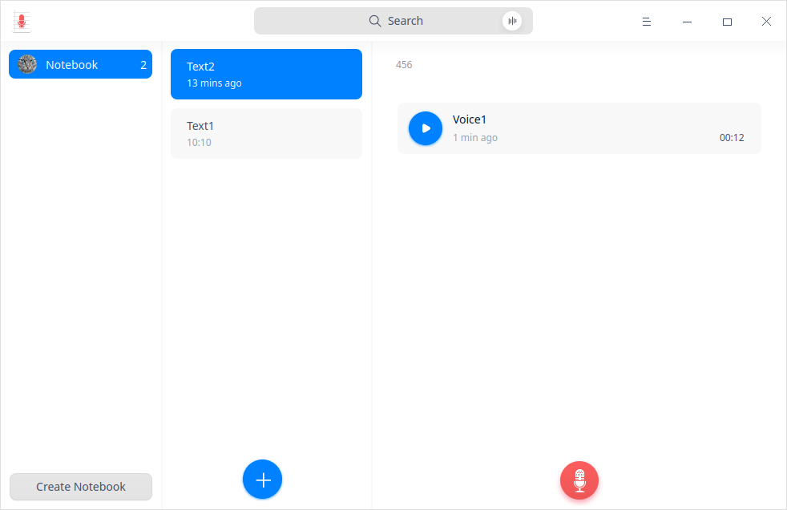
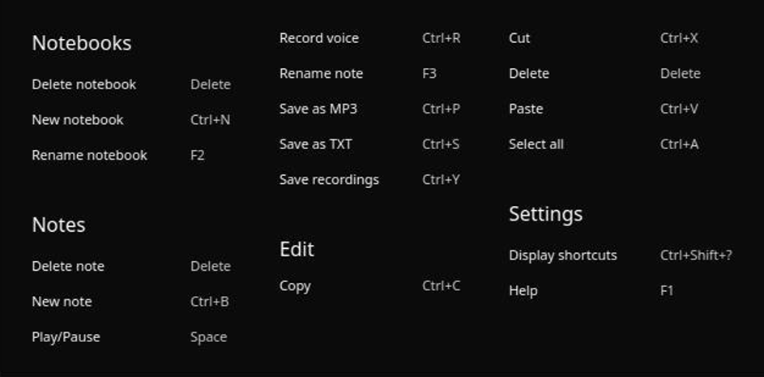
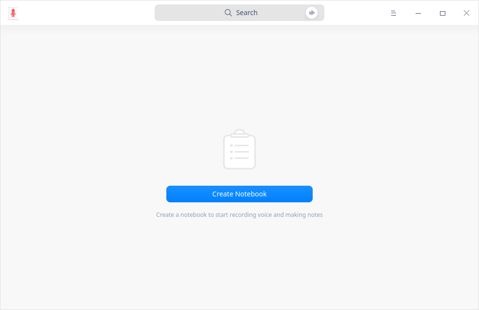
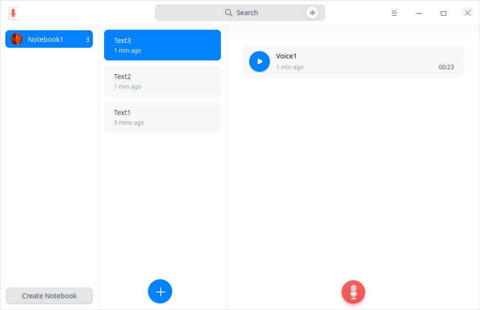
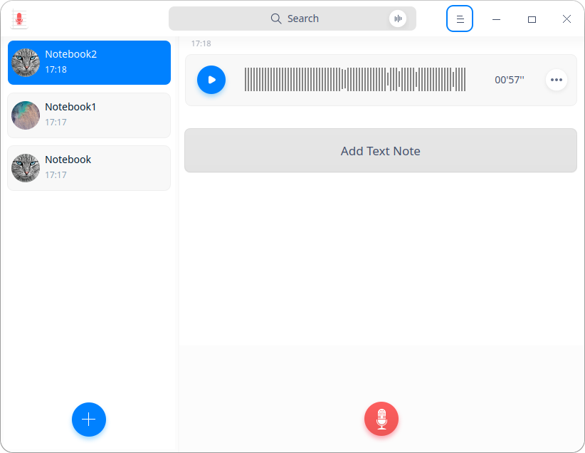
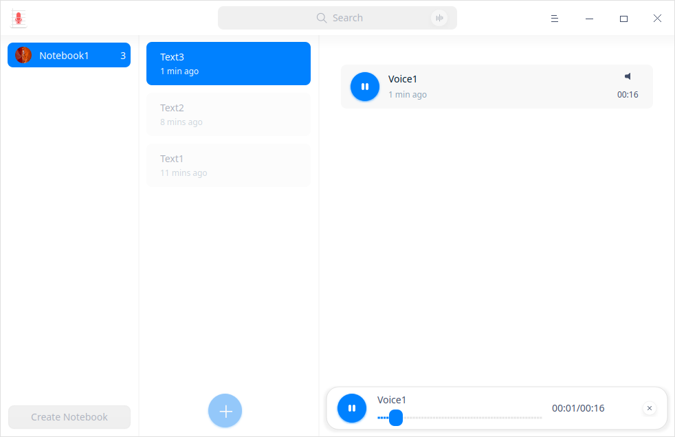
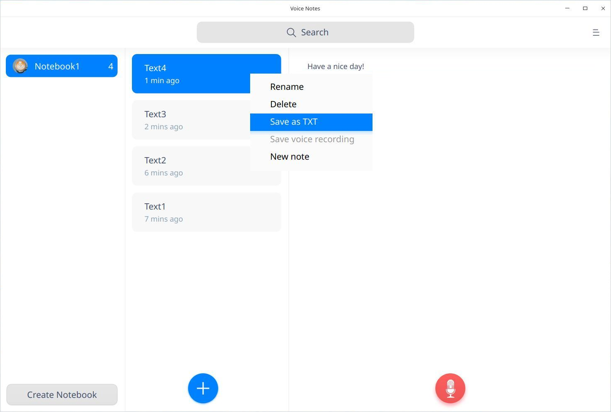
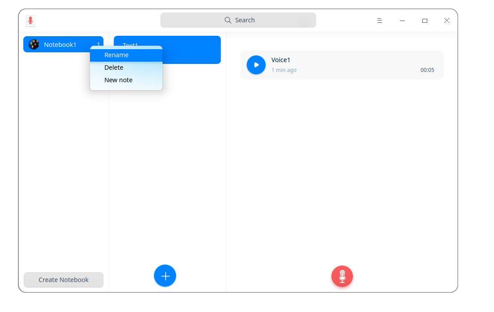

# Voice Notes|../common/deepin-voice-note.svg|

## Overview

Voice Notes is a simple memo software with texts and voice recordings. You are able to save the recordings as MP3 format or texts. 

## Guide

You can run, exit or create a shortcut for Voice Notes by the following ways.

### Run Voice Notes

1.  Click on dock to enter the Launcher interface.
2.  Locate by scrolling the mouse wheel or searching Voice Notes in the Launcher interface and click it to run.
3.  Right-click  and you can:

   - Click **Send to desktop** to create a desktop shortcut.
   - Click **Send to dock** to fix it on Dock.
   - Click **Add to startup** to add it to startup and it will auto run when the system boots.

> Notes: If Voice Notes has been fixed on dock by default, you can click   to run.

### Exit Voice Notes

- Click on the Voice Notes interface to exit Voice Notes.
- Right-click on dock and select **Close All** to exit.
- Click  on the Voice Notes interface and select  **Exit** to exit.

### View Shortcuts

On the Voice Notes interface, press  **Ctrl** + **Shift** +**？** on the keyboard to view shortcuts. Proficiency in shortcuts will greatly improve your efficiency.

 

## Operations

### Create Notebook

- Click **Create Notebook** to create a new notebook when there is none in Voice Note.

&nbsp;&nbsp;&nbsp;&nbsp;&nbsp;&nbsp;&nbsp;&nbsp;&nbsp;&nbsp;&nbsp;&nbsp;&nbsp;

- When there is a note created in Voice Note, there would be a text created by default, click  icon on the Voice Notes interface to create more new texts.

  You can start recording voices or making texts after creating a text.
  
  The default naming rules for Voice Notes is Notebook(n), among which n is an integer no less than 0.

### Recording Audios

You can finish audio recording easily by the following two steps:

1. Click  icon on the Voice Notes interface to start recording.
2.  Click  icon to finish recording.

> Tips: Click icon to pause recording during the recording process and click   again to resume recording.

> Notes: The maximum recording time is 60 minutes.

### Recording Playback

The finished recordings are displayed on the Voice Notes interface in list. Select a recording file and click icon to listen to the playback.

> Tips: Click icon to pause or stop playback and click again to resume playback when you are listening to the recording.

### Search

1. In the search box on top of the Voice Notes interface, you can clickto enter keywords.

2.  Press the **Enter** key on the keyboard to realize quick location.

   - When there is matched information, the search result list will be displayed on the right.

   - When there is no matched information, "No search results" will be displayed on the right.

3.  Clickin the search box  to clear the currently-entered keywords or cancel the search. 

### Convert Voices to Texts

1. Select a recording file on the Voice Notes interface.
2. Right-click and select **Voice to Text**.

### Save Recordings as MP3 Format

1.   Select a recording file on the Voice Notes interface.
2.   Right-click and select **Save as MP3**.
3.   Save it to the storage device.

### Add Text Notes

1. Select a notebook, right-click and select **New note** or click  icon on the Voice Notes interface to add a new text note.
2.  Move the cursor to the right column to click and input text. 

> Tips: It is available to record audios in notebooks. Please refer to recording audios for details.

### Save as TXT

1.  Select a text note on the Voice Notes interface.
2.  Right-click and select **Save as TXT**.
3.  Save the text note to the storage device in TXT format.
    

### Rename New Notebook

The completed note file will be automatically saved as "Note (n)" and you can rename it. 

1. On the Voice Notes interface, right-click a created notebook.

2. Select **Rename**.

3. Enter the file name.

4. Click in the blank area on the interface or press the **Enter** key on the keyboard to finish renaming.

   > Tips: You can also rename each text note under a notebook, please refer to **Rename New Notebook** for details. 

### Delete Voices

1.  Select a voice file on the Voice Notes interface.
2.  Right-click and select **Delete**.

3.  Click **Confirm** in the pop-up prompt box.

### Delete Text Notes

1.   Select a text note on the Voice Notes interface.
2.  Right-click and select **Delete**.

3.  Click **Confirm** in the pop-up prompt box.

### Delete New Notebooks

1. On the Voice Notes interface, right-click a new notebook.
2.  Select **Delete**.

## Main Menu

On the main menu, you can switch window themes, view help manual and get more information about Voice Notes.

### Theme

The window theme includes Light Theme, Dark Theme and System Theme (default).

1. On the Voice Notes interface, click.
2. Click **Theme** to select a theme.

### Help

View Help to get more information about Voice Notes.

1.  On the Voice Notes interface, click  .
2.  Click **Help**.
3.  View the manual.

### About

1.  On the Voice Notes interface, click  . 
2.  Click **About**.
3.  View the version description.

### Exit

1. On the Voice Notes interface, click  .
2.  Click **Exit** to exit.
