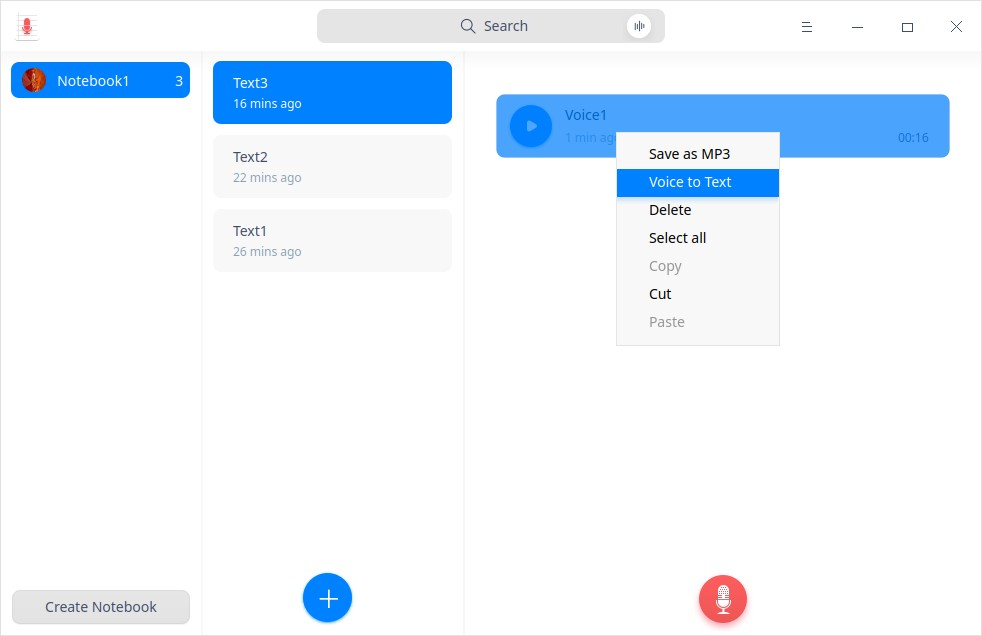

# Voice Notes|../common/deepin-voice-note.svg|

## Overview

Voice Notes is a simple memo software with texts and voice recordings. You are able to save the recordings as MP3 format or texts. 

## Guide

You can run, exit or create a shortcut for Voice Notes in the following ways.

### Run Voice Notes

1.  Click  in the dock to enter the Launcher interface.
2.  Locate  by scrolling the mouse wheel or searching "voice notes" in the Launcher interface, and click it to run.
3.  Right-click , and you can:

   - Click **Send to desktop** to create a desktop shortcut.
   - Click **Send to dock** to fix it in the Dock.
   - Click **Add to startup** to add the application to startup, and it will automatically run when the system starts up.

> Notes: If Voice Notes has been fixed in the dock by default, you can click  in the dock to run it.

### Exit Voice Notes

- Click  on the Voice Notes interface to exit Voice Notes.
- Right-click  in the dock, and select **Close All** to exit.
- Click  on the Voice Notes interface, and select **Exit** to exit.

### View Shortcuts

On the Voice Notes interface, press **Ctrl** + **Shift** + **?** on the keyboard to view shortcuts. Proficiency in shortcuts will greatly improve your efficiency.

## Operations

### Create Notebooks

- Click **Create Notebook** to create a new notebook when there is none in Voice Notes.

&nbsp;&nbsp;&nbsp;&nbsp;&nbsp;&nbsp;&nbsp;&nbsp;&nbsp;&nbsp;&nbsp;&nbsp;&nbsp;

- When a notebook is created in Voice Note, a text is also created by default. Click  icon on the Voice Notes interface to create more new texts.

  You can start recording voices or writing texts after creating a text.
  
  The default naming rule for Voice Notes is Notebook(n), in which n is an integer no less than 0.

### Record Voice Notes

You can record audios simply in two steps:

1. Click  icon on the Voice Notes interface to start recording.
2.  Click  icon to finish recording.

> Tips: Click  icon to pause recording during the recording process, and click  again to resume recording.

> Notes: The maximum recording time is 60 minutes. Voice notes can only be created in the text notes. 

### Playback Voice Notes

The recorded voice files are displayed on the Voice Notes interface in a list. Select a voice file, and click  icon to listen to the playback.

> Tips: Click  icon to pause or stop playback, and click  again to resume playback when you are listening to the recording.

### Search Voice Notes

1. In the search box located in the top center area of the Voice Notes interface, you can click  to enter keywords.

2.  Press the **Enter** key on the keyboard to fast locate.

   - When there is matched information, the search result list will display on the right.

   - When there is no matched information, **No search results** will display on the right.

3.  Click  in the search box  to clear the current keywords or cancel the search. 

### Convert Voices to Texts

1. Select a voice file on the Voice Notes interface.
2. Right-click, and select **Voice to Text**.

### Save Voices as MP3 Format

1.   Select a voice file on the Voice Notes interface.
2.   Right-click, and select **Save as MP3**.
3.   Save it to the storage device.

### Add Text Notes
1. Select a notebook, right-click it, and select **New note**; or click  icon on the Voice Notes interface to add a new text note.
2.  Move the cursor to the right column to click and input text. 

> Tips: You can record audios in notebooks. Please refer to [Record Voice Notes](#Record Voice Notes) for details.

### Save as TXT

1.  Select a text note on the Voice Notes interface.
2.  Right-click, and select **Save as TXT**.
3.  Save the text note to the storage device in TXT format.

### Text to Speech

1. Go to **Control Center** > **Assistive Tools**, and enable **Text to Speech**.

2. Select a paragraph of text on the Voice Notes interface, and right-click to select **Text to Speech**. The text selected will be converted to speech and read accordingly. 

3. In the text to speech mode, right-click to select **Stop reading** or left-click to stop reading.

   >Notes:
   >
   >- When no text is selected, **Text to Speech** is greyed out and inoperable. 
   >- When only an audio file is selected, **Text to Speech** is inoperable; if the audio file selected contains voice-to-text content, **Text to Speech** can be operated.

### Speech to Text

1. Go to **Control Center** > **Assistive Tools**. Enable **Speech to Text**, and select **Language**.

2. In the text input box on the Voice Notes interface, right-click and select **Speech to Text**. Now you can input audios via microphone, and the translated text will be edited and displayed in the text input box.  

3. In the speech to text mode, click the the blank area on the Voice Notes interface to stop text editing and display.  

   >Tips: You can enable **Speech to Text** while recording audios. 

### Translate Text Notes

1. Go to **Control Center** > **Assistive Tools**. Enable **Translation**, and select the **Language** option from **en-cn** or **cn-en**.

2. Select a paragraph of text on the Voice Notes interface, and right-click to select **Translate**. The text selected will be translated to target language.

   >Notes: When only an audio file is selected, **Translate** is inoperable; if the audio file selected contains voice-to-text content, **Translate** can be operated.

### Rename Notebooks

The notebook created will be automatically saved as **Note (n)**. You can rename it in the following steps. 

1. On the Voice Notes interface, right-click a notebook.

2. Select **Rename**.

3. Enter the file name.

4. Click in the blank area on the interface, or press the **Enter** key on the keyboard to rename.

   > Tips: You can also rename each text note under a notebook. 

### Delete Voice Notes

1.  Select a voice file on the Voice Notes interface.
2.  Right-click, and select **Delete**.
3.  Click **Confirm** in the pop-up prompt box.

### Delete Text Notes

1.   Select a text note on the Voice Notes interface.
2.  Right-click, and select **Delete**.
3.  Click **Confirm** in the pop-up prompt box.

### Delete Notebooks

1. Select a notebook on the Voice Notes interface.
2. Right-click, and select **Delete**.
3. Click **Confirm** in the pop-up prompt box.

## Main Menu

On the main menu, you can set audio source, check privacy policy, switch window themes, view help manual, and get more information about Voice Notes.

### Settings

You can set up audio source from **Internal** and **Microphone** (default) options.

1. On the Voice Notes interface, click .
2. Set up audio source:
   - Select **Internal** source, and only system built-in sound will be recorded. 
   - Select **Microphone** source, and only microphone sound will be recorded. 

### Theme

The window theme provides three theme types, namely Light Theme, Dark Theme, and System Theme (default).

1. On the Voice Notes interface, click .
2. Click **Theme** to select one theme.

### Help

1. On the Voice Notes interface, click .
2. Click **Help** to view the manual of Voice Notes.

### About

1. On the Voice Notes interface, click . 
2. Click **About** to view the version and introduction of Voice Notes.

### Exit

1. On the Voice Notes interface, click .
2. Click **Exit** to exit Voice Notes.

Update Date: 2020-09-30 Version: 5.7
