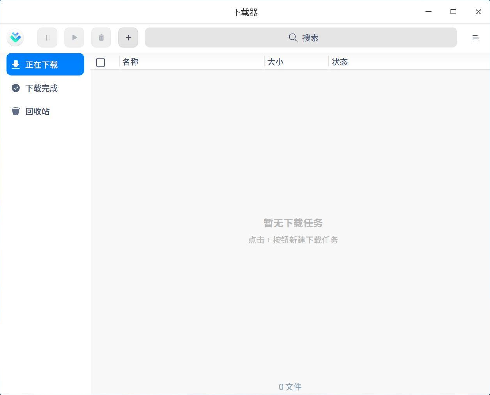
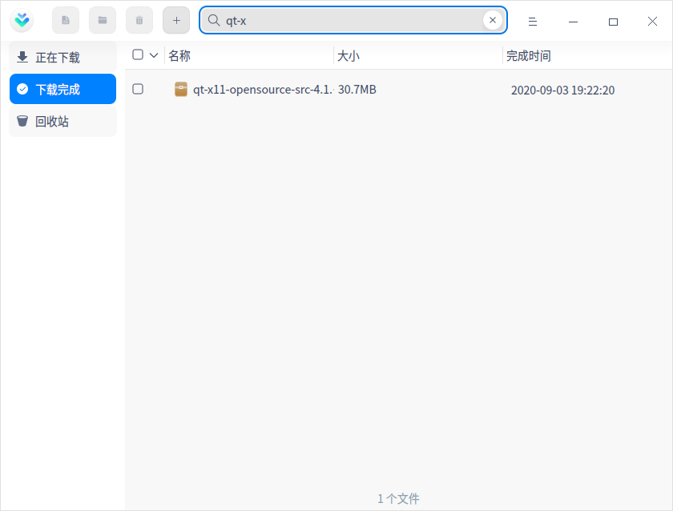
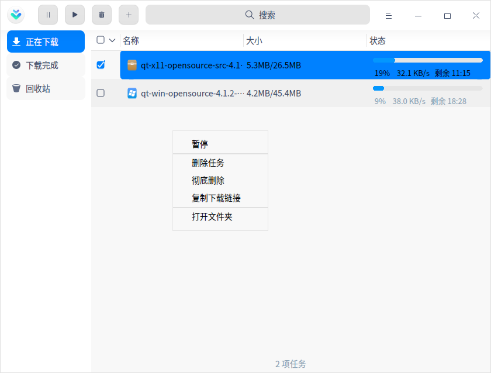
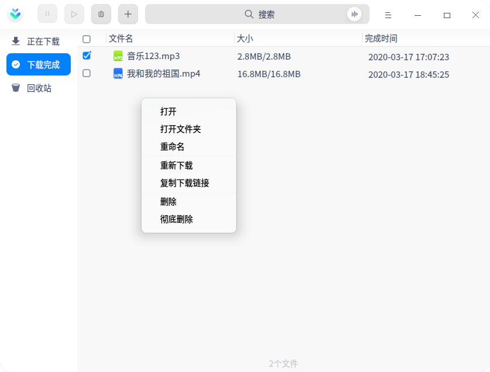
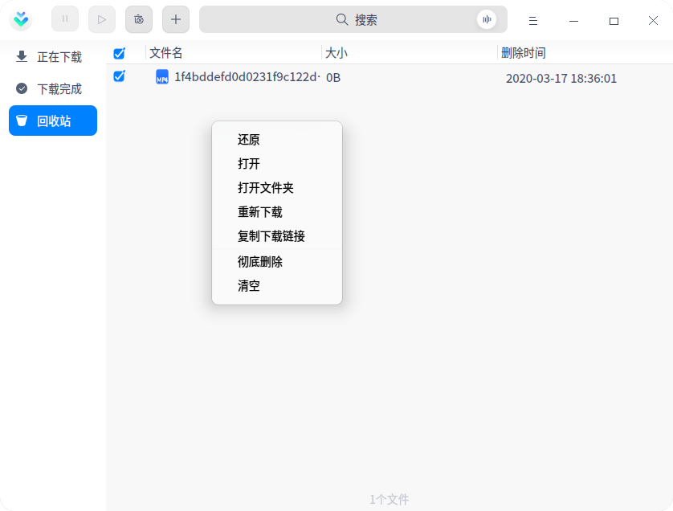

# 下载器|../common/uos-downloadmanager.svg|

## 概述

下载器是一款可以更快地从网上下载文本、图像、视频、音频等信息资源的软件，并帮助您管理各种下载信息资源。

## 使用入门

您可以通过以下方式运行或关闭下载器，或者创建快捷方式。

### 运行下载器

1. 单击任务栏上的 进入启动器界面。
2. 上下滚动鼠标滚轮浏览或通过搜索找到【下载器】按钮    ，单击打开下载器  。
3. 右键单击 ，您可以：
   - 单击 **发送到桌面**，在桌面创建快捷方式。

   - 单击 **发送到任务栏**，将应用程序固定到任务栏。

   - 单击 **开机自动启动**，将应用程序添加到开机启动项，在电脑开机时自动运行该应用程序。

### 关闭下载器

- 在下载器界面，单击   ，退出下载器。
- 右键单击任务栏上的 图标，选择 **关闭所有** 来退出下载器。
- 在下载器界面单击  ，选择 **退出** 来退出下载器。

## 操作介绍
### 添加任务

#### 通过下载链接添加任务

1. 在下载器界面单击，添加下载任务。

2. 输入下载地址，选择路径，单击 **确认**，则任务创建成功。

   > ：可同时添加多个链接，需确保每行只有一个链接。

#### 通过BT文件创建下载任务

1. 双击BT文件，或者单击操作栏中添加任务按钮，添加任务弹框。

   - 双击BT文件时，直接弹出下载资源确认框。

   - 在下载器界面单击，将BT文件拖入地址框，或单击 ，弹出文件管理器，选择需要的BT文件。

2. 在下载资源确认框中，勾选需要下载的文件，选择下载路径，单击 **下载**，则任务创建成功。

### 搜索

1. 下载器支持两种搜索方式：文字搜索和语音搜索。

   - 文字搜索：单击，输入关键字；

   - 语音搜索：单击， 输入语音，语音会转化为文字显示在搜索框中；

2. 输入成功后，界面会根据字段显示搜索结果；如果没有发现匹配的选项时，界面显示为 **无搜索结果**。

3. 单击  ，则关闭搜索内容。

### 正在下载

主要显示正在下载的文件列表，包括文件名、大小及状态。

> ：以下操作需要勾选对应文件才能生效。

**暂停**：单击   或右键选择 **暂停** 后，文件暂停下载。

**开始**：如果想要继续下载，单击   后，之前暂停下载文件则会继续下载。

**删除**：单击  或右键选择 **删除** 后，可删除正在下载的文件，被删除的文件会被放到回收站。如果选择同时删除本地选项，回收站中则不会出现此文件。

**打开文件夹**：右键选中后，界面直接跳转到下载文件所在的文件夹。

**复制下载链接**：右键选中后，可将复制的下载链接共享给其他人。

**彻底删除**：右键选中后，本地文件也将被删除。

### 下载完成

主要显示下载完成的文件列表，包括文件名、大小及完成时间。

> ：以下操作需要勾选对应文件才能生效。

**删除**：单击  或右键选择 **删除** 后，可删除正在下载的文件，被删除的文件会被放到回收站。如果选择同时删除本地选项，回收站中则不会出现此文件。

**打开**：右键选中后，可打开该文件。

**打开文件夹**：右键选中后，界面直接跳转到文件所在的文件夹。

**重命名**：右键选中后，可对下载的文件重命名。

**重新下载**：右键选中后，可重新下载该文件。

**复制下载链接**：右键选中后，可将复制的下载链接共享给其他人。

**彻底删除**：右键选中后，本地文件也将被删除。

### 下载失败

当文件下载失败时，可尝试重新下载。如果还是下载失败，可能是下载链接问题或存储路径空间不够等原因，具体以实际情况为准。

### 回收站 

主要显示被删除的文件列表，包括文件名、大小及删除时间。

> ：以下操作需要勾选对应文件才能生效。

**还原**：右键选中后，可还原该文件，还原后的文件会被放到下载完成列表中。

**打开**：右键选中后，可打开该文件。

**打开文件夹**：右键选中后，界面直接跳转到文件所在的文件夹。

**重新下载**：右键选中后，可重新下载该文件。

**复制下载链接**：右键选中后，可将复制的下载链接共享给其他人。

**彻底删除**：单击或右键选择 **彻底删除** 后，本地文件将被删除。

**清空**：右键选中后，可清空回收站中的所有文件。

## 主菜单

在主菜单中，您可以进行下载设置、切换窗口主题，查看帮助手册等操作。

### 设置
#### 基本设置

**启动**：主要设置程序启动的相关项。

- 开机启动：打开此项后，当电脑开机时，自动启动下载器程序。
- 免打扰模式：打开此项后，外部程序通过下载资源启动下载器时，不弹出创建任务，自动以默认选项创建下载任务，同时下载完成后不发送通知。
- 启动后自动开始未完成的任务：打开此项后，每当启动下载器时，自动开始正在下载列表中没有下载完的任务

**下载目录**：主要设置下载目录的相关项。

- 自动修改为上次使用的目录：创建下载任务时，下载路径默认为上次下载时选择的路径 。
- 设置默认目标目录：从文件管理器中选择一下文件夹，作为默认下载路径，此后每次创建下载任务时，都以此路径为默认下载路径。

#### 下载设置

主要设置最大下载限速、最大上传限速和限速时段。

#### 通知提醒

当有任务状态变更时，通过系统通知来告知用户任务状态变更内容 。

#### 高级设置

主要设置下载磁盘缓存的大小，磁盘缓存越大，下载速度越快，占用电脑资源越多。

#### 恢复默认

单击 **恢复默认**，则所有设置项恢复默认设置。

### 主题

窗口主题包含浅色主题、深色主题和系统主题，其中系统主题为默认设置。

1. 在下载器界面，单击。
2. 单击 **主题**，选择一个主题颜色。

### 帮助

查看帮助手册，通过帮助进一步让您了解和使用下载器。

1. 在下载器界面，单击 。
2. 单击 **帮助**。
3. 查看关于下载器的帮助手册。

### 关于

1. 在下载器界面，单击 。
2. 单击 **关于**。
3. 查看关于下载器的版本和介绍。

### 退出

1. 在下载器界面，单击 。
2. 单击 **退出**。

