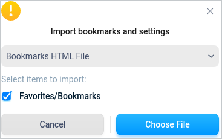
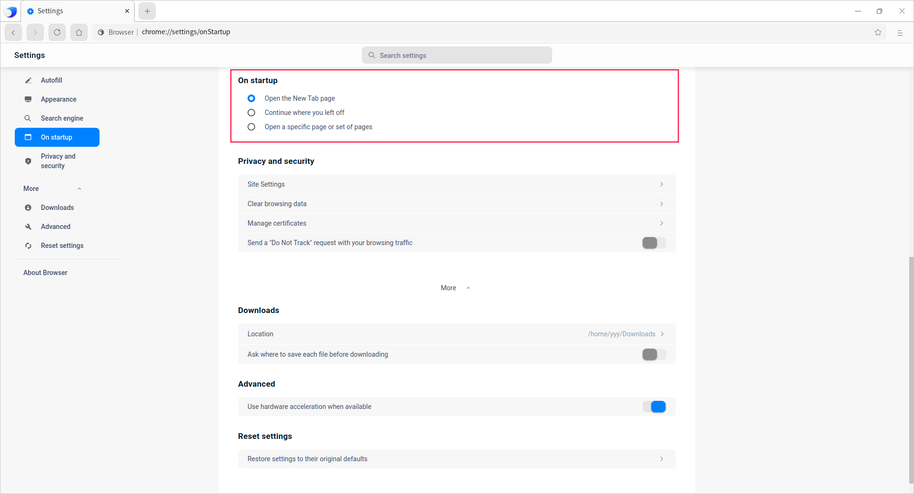
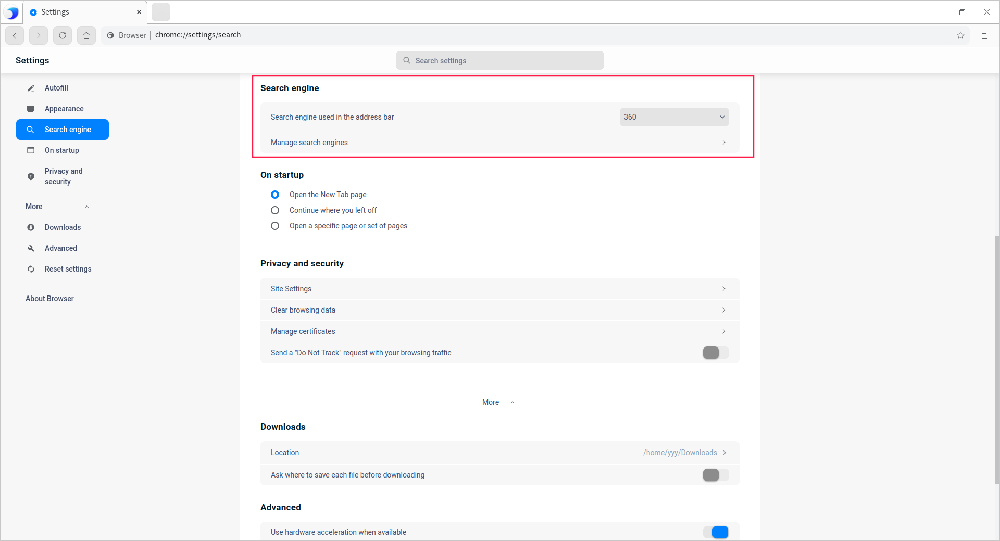
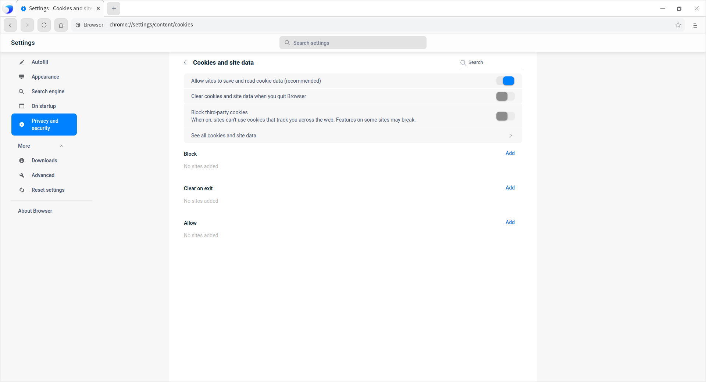

# Browser|../common/deepin-browser.svg|

## Overview

Browser is a kind of application program which can retrieve and display the information resources of the world wide web. It can be used to display texts, images and other information of the world wide web or local area network, so as to facilitate users to quickly find various resources.

## Guide

You can run, exit or create a shortcut for Browser by the following ways.

### Run Browser

1.  Click  on dock  to enter the Launcher interface.
2.  Locate  by scrolling the mouse wheel or searching Browser in the Launcher interface and click it to run.
3.  Right-click  and you can:
 - Click **Send to desktop** to create a desktop shortcut.
 - Click **Send to dock** to fix it on Dock.
 - Click **Add to startup** to add it to startup and it will auto run when the system boots.

> Notes: Browser is fixed on Dock by default. You can click Browser icon  on dock to open Browser.

### Exit Browser

- Click   on the Browser interface.
- Right-click  on dock and select **Close All** to exit.

## Operations

### Manage tabs

You can not only open and view multiple tabs in Browser, but also can switch among them.

#### New tab

Add new tabs by the following ways:

- At the top of Browser, click  next to the last tab on the right.
- Right-click in the blank area at the top of Browser, and select **New tab**.
- Place the mouse in the tab head and right-click, select **Open new tab**.
- In Browser, click  > **New tab**.
- Press **Ctrl** + **T**.

#### New window

When you open a new window in Browser, a new tab would be opened at the same time. Open new window by the following ways:

- Click a tab and drag it outside the current page. 

- In Browser, click  > **New window**.

- Press **Ctrl** + **N**.

> Notes: click  > **New incognito window** to carry out private browsing.

#### Open local files in tabs

Open local files in tabs by the following ways:

- Drag the file you want to open from the desktop or a folder into a tab.
- Press **Ctrl** + **O**. File Manager window pops up. Select the file you want to open in it.

#### Open a link in tabs

Hold **Ctrl** and click the link you want to open at the same time.

#### Sort tabs

Drag the tabs at the top of the browser left and right to change the order of the tabs.

- To fix a tab on the left side, right-click it and select **Pin this tab**. The pinned tab would be displayed with the website's icon in a small tab. 

- To unpin the tab, right-click it and select **Unpin this tab**. 

#### Close tabs

Close tabs by the following ways.

- Select a tab, click  in it.
- Right click a tab, select **Close this tab**, **Close other tabs** or **Close tabs to the right**. 

#### Restore tabs or windows

If you accidentally close a tab or window, right-click the blank area of the tab bar and select **Reopen closed tab**.

#### Force close a page or application

If a tab, window, or extender does not work properly, right-click  in Dock and select **Force Quit** to close it.

### Manage bookmark

#### Add bookmark

You can add common web pages to bookmarks in browser, which makes it easy to open quickly.

1. After opening the webs you want to bookmark, you can bookmark it/them by the following ways.

   - Click on the right side of the address bar;
   - Click   > **Bookmarks**  > **Bookmark this tab**。
   - Click    > **Bookmarks**  > **Bookmark all tabs**.

2. "Add bookmark" window pops up. Set the name, or, click **New folder** to add the bookmark into the new folder, and click **Save**. 

#### Find bookmark

1. Click   > **Bookmarks**  > **Bookmark manager**. 
2. Clickat the top of bookmark manager, and input keywords to search a bookmark. 

#### Edit bookmark

1. Click   > **Bookmarks**  > **Bookmark manager**. 
2. Select a bookmark in bookmark manager interface, clicknext to it or right-click and select **Edit** to modify bookmark.

#### Delete bookmark

1. Click   > **Bookmarks**  > **Bookmark manager**. 

2. Select a bookmark in bookmark manager interface. Delete it by the following ways.

   - Clicknext to the bookmark and select **Delete**.
   - Right-click and select **Delete**.

>  Notes: you can also click on the right side of the address bar and click **Delete** in the pop-up window.

#### Sort Bookmark

1. Click   > **Bookmarks**  > **Bookmark manager**. 
2.  In bookmark manager interface, you can drag the bookmarks up or down to change the order of the bookmarks, or you can copy and paste the bookmarks in the order you expect.

#### Import bookmark

1. Click   > **Bookmarks**  > **Import bookmarks and settings**. 

2. In the importing interface, select "Bookmarks HTML File" in the drop-down box, and click **Choose File**. 

   

3. File Manager window pops up. Select a html file, and the imported bookmark would be displayed in the bookmark bar. 

### Manage downloads

Download and save the web pages, pictures and other files in Browser to the computer or storage device. 

#### Download files

1. In Browser, open the page where you want to download a file.
2. Save file(s): 

   - Common files: click the download link. Or, right-click it and select **Save as**.
   - Images: right-click and select **Save image as**. 
3. According to the page prompt, select the storage path of the download file, and then click **Save**.

4. After downloading, the file will be displayed at the bottom of Browser. Click the file name to open it. To view the path of the file, click the up arrow next to the file name and select **Show in folder**. Or, you can view the downloaded files in the "Downloads" page.

You can also set automatic downloads:

1. In Browser, select  > **Settings**, enter the settings page.
2. Click **Privacy and security** in the left panel, and click > next to "Site Settings" to enter the site settings page. 
3. In "Permissions" area, click > next to "Automatic downloads" to turn on "Ask when a site tries to download files automatically after the first file(recommended)".

#### Pause or cancel downloading

   - At the bottom of Browser, find the file you want to pause or cancel downloading, click the up arrow next to the file name, and select the **Pause** / **Resume** or **Cancel** button.

  

   - Select    > **Downloads**, select **Pause** / **Resume** or **Cancel** button.

#### View download history

Select   > **Downloads** to view download history.

   - To open the downloaded file, click its name. The system will use the default application to open it according to its file type.
   - To remove a file from the history, click  on the right of it file name. The downloaded file would not be deleted.

#### Set default saving path

Specify the default location to save the downloaded content, or select a specific target location for each download.

1. In Browser, select > **Settings**, enter the settings page.

2. Click **More** > **Downloads** to set  the default saving path.

   

> Tips: If you want to select a particular location for each download, turn on "Ask where to save each file before downloading". 

### Manage history 

#### View history

The history contains the address and specific time of the website visited during the use of Browser.

Select  > **History** to enter the history page. 

#### Delete history

In history page, delete history by one of the following ways.

- Check the history to be deleted and click **Delete** in the upper right corner of the page.
- Click the operation button  next to a history and select **Remove from history**. 

You can also clear browsing data, refer to [Clear browsing data](#Clear browsing data) under "Settings" chapter.

### Search information

Use Browser to quickly find the information you need on the Internet, bookmark list and browsing history.

1. In the address bar at the top of Browser, enter the information you want to search and press **Enter** key.
2. Select **Webpage**, **Images**, **News**, **Videos** or **Maps** to search.

#### Find contents

To find a specific word or phrase in a web page.

1. Open a webpage in Browser, press **Ctrl** +**F**, or click   > **Find**. 
2. Enter the keyword in the search box in the upper right corner of the window and press **Enter**.
3. The matching content will be highlighted in blue, and the position of all matching content in the web page can be viewed according to the blue mark on the scroll bar.

#### Search contents

1. Open a webpage in Browser, select a word or phrase by mouse. 
3. Right-click and select **Search XXX for "xxxxxx"** to use your default search engine to search related web pages.

### Print

1. In Browser, select the contents to be printed(webpage, image, and so on).
2. Right-click and select **Print** or select   > **Print**. 
3. Print preview page pops up. Select the target printer, set up printing parameters. 
4. After getting ready, click **Print**. 

### View source code

Right-click any blank area in a webpage and select **View page source**. 

### Developer tools

When you need to design a UI or debug a website, you can open developer tools by one of the following ways.

- Select   > **More tools** > **Developer tools**.
- Right-click any blank area in a webpage and select **Inspect**.
- Press F12.

> Attention: Do not use in illegal ways.

## Settings

### Set default browser

When opening Browser, if the prompt box "It is not your default browser" pops up. Click **Set as default**.

> Tips: Set Browser as the default web program in Control Center, refer to [Default Applications](dman:///dde#Default Applications) for operations.

### Set homepage and launch page

Customize Browser to display any web page when you open the homepage or launch page. The two pages are not the same unless you set them to be the same.

- The launch page is the first web page to be displayed after Browser is launched.
- Homepage is the one to enter after clicking the home page icon. 

#### Set homepage

1. In Browser, select > **Settings**, enter the settings page.
2. Click **Appearance** in the left panel. Turn on "Show home button", then the icon  would be displayed in the left side of the address bar. In addition, you can set up the web page to be opened when homepage is opened: 
   - **New Tab page**: the new tab to be skipped into whenever you click home button.
   - **Enter custom web address**: to specified web page to be skipped into whenever you click home button.

#### Set launch pages

1. In Browser, select > **Settings**, enter the settings page.
2. Click **On startup** in the left panel to set up the web page to be displayed when Browser is opened. 
   - **Open the New Tab page**: when Browser is opened, a "New Tab" page would be opened.
   - **Continue where you left off**: when Browser is opened, the web page you were browsing when Browser was closed would be opened again.
     The system will save cookies and website data, so any website you logged in (such as Google) will be opened again. If you do not want to automatically log in to these pages, do the following:
       1. Open Browser, select   > **Settings** to enter settings. 
       2. Click **Privacy and security** in the left panel, click > next to "Site Settings" to enter site settings.
       3. Click > next to "Cookies and site data", turn on "Clear cookies and site data when you quit Browser". 

   - **Open a specific page or set of pages**: when Browser is opened, any specified web page would be opened. You can add new web sites in the text box below, and modify or delete them in the future. 

>  Notes: 

- If you find that the home page or the launch page is not the page you set up, it indicates that malware may exist on your system.

- If you are using a browser of a company or school, the network administrator may choose the launch page for you, and you cannot make any changes. For more help, please consult your administrator.

### Search engine

1. In Browser, enter the search engine interface by one of the following methods.

   - Place the cursor in the address bar, right-click and select **Edit search engines...**.

   - Select   > **Settings**, click **Search engine** in the left panel. 
   
2. You can add new search engine or modify the current one. 

   

> Notes: If your default search engine changes suddenly, it indicates that your system may have been attacked by malware.

### Password management

If you enter a new password on a website, the browser will ask if you want to save it. If yes, click **Save**.

#### Log in with a saved password

If you have saved your password when you visited a website before, you don't need to enter your user name and password when you log in again.

   - If you have saved a set of user names and passwords for the site: the browser will automatically fill in the login form.

   - If you have saved multiple sets of user names and passwords: select the user name field, and then select the login information you want to use.

#### Delete saved password

1. In Browser, select > **Settings**, enter the settings page.
2. Click **Autofill** in the left panel, and click > next to "Passwords" to enter the password setting page.

3. You can view websites with their passwords saved or delete passwords.

To clear all saved passwords, please refer to [Clear browsing data](#Clear browsing data), and then check "Passwords and other sing-in data".

#### Enable or disable the password saving function

By default, the browser asks you if you want to save the password. You can enable or disable this feature at any time.

1. In Browser, select > **Settings**, enter the settings page.

2. Click **Autofill** in the left panel, and click > next to "Passwords" to enter the password details page.

3. Turn on or off "Offer to save passwords". 

### Privacy and security

#### Site Settings

In the site settings page, you can view the permissions and stored data of each website.

1. In Browser, select > **Settings**, enter the settings page.
2. Click **Privacy and security** in the left panel, and click > next to "Site Settings" to enter the site settings page. 
3. You can view the permissions and stored data of each website. In "Permissions" area, you can set up the following: 

**Cookies and site data**

Cookies can make your online experience easier by saving browsing information. You can set the following:

- **Allow sites to save and read cookie data(recommended)**:  it's turned on by default. 
- **Clear cookies and site data when you quit Browser**: Automatically delete the corresponding cookies after exiting the browser.
- **Block third-party cookies**: The website can't use cookies to track your activities on the Internet, and the functions on some websites may not work properly.
- Click **See all cookies and site data** to: 
  - Delete specified cookies and site data: Search the name of cookies and website data, and click the delete button on the right side of the website address.
  - Delete all cookies and site data: click **Remove All**. 

You can also enter the web site in **Block**, **Clear on exit** and **Allow** area. 

**Location**

By default, Browser asks if you want to allow a website to view your exact location information.

   - **Allow**: allow websites to access location information. If you allow Browser to share your location information with a website, it will send information to the location information service of the search engine to know your general location. Browser will then share your location information with the site.

   - **Block**: websites are forbidden to access location information.

**Camera and Microphone**

Some sites may request to use your camera and microphone, and by default, Browser asks if you allow a site to turn on the camera and microphone.

- **Allow**: allow websites to turn on cameras and microphones.

- **Block**: forbid websites from turning on cameras and microphones.

**JavaScript**

JavaScript helps to improve the interactivity of websites. You can add allowed and blocked websites.

**Automatic downloads**

If you want to download multiple files from a website, select whether you want to download these files automatically. You can add allowed and blocked websites.

Several website permissions can be set up below, such as pictures, flash, sound, USB device, file modification and so on.

#### Clear browsing data

1. Clear browsing data by one of the following ways.

   - Select   > **Settings** > **Privacy and security** > **Clear browsing data**.
   - Select   > **History** > **Clear browsing data**

   - Select   > **More tools** > **Clear browsing data**

2. Check the data types to be cleared in the basic and advanced setting pages:

     - Time range, such as:
       - Last hour
       - Last 24 hour
       - Last 7 days
       - Last 4 weeks
       - All time
     - Browsing history
     - Cookies and other site data
     - Cached images and files
     - Download history
     - Passwords and other sign-in data
     - Autofill form data
     - Site settings

     

3. After checking necessary types, click **Clear data**.

#### Manage certificates

In Browser, you can import certificates and manage them.

1. In Browser, select  > **Settings**, enter the settings page.

2. Click **Privacy and security** in the left panel, and click > next to "Manage certificates" to enter the manage certificate page.

3. Click **Import**, jump to File Manager, and select a certificate file to import.

#### Send a "Do Not Track" request with your browsing traffic

This function is turned off by default. When it is turned on, it means that you don't want to be tracked by any third party website.

### Advanced

Use hardware acceleration when available: assign the work with very much calculation to special hardware to reduce the workload of CPU. This function is on by default. For example, when playing video, you can use the graphics card to decode, so that the CPU can handle other tasks without causing the operating system to jam.

### Reset settings

When you click this button, you can reset some of the settings, such as the search engine; however, your bookmarks, history, and stored passwords will not be cleared.

## Theme

The window theme includes Light Theme, Dark Theme and System Theme.

1. On the Browser interface, click.
2. Click **Theme** to select a theme.

## Help

View Help to know more and better use Browser.

1. On the Browser interface, click .
2. Click **Help**.
3. View the manual.

## About

1. On the Browser interface, click  . 
2. Click **About**.
3. View the version description.

## Exit

1. On the Browser interface, click  .
2. Click **Exit** to exit.
