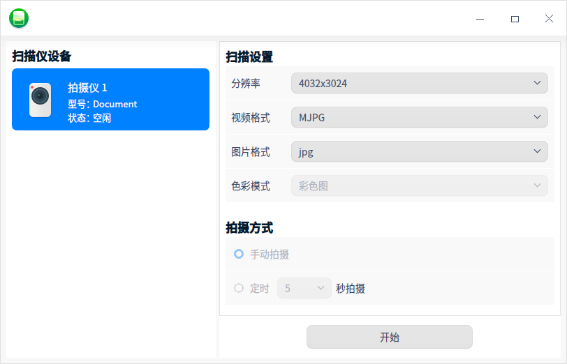
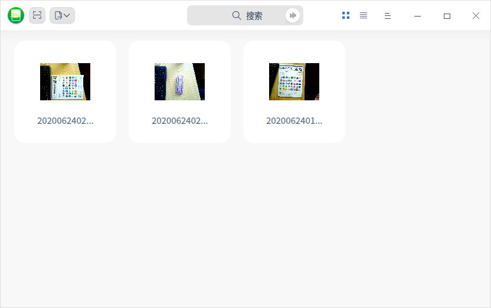
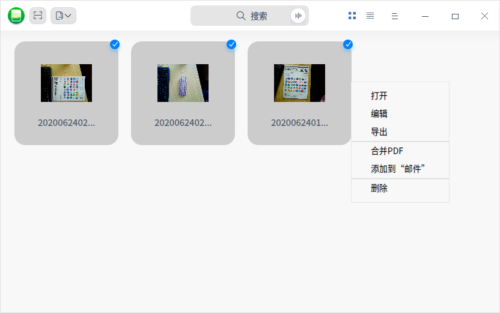

# 扫描管理器|../common/scan-manager.svg|

## 概述

扫描管理器是一款管理扫描设备的工具，可同时管理多个扫描设备。界面可视化，操作简单，帮助用户提高扫描的效率、扫描的质量以及节省存储空间。

## 使用入门

您可以通过以下方式运行或关闭扫描管理器，或者创建快捷方式。

### 运行扫描管理器

1. 单击任务栏上的 进入启动器界面。
2. 上下滚动鼠标滚轮浏览或通过搜索找到扫描管理器按钮    ，单击即可打开  。
3. 右键单击 ，您可以：
   - 单击 **发送到桌面**，在桌面创建快捷方式。

   - 单击 **发送到任务栏**，将应用程序固定到任务栏。

   - 单击 **开机自动启动**，将应用程序添加到开机启动项，在电脑开机时自动运行该应用程序。

### 关闭扫描管理器

- 在扫描管理器界面，单击   ，退出扫描管理器。
- 右键单击任务栏上的 图标，选择 **关闭所有** 来退出扫描管理器。
- 在扫描管理器界面单击  ，选择 **退出** 来退出扫描管理器。

## 操作介绍
### 扫描

在扫描管理器主界面，单击 **扫描** 按钮，设备列表会显示与当前电脑连接上的所有扫描设备，如拍摄仪和扫描仪等。

#### 拍摄仪

1. 选择拍摄仪后，在界面可设置扫描参数、拍照方式、水印、裁剪方案等参数。

   

2. 单击 **开始**，进入扫描界面。您可以设置1:1显示，放大或缩小，旋转及剪裁扫描区域。

3. 完成设置后，单击 **扫描**，在界面右侧可以看到保存的图片。

   

#### 扫描仪

1. 选择扫描仪后，在界面可设置扫描的分辨率、图片格式及图片类型等参数。
2. 完成设置后，单击 **开始**，进入扫描界面。
3. 单击 **扫描**，在界面右侧可以看到保存的图片。

### 图片处理

1. 关闭扫描页面后，扫描完成的图片会显示在扫描管理器主界面。您可以单击图标/列表视图、，以图标或列表形式查看图片。

   

2. 选中图片并右键单击，您还可以对进行编辑、导出、合并PDF、删除等操作。

   

3. 选择 **编辑** 后，弹出 **画板** 界面，您可以在画板中编辑图片。

   

### 图片导出

扫描完的图片可以直接导出到文件夹，也可以通过邮件发送给用户。

#### 导出到文件夹

1. 扫描完的图片可以直接导出，或先合并为PDF，再导出到指定位置。

2. 在扫描管理器主界面，图片导出有以下两个入口：

   - 选中图片后，单击导出按钮，选择 **导出**。
   - 选中图片并右键单击，选择 **导出**。

> 窍门：如果图片较多，可以先合并为PDF文件，再选择导出。

3. 弹出文件管理器，选择指定位置，保存即可。

#### 添加到“邮件”

1. 在扫描管理器主界面，可以通过邮件发出图片，有以下两个入口：

   - 选中图片后，单击导出按钮，选择 **添加到“邮件”**。
   - 选中图片并右键单击，选择 **添加到“邮件”**。

   > 窍门：如果图片较多，可以先合并为PDF文件，再通过邮件发出。

2. 弹出邮件界面，设置收件人等信息后，发送邮件即可。

## 主菜单

在主菜单中，您可以进行扫描管理设置、切换窗口主题，查看帮助手册等操作。

### 设置

1. 在扫描管理器界面，单击 。

2. 单击 **设置**，您可以设置扫描文件的缓存位置，选择是否开启覆盖时警告等功能。

   

### 主题

窗口主题包含浅色主题、深色主题和系统主题，其中系统主题为默认设置。

1. 在扫描管理器界面，单击。
2. 单击 **主题**，选择一个主题颜色。

### 帮助

查看帮助手册，通过帮助进一步让您了解和使用扫描管理器。

1. 在扫描管理器界面，单击 。
2. 单击 **帮助**，查看关于扫描管理器的帮助手册。

### 关于

1. 在扫描管理器界面，单击 。
2. 单击 **关于**，查看关于扫描管理器的版本和介绍。

### 退出

1. 在扫描管理器界面，单击 。
2. 单击 **退出**。

