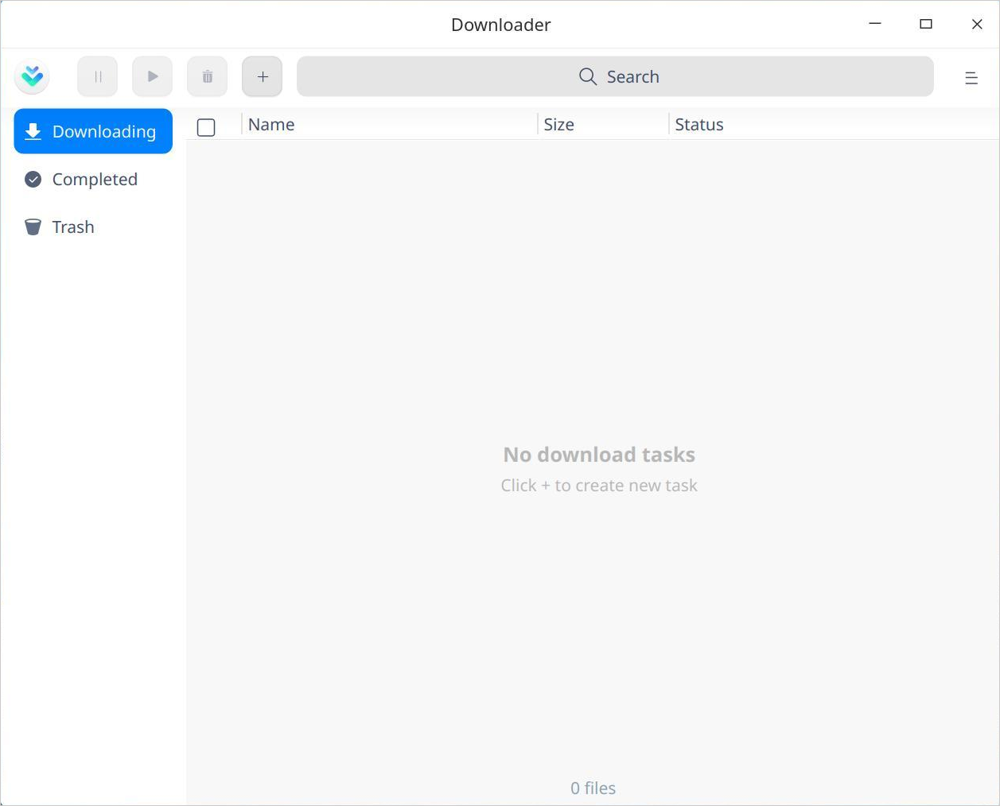
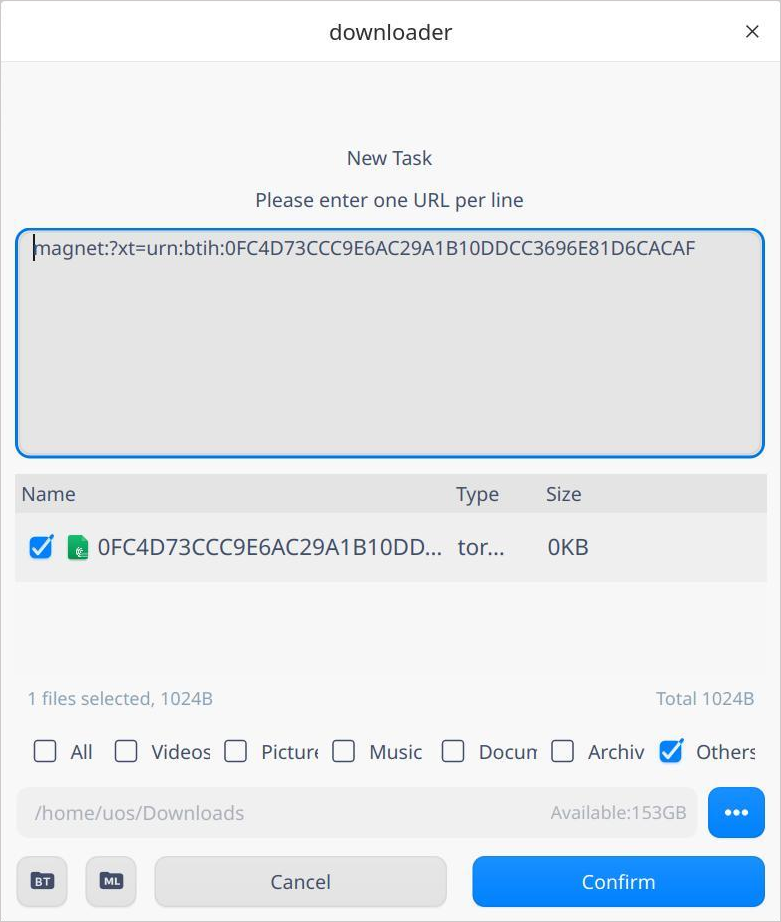
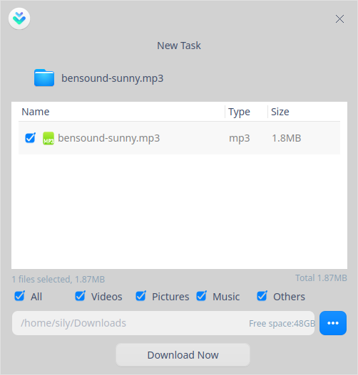
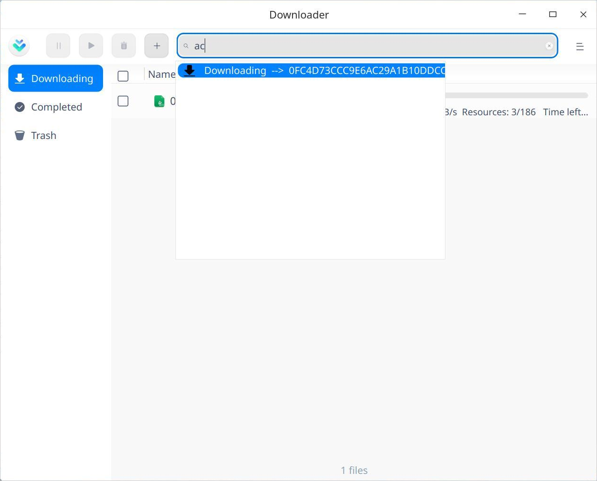
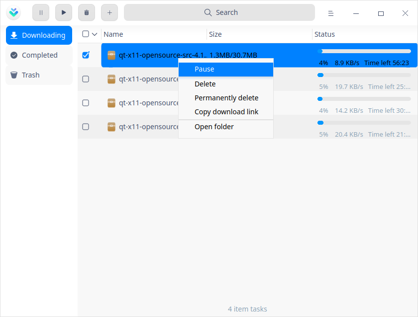
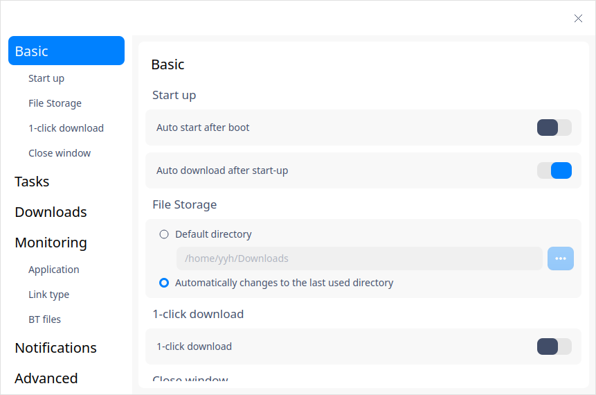
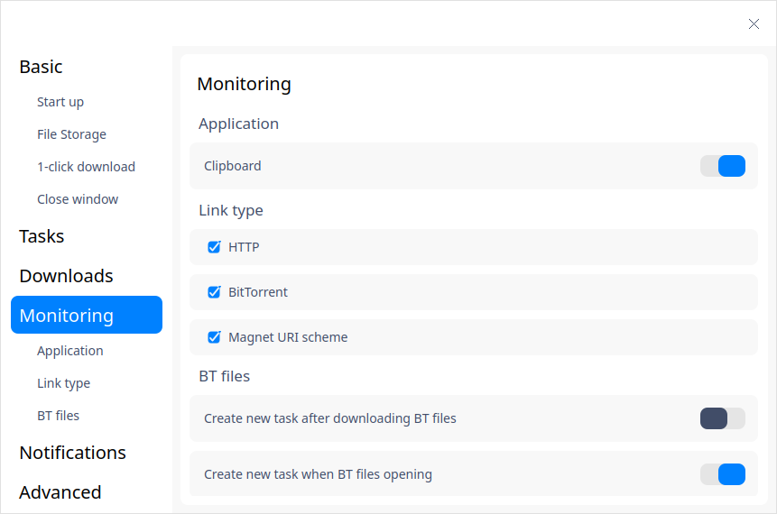
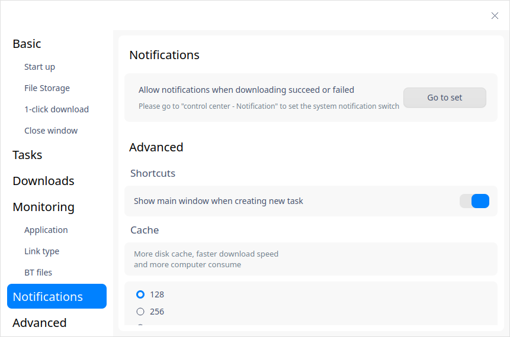
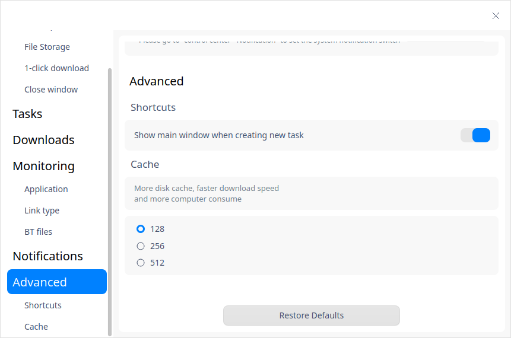
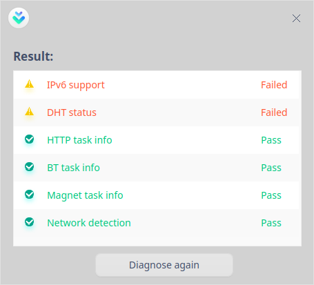

# Downloader|../common/uos-downloadmanager.svg|

## Overview

Downloader is a tool for downloading network resources. It supports a variety of network download protocols. It establishes network resource download tasks and provide task management for users. It can make reasonable use of network bandwidth and conveniently obtain the resources that can be downloaded on the network.

## Guide

You can run, close or create a shortcut for Downloading Manager as follows.

### Run Downloader

1. Click  on the Dock to enter the interface of launcher.
2. Locate  by scrolling the mouse wheel or searching "Log Viewer" in the Launcher interface and click it to run.
3. Right-click  to:
   - Select **Send to desktop** to create a shortcut on the desktop.

   - Select  **Send to dock** to fix it onto the dock.

   - Select **Add to startup** to run it automatically when the computer is turned on.

### Close Downloader

- On the main interface of Downloading Manager, click X to exit.
- Right-click on the Dock, select **Close all** or **Force Quit** to exit.
- On interface of Downloader, click  and select **Exit** to exit.

## Operations
### New tasks

#### For URL

1. On main interface of Downloader, click , a window titled **New Task** pops up. 

2. Enter a URL, and select the storing path, and click **Confirm**. 

   > Notes: You can add many URL at a time, but you should make sure there is only one in each line.

#### For BT files

1. There are two methods to create downloading tasks for BT files:

   - Double-click a BT file, a window titled **New Task** pops up. 

   - On main interface of Downloader, click and drag a BT file into the address box or click , then the interface of File Manager pops up. Select the BT file you need. 
2. In the confirming box of downloading resource, select the file types you want to download, select a storing path.  
3. Click **Download Now** to create a task.

### Search

1. Downloading Manager supports searching.  Click  to input keywords.
2. Searching results will be displayed after inputing. If no results are found, you will get a hint **No match result**. 

3. Click  to clear searching contents. 

### Downloading

A list of files being downloaded is displayed in this interface, including file name, size and status.  You can also:

> Notes: To enable the following operations you should select the file first. 

**Pause**: click  or right-click and select **Pause** to pause downloading.

**Continue**: if you want to continue downloading, click  or right-click and select **Continue** to resume the paused downloading process. 

**Delete**: click   or right-click the file and select **Delete** to delete a downloaded file, and it goes into Trash. If you check **Delete local files**, it would not be found in the Trash and local file is deleted also. 

**Permanently delete**: right-click the file and select this option to delete local file. 

**Copy download link**: right-click the file and select this option to share it to others. 

**Open folder**: right-click the file and select this option, the folder where the file is saved will be opened.

### Completed

A list of files that have been downloaded is displayed in this interface, including file name, size and finish time. You can also:

> Notes: To enable the following operations you should select the file first.

**Open**: click  or right-click and select this option to open the file. 

**Open folder**: click right-click and select this option, the folder where the file is saved will be opened. 

**Rename**: right-click and select this option to rename it.

**Move to**: right-click and select this option to move the downloaded files into the specified folders.

**Delete**: click   or right-click the file and select **Delete** to delete a downloaded file, and it goes into Trash. If you check **Delete local files**, it would not be found in the Trash and local file is deleted also. 

**Permanently delete**: right-click the file and select this option to delete local file.

**Copy download link**: right-click the file and select this option to share it to others. 

### Failed

If downloading process has failed, you can try again. If it still fails, the possible causes include: wrong downloading URL, insufficient storage space and so on. 

### Trash

A list of files that have been deleted is displayed in this interface, including file name, size and delete time. And you can also:

> Notes: To enable the following operations you should select the file first.

**Restore**: click  or right-click the file and select this option to restore it to its original status and it will be moved into the list of files that have been downloaded.

**Download again**: right-click the file and select this option to try again. 

**Open**: right-click the file and select this option t open it.

**Open folder**: right-click the file and select this option, the folder where the file is saved will be opened.

**Copy download link**: right-click the file and select this option to share it to others. 

**Delete**: click   or right-click the file and select **Delete** to delete a downloaded file, and it goes into Trash. If you select **Delete local files**, it would not be found in the Trash and local file is deleted also. 

**Permanently delete**: right-click the file and select this option to delete local file.

**Empty**: click  or right-click the file and select this option to clear up all files in Trash.

## Main Menu

In the main menu, you can adjust settings, use diagnostic tools, switch themes, view help manual, and so on.

### Settings
#### Basic

**Start up**: this option is related to the startup of the Downloader.

- Auto start after boot: Downloader starts up when the computer starts up when this button is switched on.  
- Auto download after start-up: Whenever you start up Downloader, the unfinished tasks in the downloading list will be resumed automatically when this button is switched on.  

**File Storage**: this setting is related to downloading directory. 

- Default directory: select a folder in File Manager and set it as default directory. 
- Automatically changes to the last used directory: when you create a task, the last used directory is set as default directory.

**1-click download**: once this button is switched on, whenever you click a URL or open a BT file, a task is created directly without popping up the interface of Downloader. 

**Close window**: you can choose whether to minimize to System Tray or to exit.

#### Tasks

You can set the tasks being downloaded, for example, choose the active downloads, downloading speed, and so on.

#### Downloads

You can choose "speed unlimited" or "speed limited" and the "limited period" here.

#### Monitoring

**Application**: currently clipboard is supported here. When Downloader is running, if there was any URL copied to clipboard, Downloader would automatically create a task and resource selecting box would pop up.

**Link type**: only when "Application" button is switched on, can you select link types. Currently, HTTP, BitTorrent and Magnet URI scheme are supported. Tasks are created successfully only when the URL copied or clicked complies with the selected link types. 

**BT files**: set Downloader as the default opening program for BT files. When you click a BT file, Downloader starts up automatically and creates a task, and resource selecting box pops up.

#### Notifications

When a task status changes, the system will notify you about the change. Please read [Notification Settings](dman:///dde#Notification Settings) for details. 

#### Advanced

You can set cache sizes here. The larger the disk cache is, the faster the download speed and the more computer resources are consumed.

#### Restore Defaults

Click **Restore Defaults** to restore all settings to defaults. 

### When download completed

When download is completed, you can select **Shut down**, **Hibernate**, or **Exit Downloader**. For example, in order to avoid the peak use of the network, you can create a download task before you go off work, and set the automatic shutdown after the download is completed.

### Diagnostic tool

You can use it to test IPv6 support, DHT status, HTTP task info, BT task info, Magnet task info and network detection.

### Theme

The window theme includes Light Theme, Dark Theme and System Theme (default).

1. Click on the interface.
2. Click  **Theme** to select one.

### Help

Click Help to get the manual, which will help you further know and use Log Viewer.

1. Click on the interface.
2. Click **Help** to view the manual.

### About

1. Click on the interface.
2. Click **About** to view version information and introduction about Log Viewer.

### Exit

1. Click on the interface.
2. Click  **Exit**.

Update Date: 2020-09-22 Version: 1.0
