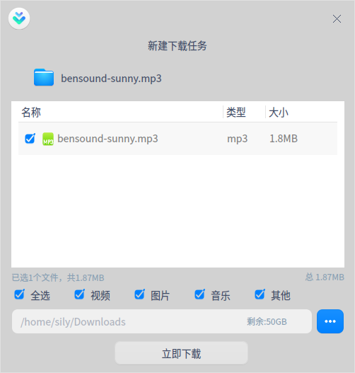
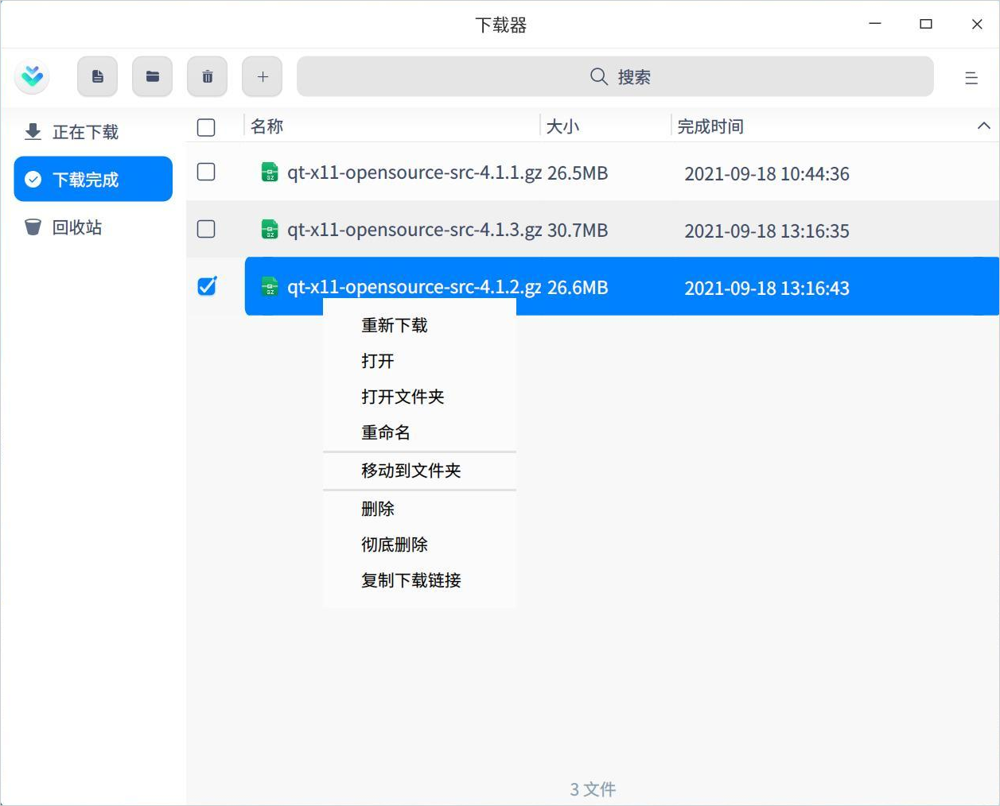
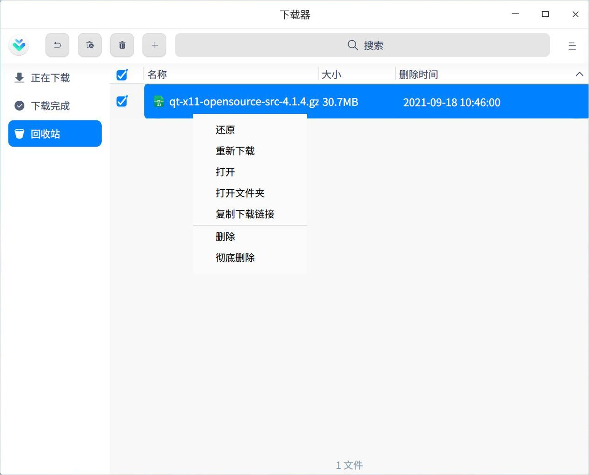
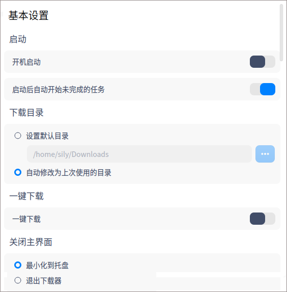
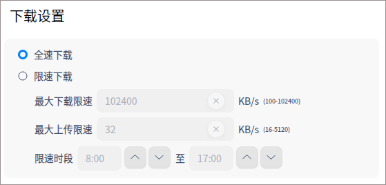
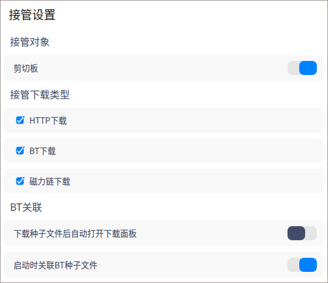
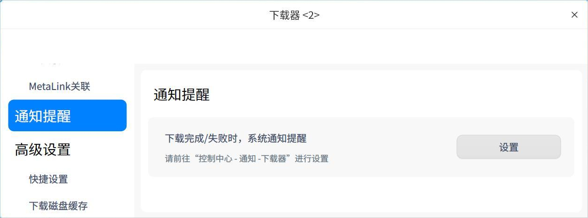

# 下载器|../common/uos-downloadmanager.svg|

## 概述

下载器是一个网络资源下载工具，支持多种网络下载协议，为用户建立网络资源下载任务和任务管理。可以合理的利用网络带宽，便捷的获取网络上可下载的资源。

## 使用入门

您可以通过以下方式运行或关闭下载器，或者创建快捷方式。

### 运行下载器

1. 单击任务栏上的启动器 ，进入启动器界面。
2. 上下滚动鼠标滚轮浏览或通过搜索，找到下载器    ，单击运行  。
3. 右键单击 ，您可以：
   - 单击 **发送到桌面**，在桌面创建快捷方式。

   - 单击 **发送到任务栏**，将应用程序固定到任务栏。

   - 单击 **开机自动启动**，将应用程序添加到开机启动项，在电脑开机时自动运行该应用程序。

### 关闭下载器

- 在下载器界面，单击   ，退出下载器。
- 右键单击任务栏上的 图标，选择 **关闭所有** 来退出下载器。
- 在下载器界面单击  ，选择 **退出** 来退出下载器。

## 操作介绍
### 添加任务

#### 通过下载链接添加任务

1. 在下载器界面单击添加任务按钮，弹出资源选择框。

2. 输入下载地址，并选择路径，单击 **确认**，则任务创建成功。

   > 说明：可同时添加多个链接，需确保每行只有一个链接。

#### 通过BT文件创建下载任务

1. 通过BT文件创建下载任务，有以下两种方式：

   - 双击BT文件时，直接弹出资源选择框。

   - 在下载器界面单击，将BT文件拖入地址框，或单击 ，弹出文件管理器，选择需要的BT文件。
2. 在资源选择框中，勾选需要下载的文件类型，并选择下载路径。
3. 单击 **立即下载**，则任务创建成功。

### 搜索任务

1. 下载器中自带搜索功能，可以搜索下载任务。单击搜索按钮，输入关键字；

2. 输入成功后，界面会根据字段显示搜索结果；如果没有发现匹配的选项时，则显示为 **没有匹配的搜索结果**。

3. 单击关闭按钮  ，则关闭搜索内容。

### 正在下载

主要显示正在下载的文件列表，包括文件名、大小及状态，还可以进行以下操作：

> 说明：以下操作需要勾选对应文件才能生效。

**暂停**：单击暂停按钮  或右键选择 **暂停** 后，文件暂停下载。

**开始**：如果想要继续下载，单击开始按钮   或右键选择 **开始** 后，之前暂停下载文件则会继续下载。

**删除任务**：单击删除按钮  或右键选择 **删除任务** 后，可删除正在下载的文件，被删除的文件会被放到回收站。如果勾选 **同时删除本地文件**，回收站中则不会出现此文件，且本地文件也将被删除。

**彻底删除**：右键选中后，被删除的文件不会被放到回收站，且本地文件将被删除。

**复制下载链接**：右键选中后，可复制下载链接重新下载或共享给其他人。

**打开文件夹**：右键选中后，界面直接跳转到下载文件所在的文件夹。

### 下载完成

主要显示下载完成的文件列表，包括文件名、大小及完成时间，还可以进行以下操作：

> 说明：以下操作需要勾选对应文件才能生效。

**打开**：单击打开按钮  或右键选择 **打开** 后，可打开该文件。

**打开文件夹**：单击打开文件夹按钮  或右键选择 **打开文件夹** 后，界面直接跳转到文件所在的文件夹。

**重命名**：右键选中后，可对下载的文件重命名。

**移动到文件夹**：右键选中后，可将下载的文件移动到指定的文件夹。

**删除任务**：单击删除按钮  或右键选择 **删除任务** 后，可删除已下载的文件，被删除的文件会被放到回收站。如果勾选 **同时删除本地文件**，回收站中则不会出现此文件，且本地文件也将被删除。

**彻底删除**：右键选中后，被删除的文件不会被放到回收站，且本地文件将被删除。

**复制下载链接**：右键选中后，可复制下载链接重新下载或共享给其他人。

### 下载失败

当文件下载失败时，可尝试重新下载。如果还是下载失败，可能是下载链接问题、存储路径空间不够或无网络等原因，具体以实际情况为准。

### 回收站 

主要显示被删除的文件列表，包括文件名、大小及删除时间，还可以进行以下操作：

> 说明：以下操作需要勾选对应文件才能生效。

**还原**：单击还原按钮  或右键选择 **还原** 后，可还原该文件，还原后的文件会被放到下载完成列表中。

**重新下载**：右键选中后，可重新下载该文件。

**打开**：右键选中后，可打开该文件。

**打开文件夹**：右键选中后，界面直接跳转到文件所在的文件夹。

**复制下载链接**：右键选中后，可复制下载链接重新下载或共享给其他人。

**删除任务**：单击删除按钮  或右键选择 **删除任务** 后，可删除回收站中的文件。如果勾选 **同时删除本地文件**，本地文件也将被删除。

**彻底删除**：右键选中后，被删除的文件不会被放到回收站，且本地文件将被删除。

**清空**：单击清空按钮 或右键选中 **清空** 后，可清空回收站中的所有文件。

## 主菜单

在主菜单中，您可以进行下载设置、使用下载诊断工具、切换窗口主题、查看帮助手册等操作。

### 设置
#### 基本设置

**启动**：主要设置程序启动的相关项。

- 开机启动：开启此项后，当电脑开机时，自动启动下载器程序。
- 启动后自动开始未完成的任务：开启此项后，每当启动下载器时，自动开始正在下载列表中没有下载完的任务

**下载目录**：主要设置下载目录的相关项。

- 设置默认目录：从文件管理器中选择一下文件夹，作为默认下载路径，此后每次创建下载任务时，都以此路径为默认下载路径。
- 自动修改为上次使用的目录：创建下载任务时，下载路径默认为上次下载时选择的路径 。

**一键下载**：开启一键下载功能后，单击链接或打开BT文件时，不弹出下载器界面，直接建立下载任务。

**关闭主界面**：在关闭主界面的时候可设置为最小化到托盘或退出下载器。

#### 任务管理

主要对下载中的任务进行设置，可以选择同时下载最大任务数，全局下载速度等。

#### 下载设置

主要设置全速下载或限速下载，及限速时段。

#### 接管设置

**接管对象**：目前支持的接管对象为剪切板。当下载器处于运行状态时，如果有下载链接被复制到剪贴板，下载器会自动创建任务，并弹出资源选择框。

**接管下载类型**：在有接管对象的时候才能选择接管下载类型，当前支持 HTTP下载、BT下载和磁力链下载。只有当复制或点击的链接为选中的类型时，才会创建下载任务。

**BT关联**：将下载器设置为BT文件的默认打开程序。当用户点击BT文件时，自动启动下载器，并创建下载任务，弹出资源选择框。

#### 通知提醒

当有任务状态变更时，通过系统通知来告知用户任务状态变更内容 ，具体操作请参阅 [通知设置](dman:///dde#通知设置)。

#### 高级设置

主要设置下载磁盘缓存的大小，磁盘缓存越大，下载速度越快，占用电脑资源越多。

#### 恢复默认

单击 **恢复默认**，则所有设置项恢复默认设置。

### 下载完成后

下载完成后，可以选择 **关机**、**休眠** 或 **退出下载器**。如为了错开网络使用高峰，您可以在下班前创建下载任务，并设置下载完成后自动关机。

### 下载诊断工具

主要诊断是否支持IPv6协议、DHT网络状态、下载类型任务信息及网络环境。

### 主题

窗口主题包含浅色主题、深色主题和系统主题，其中系统主题为默认设置。

1. 在下载器界面，单击。
2. 单击 **主题**，选择一个主题颜色。

### 帮助

1. 在下载器界面，单击 。
2. 单击 **帮助**，查看关于下载器的帮助手册，让您进一步了解和使用下载器。

### 关于

1. 在下载器界面，单击 。
2. 单击 **关于**，查看关于下载器的版本和介绍。

### 退出

1. 在下载器界面，单击 。
2. 单击 **退出**。

文档更新时间: 2020-09-30 版本: 1.0
