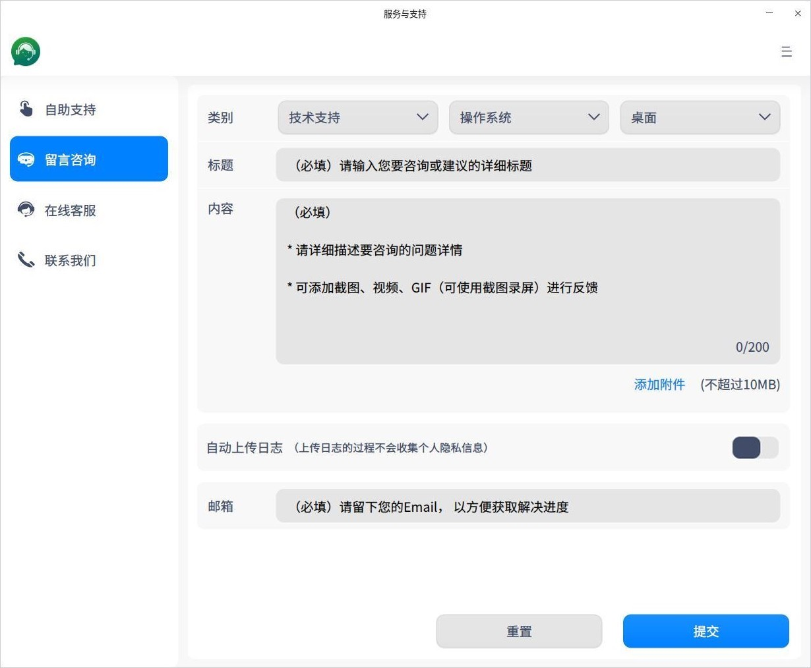
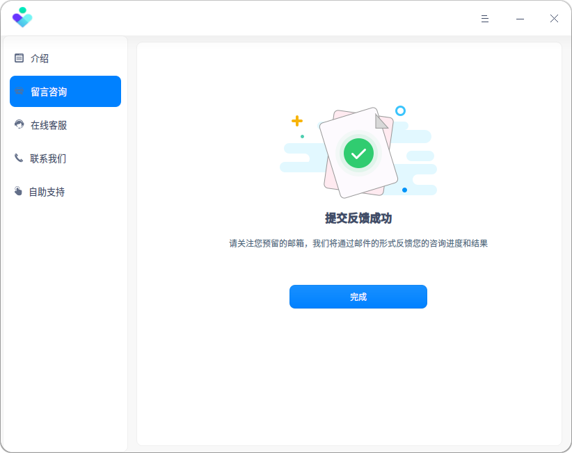
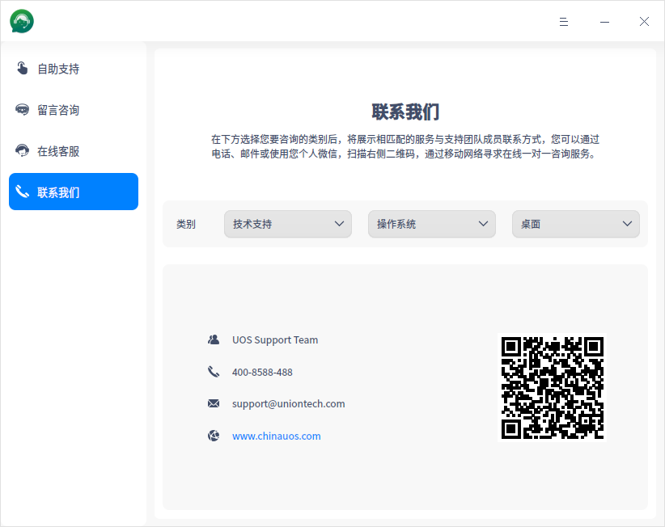
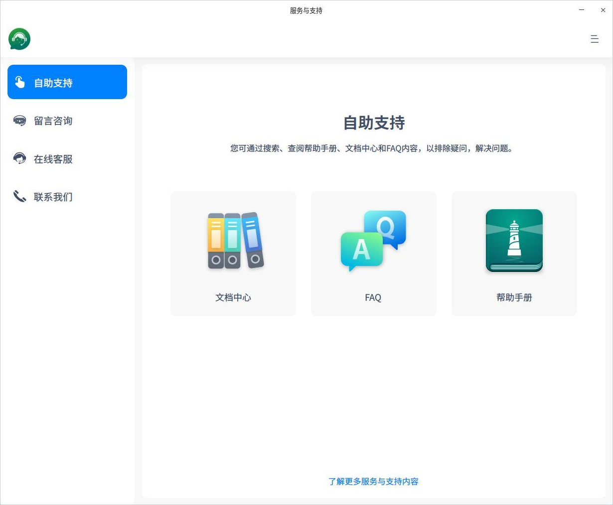

# 服务与支持|../common/support.svg|

## 概述

服务与支持是由统信软件研发的一款用户在系统端，与UOS官方技术服务团队进行交互的应用程序，它涵盖远程服务、现场服务、培训服务和顾问咨询服务等，旨在为用户提供多种渠道的服务与技术支持，更便于用户快速寻求帮助并反馈问题。

## 使用入门

### 运行服务与支持

1. 进入UOS系统，点击桌面下方的启动器 ，进入启动器界面。
2. 上下滚动鼠标滚轮浏览或通过搜索，找到服务与支持， 点击运行。
3. 右键单击 **服务与支持**，您可以：

 - 点击 **发送到桌面**，在桌面创建快捷方式。
 - 点击 **发送到任务栏**，将应用程序固定到任务栏。
 - 点击 **开机自动启动**，将应用程序添加到开机启动项，在电脑开机时自动运行该应用。

### 关闭服务与支持

- 在服务与支持界面点击   ，退出服务与支持。
- 在任务栏右键单击 ，选择 **关闭所有**或 **强制退出**退出服务与支持。
- 在服务与支持界面点击  ，选择 **退出** 来退出服务与支持。

## 主界面

主界面左侧导航栏主要包含介绍、留言咨询、在线客服、联系我们和自助支持。

用户可以通过以下方式寻求技术支持和服务。
- 在线咨询： 提供IM和反馈两种在线咨询方式。
- 电话：5x8小时或7x24小时呼叫中心电话支持响应。
- 邮件：用户通过发送邮件到指定官方邮件，寻求服务与技术响应。
- 企业微信：用户通过微信添加服务与支持团队成员企业微信号为好友，寻求在线响应。
- 自助支持：用户通过搜索、查询帮助手册、文档中心和FAQ内容，已排除疑问，解决问题。

点击 **了解更多服务与支持内容**，跳转至UOS产品官方网站技术支持页面（https://www.uniontech.com/service）。

## 留言咨询

为了确保能够为用户提供高效的服务，通过留言咨询，用户可以留下联系方式和咨询内容，以方便客服及时与用户取得联系，快速解决问题。

1. 在左侧导航栏点击 **留言咨询** 页签。

   - 当有外网连接时，进入留言咨询界面，执行步骤 2。
   - 当无网连接时，点击 **联系我们**，具体操作请参阅 联系我们。
   
2. 设置相关参数，如图所示。

   - **咨询类别**：必选项，如技术支持、操作系统、桌面等。
   - **标题**：必选项，咨询或建议的详细标题。
   - **内容**：必选项，描述需要咨询的问题，可通过鼠标拖拽截图、视频和GIF文件到内容。
   - **添加附件**：可选项，附件数量不超过4个，每个附件大小不超过10MB。
   - **上传日志**：可选项，默认关闭，用户可以选择开启。上传日志的过程中将保护您的个人隐私信息。
   - **邮件**：必选项，E-mail用于向用户反馈问题的处理进度和结果。
   
   
   
   
3. 点击 **提交**，弹出 **提交反馈成功**对话框。将填写的信息反馈给 UOS服务与支持团队 。

   在尚未提交反馈信息时，如果需要修改信息或信息填写错，可以点击 **重置**，清空已填写和上传的内容或附件，将恢复为初始的默认状态。
   
4. 点击 **完成**， 返回到应用主界面。

 当留言咨询提交后，UOS服务与支持团队将通过您预留的E-mail反馈处理进度和结果 。

   

## 在线客服

用户轻轻一点，就可以与客服人员及时交流、沟通服务与技术问题。

1. 在左侧导航栏点击 **在线客服** 页签。

   - 当有外网连接时，进入在线客服界面，执行步骤 2。
   - 当无网连接时，点击 **联系我们**，具体操作请参阅 联系我们。

2.  进行在线IM聊天、发送附件、查看历史消息。

   - 在输入框中输入想要咨询沟通的内容，即可开启在线聊天。
   - 点击上传附件图标，上传附件。
   - 点击对话框顶部 **查看更多历史消息**，查看历史消息。

 

## 联系我们

用户可以通过电话、邮件或使用个人微信扫描企业微信号二维码，添加好友，通过移动网络联系我们寻求一对一的咨询服务。

1. 在左侧导航栏点击 **联系我们** 页签，进入联系我们界面。
2.  选择需要咨询的类别，将展示相匹配的服务与支持团队成员联系方式， 用户通过获取联系方式来联系我们。

## 自助支持

用户可以通过搜索、查阅帮助手册、UOS网站文档中心和FAQ，来排除疑问、解决问题。

在左侧导航栏点击 **自助支持** 页签，进入自助支持界面。

- **文档中心**：点击 **前往文档中心** 图标，跳转至UOS产品网站（https://doc.chinauos.com/），输入用户名、密码，登录网站（如没有注册，则需要注册成功后才可以登录），进入文档中心页面，即可查看相应文档。
- **FAQ**：点击 **前往FAQ** 图标，跳转至UOS产品网站（https://doc.chinauos.com/），进入FAQ页面。 
- **帮助手册**：点击 **打开“帮助手册”** 图标，打开应用的帮助手册。

帮助手册图

## 主菜单 

在主菜单中，您可以切换窗口主题、查看帮助手册，了解服务与支持的更多信息。

### 主题

窗口主题包含深色主题、浅色主题和系统主题，其中系统主题为默认设置。

1.  在服务与支持界面，点击。
2.  点击 **主题**，选择一个主题颜色。

### 帮助

查看帮助手册，通过帮助让您进一步了解服务与支持。

1.  在服务与支持界面，点击 。
2.  点击 **帮助**。
3.  查看关于服务与支持的帮助手册。

### 关于

1.  在服务与支持界面，点击 。
2.  点击 **关于**。
3.  查看关于服务与支持的版本和介绍。

### 退出

1. 在服务与支持界面，点击 。
2. 点击 **退出**。

