# File Manager|../common/deepin-file-manager.svg|

## Overview

As the core component to manage files, File Manager is a powerful, easy-to-use tool with an elegant and simple interface. Full-featured, well-designed, efficient-improved, File Manager will be a good help in your daily life and work.

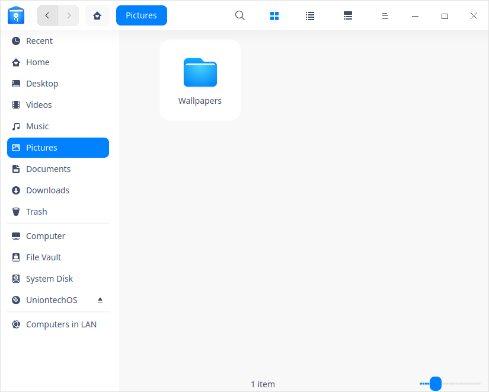

## Guide

You can run, close and create a shortcut for File Manager by the following ways.

### Run File Manager

1. Click  on dock to enter Launcher interface.
2. Locate  by scrolling mouse wheel or searching by "File Manager" in Launcher interface.
3. Right-click , you can
 - Click **Send to desktop** to create a desktop shortcut.
 - Click **Send to dock** to fix the application on dock.
 - Click **Add to startup** to add the application to startup, it will automatically run when the system starts up.

### Exit File Manager

- On File Manager interface, click  to exit.
- Right-click  on Dock, select **Close All** to exit File Manager.
- Click  and select **Exit** to exit File Manager.

### View Shortcut Keys

On Document Viewer interface, press  **Ctrl** +**Shift** +**?** to view all shortcut keys quickly, which helps you to use them skillfully and improves your working efficiency. 

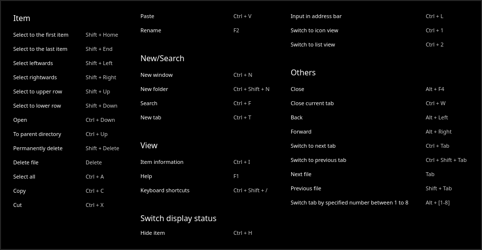

## Main Interface

On File Manager interface, you can execute many operations with the functional bars. It is designed to be easy-to-use, user-friendly and efficient improving.

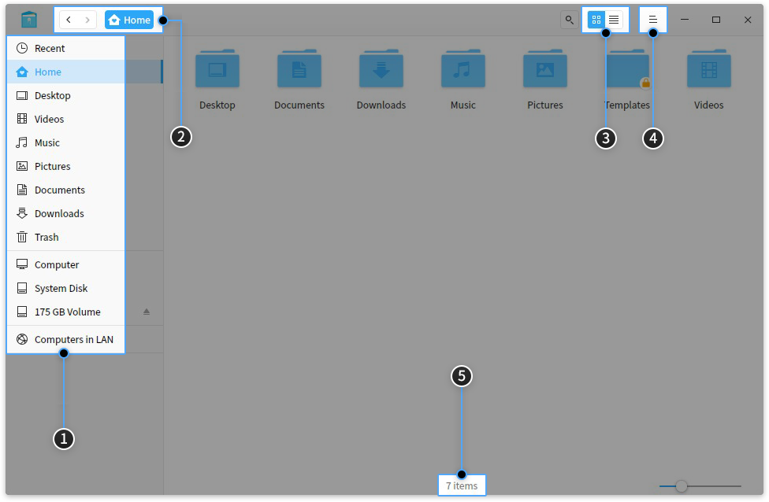

| No. | Name          | Description                                                         |
| ---- | ------------- | ------------------------------------------------------------ |
| 1    | Left panel        | Click icons in left panel to quickly visit local files, disks, computers in LAN, bookmarks and tags. |
| 2    | Address bar        | You can quickly switch visiting history, switch among directory levels, search and input address in address bar. |
| 3    | View | Click  and  to switch view modes. |
| 4    | Info column        | Click  to view basic information and tags of files(folders). |
| 5    | Main menu        | You can create new window, switch themes, set share password, make settings, view manual and application information, and exit the application in Main menu. |
| 6    | Status bar        | You can view the number of files or selected files.                            |

> Tips: you can drag the dividing line on the right of left panel to change its width.

## Basic Functions

File Manager is featured with the basic functions as a file manager, you can easily create, copy, rename or delete files/folders with it.

### New Document/Folder

#### New Document

1. On File Manager interface, right-click and select **New document**.
2. In the pop-up menu, select the document format you want to create.
3. Input a name for the new document, and press **Enter** key, or click at blank area.

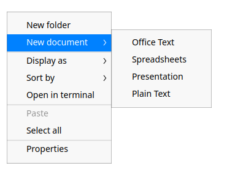

#### New Folder

1. On File Manager interface, right-click and select **New folder**.
2. Input a name for the new folder, and press **Enter** key, or click at blank area.

### Rename File/Folder

1. Select the file/folder, right-click to select **Rename**.
2. Input a new name for the file/folder, and press **Enter** key, or click at any blank area.

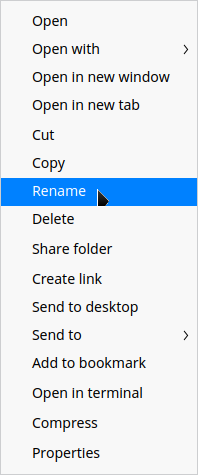

> Tips: Check "Hide file extension when rename" in **Settings** to rename file more conveniently.

### Batch Rename

1. On File Manager interface, select multiple files.
2. Right-click and select **Rename**.
   - **Replace Text**: Input the content to be replaced in Find box, and input content to rename in Replace box.
   - **Add Text**: Input the content to add in Add box, and select the location.
   - **Custom Text**: Input the file name and SN.
3. Click **Rename** to finish operation.

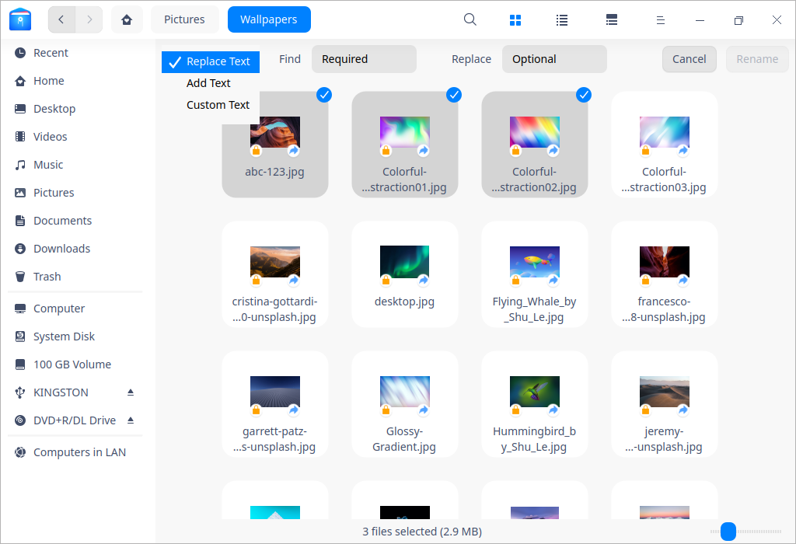

### View files

Click  and  on the interface to switch icon view and list view.

- Icon view: displaying filenames, icons or thumbnails.

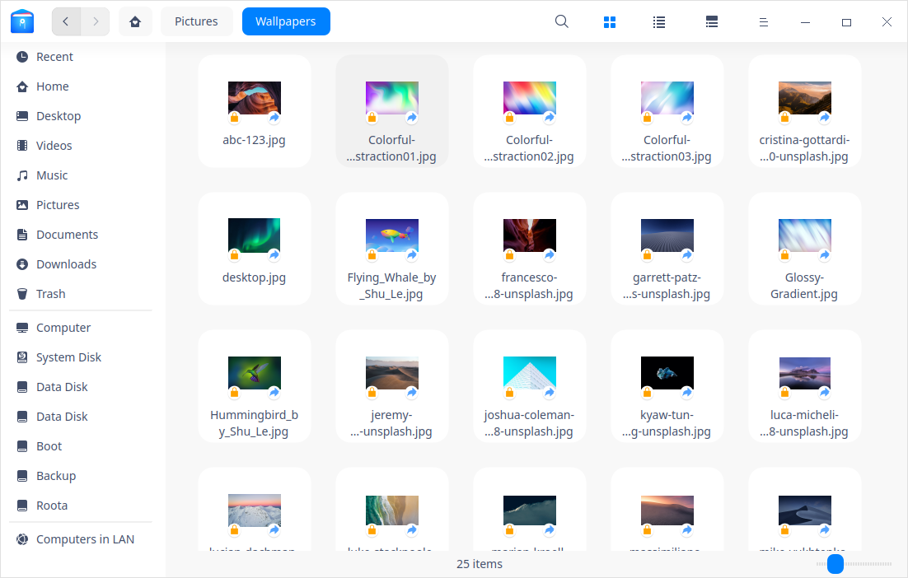

- List view: displaying file icons or thumbnails, names, time modified, sizes, types and etc in a list. 

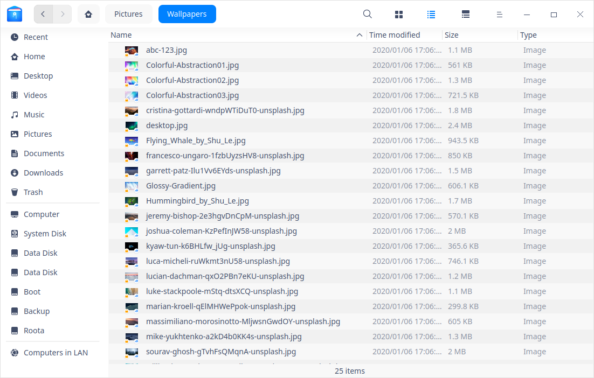

> Tips: In list view, place the cursor on the dividing line between any two columns and drag it to change the width of the current column. Double-click the dividing line to adjust to the biggest width of the current column automatically. 

> Tips: Press  **Ctrl**+**1**  or  **Ctrl**+ **2**  to switch icon view and list view. 

### Sorting

1. Right-click in the blank area on File Manager, select **Sort by**.
2. Choose among the sorting options, which include **Name**, **Time modified**, **Size** and **Type**.

> Tips: you can click the head of the columns in the list view to change the sort order.

### Open Files

1. On File Manager, right-click the file you want to open.
2. In the context menu, select **Open with**>**Select default program**.
3. Select the application you want to open the file in the list.

> Notes: It will use the default application to open the file when you double-click it. You can right-click the file, select **Properties** and choose a default application in **Open with ** list. You can also set the options in the [Default Applications](dman:///dde#Default Application Settings) of the Control Center to change the global default applications of the specified file types.

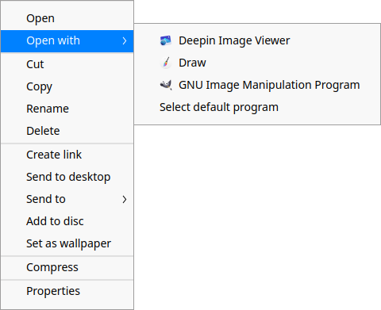

> Tips: You can right-click multiple files of the same type, and select **Open with** to open them at a time.

### Hide files

1. On File Manager, right-click the file you want to hide.
2. Select **Properties**, check **Hide this file**.

### Copy File/Folder

1. Select the files/folders to be copied, right-click and select **Copy**.
2. Enter the directory to which the files/folders will be pasted, right-click and select **Paste**.

### Compress File/Folder

1. Select the files/folders to be compressed, right-click and select **Compress**.
2. Input a file name and select a file format for the to be compressed file.
3. Select a location to store it.
4. Select **Compress** to generate the compressed file.

> Notes: Switch on **Advanced Options** to set password and split volumes sizes. **Encrypt the archive** and **Split to volumes** are only applicable for some formats.

### Delete File/Folder

Right-click file/folder to select **Delete**.
  - You can find the deleted files in Trash. Right-click files in Trash, you can choose **Restore** or **Delete**. 
  - The shortcut of the deleted files will become invalid.

> Attention: File/folder in external device will be permanently deleted and can not be restored when you select **Delete**.

### Undo Operation
In file manager,  use **Ctrl** + **Z** to undo the previous steps, including:
- Delete the newly created file/folder.
- Resume the renamed file/folder to the previous name.
- Restore the deleted file/folder from trash.
- Restore the moved (via dragging or cutting) file/folder to the previous location.
- Delete the copied and pasted file/folder.

> Attention: If the above operations are continuous, you can undo all of them; if there is file overwriting or permanently file deleting, then you can only return to that step.

### File/Folder Properties

In Properties of files, you can view the basic info, open with list, and permissions. In properties of folders, you can see basic info, sharing info, and permissions.

1. On File Manager interface, right-click a file. 
2. Select **Properties**.

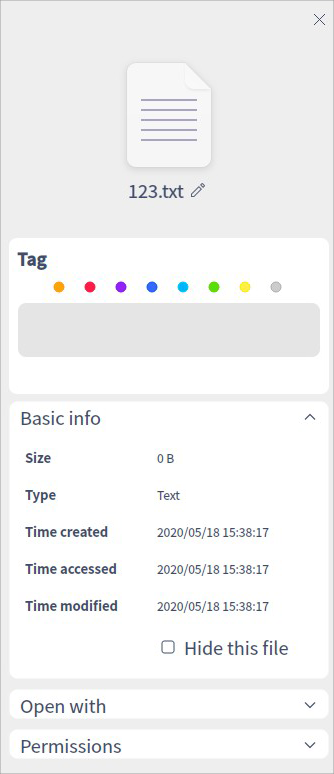

> Notes: If you check the properties of multiple files at a time, the total size and quantities will be displayed. If you check the properties of a shortcut, the source file location will be displayed in addition. You can press **Ctrl** + **I** to view the properties as well.

## Common Operations

File Manager is featured with many useful functions, which are all designed to ease the commonly used operations.

### Switch Address Bar

There are three sections in address bar, namely back/forward buttons, breadcrumb bar, and directory/search bar. By default, breadcrumb bar is displayed in the address bar. 

- Clicking back/forward buttons to quickly view the previous address or the next address. 
- Each level of the location of a file will form a breadcrumb. You can switch quickly among levels by clicking all breadcrumbs.

By clicking the search icon, or right-click the file path and select **Edit address**, the address bar will be switched into inputting box. By clicking out of the inputting box, the address bar will restore to breadcrumbs automatically. 

- The inputting box can identify smartly. You can input keywords or an address and press **Enter** key, the system will identify automatically and search or visit.

### Search files

Click the search button or press **Ctrl + F**  to switch to the search bar. Or, input the keywords and press **Enter**, the search results will be shown in the window.

- If you need to search in a specified directory, please enter it before search.

> Notes: 
   - In **Settings**, check "Auto index internal disk" and "Index external storage device after connected to computer" to quicken the searching speed.
   - In case you want to search files by keywords in the content, you can check **Full-Text search** in **Settings** > **Advanced** > **Index**.

#### Advanced Search
1. In search bar, input the keywords and press **Enter**. When the results appear, you will see  icon, you can click it to do advanced search.
2. Select the searching range, file type and size, and modified time, accessed time and created time to narrow the search results.

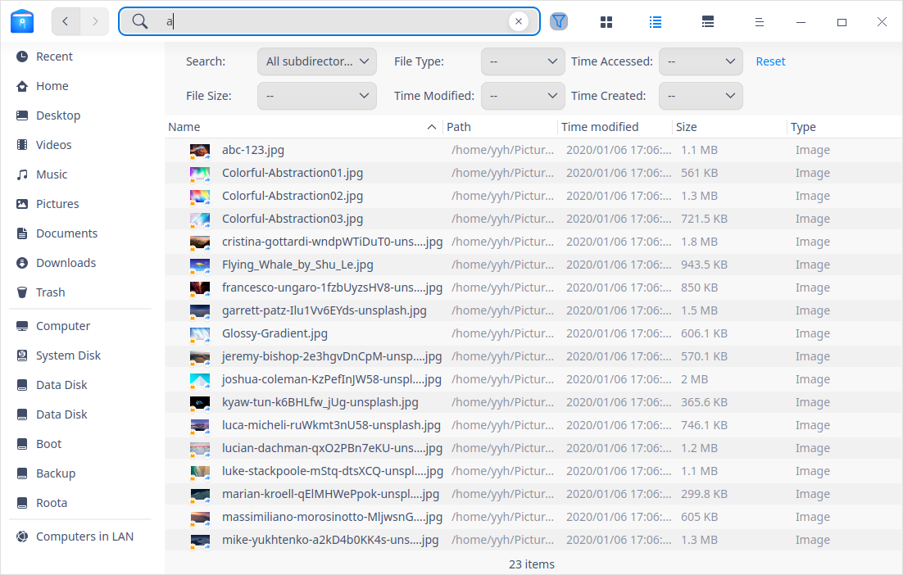

### Recent Files
By default, there is a **Recent** entry on left panel. Click it to view the recently used files. Files are sorted by default in reverse order of access time.

> Notes: If you want to hide "Recent", you can uncheck "Display recent file entry in left panel" in Settings > Basic > Hidden files. To hide the access record of a specific file, right-click the file and select **Remove** which will not delete the file.

### Manage Tabs

File Manager supports multi-tab view.

1. On File Manager, right-click the folder.
2. In the pop-up context menu, select **Open in new tab**.
3. When the window has multi-tabs, you can:
 - Click + in tab bar to add a new tab.
 - Click × on the tab to close it. 
 - Place the cursor on the tab, middle-click to close it.

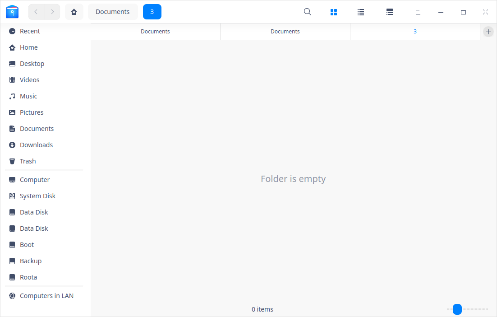

> Tips: When the File Manager has only one tab, the tab bar is hidden, you can press **Ctrl** + **T** to add a new tab.

### Manage Bookmarks

To quickly visit a folder from the left panel, you can add bookmarks for frequently used folders.

- Add Bookmarks: On File Manager, right-click the folder, in the pop-up context menu, select **Add to bookmark**.
- Move Bookmarks: you can move bookmarks within the bookmark area. Drag and drop the bookmark to the designated location.
- Delete Bookmarks: you can delete bookmarks by right-clicking the bookmark and select **Remove**, or right-clicking the bookmarked folder and select **Remove bookmark**, or dragging and dropping the bookmark out of the left panel to delete it.

### Manage Tags

By adding tags on file/folder, you can classify and manage your files better.

> Notes: currently only x86 platform supports **Tag information**. All contents related to "Tag information" in this manual are only applicable for x86 platform.

#### Add Tags

##### By Tag information

1. Right-click a file/folder, select **Tag information**.
2. Input tag info. Use comma to separate tags in case of multiple tags.
3. Press  **Enter** key to finish adding tag.

> Notes: The tag color is randomly assigned from eight default colors.

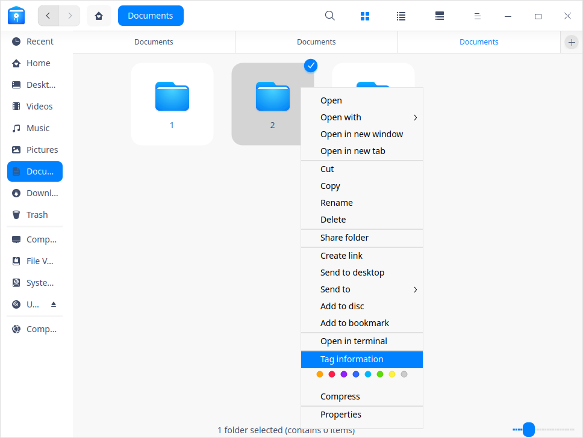

##### By Color Tag

Right-click a file/folder, select a "color button" to create a color tag directly.

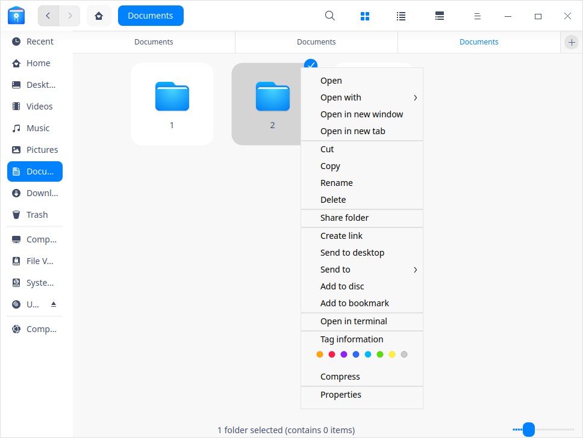

##### By information column on the right side

Select a file/folder, click , and add tags in the information column on the right side.

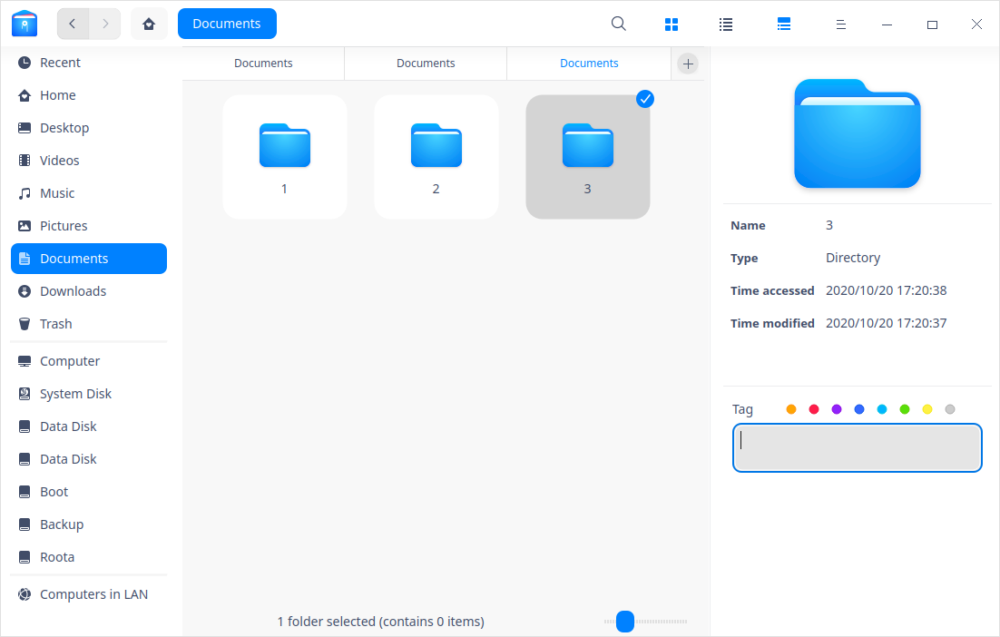

> Notes: You can add tag to multiple files/folders at a time, or add multiple tags to a single file/folder; you can also add tags in Properties of the file/folder. The tag appears in the left panel.

> Attention: If a file has a tag, copy or cut and then paste it, the new file still has the same tag.

#### Rename Tag

Right-click a tag in  the left panel,  select **Rename** to modify the current tag.

#### Change Tag Color

Right-click a tag in  the left panel,  select a "Color button" to change the current tag color.

#### Change Tag Order

Drag and drop the tag upwards or downwards to change its order.

#### Delete Tag
Right-click a tag in left panel,  select **Remove** to delete the tag.

### Preview Files

File Manager supports file preview by pressing space bar. Select a file and press the space bar on the keyboard to quickly preview it. In the preview window, you can view the file info, including image resolution, document size, text content. It also supports gif, audio and video playback.

#### Preview Video

1. Select a video and press  the space bar to start video preview.
2. Click in the preview window to pause video playing.
3. Drag the progress bar to play forward or backward.
4. Click **Open** at the bottom to enter "open with" window.

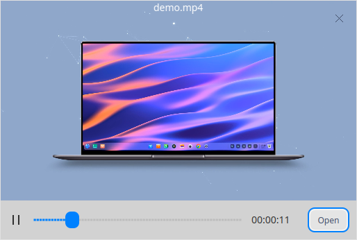

Notes: You can select multiple files and press space bar to preview them at a time.

### Permission Management
In file/folder properties, click **Permissions** to set **Owner**, **Group** and **Others**. 

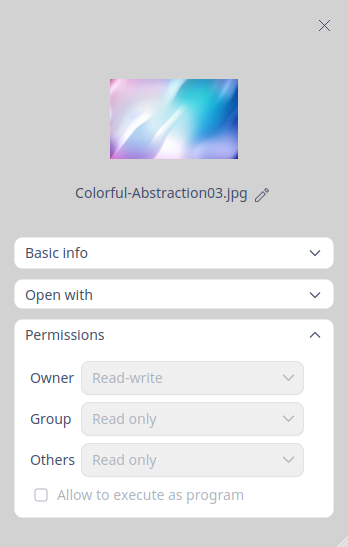

### My Shares

You can share folders in File Manager, if there are some folders shared, the share icon will show on the left panel, if not, the share icon will be removed.

#### Share Local Files

1. On File Manager interface, right-click a folder, select **Share folder**.
2. In the pop-up window, check **Share this folder** under **Sharing**.
3. Input **Share name**, and choose **Permission** and **Anonymous ** according to actual needs before closing the window.
5. To set share password, click  and select **Set share password**.
5. Input password and click **Confirm**.

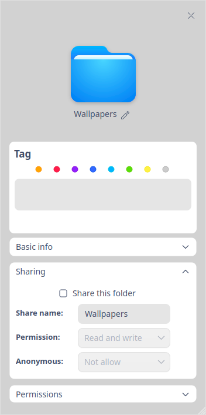

> Tips: You can cancel sharing by unchecking **Share this folder**, or right-click the folder and select **Cancel sharing**. 

#### Visit Sharing Folders 

You can find sharing folders of other users in the same LAN in **Computers in LAN**. You can also visit sharing folders via smb.

1. On File Manager interface, input the sharing address of the LAN user, e.g. smb://xx.x.xx.xxx (usually it should be an IP address), press **Enter** key.
2. Input the username and password or visit by anonymous access.
- Unencrypted folders can be visited by anonymous access without inputting username and password.
- When you visit encrypted folders, a window pops up and you will have to input user name and password before visiting. If you check **Remember password**, you don't have to input password when you visit the folder next time.
  - Username: i.e. the name created when the user installed the system, which means the one used to log in the system.
  - Password: i.e. the sharing password set when LAN user shares the folder.  
3. Click **Connect**. 

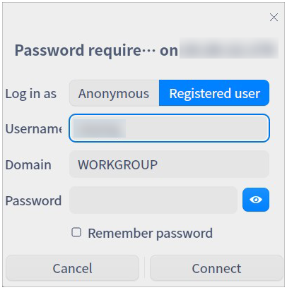

### Computers in LAN

1. On File Manager interface, click .
2. Double-click the folder you want to visit.
3. Input the username and password or visit by anonymous access.
   - Unencrypted folders can be visited by anonymous access without inputting username and password.
   - When you visit encrypted folders, a window pops up and you will have to input user name and password before visiting. If you check **Remember password**, you don't have to input password when you visit the folder next time.
4. Click **Connect** to establish connection.

### Open in Terminal

1. On File Manager interface, right-click in any blank area.
2. Select **Open in terminal** to start up Terminal, and its path is the current directory.

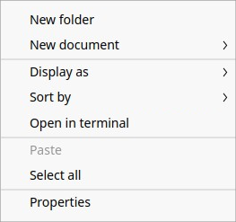

### Create Link

1. On File Manager interface, right-click the item to create a link for.
2.  Select **Create link**.
3. In the pop-up window, select a location and input the name of the link.
4. Click **Save** to finish creating the link.

> Tips: By selecting **Send to desktop** for an item, you can create a link on desktop with one click.

### Send To Other Device

When there is an external device inserted, you can directly send file/folder to it.

1. On File Manager interface, select a file/folder.
2. Right-click and select **Send to**.
3. Select the device you want to send to.
4. File/folder will be copied to the device.

## Disk Management

On File Manager interface, you can manage local and external disks. 

### View Disks

Local disks are displayed in the left panel of File Manager. When you mount any external disks or insert other mobile storage devices, the corresponding icons will be displayed in the left panel.

<table class="block1">
    <caption></caption>
    <tbody>
        <tr>
            <td>Local disks</td>
            <td>All disks of local harddisk divisions</td>
        </tr>
        <tr>
            <td>External disks</td>
            <td>Including mobile hard disks, CDs/DVDs and USB flash disks.</td>
        </tr>
    	<tr>
            <td>Mobile devices</td>
            <td>Including mobile phone storage, storage cards, SD cards and so on.</td>
        </tr>
    </tbody>
</table>

> Notes: If disks or folders in the disk are encrypted, you will have to input password before visiting them. 

### Unmount/Eject/Safely Remove Disks

1. In the left panel of File Manager, right-click the disk you want to remove.
2. Select **Unmount**.
3. The disk will be removed from the disk list, and so will all partition of it .

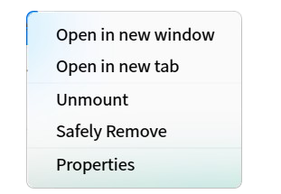

> Tips: you can also select **Eject** or click  in the left panel to unmount the disk.

### Rename Disks
1. In the left panel or on computer interface, right-click the disk you want to rename.
2. Select **Unmount** and then select **Rename**.
3. Input the new name.

### Format Disks

1. In the left panel of File Manager, right-click the disk to format.
2. Select **Unmount** and then select **Format**.
3. In the pop-up window, choose the type and volume label for the disk.
4. Click **Format**.

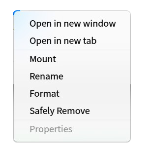

> Notes: If you check **Quick Format**, the disk can be formated quickly in a few seconds, but the data could be restored by file recovery tools. If you don't want these data to be restored, you can uncheck this option box and format the disk.

## Main Menu

You can create new window, switch themes, [set share password](#Share Local Files),make settings, view manual and version information in Main Menu.

### New Window

1. Click on the interface.
2. Select **New window** to open a new window.

### Theme

The window theme includes Light Theme, Dark Theme and System Theme (default).

1. Click on the interface.
2. Click  **Theme** to select one.

### Settings

1. Click on the interface.
2. Select **Settings**.
3. Modify the settings according to your needs:
   - Basic:
      + In **Open behavior**, you can set whether to open folder in new window always by one click or double click.
      + In **New window and tab**, you can set the default path to open in a new window/tab.
      + In **View**, you can set file icon size and default view.
      + In **Hidden files**, you can set whether to show the hidden file, whether to hide file extension when rename, and whether to display recent file entry in left panel.
   - Advanced: 
    + In **Index**, you can set whether to auto index internal disk and externally connected storage devices, and whether to search by file content.
     + In **Preview**, you can set which types of files can be previewed.
     + In **Mount**, you can set to auto mount.
     + In **Dialog**, you can set whether to use the file chooser dialog of File Manager.
     + In **Other**, you can set whether to hide system disk or not.

### Help

1. Click on the interface.
2. Click **Help** to view the manual.

### About

1. Click on the interface.
2. Click **About** to view version information and introduction about File Manager.

### Exit

1. Click on the interface.
2. Click **Exit**.

Update Date: 2021-01-13 Version: 5.2
