# 桌面环境|../common/dde.svg|

## 概述
统信操作系统(简称“统信UOS”)是一款美观易用、安全可靠的国产桌面操作系统。统信UOS预装了文件管理器、应用商店、看图、系统监视器等一系列原生应用。它既能让您体验到丰富多彩的娱乐生活，也可以满足您的日常工作需要。随着功能的不断升级和完善，统信操作系统已成为国内最受欢迎的操作系统之一。

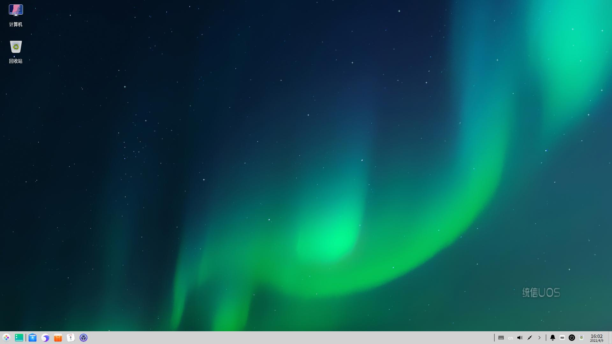

### 系统简介
初次进入统信操作系统，会自动打开欢迎程序。您可以观看视频了解系统功能，选择桌面样式和图标主题，进一步了解该系统。

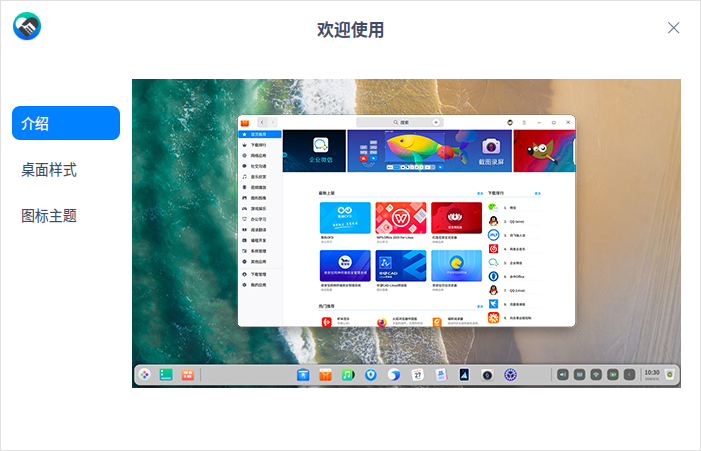

成功登录系统后，即可体验统信UOS桌面环境。桌面环境主要由桌面、任务栏、启动器、控制中心等组成，是您使用该操作系统的基础。

## 桌面
桌面是您登录后看到的主屏幕区域。在桌面上，您可以新建文件/文件夹、排列文件、打开终端、设置壁纸和屏保等，还可以通过启动器 [发送到桌面](#设置快捷方式) 向桌面添加应用的快捷方式。

### 新建文件夹/文档
在桌面新建文件夹或文档，也可以对文件进行常规操作，和在文件管理器中一样。

- 在桌面上，单击鼠标右键，单击 **新建文件夹**，输入新建文件夹的名称。
- 在桌面上，单击鼠标右键，单击 **新建文档**，选择新建文档的类型，输入新建文档的名称。

在桌面文件或文件夹上，单击鼠标右键，您可以使用文件管理器的相关功能：

|功能| 说明 |
| ----------- |------------------------------------------ |
| 打开方式    | 选定系统默认打开方式，也可以选择其他关联应用程序来打开。 |
| 剪切      |移动文件或文件夹。             |
| 复制      |复制文件或文件夹。             |
| 重命名      |重命名文件或文件夹。            |
| 删除        |删除文件或文件夹。              |
| 创建链接    |创建一个快捷方式。                         |
| 标记信息    |添加标记信息，以对文件或文件夹进行标签化管理。      |
| 压缩/解压缩 |压缩文件或文件夹，或对压缩文件进行解压。 |
| 属性        |查看文件或文件夹的基本信息，共享方式，及其权限。      |

### 设置排列方式
您可以对桌面上的图标按照需要进行排序。

1. 在桌面上，单击鼠标右键。
2. 单击 **排序方式**，您可以：
   - 单击 **名称**，将按文件的名称顺序显示。
   - 单击 **大小**，将按文件的大小顺序显示。
   - 单击 **类型**，将按文件的类型顺序显示。
   - 单击 **修改时间**，文件将按最近一次的修改日期顺序显示。

> 窍门：您也可以勾选 **自动排列**，桌面图标将从上往下，从左往右按照当前排序规则排列，有图标被删除时后面的图标会自动向前填充。

### 调整图标大小
1. 在桌面上，单击鼠标右键。
2. 单击 **图标大小**。
3. 选择一个合适的图标大小。

> 窍门：您也可以用 **Ctrl** + //鼠标滚动来调整桌面和启动器中的图标大小。

### 设置显示器
从这里快速进入控制中心设置显示器的缩放比例、分辨率和亮度等。

1. 在桌面上，单击鼠标右键。
2. 单击 **显示设置**，快速进入控制中心的显示设置界面。

> 说明：关于显示的设置，具体操作请参阅 [显示设置](#显示设置) 。

 ### 更改壁纸
您可以选择一些精美、时尚的壁纸来美化桌面，让您的电脑显示与众不同。

1. 在桌面上，单击鼠标右键。
2. 单击 **壁纸与屏保**，在桌面底部预览所有壁纸。
3. 选择某一壁纸后，壁纸就会在桌面和锁屏中生效。
4. 您可以单击 **仅设置桌面** 和 **仅设置锁屏** 来控制壁纸的生效范围。

&nbsp;&nbsp;&nbsp;&nbsp;&nbsp;&nbsp;&nbsp;&nbsp;&nbsp;&nbsp;&nbsp;&nbsp;&nbsp;
> 窍门： 您还可以在图片查看器中设置您喜欢的图片为桌面壁纸。

### 设置屏保
屏幕保护程序原本是为了保护显像管，现在一般用来防范他人偷窥您电脑上的一些隐私。

1. 在桌面上，单击鼠标右键。
2. 单击 **壁纸与屏保**，单击 **屏保**，在桌面底部预览所有屏保。
3. 选择其中一个屏保，单击 **设置屏保**，在上方选择 **闲置时间**。
4. 您可以勾选 **恢复时需要密码**，以便更好地保护您的隐私。
5. 待电脑空闲指定时间后，将启动您选择的屏幕保护程序。

### 剪贴板
剪贴板展示当前用户登录系统后复制和剪切的所有文本、图片和文件。使用剪贴板可以快速复制其中的某项内容。注销或关机后，剪贴板会自动清空。

1. 使用快捷键 **Ctrl** + **Alt** + **V** 唤出剪贴板。
2. 双击剪贴板内的某一区块，会快速复制当前内容， 且当前区块会被移动到剪贴板顶部。
3. 选择目标位置粘贴。
4. 鼠标移入剪贴板的某一区块，单击上方的，删除当前内容；单击顶部的 **全部清除**，清空剪贴板。

## 任务栏
任务栏是指位于桌面底部的长条，主要由启动器、应用程序图标、托盘区、系统插件等组成。在任务栏，您可以打开启动器、显示桌面、进入工作区，对其上的应用程序进行打开、新建、关闭、强制退出等操作，还可以设置输入法，调节音量，连接Wi-Fi，查看日历，进入关机界面等。

### 认识任务栏图标
任务栏图标包括启动器图标、应用程序图标、托盘区图标、系统插件图标等。

| 图标 | 说明 | 图标 | 说明 |
| ------------------------------------------------------------ | :---------------------------------- | -------------------------------------------------------- | --------------------------------------------------- |
|                         | 启动器 - 点击查看所有已安装的应用。 |  | 显示桌面。                                          |
|  | 文件管理器 - 点击查看磁盘中的文件、文件夹。 |  | 浏览器 - 点击打开网页。 |
|  | 商店 - 搜索安装应用软件。 |  | 日历 - 查看日期、新建日程。            |
|                      | 控制中心 - 点击进入系统设置。       |                    | 通知中心 - 显示所有系统和应用的通知。               |
|         | 屏幕键盘 - 点击使用虚拟键盘。 | | 电源 - 点击进入关机界面。 |
|  | 回收站。        |                             |                                             |

&nbsp;&nbsp;&nbsp;&nbsp;&nbsp;&nbsp;&nbsp;&nbsp;&nbsp;&nbsp;&nbsp;&nbsp;&nbsp;
> 窍门：在高效模式下，单击任务栏最右侧可显示桌面。将鼠标指针移到任务栏上已打开窗口的图标时，会显示相应的预览窗口。

### 切换显示模式
任务栏提供两种显示模式：时尚模式和高效模式，显示不同的图标大小和应用窗口激活效果。

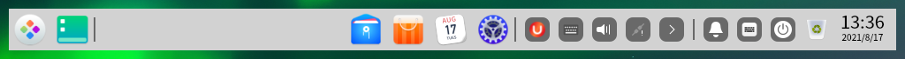

&nbsp;&nbsp;&nbsp;&nbsp;&nbsp;&nbsp;&nbsp;&nbsp;&nbsp;&nbsp;&nbsp;&nbsp;&nbsp;

您可以通过以下操作来切换显示模式：

1. 右键单击任务栏。
2. 在 **模式** 子菜单中选择一种显示模式。

### 设置任务栏位置
您可以将任务栏放置在桌面的任意方向。

1. 右键单击任务栏。
2. 在 **位置** 子菜单中选择一个方向。

### 调整任务栏高度 
鼠标拖动任务栏边缘，改变任务栏高度。

### 显示/隐藏任务栏
任务栏可以隐藏，以便最大程度的扩展桌面的可操作区域。

1. 右键单击任务栏。
2. 在 **状态** 子菜单中您可以：
   - 选择 **一直显示**，任务栏将会一直显示在桌面上。
   - 选择 **一直隐藏**，任务栏将会隐藏起来，只有在鼠标移至任务栏区域时才会显示。
   - 选择 **智能隐藏**，当占用任务栏区域时，任务栏自动隐藏。

### 显示/隐藏插件
1. 右键单击任务栏。
2. 在 **插件** 子菜单中勾选或取消勾选 **回收站、电源、显示桌面、屏幕键盘、通知中心、时间**，可以设置这些插件在任务栏上的显示和隐藏效果。

### 查看通知
当有系统或应用通知时，会在桌面上方弹出通知消息。若有按钮，单击按钮执行对应操作；若无按钮，单击关闭此消息。

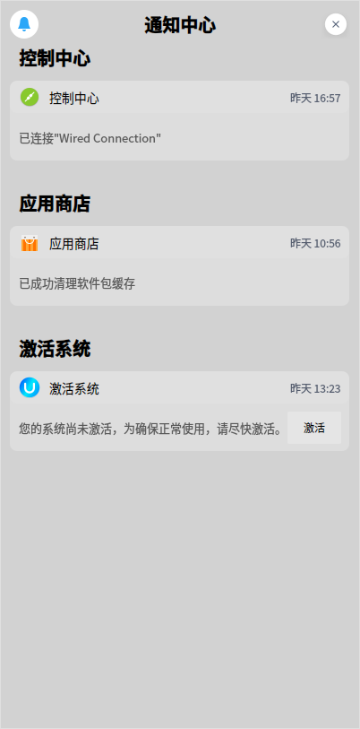

&nbsp;&nbsp;&nbsp;&nbsp;&nbsp;&nbsp;&nbsp;&nbsp;&nbsp;&nbsp;&nbsp;&nbsp;&nbsp;

您还可以单击任务栏上的 ， 打开通知中心，查看所有通知。

### 查看日期时间

- 鼠标指针悬停在任务栏的时间上，查看当前日期、星期和时间。
- 单击时间，打开日历。

### 进入关机界面
您可以单击任务栏上的  进入关机界面，也可以在启动器的小窗口模式中单击 。

|功能|说明|
|--|---|
|关机|关闭电脑。|
|重启|关机后再次重新运行您的电脑。|
|锁定|锁定电脑，或按下键盘上的 **Super** + **L** 组合键锁定。|
|切换用户|选择另一个用户帐户登录。|
|注销|清除当前登录用户的信息。|
|系统监视器|快速启动系统监视器。|

&nbsp;&nbsp;&nbsp;&nbsp;&nbsp;&nbsp;&nbsp;&nbsp;&nbsp;&nbsp;&nbsp;&nbsp;&nbsp;

> 说明：当系统存在多个帐户时才显示 。

### 回收站
电脑中临时被删除的所有文件您都可以在回收站中找到，回收站中的文件可以被恢复或清空。

#### 还原文件
对于已删除的文件，您可以进入回收站进行还原，或使用 **Ctrl** + **Z** 还原刚删除的文件。

1. 在回收站中，选择要恢复的文件。
2. 单击鼠标右键，选择 **还原**。
3. 还原文件到原来的存储路径下。

> 注意：如果原来所在的文件夹已经删除，还原文件时会自动新建文件夹。

#### 清空回收站
在回收站中，单击 **清空**，将彻底删除回收站的所有内容。

## 启动器
启动器  帮助您管理系统中已安装的所有应用，在启动器中使用分类导航或搜索功能可以快速找到您需要的应用程序。

> 窍门：您可以进入启动器查看新安装的应用。新安装应用的旁边会出现一个小蓝点提示。

### 切换模式
启动器有全屏和小窗口两种模式。单击启动器界面右上角的图标来切换模式。

两种模式均支持搜索应用、设置快捷方式等操作。

小窗口模式还支持快速打开文件管理器，控制中心和进入关机界面等功能。

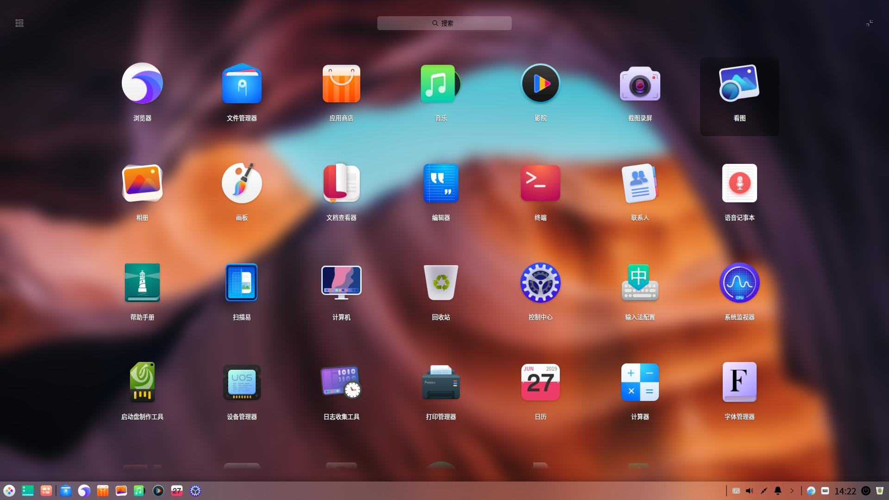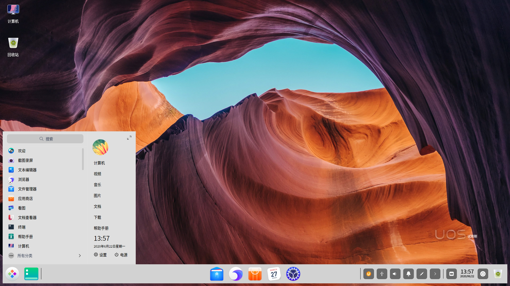

### 排列应用

在全屏模式下，系统默认按照安装时间排列所有应用。

- 将鼠标悬停在应用图标上，按住鼠标左键不放，将应用图标拖拽到指定的位置自由排列。
- 单击启动器界面左上角分类图标进行排列。

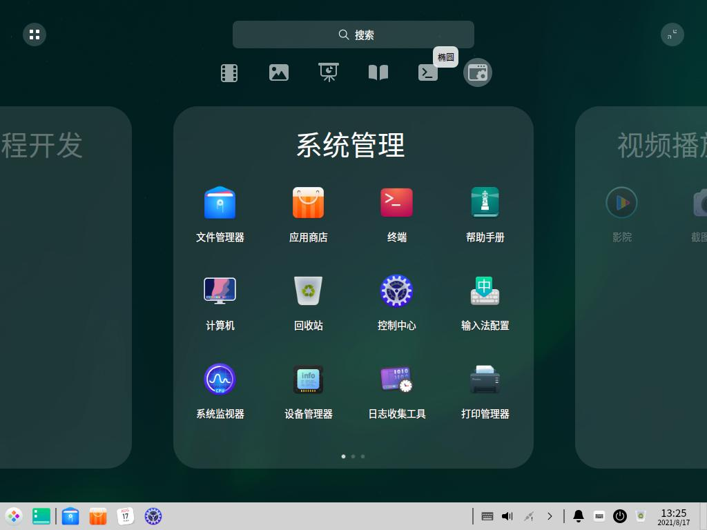

&nbsp;&nbsp;&nbsp;&nbsp;&nbsp;&nbsp;&nbsp;&nbsp;&nbsp;&nbsp;&nbsp;&nbsp;&nbsp;

在小窗口模式下，默认按照使用频率排列应用。

### 查找应用

在启动器中，您可以滚动鼠标滚轮或切换分类导航查找应用。

如果知道应用名称，直接在搜索框中输入关键字，快速定位到需要的应用。

### 设置快捷方式
快捷方式提供了一种简单快捷地启动应用的方法。

#### 创建快捷方式
将应用发送到桌面或任务栏上，方便您的后续操作。

在启动器中，右键单击应用图标，您可以：

- 单击 **发送到桌面**，在桌面创建快捷方式。

- 单击 **发送到任务栏**，将应用固定到任务栏。

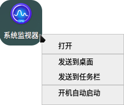

> 说明：您还可以从启动器拖拽应用图标到任务栏上放置。但是当应用处于运行状态时您将无法拖拽固定，此时您可以右键单击任务栏上的应用图标，选择 **驻留** 将应用固定到任务栏，以便下次使用时从任务栏上快速打开。

#### 删除快捷方式
您既可以在桌面直接删除应用的快捷方式，也可以在任务栏和启动器中删除。

**从任务栏上删除**

- 在任务栏上，按住鼠标左键不放，将应用图标拖拽到任务栏以外的区域移除快捷方式。
- 当应用处于运行状态时您将无法拖拽移除，此时可以右键单击任务栏上的应用图标，选择 **移除驻留** 将应用从任务栏上移除。

**从启动器中删除**

在启动器中，右键单击应用图标，您可以：

- 单击 **从桌面上移除**，删除桌面快捷方式。
- 单击 **从任务栏上移除**，将固定到任务栏上的应用移除。

> 说明：以上操作，只会删除应用的快捷方式，而不会卸载应用。

### 安装应用
如果启动器中没有您需要的应用，可以在应用商店一键下载安装。

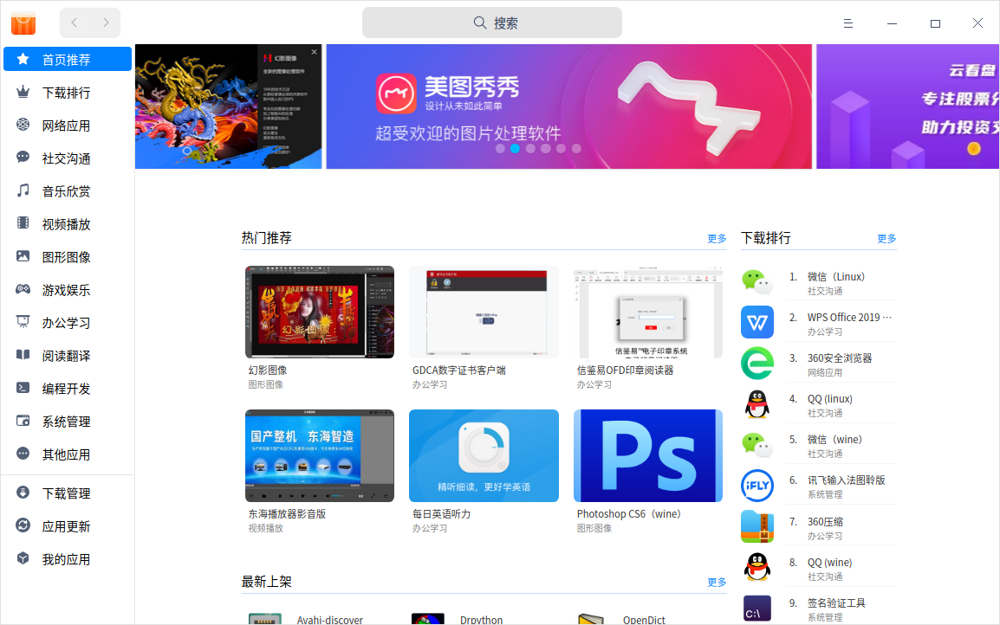

### 运行应用
对于已经创建了桌面快捷方式或固定到任务栏上的应用，您可以通过以下途径来打开应用。

- 双击桌面图标，或右键单击桌面图标选择 **打开**。
- 直接单击任务栏上的应用图标，或右键单击任务栏上的应用图标选择 **打开**。

在启动器中，直接单击应用图标打开，或右键单击应用图标选择 **打开**。

> 窍门：对于经常使用的应用，您可以在启动器中，右键单击应用图标选择 **开机自动启动**。

### 卸载应用
对于不再使用的应用，您可以选择将其卸载，以节省硬盘空间。

1. 在启动器中，右键单击应用图标。
2. 单击 **卸载**。

> 窍门：在 **时尚模式** 下，您还可以在启动器的全屏模式界面，按住鼠标左键不放，将应用图标拖拽到任务栏的  中卸载应用。

## 控制中心
统信操作系统通过控制中心来管理系统的基本设置，包括帐户管理、网络设置、日期和时间、个性化设置、显示设置、系统升级等。当您进入桌面环境后，单击任务栏上的 即可打开控制中心窗口。

### 首页介绍
控制中心首页主要展示各个设置模块，方便日常查看和快速设置。

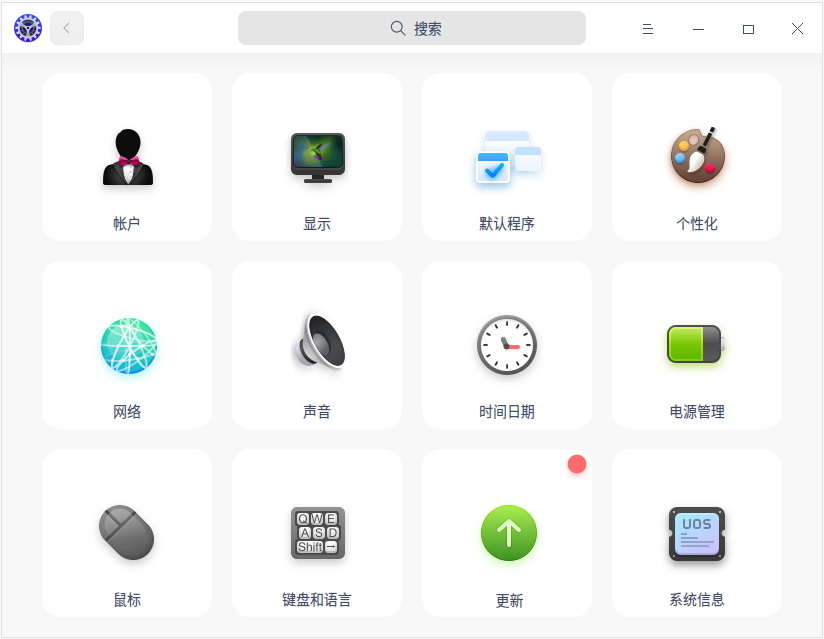

&nbsp;&nbsp;&nbsp;&nbsp;&nbsp;&nbsp;&nbsp;&nbsp;&nbsp;&nbsp;&nbsp;&nbsp;&nbsp;

打开控制中心的某一设置模块后，可以通过左侧导航栏快速切换到另一设置模块。

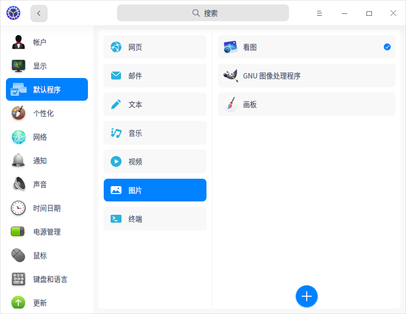

#### 标题栏
标题栏包含返回按钮，搜索框，主菜单及窗口按钮。

- 返回按钮：若要返回首页，单击 。
- 搜索框：输入关键字后，回车，搜索相应设置。
- 主菜单：单击 进入主菜单。在主菜单中，您可以设置窗口主题，查看版本，或退出控制中心。

### 帐户设置
在安装系统时您已经创建了一个帐户。在这里，您可以修改帐户设置或创建一个新帐户。

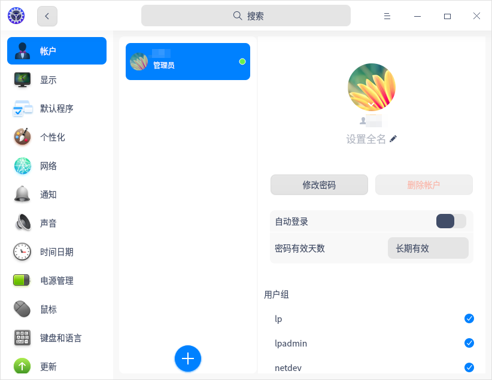

#### 创建新帐户

1. 在控制中心首页，单击 。
2. 单击。
3. 输入用户名、密码和重复密码。
4. 单击 **创建**。
5. 在授权对话框输入当前帐户的密码，新帐户就会添加到帐户列表中。

#### 更改头像

1. 在控制中心首页，单击 。
2. 单击列表中的帐户。
3. 单击帐户头像，选择一个头像或添加本地头像，头像就替换完成了。

#### 设置全名

帐户全名会显示在帐户列表和系统登录界面，可根据需要设置。

1. 在控制中心首页，单击 。
2. 单击列表中的帐户。
3. 单击 **设置全名** 后的 ，输入帐户全名。

#### 修改密码

1. 在控制中心首页，单击 。
2. 单击当前帐户。
3. 单击 **修改密码**，进入修改密码页面。
4. 输入当前密码、新密码和重复密码。

#### 删除帐户

1. 在控制中心首页，单击 。
2. 单击其他未登录的帐户。
3. 单击 **删除帐户** 。
4. 在弹出的确认界面中单击 **删除**。

> 注意: 已登录的帐户无法被删除。

#### 权限设置

除安装时的第一个帐户是管理员权限外，后面所添加的所有帐户都是普通用户。一个帐户可以在多个用户组内。

##### 设置组

添加或修改帐户时，可以：

- 选择系统内已有的组。
- 选择当前用户同名的组。
- 选择之前添加帐户时和其他用户同名的组。

### 显示设置
设置显示器的分辨率、亮度、屏幕方向等，让您的电脑显示到达最佳状态。

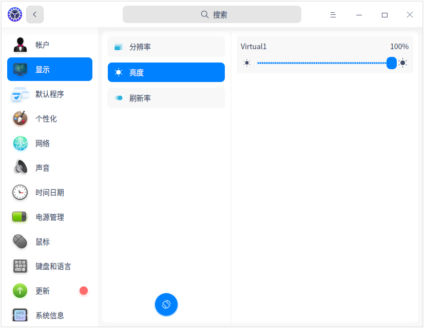

#### 单屏设置

##### 更改分辨率

1. 在控制中心首页，单击 。
2. 单击 **分辨率**，进入分辨率设置界面。
3. 在列表中选择合适的分辨率参数。
4. 单击 **保存**。

##### 调节亮度

1. 在控制中心首页，单击 。
2. 单击 **亮度**，进入亮度设置界面。
 - 拖动亮度条滑块，调节屏幕亮度。
 - 打开 **自动调节色温** 开关，开启进入护眼模式，自动调节色温。
 - 打开 **手动调节** 亮度开关，可以调节屏幕亮度 。

##### 设置屏幕刷新率

1. 在控制中心首页，单击 。
2. 单击 **刷新率**。
3. 选择一个合适的刷新率，单击 **保存**。

##### 改变屏幕方向

1. 在控制中心首页，单击 。
2. 单击  。
3. 每单击一下鼠标左键，屏幕逆时针旋转90°。
3. 要还原为之前的屏幕方向，单击鼠标右键退出；要使用当前屏幕方向，请按下组合键 **Ctrl** + **S** 保存。

#### 多屏设置

多屏显示，让您的视野无限延伸！使用VGA、HDMI、EDP等线缆将您的电脑和另一台显示器、投影仪等连接起来，同时在多个屏幕显示您电脑上的内容。

1. 在控制中心首页，单击 。
2. 单击 **多屏显示模式**。
3. 选择一种显示模式。
   - **复制 **将主屏的显示内容复制到其他屏幕。
   - **扩展** 将主屏的显示内容扩展到其他屏幕，扩大桌面区域。
   - **自定义** 设置显示模式，主屏、分辨率、刷新率和屏幕旋转方向。

在多屏环境下，按下 **Super** + **P **调出多屏显示模式的OSD。

详细操作方法如下。

1. 按住 **Super** 不放，再按下 **P** 或鼠标单击来进行模式选择。
2. 松开按键，确认选择，模式生效。

> 说明：当多屏显示模式为扩展模式时，仅主屏支持桌面图标显示、操作右键菜单等功能，而副屏不支持。

##### 自定义设置

1. 在控制中心首页，单击 。
2. 单击 **多屏显示模式** > **自定义**。
3. 单击 “识别”，查看屏幕名称。
4. 选择“合并”或“拆分”，然后对多个屏幕进行设置，如主屏、分辨率、刷新率，旋转屏幕等。
5. 单击 **保存**。

> 说明：合并即复制模式，拆分即扩展模式。

#### 触控屏设置

当接入触控屏时，您可以设置所在屏幕，并对其进行调整。

1. 在控制中心首页，单击 。
2. 单击 **触控屏**，并对屏幕进行设置。
3. 单击 **确定**。

### 默认程序设置

当安装有多个功能相似的应用程序时，可以选择其中的一个应用作为对应文件类型的默认启动程序。

#### 设置默认程序

1. 右键单击文件，选择 **打开方式** > **选择默认程序**。
2. 选择一个应用，自动勾选"设为默认"，单击 **确定**。
3. 该应用将自动添加到控制中心的默认程序列表。

#### 更改默认程序

1. 在控制中心首页，单击 。
2. 选择一个文件类型进入默认程序列表。
3. 在列表中选择另一个应用程序。

#### 添加默认程序

1. 在控制中心首页，单击 。
2. 选择文件类型进入默认程序列表。
3. 单击列表下的，选择desktop文件（一般在/usr/share/applications)，或特定的二进制文件。
4. 该程序将添加到列表，并自动设置为默认程序。

#### 删除默认程序

在默认程序列表中，您只能删除自己添加的应用程序，不能删除系统已经安装的应用。要删除系统已经安装的应用，只能卸载应用。卸载后该应用将自动从默认程序列表中删除。

可用以下方法删除自己添加的默认程序。

1. 在控制中心首页，单击 。
2. 选择文件类型进入默认程序列表。
3. 单击程序后面的，删除默认程序。

### 个性化设置
在这里，您可以设置系统主题、活动用色、字体等，改变桌面和窗口的外观，设置成您喜欢的显示风格。

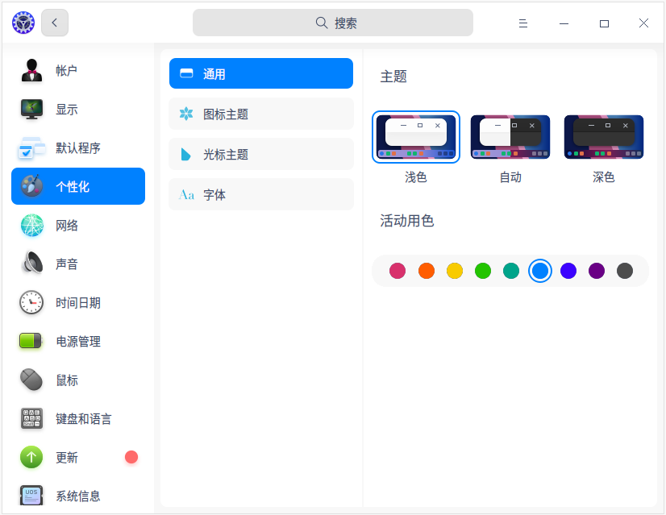

#### 设置窗口主题
1. 在控制中心首页，单击 。
2. 单击 **通用**，选择一种窗口主题。
3. 该主题即为系统窗口主题。

> 窍门：自动主题表示根据当前时区的时间，根据日出日落的时间自动更换窗口主题。日出后是浅色，日落后是深色。

#### 更改活动用色
活动用色是指选中某一选项时的强调色。

1. 在控制中心首页，单击 。
2. 单击 **通用**。
3. 单击 **活动用色** 下的一种颜色，可实时查看该颜色效果。

#### 设置图标主题

1. 在控制中心首页，单击 。
2. 单击 **图标主题**，选择一款图标样式。

#### 设置光标主题

1. 在控制中心首页，单击 。
2. 单击 **光标主题**，选择一款光标样式。

#### 更改系统字体

1. 在控制中心首页，单击 。
2. 单击 **字体**，进入设置字体界面。
3. 设置系统字号和字体。

### 网络设置
登录系统后，您需要连接网络，才能接收邮件、浏览新闻、下载文件、聊天、网上购物等。

> 窍门：您可以单击任务栏托盘区的网络图标，查看当前网络状态。

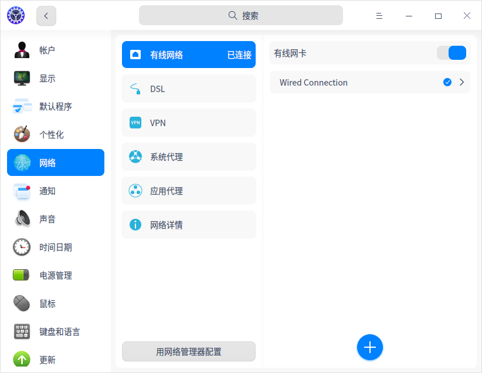

#### 有线网络

有线网络安全快速稳定，是最常见的网络连接方式。当您设置好路由器后，把网线两端分别插入电脑和路由器，即可连接有线网络。

1. 将网线插入电脑上的网络插孔。
2. 将网线的另一端插入路由器或网络端口。
3. 在控制中心首页，单击  。
4. 单击 **有线网络**，进入有线网络设置界面。
5. 打开 **有线网卡**，开启有线网络连接功能。
6. 当网络连接成功后，桌面右上角将弹出“已连接有线连接”的提示信息。

您还可以在有线网络的设置界面，编辑或新建有线网络设置。

#### 无线网络

无线网络帮助您摆脱线缆的束缚，上网形式更加灵活，支持更多设备使用。

##### 连接无线网络

1. 在控制中心首页，单击  。
2. 单击 **无线网络**，进入无线网络设置界面。
3. 打开 **无线网卡**，开启无线网络连接功能。
4. 电脑会自动搜索并显示附近可用的无线网络。
5. 选择需要连接的无线网络。
 - 如果该网络是开放的，将自动连接到此网络。
 - 如果该网络是加密的，请根据提示输入密码，单击 **连接**，然后将自动完成连接。

##### 连接隐藏网络

为了防止他人扫描到自己的WiFi，进而破解WiFi密码连接您的网络，您可以在路由器设置界面隐藏无线网络。设置后，您需要手动连接隐藏网络才能上网。

1. 在控制中心首页，单击  。
2. 单击 **无线网络**，进入无线网络设置界面。
3. 单击 **连接到隐藏网络**。
4. 输入网络名称、SSID和其他必填选项。
5. 单击 **保存** 。

#### 无线热点

无线热点将电脑连接的网络信号转换为WiFi热点，以供一定距离内的其他设备无线上网。要开启无线热点，电脑必须连接到网络并装有无线网卡。

1. 在控制中心首页，单击  。
2. 单击 **个人热点**。
3. 打开 **热点** 开关，设置热点信息。
4. 单击 **保存** 。

#### 移动网络

当您处于一个没有网络信号的地方时，可以使用无线上网卡来上网。在有电话信号覆盖的任何地方，无线上网卡通过运营商的移动数据网络接入宽带服务。

1. 将移动网卡插入电脑上的USB接口中。
2. 电脑将根据移动网卡和运营商信息，自动适配并自动连接网络。
3. 在控制中心首页，单击  。
4. 单击 **移动网络**，查看详细设置信息。

#### 拨号网络

拨号上网（DSL）是指通过本地电话拨号连接到网络的连接方式。配置好调制解调器，把电话线插入电脑的网络接口，创建宽带拨号连接，输入运营商提供的用户名和密码，即可拨号连接到Internet上。

##### 新建拨号连接

1. 在控制中心首页，单击  。
2. 单击 **DSL**，单击 。
3. 输入宽带名称、帐户、密码。
4. 单击 **保存**，系统自动创建宽带连接并尝试连接。

#### VPN

VPN即虚拟专用网络，其主要功能是在公用网络上建立专用网络，进行加密通讯。无论您是在外地出差还是在家中办公，只要能上网就能利用VPN访问企业的内网资源。您还可以使用VPN加速访问其他国家的网站。

1. 在控制中心首页，单击  。
2. 单击 **VPN**，选择  或 。
3. 选择VPN协议类型，并输入名称、网关、帐号、密码等信息。（导入VPN会自动填充信息）
4. 单击 **保存**，系统自动尝试连接VPN网络。
5. 您可以将VPN设置导出，备用或共享给其他用户。

> 说明：打开 **仅用于相对应的网络上的资源** 开关，可以不将VPN设置为默认路由，只在特定的网络资源上生效。

#### 系统代理

1. 在控制中心首页，单击  。
2. 单击 **系统代理**，进入系统代理界面。
 - 单击 **无**，关闭代理服务器功能。
 - 单击 **手动**，输入代理服务器的地址和端口信息。
 - 单击 **自动**，输入URL，系统将自动配置代理服务器的信息。

#### 应用代理

1. 在控制中心首页，单击  。
2. 单击 **应用代理**。
3. 设置应用代理参数。
4. 单击 **保存**。

> 说明：应用代理设置成功后，打开启动器，右键单击应用图标，可以选择 **使用代理**。

#### 网络详情

在网络详情界面，您可以查看MAC、IP地址、网关和其他网络信息。

1. 在控制中心首页，单击 。
2. 单击 **网络详情**，进入网络信息界面。
3. 查看当前有线网络或无线网络的信息。

### 通知设置

设置系统通知的勿扰模式，开启或关闭某些应用的通知显示。

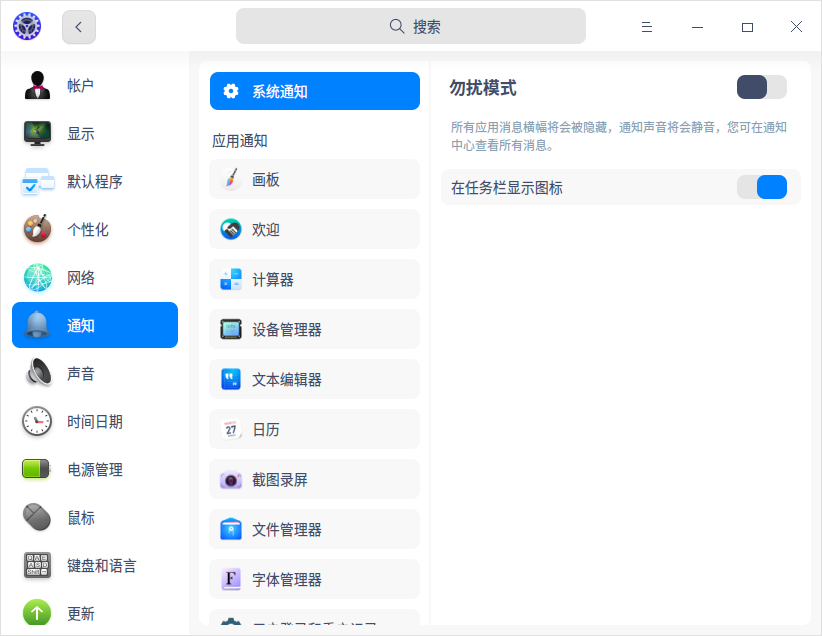

#### 设置系统通知

设置系统通知的勿扰模式及是否在任务栏显示通知图标。

1. 在控制中心首页，单击 。

2. 单击 **系统通知**，进入系统通知界面。

   - 开启或关闭勿扰模式。
      当开启勿扰模式后，可以设置勿扰模式的开启时间、结束时间；也可以设置 **在屏幕锁屏时** 显示通知。开启勿扰模式可以使所有通知静音，但您可以在通知中心查看所有消息。
   - 设置是否在任务栏显示通知图标。

#### 设置应用通知

对第三方应用及系统自带部分应用的通知显示进行自定义设置。

1. 在控制中心首页，单击 。
2. 在应用通知区域选择开启一个应用，在开启的应用界面中，您可以勾选：
   - 通知时提示声音
   - 锁屏时显示消息
   - 在通知中心显示
   - 显示消息预览

### 声音设置

输入输出设备声音的设置（如设置扬声器和麦克风），让您听得更舒适，录音更清晰。

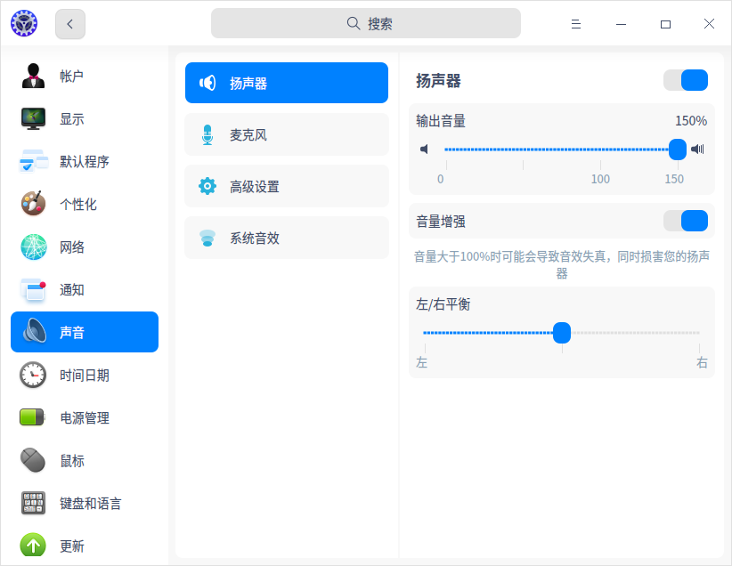

#### 输出设备

1. 在控制中心首页，单击 。
2. 单击 **输出**，进入输出设备配置界面，您可以：
   - 在输出设备后面的下拉框中选择输出设备类型。
   - 通过拖曳滑块调节输出音量和左/右声道平衡。
   - 打开 **音量增强**，音量的可调节区间由0~100% 转变为0~150%。

#### 输入设备

1. 在控制中心首页，单击 。
2. 单击 **输入**，进入输入设备配置界面，您可以：
   - 在输入设备后面的下拉框中选择输入设备类型。
   - 通过拖曳滑块调节输入音量。
   - 打开 **开启** 按钮，还可以设置 **噪音抑制** 功能。

> 窍门：通常，需要调大输入音量，确保能够听到声源的声音，但是音量不宜过大，因为这会导致声音失真。可以对着麦克风以正常说话的音量讲话，并观察反馈音量的变化，变化较明显，则说明输入音量合适。

#### 系统音效

1. 在控制中心首页，单击 。
2. 单击 **系统音效**，勾选选项，开启某一事件发生时的声音效果。

> 窍门：您可以单击试听音效。

### 时间日期
正确选择您所在的时区，一般即可显示正确的日期和时间。您也可以手动修改时间和日期。

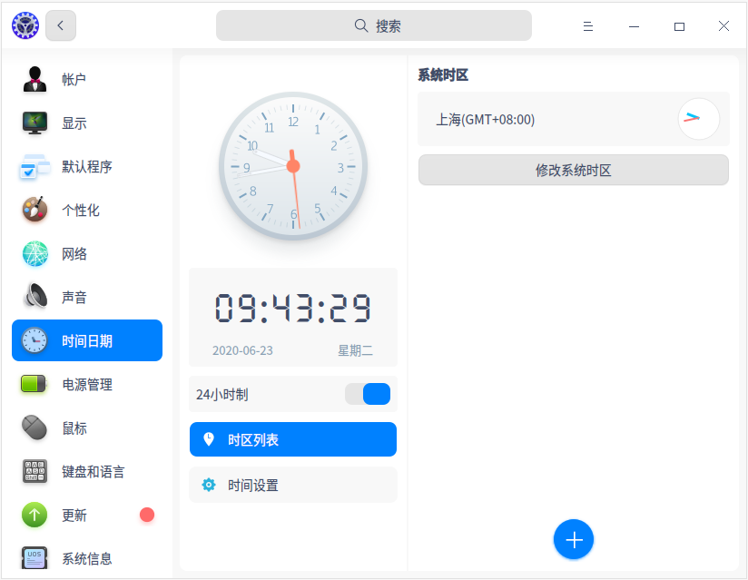

#### 修改时区
在您安装系统时，已选择了系统时区。若要修改系统时区，请按如下步骤设置。

1. 在控制中心首页，单击 。
2. 单击 **时区列表**。
3. 单击 **修改系统时区**， 通过搜索或单击地图选择时区。
4. 单击 **确定**。

#### 添加时区

您可以同时使用多个时区，以便查看另一时区的时间。

1. 在控制中心首页，单击 。
2. 单击 **时区列表**。
3. 单击，通过搜索或单击地图选择时区。
4. 单击 **添加**。

#### 删除时区

1. 在控制中心首页，单击 。
2. 单击 **时区列表**。
3. 单击时区列表后面的 **编辑**。
4. 单击 ，删除已添加的时区。

#### 修改时间和日期
默认情况下，系统通过网络自动同步该时区的本地时间和日期。您也可以手动修改时间和日期。手动设置后，自动同步功能会被关闭。
1. 在控制中心首页，单击 。
2. 单击 **时间设置** 。
   - 开启或关闭自动同步配置。
   - 设置正确的时间和日期。
3. 单击 **确定**。

#### 设置时间日期格式

支持即时设置时间日期的格式。

1. 在控制中心首页，单击 。
2. 单击 **格式设置**，可以设置星期、长短日期、长短时间等格式。

### 电源管理

对系统电源进行一些设置，让笔记本电池更耐用，让系统更安全。

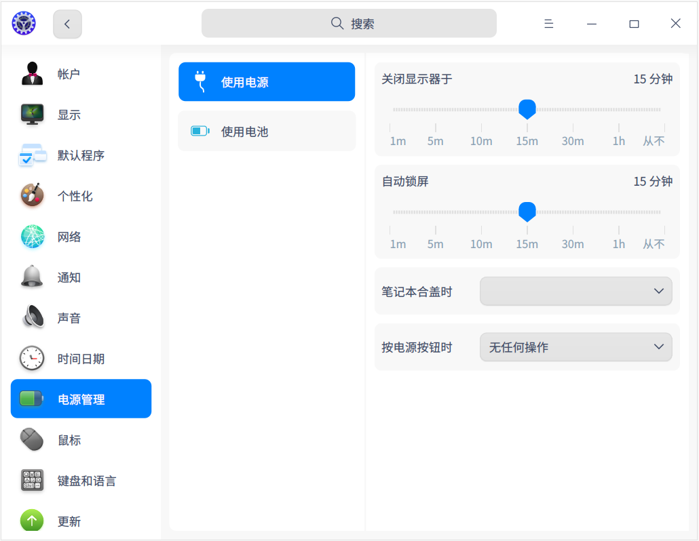

&nbsp;&nbsp;&nbsp;&nbsp;&nbsp;&nbsp;&nbsp;&nbsp;&nbsp;&nbsp;&nbsp;&nbsp;&nbsp;

#### 设置显示器关闭时间

1. 在控制中心首页，单击 。
2. 单击 **使用电源** 或 **使用电池**。
3. 选择关闭显示器的时间。

> 说明：笔记本电脑用户可以在“使用电源”和“使用电池”下对同一设置项分别设置不同的时间。

#### 设置自动锁屏时间

1. 在控制中心首页，单击 。
2. 单击 **使用电源** 或 **使用电池**。
3. 选择自动锁屏的时间。

#### 设置合盖显示状态

1. 在控制中心首页，单击 。
2. 单击 **使用电源** 或 **使用电池**。
3. 设置 **笔记本合盖时** 为 **关闭显示器** 或 **无任何操作**。

> 说明：仅笔记本电脑支持设置合盖显示状态。

#### 设置电源按钮

1. 在控制中心首页，单击 。
2. 单击 **使用电源** 或 **使用电池**。
3. 选择电源按钮 **关机**、**关闭显示器** 或 **无任何操作**，更改电源设置。

更改设置后会即时生效，同时系统通知用户已修改电源设置。

#### 设置低电量通知

1. 在控制中心首页，单击 。
2. 单击 **使用电池**。
3. 打开 **低电量通知**，当电池剩余电量低于设置的阈值（例如，20%）时，系统会发出低电量通知。

用户可以通过拖拽低电量滑块，调节低电量的阈值。

> 说明：仅笔记本电脑支持设置低电量通知。

### 鼠标

鼠标是计算机的常用输入设备。使用鼠标，可以使操作更加简便快捷。

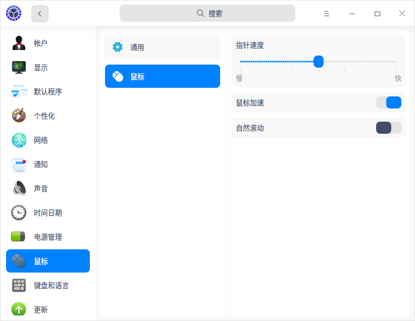

#### 通用设置

1. 在控制中心首页，单击 。
2. 单击 **通用**。
3. 开启 **左手模式**，调节鼠标和触控板的**滚动速度**，**双击速度**。

> 说明：开启左手模式后，鼠标的左右键功能互换。

#### 鼠标设置

插入或连接鼠标后，在控制中心进行相关设置，让其更符合您的使用习惯。

1. 在控制中心首页，单击 。
2. 单击 **鼠标**。
3. 调节 **指针速度**， 控制鼠标移动时指针移动的速度。
4. 单击 **自然滚动** / **鼠标加速** 开关，开启相应功能。

> 说明：
> - 开启鼠标加速，提高了指针精确度，鼠标指针在屏幕上的移动距离会根据移动速度的加快而增加。可以根据使用情况开启或关闭。
> - 自然滚动开启后，鼠标滚轮向下滚动，内容会向下滚动；鼠标滚轮向上滚动，内容会向上滚动。

#### 触控板设置

&nbsp;&nbsp;&nbsp;&nbsp;&nbsp;&nbsp;&nbsp;&nbsp;&nbsp;&nbsp;&nbsp;&nbsp;&nbsp;

若您使用的是笔记本电脑，可以在 **鼠标 > 通用** 界面开启 **输入时禁用触控板**，在 **鼠标 > 鼠标** 界面开启 **插入鼠标时禁用触控板**，以避免误触触控板。

您还可以调节触控板的 **指针速度**，控制手指移动时指针移动的速度；开启自然滚动，变更滚动方向。

#### 指点杆设置
指点杆，常称为小红帽，是一种主要应用于笔记本电脑的定点设备，可用来控制指针的移动。

1. 在控制中心首页，单击 。
2. 单击 **指点杆**。
3. 调节 **指针速度**， 控制使用指点杆时指针移动的速度。

### 键盘和语言

在此模块，您可以设置键盘属性，以便符合您的输入习惯，还可以根据国家和语言调整键盘布局，设置系统语言，以及自定义快捷键。

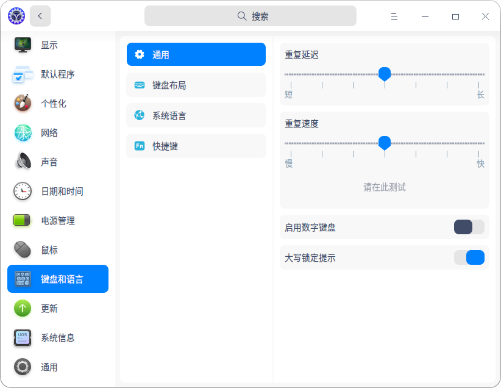

#### 键盘属性

1. 在控制中心首页，单击 。
2. 单击 **通用**。
2. 调节 **重复延迟**/**重复速度**。
3. 单击“请在此测试”，按下键盘上的任意字符不松开，查看调节效果。
4. 单击 **启用数字键盘**/**大写锁定提示** 开关，开启相应功能。

#### 键盘布局
设置键盘布局，可以为当前语言自定义键盘。按下键盘上的按键时，键盘布局会控制哪些字符显示在屏幕上。更改键盘布局后，屏幕上的字符可能与键盘按键上的字符不相符。 

一般在安装系统时，就已经设置了键盘布局，您也可以添加其他的键盘布局。

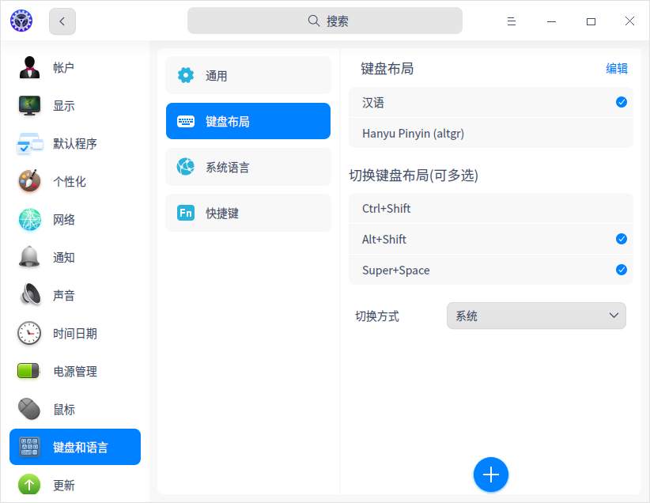

##### 添加键盘布局

1. 在控制中心首页，单击 。
2. 单击 **键盘布局**，进入键盘布局界面。
3. 单击，单击某一键盘布局即可添加到列表。

##### 删除键盘布局

1. 在控制中心首页，单击 。
2. 单击 **键盘布局**，进入键盘布局界面。
3. 单击”键盘布局“后的 **编辑**。
4. 单击 ，删除该键盘布局。

##### 切换键盘布局

1. 在控制中心首页，单击 。
2. 单击 **键盘布局**，进入键盘布局界面。
3. 选择一个键盘布局进行切换。
4. 切换成功后，该键盘布局将标记为已选择。

> 窍门：您也可以选择一组或多组快捷键，按顺序切换已添加的键盘布局。选择 **切换方式**， 让切换后的键盘布局应用于整个系统或当前应用。

#### 系统语言

系统语言默认为您安装系统时所选择的语言，可以随时更改。

##### 添加系统语言
您可以添加多个语言到系统语言列表，以便切换系统语言。

1. 在控制中心首页，单击 。
2. 单击 **系统语言**，进入系统语言界面。
3. 单击  进入语言列表。
4. 选择语言，该语言将自动添加到系统语言列表。

##### 切换系统语言

1. 在控制中心首页，单击 。
2. 单击 **系统语言**，进入系统语言界面。
3. 选择要切换的语言，系统将自动开始安装语言包。
4. 语言包安装完成后，需要注销后重新登录，以便设置生效。

> 注意：更改系统语言后，键盘布局可能也会发生改变。重新登录时，请确保使用正确的键盘布局来输入密码。

#### 快捷键
快捷键列表显示了系统所有的快捷键。您可以在这里查看、修改和自定义快捷键。

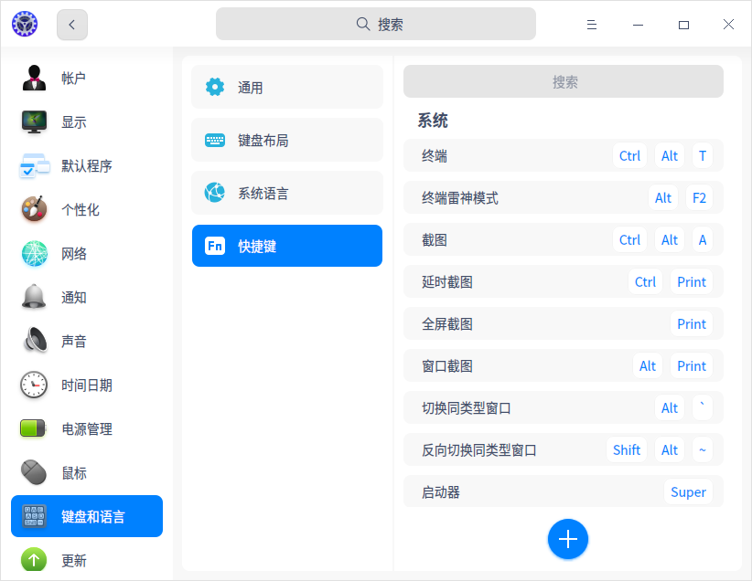

##### 查看快捷键

1. 在控制中心首页，单击 。
2. 单击 **快捷键**，进入快捷键设置界面。
3. 搜索或查看默认的系统快捷键、窗口快捷键和工作区快捷键。

##### 修改快捷键

1. 在控制中心首页，单击 。
2. 单击 **快捷键**，进入快捷键设置界面。
3. 单击需要修改的快捷键。
4. 使用键盘输入新的快捷键。

> 窍门：若要禁用快捷键，请按下键盘上的 。若要取消修改快捷键，按下键盘上 **Esc** 键， 或单击下方的”恢复默认”按钮。

##### 自定义快捷键
您可以为常用的应用自定义一个快捷键。

1. 在控制中心首页，单击 。
2. 单击 **快捷键**。
3. 单击，进入添加快捷键界面。
4. 输入快捷键名称、命令和快捷键。
5. 单击 **添加**。
6. 添加成功后，单击”自定义快捷键“后的 **编辑**。
7. 单击某个快捷键后 ， 删除自定义的快捷键。

> 窍门：若要修改快捷键，单击输入新的快捷键即可。若要修改自定义快捷键的名称和命令，单击“自定义快捷键”后的 **编辑** ，单击快捷键名称后的 ，进入修改页面。

### 系统更新
当系统存在更新时会在控制中心首页提示，单击  进入"检查更新"页面，检查完毕后，即可开始下载和安装更新。您还可以设置自动下载更新。

> 窍门：如果您不想收到系统或应用更新的提示，可在“更新设置”中关闭“更新提醒”。

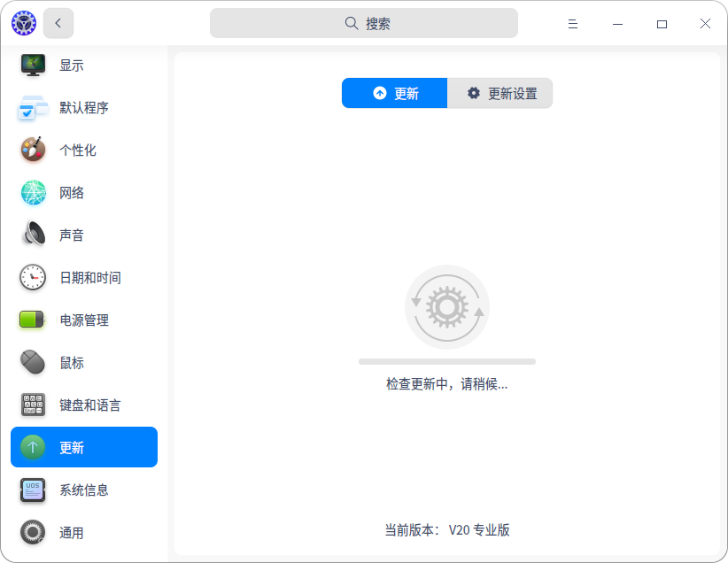

#### 更新和升级

1. 在控制中心首页，单击 。
2. 单击 **检查更新**，进入检查系统更新界面。
 - 如果系统没有更新将会提示“您的系统已经是最新的”。
 - 如果系统存在更新，将显示 **下载并安装更新** 按钮、下载数据大小和更新详情。
3. 单击 **下载并安装更新** 按钮，系统将自动开始下载并安装更新。
4. 更新完成后，会出现”更新成功”提示。

> 说明：在下载过程中，您可以单击按钮暂停下载，再次单击按钮继续下载。更新完成后，会弹出对话框提醒用户 **重启** 或 **关机** 。

#### 自动下载更新

1. 在控制中心首页，单击 。
2. 单击 **更新设置**。
3. 打开 **下载提醒**。
4. 当系统存在更新时，将自动下载数据。

> 窍门：打开 **清除软件包缓存** 开关，系统会定期自动清理下载软件包导致的缓存。

#### 系统源检测
1. 在控制中心首页，单击 。
2. 单击 **更新设置**。
3. 打开 **系统源检测**，系统源被更新、修改后会弹出通知提示用户。

> 说明：开启 **智能镜像源**，系统会自动匹配响应最快的镜像源。

### 系统信息

您可以查看系统版本、版本授权和电脑硬件等信息，以及该系统的一些协议。

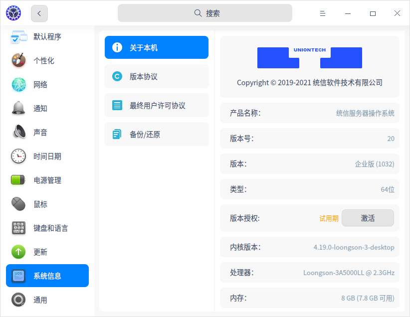

#### 关于本机

1. 在控制中心首页，单击 。
2. 在 **关于本机** 下，您可以查看当前系统版本、版本授权及电脑硬件信息；
3. 若系统未激活，可在此页面单击 **激活**，进行系统激活。

#### 版本协议

1. 在控制中心首页，单击 。
2. 在 **版本协议** 下，查看系统版本协议。

#### 最终用户许可协议

1. 在控制中心首页，单击 。
2. 在 **最终用户许可协议** 下，查看最终用户许可协议。

### 授权管理
授权管理是系统预装的工具，帮助您激活系统。

以下将从未激活、激活方式、激活成功及激活失败这几个方面进行介绍。

#### 未激活

1. 运行授权管理工具有两种方式：

   - 单击右下角托盘上的 进入界面。

   - 打开 **控制中心**，选择 **系统信息**，单击 **关于本机**。可查看版本授权栏，单击 **激活** 进入页面。

2. 未激活状态分为两种：未激活和过期未激活。

   - 未激活：界面包括产品名称、产品版本和授权状态信息。

   - 过期未激活：在截止时间内未激活系统，界面包括产品名称、产品版本、授权状态、授权对象和截止日期信息。

3. 可选择激活方式激活系统。

> 说明：如果系统未激活，授权管理图标 一直常驻在右下角托盘，开机即显示。

#### 激活方式

授权管理激活方式分在线激活和离线激活，而在线激活方式包含试用期激活、输入序列号、导入激活文件。

> 注意： 只有在试用期或被激活成功的系统，才能正常使用统信UOS的所有功能，否则会有部分功能受到限制。

**在线激活**

在线激活的前提是系统网络连接正常。

试用期激活

每台设备仅有一次试用期激活机会，从激活当天算起，有效期为90天。试用期间可使用系统全部功能。

1. 单击右下角托盘上的 进入界面。

   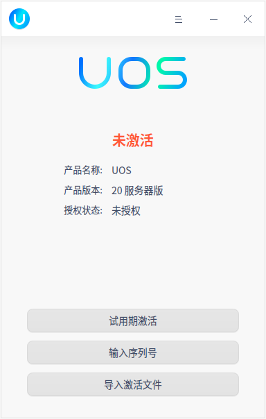

2. 单击 **试用期激活**，跳转到激活界面。

3. 单击 **立即激活**，会弹出二次确认弹框，单击 **确定**，弹出试用期激活成功界面，任务栏图标变为。

4. 在此界面，可查看试用到期时间等信息，也可以选择永久激活系统。

   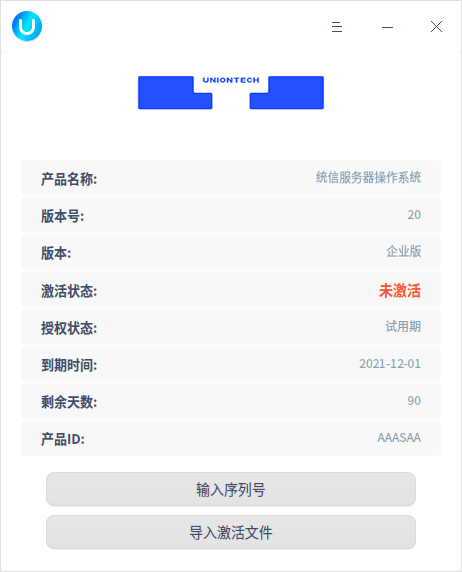

输入序列号

1. 单击右下角托盘上的 进入界面。

2. 单击 **输入序列号**，输入或复制正确的序列号，单击 **立即激活**。

   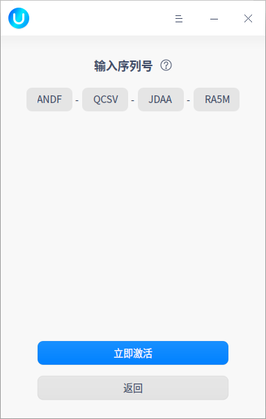

3. 会弹出二次确认弹框，单击 **确定**，弹出激活成功界面。

导入激活文件

1. 单击右下角托盘上的 进入界面。

2. 单击 **导入激活文件**，弹出文件管理器，选择.key格式的激活文件。

   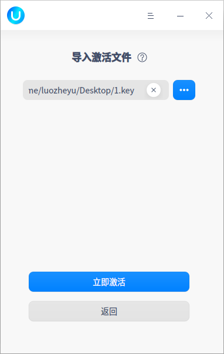

3. 选择正确的文件，单击 **立即激活**。会弹出二次确认弹框，单击 **确定**，弹出激活成功界面。

**离线激活**

离线激活的前提是系统网络连接异常。

1. 选择输入序列号或导入授权文件激活时，系统检测网络连接异常，则跳转到离线激活界面。

2. 离线激活界面显示二维码、序列号、机器ID及离线激活码输入框。

   

3. 手机扫描二维码，手机端弹出激活界面，界面显示当前机器ID及序列号。

   

4. 单击 **立即激活**，会弹出二次确认弹框，单击 **确定**。

5. 跳转到激活成功界面，显示机器ID、序列号和离线激活码。

   

6. 手动将手机端的离线激活码输入电脑端的离线激活码输入框。

   

7. 单击 **离线激活**，跳转到激活成功界面。

#### 激活成功

1. 激活成功界面显示产品名称、产品版本和激活方式等信息。
   - 产品名称：操作系统的名称。
   - 产品版本：操作系统的版本。
   - 授权状态：授权状态分为未授权、已过期、已授权，激活成功显示已授权。
   - 授权对象：被授权的用户名称。
   - 激活方式：激活方式分为序列号、激活文件及离线激活码，根据实际激活方式体现。
   - 到期时间：超过了截止时间，系统会提醒授权即将到期。

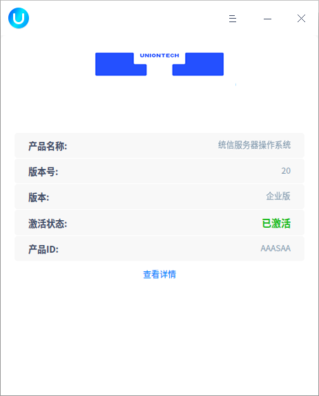

2. 系统激活成功后，右下角托盘不再显示授权管理图标，可通过控制中心查看授权管理工具。

#### 激活失败

若激活文件已使用或已失效，则会弹出激活失败界面。

#### 激活服务器设置

如果当前激活服务器崩溃了，通过授权管理工具，单击 主菜单中的设置，可以自定义新的激活服务器。

### 备份还原

为避免因软件缺陷、硬件损毁、人为操作不当、骇客攻击、电脑病毒、自然灾害等因素造成数据缺失或损坏，可以进行应用数据或系统数据的备份还原，以保障系统的正常运行。

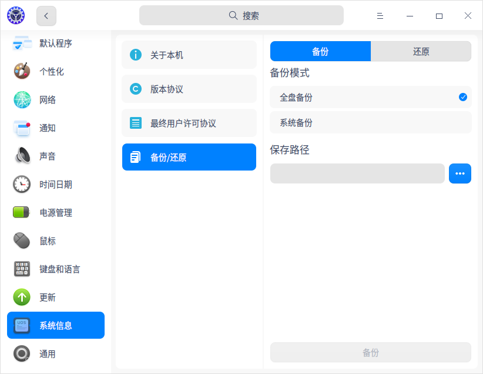

#### 备份

统信UOS提供初始化备份、控制中心备份的备份方式。

##### 通过初始化进行备份

当系统安装完成时，会先自动创建恢复分区，再备份启动分区和根分区，并保存恢复分区信息及磁盘分区配置。

##### 通过控制中心进行备份

用户既可以手动备份/手动恢复数据，也可以通过一键还原恢复数据。

1. 在控制中心首页，单击 。
2. 选择 **备份/还原** > **备份**，设置备份模式和备份文件的保存路径。
   备份模式：全盘备份、系统备份
   - 全盘备份：备份全磁盘的系统文件和用户文件

   - 系统备份：不保留用户数据时，备份根分区和启动分区的文件；保留用户数据时，备份根分区、启动分区、opt分区、home分区文件。

   > 注意： 全盘备份无法备份在自己本身的磁盘里，只能备份在其它存储介质中；系统备份设置了文件默认存放位置，当存放空间不足时，用户可以手动更改备份文件的存放路径。

3. 单击 **开始备份**，弹出密码输入框，请输入密码授权备份文件，直至文件备份完成。

> 说明： 在备份文件的过程中，请不要拔掉电源或强行关机，以防止数据的丢失或损坏。

#### 还原

统信UOS提供从Grub进入还原、控制中心还原的还原方式。

##### 从Grub进入还原

在开机时，选择系统界面，单击 **UnionTech OS Backup & Restore**，进入统信UOS系统还原，用户可以选择“恢复统信UOS出厂设置”读取恢复出厂设置备份，也可以选择“恢复统信UOS历史备份”打开文件目录选取要还原的备份。

##### 通过控制中心进行还原

用户既可以还原所有设置，也可以手动还原前期备份的数据。

1. 在控制中心首页，单击 。
2. 选择 **备份/还原** > **还原**，您可以选择：

   - 还原所有设置
      1. 选择是否勾选 **保存用户数据**，单击 **还原**，在弹出的对话框中，单击 **确定**。 
      2. 在弹出的密码输入框中，输入密码授权进行数据的还原。
   - 手动还原
      1. 在选择还原目录参数后，单击选择要还原的文件。
      2. 单击 **开始还原**，可以进行系统的还原。

### 通用设置

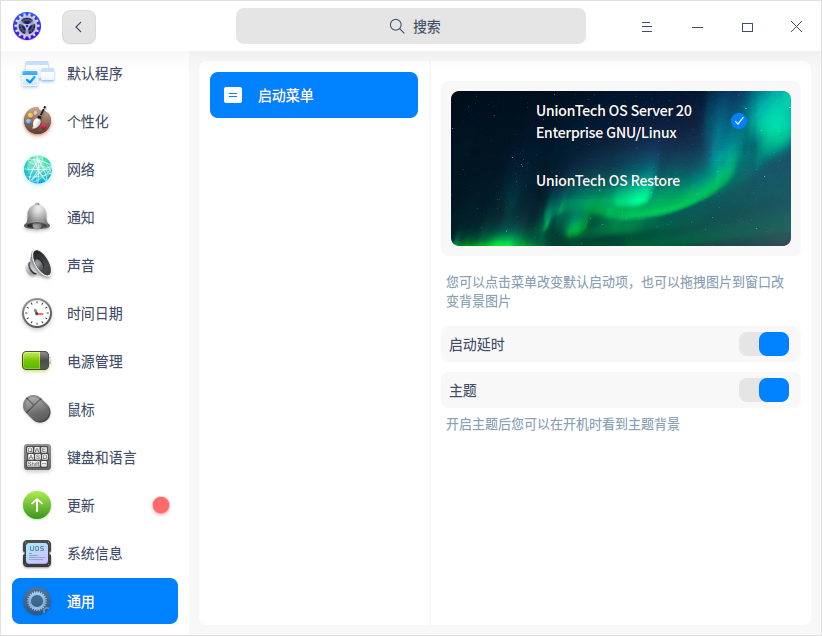

#### 设置启动菜单

启动菜单，指的是开机后选择操作系统的菜单。选择某一系统后，计算机就会引导进入该操作系统。

##### 设置启动延时

当系统存在多个系统时，“启动延时”默认开启，开机后在启动菜单停留5秒钟，您可以在启动菜单单击要进入的系统。

当系统仅存在一个系统时，“启动延时”默认关闭，开机后在启动菜单停留1秒钟，不需要进行选择。

##### 修改默认启动项

1. 在控制中心首页，单击 。
2. 单击 **启动菜单**，进入启动菜单界面。
3. 单击选中某一菜单项后，该项将成为默认启动项。

##### 更改启动菜单背景

1. 在控制中心首页，单击 。
2. 单击 **启动菜单**，进入启动菜单界面。
3. 开启 **主题**，使用该主题为启动菜单的背景。

> 窍门：您也可以把图片拖拽到预览窗口，来更换启动菜单的背景。

## 键盘交互

您可以使用键盘在各个界面区域内切换，并选择对象，执行操作。

| 按键                                                         | 功能                                                         |
| :----------------------------------------------------------- | :----------------------------------------------------------- |
| **Tab**                                                      | 在不同区域或对话框按钮之间切换。                             |
|            | 在同区域内对不同的对象进行选择。使用  进入下级菜单,使用  返回上级菜单。使用 键进行上下切换 。 |
| **Enter**                                                    | 执行选定对象。                                               |
| **Space**                                                    | 在文件管理器中，预览选定对象；在影院和音乐中，开始/暂停播放；在下拉列表中，展开下拉选项（也可使用回车键）。 |
| **Ctrl**+**M**| 打开右键菜单。                                               |

文档更新时间: 2020-10-29 版本: 2020.03
