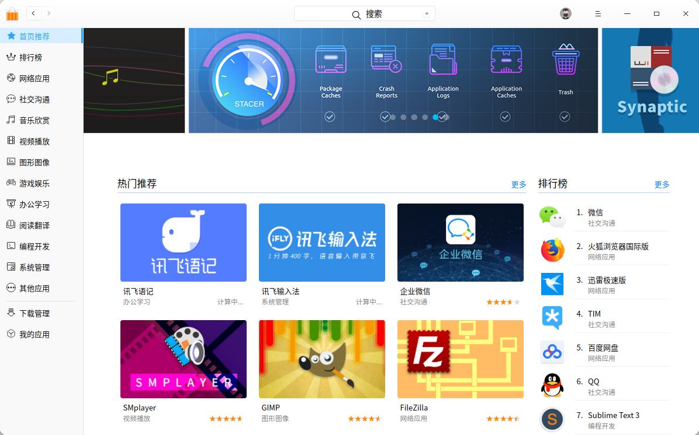
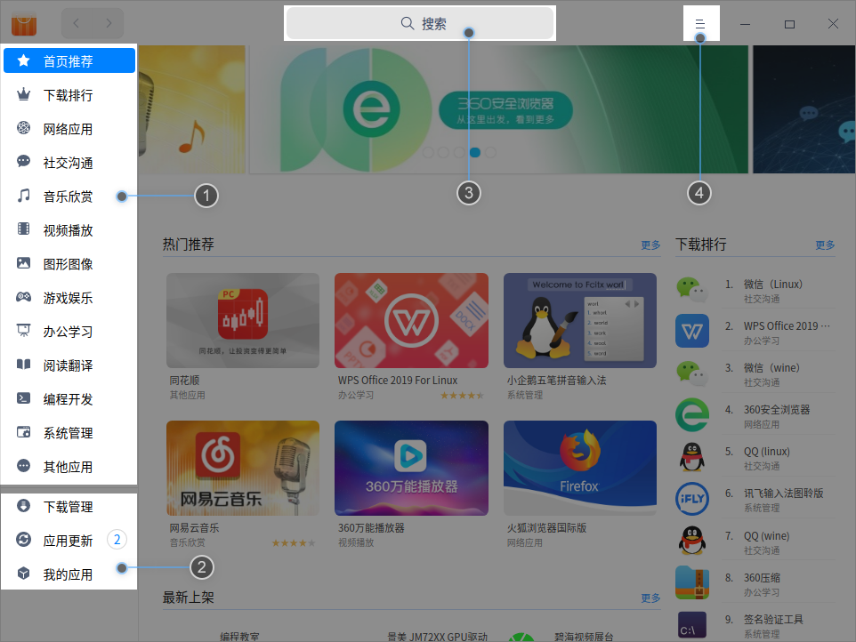
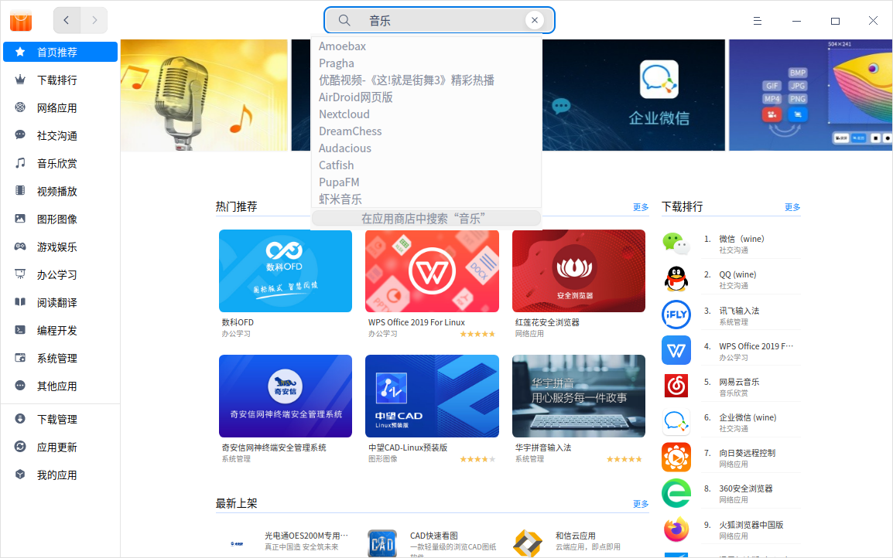
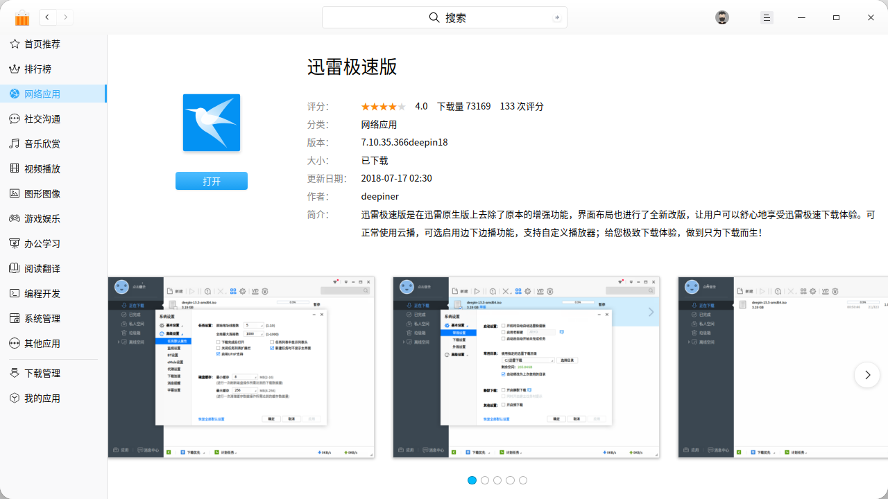
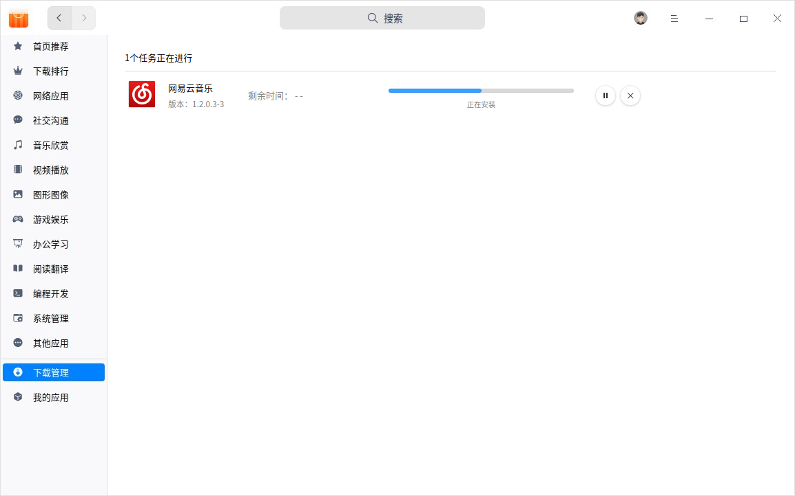
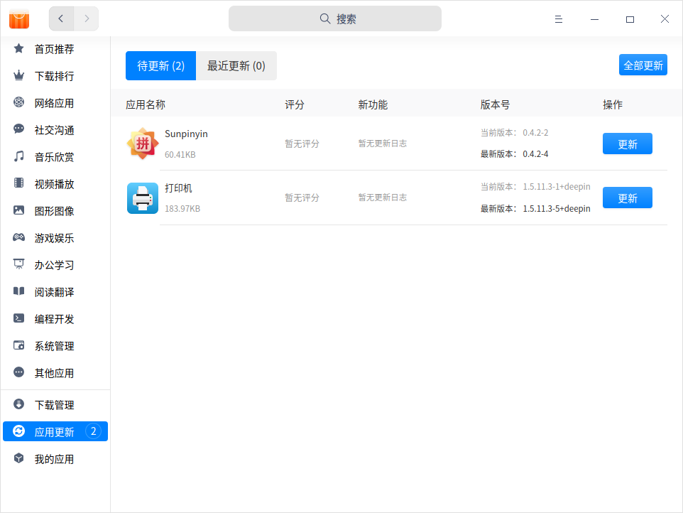
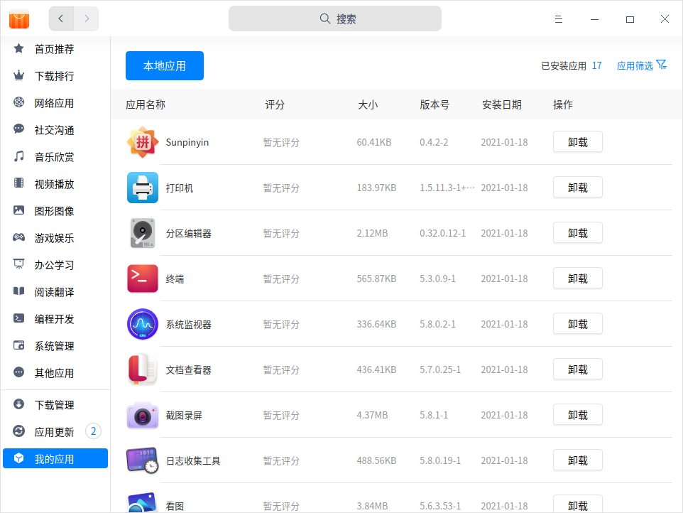

# 应用商店|../common/deepin-appstore.svg|

## 概述
应用商店是一款集应用展示、下载、安装、卸载的应用程序。应用商店精心筛选和收录了不同类别的应用，每款应用都经过人工安装并验证。您可以进入商店搜索热门应用，一键下载并自动安装。

## 使用入门

通过以下方式运行或关闭应用商店，或者创建应用商店的快捷方式。

### 运行应用商店

1. 单击任务栏上的启动器图标 ，进入启动器界面。
2. 上下滚动鼠标滚轮浏览或通过搜索，找到应用商店图标 ，单击运行。
3. 右键单击  ，您可以：
 - 单击 **发送到桌面**，在桌面创建快捷方式。
 - 单击 **发送到任务栏**，将应用程序固定到任务栏。
 - 单击 **开机自动启动**，将应用程序添加到开机启动项，在电脑开机时自动运行该应用。

>  说明：应用商店默认固定在任务栏上，也可以单击任务栏上的  打开应用商店。

### 关闭应用商店

- 在应用商店界面，单击 ，退出应用商店。
- 在任务栏右键单击 ，选择 **关闭所有** 来退出应用商店。
- 在应用商店界面，单击  ，选择 **退出** 来退出应用商店。

## 主界面
应用商店主界面由导航栏、应用管理、搜索框、主菜单组成。

<table class="block1">
    <caption>主界面</caption>
    <tbody>
        <tr>
            <td width="20px">1</td>
            <td width="100px">导航栏</td>
            <td>展示应用商店的应用分类，其中首页推荐页面显示热门推荐应用、热门专题、下载排行榜等内容。</td>
        </tr>
        <tr>
            <td>2</td>
            <td>应用管理</td>
            <td>应用管理包括下载管理、应用更新及我的应用。
                 下载管理主要显示当前下载任务，下载及安装进度，还可以暂停和删除下载任务。
                 在应用更新中，可以查看待更新的应用，并选择是否更新。
                 在我的应用中，可以查看已安装的所有应用，卸载不需要的应用。</td>
        </tr>
        <tr>
            <td>3</td>
            <td>搜索框</td>
            <td>通过搜索框快速查找应用商店中的所有应用。</td>
        </tr>
         <tr>
            <td>4</td>
            <td>主菜单</td>
            <td>在主菜单中可以清除缓存、切换主题、查看帮助手关于信息、退出应用商店。</td>
        </tr>
        <tr>
   </tbody>
   </table>

## 搜索应用

1. 应用商店中自带搜索功能，单击搜索按钮。

2. 输入关键字后，含该关键字的应用名称将在搜索栏下方显示，可查看包含该关键字的所有应用。

##  应用详情

单击应用的封面或名称，进入应用详情页面，可查看应用的评分、下载量、分类、版本、软件包大小、更新日期，以及应用标签、来源、简介、评论等信息。

## 应用管理

通过应用商店可以搜索、下载、安装不同分类的应用，还可以根据热门推荐、热门专题、下载排行等不同方式挖掘更多精彩应用。

### 下载/安装应用
应用商店提供一键式的应用下载和安装，无需手动处理。在下载安装应用的过程中，可以暂停、删除等操作，还可以查看当前应用的下载和安装进度。

1. 在应用商店界面，直接将鼠标悬停在应用的封面图或名称上，单击  。

2. 单击 **下载管理** ，进入页面可查看应用下载和安装的进度。

   

3. 安装完后，可以在我的应用界面查看对应的应用。

### 更新应用

在应用商店界面，选择 **应用更新**，可查看待升级的应用，并选择是否更新应用。还可以查看最近更新的应用列表及信息。

> 窍门：通过控制中心也可以更新和升级系统预装的应用，具体操作请参阅 [更新设置](dman:///dde#系统更新)。

### 卸载应用

在 **我的应用 **界面，找到要卸载的应用，单击 **卸载** 即可。

除了在应用商店卸载应用外，还可以通过启动器卸载应用，具体操作请参阅 [卸载应用](dman:///dde#卸载应用)。

## 主菜单

### 清除缓存
1. 在应用商店界面，单击 。
2. 单击 **清除缓存**，清除本地缓存的安装包。

### 主题

窗口主题包含浅色主题、深色主题和系统主题。

1. 在应用商店界面，单击 。
2. 单击 **主题**，选择一个主题颜色。

### 帮助

1. 在应用商店界面，单击 。
2. 单击 **帮助**，查看帮助手册，进一步了解和使用应用商店。

### 关于
1. 在应用商店界面，单击 。
2. 单击 **关于**，查看应用商店的版本和介绍。

### 退出
1. 在应用商店界面，单击 。
2. 单击 **退出**，即可退出应用商店。 

文档更新时间: 2021-04-14 版本: 6.2
