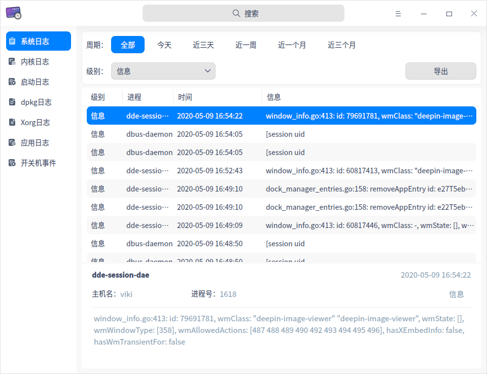
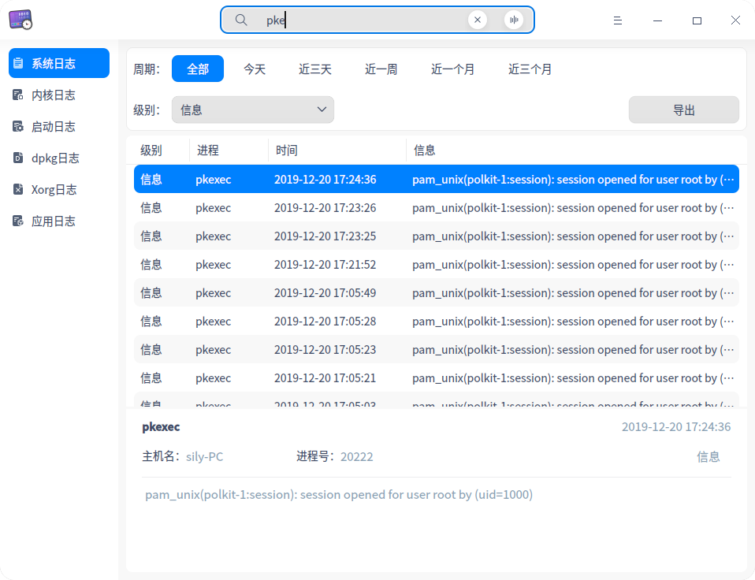
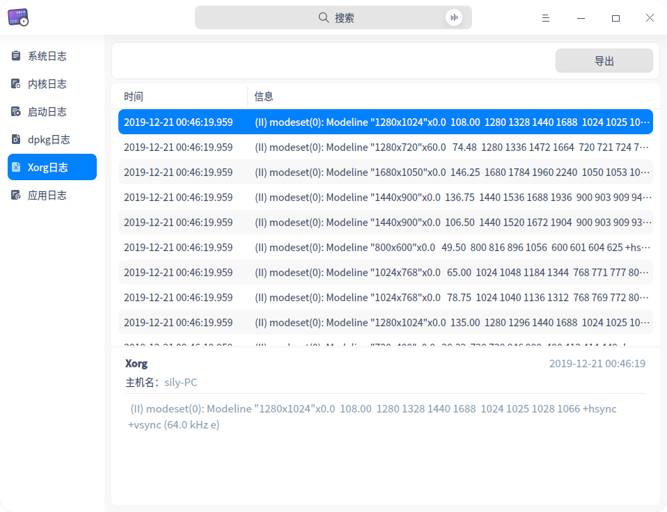
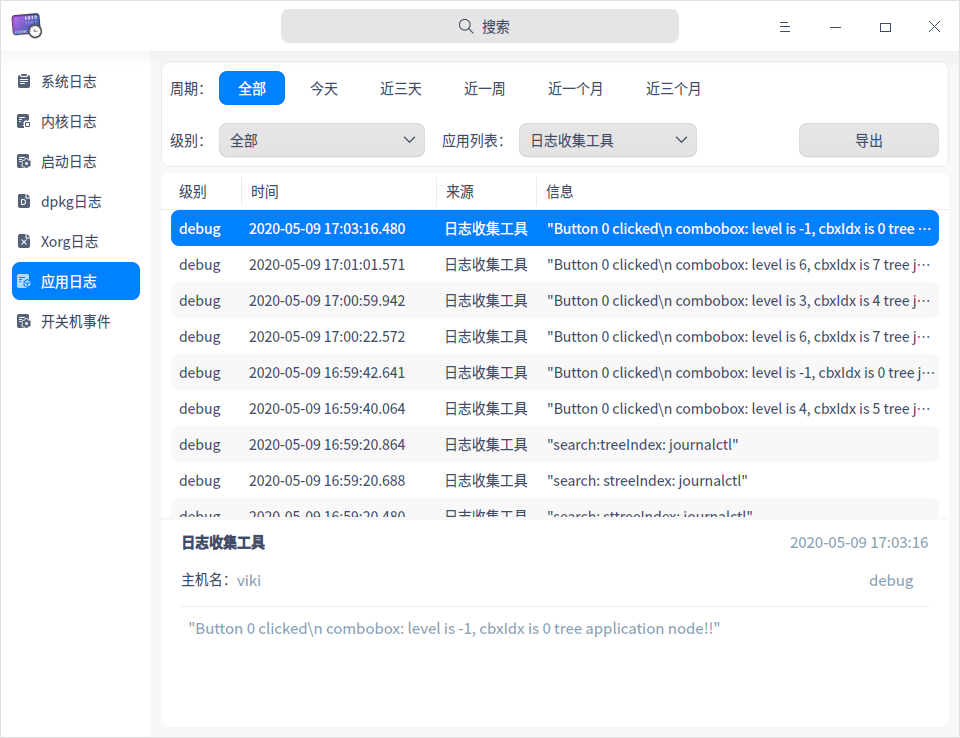

# 日志收集工具|../common/deepin-log-viewer.svg|

## 概述

日志收集工具是负责收集程序运行时所产生日志的小工具，如操作系统和应用程序在启动、运行等过程中的相关信息。您可以通过分析详细日志信息，快速的找到故障原因并解决问题。

## 使用入门

您可以通过以下方式运行或关闭日志收集工具，或者创建快捷方式。

### 运行日志收集工具

1. 单击任务栏上的启动器图标 ，进入启动器界面。
2. 上下滚动鼠标滚轮浏览或通过搜索，找到日志收集工具图标 ，单击运行。
3. 右键单击 ，您可以：
   - 单击 **发送到桌面**，在桌面创建快捷方式。
   - 单击 **发送到任务栏**，将应用程序固定到任务栏。
   - 单击 **开机自动启动**，将应用程序添加到开机启动项，在电脑开机时自动运行该应用程序。

### 关闭日志收集工具

- 在日志收集工具界面，单击 ，退出日志收集工具。
- 在任务栏右键单击 ，选择 **关闭所有**，退出日志收集工具。
- 在日志收集工具界面单击 ，选择 **退出** ，退出日志收集工具。

## 操作介绍

### 搜索日志

1. 在日志收集工具搜索框中，单击 。
2. 输入关键字，实时显示搜索结果。
3. 单击  ，清空搜索内容。

### 筛选日志

您可以通过 **周期**、**级别**、**状态**、**应用列表** 或 **事件类型** 来筛选日志。
<table border="1">
   <tr>
    <th>类型</th>
 <th>说明 </th>
</tr>
   <tr>
    <td>按周期筛选</td>
    <td>按日志生成的时间顺序进行筛选。
      <ul>
          <li>选项包括：全部、今天、近三天、近一周、近一个月、近三个月，默认选项为全部。</li>
          <li>适用类型：除了启动日志没有显示时间外，其他类型的日志都支持按周期筛选。</li>
      </ul>
 </td>
</tr>
   <tr>
    <td>按级别筛选</td>
    <td>按照事件的级别高低进行筛选。
    <ul>
          <li>选项包括：全部、紧急、严重警告、严重、错误、警告、注意、信息、调试，默认选项为信息。</li>
          <li>适用类型：系统日志、应用日志。</li>
      </ul>
      <tr>
    <td>按状态筛选</td>
    <td>
    <ul>
          <li>选项包括：全部、OK、Failed，默认选项为全部。</li>
          <li>适用类型：仅适用于启动日志。</li>
      </ul>
          <tr>
    <td>按应用列表筛选</td>
    <td>
        适用类型：仅适用于应用日志，对应用程序的log文件进行筛选，默认选项为第一个应用程序。 </td>
              <tr>
    <td>按事件类型筛选</td>
    <td>
    <ul>
          <li>选项包括：全部、登录、开机、关机，默认选项为全部。</li>
          <li>适用类型：仅适用于开关机事件。</li>
      </ul>
 </td>
   </tr>
   </table>

### 查看日志

#### 查看系统日志

1. 在日志收集工具界面，单击 **系统日志**。
2. 查看系统日志的级别、进程、时间和信息。
3. 选中某条日志后，可查看该日志的详细信息，包括进程、时间、主机名、进程号、级别和详细信息。

#### 查看内核日志

1. 在日志收集工具界面，单击 **内核日志**。
2. 在弹出的授权对话框中，输入用户密码完成授权。
3. 查看内核日志的时间、主机名、进程和信息。
4. 选中某条日志后，可查看该日志的详细信息，包括进程、时间、主机名和详细信息。

#### 查看启动日志

1. 在日志收集工具界面，单击 **启动日志**。
2. 在弹出的授权对话框中，输入用户密码完成授权。
3. 查看启动日志的状态和信息。
4. 选中某条日志后，可查看该日志的详细信息，包括进程、主机名、状态和详细信息。

#### 查看dpkg日志

1. 在日志收集工具界面，单击 **dpkg日志**。
2. 查看dpkg日志的时间和信息。
3. 选中某条日志后，可查看该日志的详细信息，包括进程、时间、主机名、动作和详细信息。

#### 查看Xorg日志

1. 在日志收集工具界面，单击 **Xorg日志**。
2. 查看Xorg日志的时间和信息。
3. 选中某条日志后，可查看该日志的详细信息，包括进程、时间、主机名和详细信息。

#### 查看应用日志

1. 在日志收集工具界面，单击 **应用日志**。
2. 查看应用日志的级别、时间、来源和信息。
3. 选中某条日志后，可查看该日志的详细信息，包括时间 、主机名、级别和详细信息。

#### 查看开关机事件

1. 在日志收集工具界面，单击 **开关机事件**。
2. 查看开关机事件的事件类型、用户名、时间和信息。
3. 选中某条日志后，可查看该日志的详细信息，包括时间、主机名、事件类型、用户名和详细信息。

### 导出日志

您可以将当前日志导出为文件进行保存，支持导出的文件格式为txt/doc/xls/html。

1. 在日志收集工具界面，选择某一日志类型，单击 **导出**。
2. 在弹出的窗口中选择存储路径，设置文件名称和格式。
3. 单击 **保存**，成功导出日志后，界面下方会弹出提示信息。

### 刷新日志

1. 在日志收集工具左侧导航栏中，右键单击某一日志类型。
2. 选择 **刷新**，重新加载该日志文件，更新日志列表。

### 在文件管理器中显示

在日志收集工具中仅内核日志、启动日志、dpkg日志、Xorg日志和应用日志支持 **在文件管理器中显示** 的功能。

1. 在日志收集工具左侧导航栏中，右键单击某一日志类型。
2. 选择 **在文件管理器中显示**，定位到当前日志的存储位置。

### 清除日志

在日志收集工具中仅内核日志、启动日志、dpkg日志、Xorg日志和应用日志支持 **清除日志** 的功能。
1. 在日志收集工具左侧导航栏中，右键单击某一日志类型。
2. 选择 **清除日志**。
3. 在弹出的对话框中单击 **确定**。
4. 如果弹出密码授权窗口，请输入密码完成操作。

## 主菜单

在主菜单中，您可以进行切换窗口主题，查看帮助手册等操作。

### 主题

窗口主题包含浅色主题、深色主题和系统主题。

1. 在日志收集工具界面，单击 。
2. 单击 **主题**，选择一个主题颜色。

### 帮助

查看帮助手册，进一步了解和使用日志收集工具。

1. 在日志收集工具界面，单击 。
2. 单击 **帮助**。
3. 查看日志收集工具的帮助手册。

### 关于

1. 在日志收集工具界面，单击 。
2. 单击 **关于**。
3. 查看日志收集工具的版本和介绍。

### 退出

1. 在日志收集工具界面，单击 。
2. 单击 **退出**。

文档更新时间: 2021-08-18 版本: 5.8
