# Screen Capture|../common/deepin-screen-capture.svg|

## Overview

Screen Capture is a tool which integrates the screen capture functions into one. You are free to select windows or areas automatically or manually during screen capturing. 

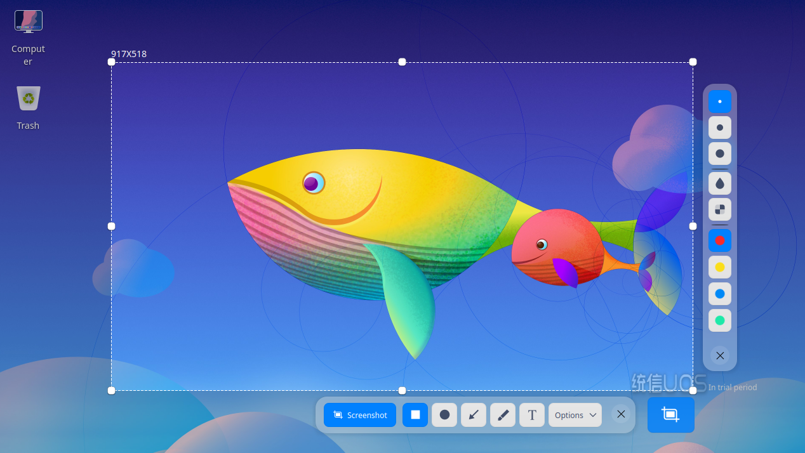

## Guide

You can run, close, or create shortcuts for Screen Capture in the following ways.

### Run Screen Capture

1.  Click  the Launcher icon  in the dock to enter the launcher interface.
2.  Locate Screen Capture  by scrolling the mouse wheel or searching "screen capture" in the Launcher interface and click it to run. 
3.  Right-click  and you can:

    - Click **Send to desktop** to create a desktop shortcut.
    - Click **Send to dock** to fix it in the Dock.
    - Click **Add to startup** to add it to startup and it will automatically run when the system starts up.

### Close Screen Capture

- Screen Capture will exit automatically after screen capturing completes.
- On the Screen Capture interface, click  to exit Screen Capture.
- On the Screen Capture interface, right-click to select **Save** or **Exit**.

### Shortcuts

In the Screenshot mode on the Screen Capture interface, press **Ctrl + Shift + ?** to view shortcuts. Proficiency in shortcuts will greatly improve your efficiency.

## Select and Adjust Screenshot Area

### Select Screenshot Area

There are three kinds of common screenshot areas, namely the full screen, program window, and customized area. When a screenshot area is captured, the selected area will be bordered with dashed white line and looks brighter than the other area.

> Notes: When the computer is connected to multiple monitors, you can also use Screen Capture to capture areas on different monitors.

#### Select Full Screen

Full screen selection is used to identify the entire screen of the current monitor.

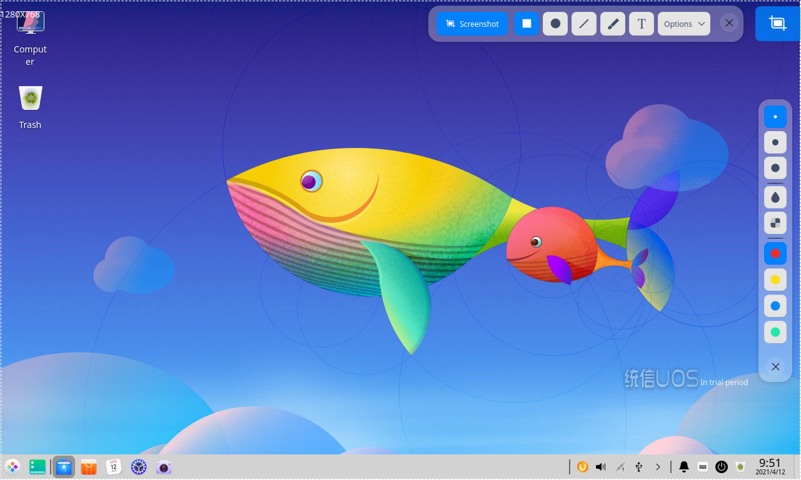
&nbsp;&nbsp;&nbsp;&nbsp;&nbsp;&nbsp;&nbsp;&nbsp;&nbsp;&nbsp;&nbsp;&nbsp;&nbsp;

You can select the full screen in the following ways:

1.  Press **Ctrl + Alt + A** on keyboard to enter the screen capture mode.
2.  Move the pointer to the desktop and the full screen will be selected automatically. The screenshot dimension will be displayed in the upper left corner. 
3.  Click the desktop and a toolbar will pop up.

You can also take a full screen screenshot directly in the following ways:

- If Screen Capture has been fixed in the dock, right-click  in the dock to select **Full Screenshot**. 
- Press  on the keyboard to take a full screen screenshot.

#### Select Program Window

Program window selection is used to identify the current application window automatically.

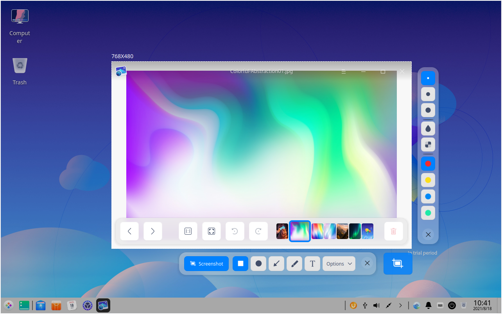
&nbsp;&nbsp;&nbsp;&nbsp;&nbsp;&nbsp;&nbsp;&nbsp;&nbsp;&nbsp;&nbsp;&nbsp;&nbsp;

1.  Press **Ctrl + Alt + A** on the keyboard to enter the screen capture mode.
2.  Move the pointer to the application window and the window will be selected automatically. The screenshot dimension will be displayed in the upper left corner. 
3.  Click the window and a toolbar will pop up.

#### Select Customized Area

Customized area selection is used to select the screenshot area freely by dragging the mouse.

&nbsp;&nbsp;&nbsp;&nbsp;&nbsp;&nbsp;&nbsp;&nbsp;&nbsp;&nbsp;&nbsp;&nbsp;&nbsp;

1.  Press **Ctrl + Alt + A** on keyboard to enter the screen capture mode.
2.  Hold down and drag the left mouse button to select the screen capture area. The screenshot dimension will be displayed above the upper left corner. 
3.  Release the left mouse button to complete area selection and a toolbar will pop up.

### Adjust the Screenshot Area

You can fine-tune the screenshot area. For example, you can enlarge or reduce the screenshot area, and move the screenshot position, among other functions. 

#### Enlarge/Reduce the Screenshot Area

- Place the pointer over the white boarder of the screenshot area and the pointer will be changed to . Hold down the left mouse button and drag the mouse to enlarge or reduce the screenshot area. 

- Press **Ctrl** +  ,  ,  or  and drag the mouse to enlarge or reduce the screenshot area vertically or horizontally.

#### Move the Screenshot Position

Place the pointer over the screenshot area and it will be changed to . You can:

- Hold down the left mouse button and drag the mouse to move the position of the screenshot area.
- Press  ,  ,  or  on the keyboard to move the screenshot area vertically or horizontally.

## Take Screenshots

Under the screenshot mode, click the corresponding icons on the toolbar and you can perform operations such as drawing and editing graphics, adding text annotations, etc. in the screenshot  area.

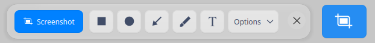
&nbsp;&nbsp;&nbsp;&nbsp;&nbsp;&nbsp;&nbsp;&nbsp;&nbsp;&nbsp;&nbsp;&nbsp;&nbsp;

<table class="block1">
    <caption>Icon Description</caption>
    <tbody>
        <tr>
            <td></td>
            <td>Rectangle</td>
            <td></td>
            <td>Elipse</td>
            <td></td>
            <td>Line</td>
        </tr>
          <tr>
            <td></td>
            <td>Pencil</td>
            <td></td>
            <td>Text</td>
            <td></td>
            <td>Exit</td>
        </tr>
    </tbody>
</table>

> Notes: Your settings in the toolbar and attribute column, such as the line weight and font size, are remembered and applied by default and will be resumed the next time when you launch Screen Capture. You are able to reset it as well. 

### Draw

You can draw some simple graphics in the screenshots. Click the icon on the toolbar, hold down the **Shift** key and drag the mouse to draw a square, circle and line or line with arrows horizontally and vertically.

#### Rectangle

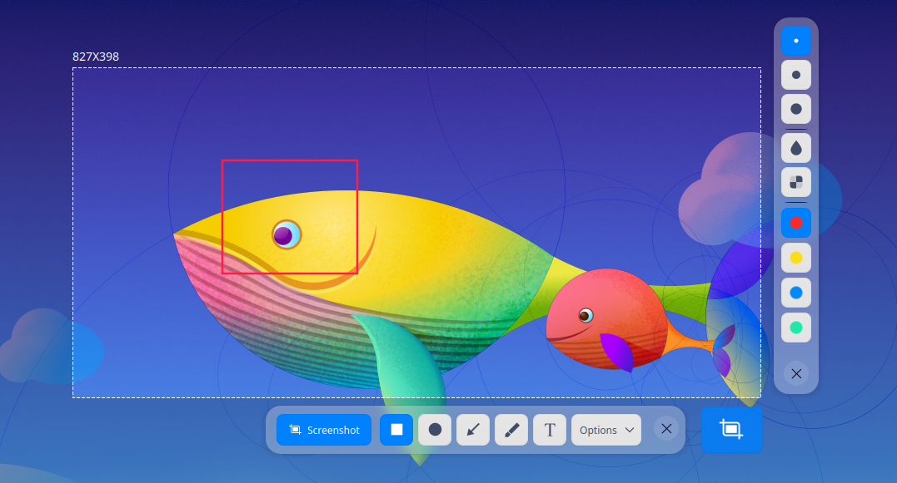
&nbsp;&nbsp;&nbsp;&nbsp;&nbsp;&nbsp;&nbsp;&nbsp;&nbsp;&nbsp;&nbsp;&nbsp;&nbsp;

1.  Click  on the toolbar which appears beside the screenshot area.
2.  In the toolbar extension panel, select the weight and color of outline for the rectangle shape. 
3.  Place the pointer on the screenshot area and the pointer will be changed to .
4.  Hold down the left mouse button and drag the mouse to complete drawing.
5.  Click  or  in the toolbar extension panel to mosaic the private information in the screenshot (if any).

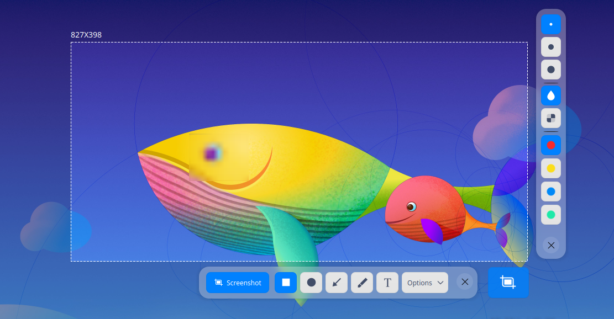

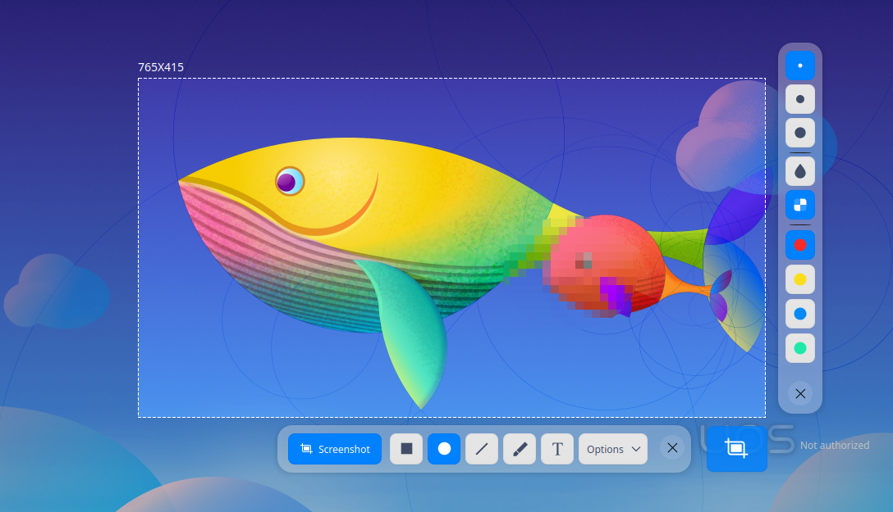
&nbsp;&nbsp;&nbsp;&nbsp;&nbsp;&nbsp;&nbsp;&nbsp;&nbsp;&nbsp;&nbsp;&nbsp;&nbsp;

#### Ellipse

&nbsp;&nbsp;&nbsp;&nbsp;&nbsp;&nbsp;&nbsp;&nbsp;&nbsp;&nbsp;&nbsp;&nbsp;&nbsp;

1.  Click  on the toolbar which appears beside the screenshot area.
2.  In the toolbar extension panel, select the weight and color of outline for the ellipse shape. 
3.  Place the pointer on the screenshot area and the pointer will be changed to .
4.  Hold down the left mouse button and drag the mouse to complete drawing.
5.  Click  or in the toolbar extension panel to mosaic the private information in the screenshot (if any).

#### Straight Line and Arrow

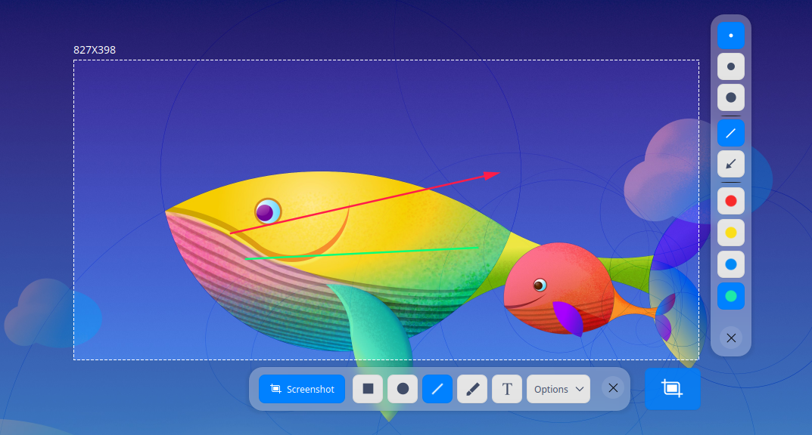
&nbsp;&nbsp;&nbsp;&nbsp;&nbsp;&nbsp;&nbsp;&nbsp;&nbsp;&nbsp;&nbsp;&nbsp;&nbsp;

1.  Click  on the toolbar which appears beside the screenshot area.
2.  In the toolbar extension panel, select the weight and color of line. 
3.  Click  or  to toggle between straight line and arrow.
4.  Place the pointer on the screenshot area and the pointer will be changed to  or .
5.  Hold down the left mouse button and drag the mouse to complete drawing.

#### Pencil

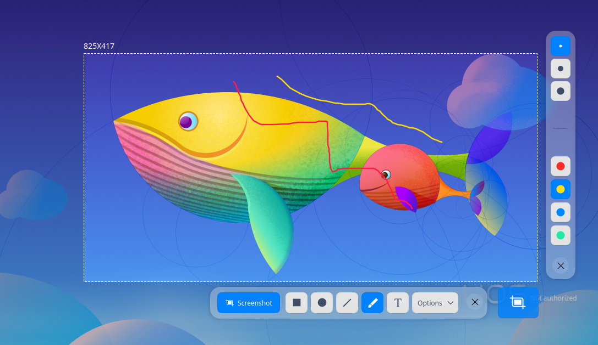
&nbsp;&nbsp;&nbsp;&nbsp;&nbsp;&nbsp;&nbsp;&nbsp;&nbsp;&nbsp;&nbsp;&nbsp;&nbsp;

1.  Click  on the toolbar which appears beside the screenshot area.
2.  In the toolbar extension panel, select the weight and color of pencil. 
3.  Place the pointer on the screenshot area and the pointer will be changed to .
4.  Hold down the left mouse button and drag the mouse to complete drawing.

### Modify Graphics

You can modify and move the drawn graphics in the screenshot.

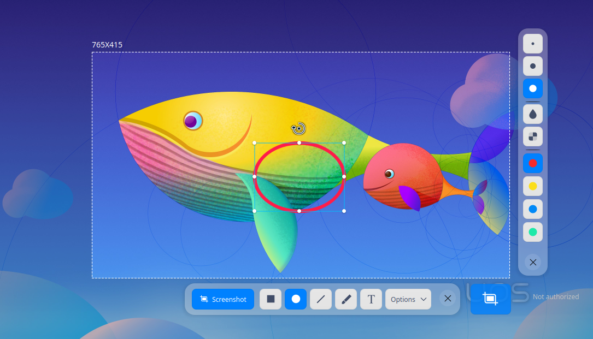

#### Move Graphics

1.  Place the pointer over the graphics outline and the mouse will be changed to .
2.  Hold down the left mouse button and drag the graphics to any place in the screenshot area.
3.  Press  ,  ,  or  on the keyboard to move the graphics vertically or horizontally.

#### Edit Graphics

1.  Place the pointer over the outline of graphics and the mouse will be changed to .
2.  Left-click to enter the editing mode and you can:
    - Press the **Delete** key on the keyboard to delete the graphics.
    - Place the pointer over the edit box and the mouse will be changed to. Enlarge or reduce the graphic area by dragging the pointer.
    - Press **Ctrl** +  ,  ,  or  to extend the graphics area vertically or horizontally.
    - Place the pointer over  in the edit box and the pointer will be changed to . Rotate the graphics by dragging the pointer.
3.  Left-click outside the edit box to exit the editing mode.

### Add Text Annotation

Add text annotations to the screenshot in order to help others better understand.

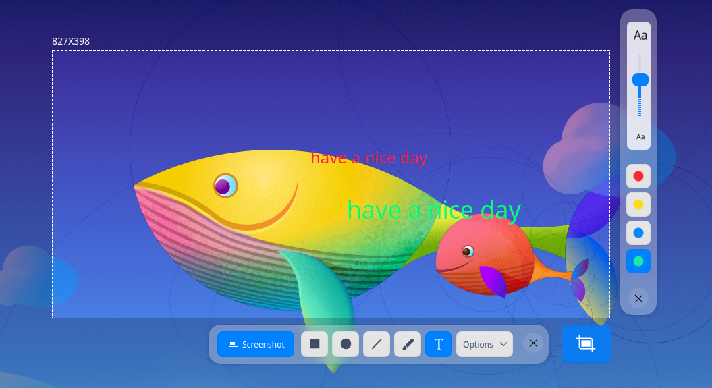
&nbsp;&nbsp;&nbsp;&nbsp;&nbsp;&nbsp;&nbsp;&nbsp;&nbsp;&nbsp;&nbsp;&nbsp;&nbsp;

1.  Click  on the toolbar which appears beside the screenshot area.
2.  In the toolbar extension panel, select the font color and size via the scroll bar. 
3.  Place the pointer over the screenshot and the mouse will be changed to .
4.  Click where you want to add an annotation and a text box will appear.
5.  Enter texts in the text box.

### Modify Text Annotations

You can modify and move the text annotations after they're entered.

#### Move Text Annotations

1.   Place the pointer over the text and the pointer will be changed to .
2.   Hold down the left mouse button and drag to move the text anywhere in the screenshot area.

#### Edit Text Annotations

1.  Place the pointer over the text and the pointer will be changed to .
2.  Double-click to enter the text editing mode and you can:
    - Press **Delete** on the keyboard to delete text annotations.
    - Modify the text in the text box.
3.  Click outside the text box to exit editing mode.

### Delay Screenshot

You are able to capture the screenshot in a specific state or at specific time with the delay screenshot feature.

- Right-click the Screen Capture icon fixed in dock and select **Delay Screenshot**.
- Press  **Ctrl** +  to start delay screenshot.
- Execute  “deepin-screen-recorder -d n”  in Terminal, among which n represents the delayed time in seconds.

### Save Screenshots

Save the screenshot for future use.

When the screenshot is saved successfully, you can see a prompt message in the upper area of the desktop. Click **View** to open the folder where the screenshot is located.

You can save the screenshot in the following ways after launching Screen Capture and selecting the screenshot area:

- Double-click to save the screen capture.
- Click  on the toolbar.
- Press **Ctrl + S** on the keyboard to save the screenshot.
- Right-click the screenshot and select **Save** to save it.

> Notes: The screenshot is saved to the clipboard by default.

Click **Options** on the toolbar of the Screen Capture interface and expand the drop-down list:

- Select **Clipboard** to save the screenshot to clipboard.
- Click **Desktop** and the screenshot will be saved to the desktop.
- Click **Pictures** and the screenshot will be saved to the pictures folder.
- Click **Folder**. Select the destination folder of the screenshot and the screenshot will be saved to your specific folder directory. 
- Select **Show pointer** and the pointer will be displayed in the screenshot area. Its position and pattern will also be saved in the picture.
- Select **PNG/JPG/BMP** to set the screenshot format.

## View Help

Press  on the keyboard to view the help manual after launching Screen Capture.

Update Date: 2021-04-14 Version: 5.8
