# Deepin File Manager|../common/deepin-file-manager.svg|

## Overview

Deepin File Manager is developed by Deepin Technology team. As the core component to manage files in deepin, it is a powerful, easy-to-use file manager with an elegant and simple interface. Full-featured, well-designed, efficient-improved, Deepin File Manager will be a good help in your daily life and work.

## Guide

You can run, close and create a shortcut for Deepin File Manager by the following ways.

### Run Deepin File Manager

1. Click  on dock to enter Launcher interface.
2. Locate  by scrolling mouse wheel or searching by "deepin file manager" in Launcher interface.
3. Right click on , you can
 - Click on **Send to desktop** to create a desktop shortcut.
 - Click on **Send to dock** to fix the application on dock.
 - Click on **Add to startup** to add the application to startup, it will automatically run when the system starts up.

> : In Control Center, you can set Deepin File Manager as the default file manager. Specific operations refer to [Default Application Settings](dman:///dde#Default Application Settings).

### Exit Deepin File Manager

- On Deepin File Manager interface, click on  to exit.
- Right click on  on Dock, select **Close All** to exit Deepin File Manager.
- Click on  and select **Exit** to exit Deepin File Manager.

## Main Interface

On Deepin File Manager interface, users can execute many operations with the functional bars. It is designed to be easy-to-use, user-friendly and efficient improving.

<table class="block1">
    <caption></caption>
    <tbody>
        <tr>
            <td width="20px">1</td>
            <td width="90px">Navigation bar</td>
            <td>Displays user directory, mounted disks, bookmarks and tags.</td>
        </tr>
        <tr>
            <td>2</td>
            <td>Address bar</td>
            <td>Input keywords to search or input directory path to access corresponding contents. Use   to go back or forward. Use breadcrumb bar to switch among parent directories and sub directories.</td>
        </tr>
        <tr>
            <td>3</td>
            <td>View</td>
            <td>User can switch view modes by clicking on  and .</td>
        </tr>
        <tr>
            <td>4</td>
            <td>Main menu</td>
            <td>User can create new window, switch to dark theme, set share password, make settings, view manual and application information, and exit the application.</td>
        </tr>
        <tr>
            <td>5</td>
            <td>Status bar</td>
            <td>Displays the number of files or selected files. User can drag the slider to adjust the size of icons in the directory.</td>
        </tr>
    </tbody>
</table>

> : User can drag the separation line on the right of navigation bar to change its width.

## Basic Functions

Deepin File Manager is featured with the basic functions as a file manager, user can easily create, copy, rename or delete files/folders with it.

### New Document/Folder

#### New Folder

1. On Deepin File Manager interface, right click and select **New folder**.
2. Input a name for the new folder, and press , or click on blank area.

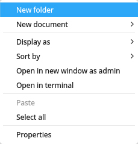

#### New Document

1. On Deepin File Manager interface, right click and select **New document**.
2. In the popup menu, select the document format you want to create.
3. Input a name for the new document, and press , or click on blank area.

### Rename File/Folder

1. Selected the file/folder, right click to select **Rename**.
2. Input a new name for the file/folder, and press , or click on blank area.

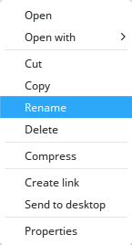

> : Check "Hide file extension when rename" in **Settings** to rename file more conveniently.

### Batch Rename

#### Replace Text

1. Selected several files/folders, right click to select **Rename**.
2. Input the content to be replaced in Find box, and input content to rename in Replace box.
3. Press , or click on blank area.

#### Add Text

1. Selected several files/folders, right click to select **Rename**.
2. Input the content to add in Add box, and select the location.
3. Press , or click on blank area.

#### Custom Text

1. Selected several files/folders, right click to select **Rename**.
2. Input the file name and SN.
3. Press , or click on blank area.

### Copy File/Folder

1. Select the files/folders to be copied, right click and select **Copy**.
2. Enter the directory to which the files/folders will be pasted, right click and select **Paste**.

 

> : A window will popup to show the progress as it starts copying. By clicking on  you can cancel the copying process. By hovering the mouse pointer to the round progress bar, it will switch to a pause button, you can pause the copying process by clicking on it.

### Compress File/Folder

1. Select the files/folders to be compressed, right click and select **Compress**.
2. Input a file name and select a file format for the to be compressed file.
3. Select a location to store the to be compressed file.
4. Select **Create** to generate the compressed file.

> : In **Other Options**, user can choose to encrypt the compressed file and the file list, and also to split the to be compressed file into several parts to reduce individual file sizes of the compressed file.

### Delete File/Folder

1. Right click on file/folder to select **Delete**.
2. The file/folder will be moved to Trash.
  - To permanently delete, open Trash and right click on the file/folder to select **Delete** or right click on Trash to select **Empty**.
  - To restore deleted files/folders, open Trash and right click on the file/folder to select **Restore**, the files/folders will be moved to their original directory.

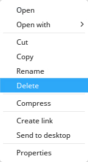

> : File/folder in external device will be permanently deleted and can not be restored when you select **Delete**.

### Undo Operation
In file manager,  use  +  to undo the previous steps, including:
- Delete the newly created file/folder.
- Resume the renamed file/folder to the previous name.
- Restore the deleted file/folder from trash.
- Restore the moved (via drag or cut) file/folder to the previous location.
- Delete the copied and pasted file/folder.

> : If the above operations are continuous, you can undo all of them; if there is file overwriting or permanently file deleting, then you can only return to that step.

### Options to Open a File

Users can select to open a file with different applications.

1. On Deepin File Manager, right click on the file to open.
2. In the context menu, select **Open with**.
3. Click on **Select default program** to open the application list.
4. Select the application you want to open the file.
5. Click on **Choose** to open the file by this application
6. You can also check **Set as default** to set the application as the default one.

If the application you want to open the file is not in the list, you can:

1. Click on **Select other programs**.
2. Select an application you want to open.
3. Click on **Open** to open the file by this application.

> : It will use the default application to open the file when you double clicked on it. Users can right click on the file, select **Properties** and choose a default application in **Open with ** list. Users can also set the options in the [Default Application Settings](dman:///dde#Default Application Settings) of the Control Center to change the global default applications of the specified file types.

> : You can right click multiple files with the same type, and select **Open with** to open them just once.

### Display Modes

Click on  or  on Deepin File Manager interface to switch between icon view and list view.

- Icon view: It will show the icon, name and thumbnail of the files.

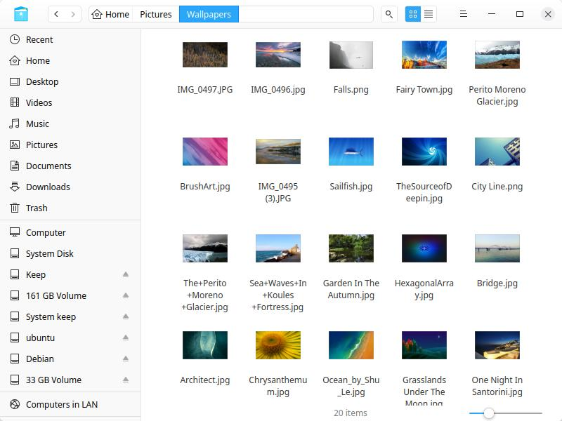

- List view: It will show the icon, name, modified time, size and type of the files.

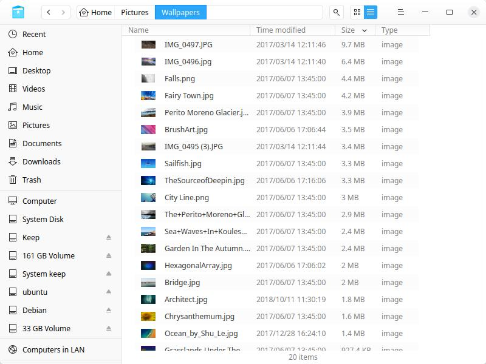

> : User can drag the line between two columns to change the column width, or double click on the line to auto fit the content width.

> : Press  +1 and  +2 to switch between icon view and list view.

### Sorting

1. Right click in the blank area on Deepin File Manager, select **Sort by**.
2. Choose among the sorting options, which include **Name**, **Time modified**, **Size** and **Type**.

> : Users can click on the head of the columns in the list view to change the sort order.

### File/Folder Properties

Users can view the file/folder properties.

1. On Deepin File Manager interface, right click on a file/folder or more and select **Properties**.
2. The window of properties will pop up according to the file/ folder quantity:
  - File/ folder is less than 16, there will be a window of properties for each file/folder.
  - File/ folder is more than 16, there will be a general window of properties for all files/folders.
3. In the popup window, you can view the file/folder information.

> : You can use shortcuts +  to view the properties as well.

## Common Operations

Deepin File Manager is featured with many useful functions, such as breadcrumb bar, tabs, bookmarks, file sharing, accessing computers in LAN, opening file/folder in Terminal and so on. They are all designed to ease the commonly used operations.

### Switch Address Bar

There are three sections in address bar, namely back/forward buttons, breadcrumb bar, and directory/search bar.

By default, breadcrumb bar is displayed in the address bar. By right clicking the path to edit address or clicking on , it will switch to directory/search bar.

By inputting a path or keyword in the bar and pressing , user can access the target directory or search for target items.

> : When user accesses a sub directory, all the parent directories of the sub directory will become a breadcrumb in the address bar. By clicking on the breadcrumbs, user can easily switch among the sub directories and their parent directories.

### Search Items

1. Click the search button or press  +   to switch to the search bar.
  - To search in a specific directory, please enter the directory and then search.
2. Input the keywords and press , the search results will be shown in the window.

> : In **Settings**, check "Auto index internal disk" and "Index external storage device after connected to computer" to quicken the searching speed.

#### Advanced Search
1. In search bar, input the keywords and press enter, click  to show advanced search.
2. Select the searching range, file type and size, and modified time to narrow the search results.

### Recent Files
By default, there is a **Recent** entry on left panel. Click it to view the recently used files. Files are sorted by default in reverse order of access time.

> : You can hide it on left panel by unchecking "Display recent file entry in left panel" under "Hidden files" in Settings. To hide the access record of a specific file, right click on the file and select **Remove** which will not delete the file.

### Manage Tabs

Deepin File Manager supports multi-tab view.

1. On Deepin File Manager, right click on the folder to open in a new tab.
2. In the popup context menu, select **Open in new tab**.
3. When the window has multi-tabs, user can:
 - Click on + in tab bar to add a new tab.
 - Click on × on the right tab of the tab bar or middle-click to close an existing tab.

> : When the Deepin File Manager has only one tab, the tab bar is hidden, you can press  +  to add a new tab.

### Manage Bookmarks

#### Add Bookmarks

Users can add folders to bookmarks in Deepin File Manager.

1. On Deepin File Manager, right click on the folder to add as bookmark.
2. In the popup context menu, select **Add to bookmark**.

#### Move Bookmarks

Users can move bookmarks within the bookmark area. Drag and drop the bookmark to the designated location.

#### Delete Bookmarks

Users can delete bookmarks by right clicking on the bookmark and select **Remove**, or right clicking on the bookmarked folder and select **Remove bookmark**, or drag and drop the bookmark out of the navigation bar to delete it.

### Manage Tags

By adding tags on file/folder, you can classify and manage your files better.

#### Add Tags

##### By Tag information

1. Right click on a file/folder, select **Tag information**.
2. Input tag info, and use comma to separate tags.
3. Press   to finish adding tag.

> : The tag color is randomly assigned from eight default colors.

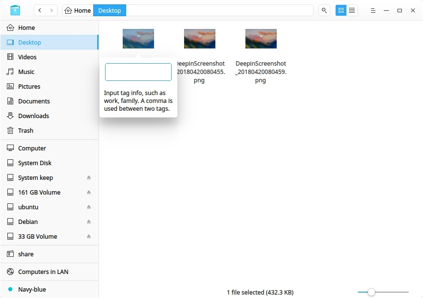

##### By Color Tag

Right click on a file/folder, select a "color button" to create a color tag.

> : You can add tag to multiple files/folders at once, or add multiple tags to a single file/folder; the tag appears in the left navigation bar.

> : If a file has a tag, copy or cut and then paste it, the new file still has the same tag.

#### Rename Tag

Right click on a tag in  the left navigation bar,  select **Rename** to rename the tag.

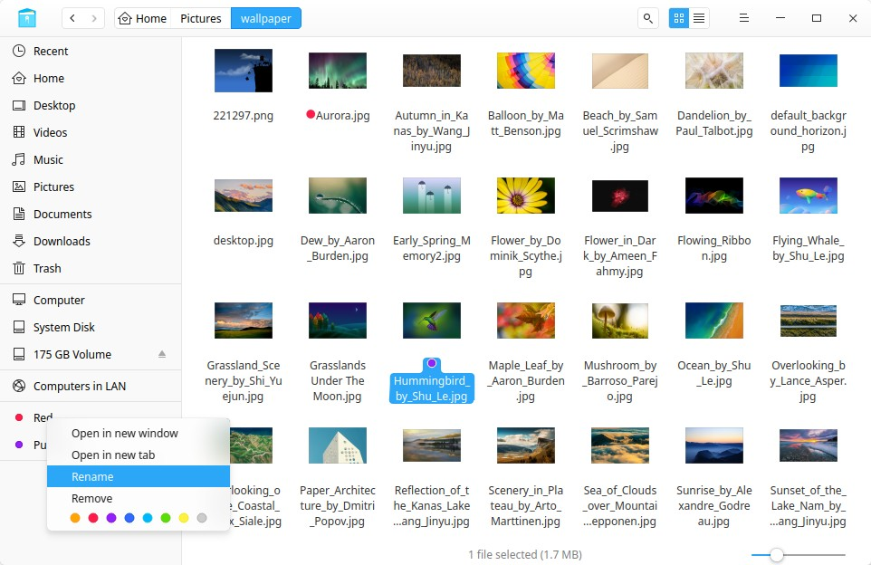

#### Change Tag Color

Right click on a tag in  the left navigation bar,  select a "Color button" to change the tag color.

#### Change Tag Order

Drag and drop the tag upwards or downwards to change its order.

#### Delete Tag
Right click on a tag in left navigation bar,  select **Remove** to delete the tag.

### Preview Files

Deepin File Manager supports file preview. Select a file and press the space bar on the keyboard to quickly preview the file info, including image resolution, document size, text content, gif, audio and video playback, etc.

#### Preview Video

1. Select a video and press  the space bar to start video preview.
2. Click in the preview window to pause video playback.
3. Drag the progress bar to play forward or backward.
4. Click **Open** at the bottom to open the video by default program.

: When selecting multiple files to  preview, use  or  to jump to the previous or next file.

### Permission Management
In file/folder properties, click **Permission Management** to set permission for different roles.

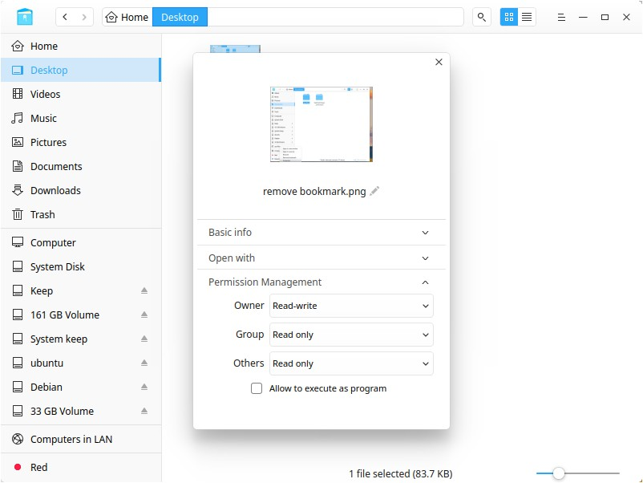

### Computers in LAN

Users can visit computers in LAN to access files and folders.

1. On Deepin File Manager interface, click on .
2. Double click on the computer icon to access.
3. Select to connect as **Anonymous ** or **Registered user**. For **Registered user**, user needs to input username and password to connect.
4. Click on **Connect** to establish connection.

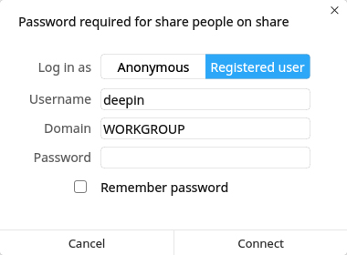

### My Shares

#### Share Folders

Users can share folders in Deepin File Manager, if there are some folders shared, the share icon will show on the navigation bar, if not, the share icon will be hidden.

1. On Deepin File Manager interface, right click on a folder, select **Properties**.
2. In the popup window, click **Share Management**.
3. To share this folder, click **Share this folder **.
4. To change share options, input **Share name**, and select to choose **Permission** and **Anonymous **.
5. To set share password, click  and select **Set share password**.

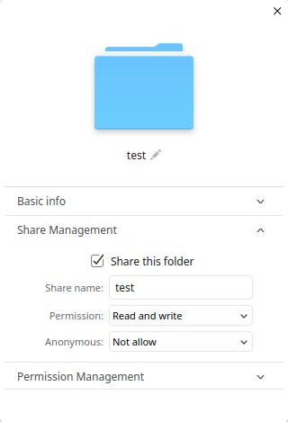

#### Manage Share

Users can manage shared folders if it has shared some folders in Deepin File Manager.

1. On Deepin File Manager interface, click  on the navigation bar.
2. All shared folders will show on the interface.
3. Users can cancel sharing by right clicking the folder and select **Cancel sharing**.

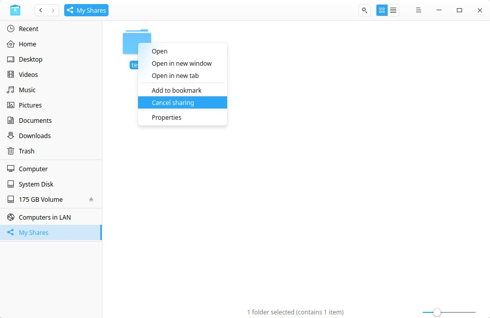

### Open in Terminal

1. On Deepin File Manager interface, enter the folder.
2. Click on blank area in the folder, and select **Open in terminal**.

### Create Link

Users can create links for items, and put the links in easy-to-reach folders (such as Desktop) to access the items faster.

1. On Deepin File Manager interface, select the item to create a link for.
2. Right click and select **Create link**.
3. In the popup window, select a folder to store the link.
4. Click on **Save** to finish creating the link.

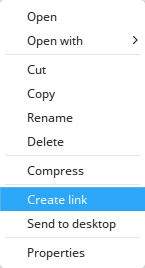

> : By selecting **Send to desktop** for an item, user can create a link on desktop with one click.

### Send To Other Device

When there is an external device inserted, you can directly send file/folder to it.

1. Selected a file/folder.
2. Right click and select **Send to**.
3. Select the device you want to send to.
4. File/folder will be copied to the device.

## Disk Management

On Deepin File Manager interface, you can mount/unmount, remove, format and decrypt disks.

### Display Disks

Mounted disks are displayed in the left navigation bar of Deepin File Manager. Including:
- Local disk, which includes all the partitions of local disk.
- External disk, which includes mobile hard disk, CD/DVD and USB flash disk.
- Mobile device, which includes mobile phone storage, storage card, SD card and so on.

### Unmount/Eject/Safely Remove Disks

1. In the navigation bar of Deepin File Manager, right click on the disk.

2. For local disk, select **Unmount** to unmount the disk. The disk will be still in the disk list.

3. For external disk, select **Unmount** to unmount and eject the removable disk/device, the disk will be removed from the disk list.

4. Select **Safely Remove** to power off and remove the external device.

> : Users can click on  in the navigation bar to unmount the disk.

### Rename Disk
Unmount the disk, right click on it and select **Rename** to change the disk label.

### Format Disks

1. In the navigation bar of Deepin File Manager, right click on the disk to format.
2. Select **Format**.
3. In the popup window, choose the type and volume label for the disk.
4. Click on **Format**.

> : Fast format can be finished in a few seconds, but the data could be restored by file recovery tools. If you don't want these data to be restored, you can uncheck this option box and format the disk.

## Main Menu

Users can create new window, switch to dark theme, make settings, view manual and about information, exit the application.

### New Window

1. On Deepin File Manager interface, click on .
2. Select **New window** to open a new window.

### Dark Theme

1. On Deepin File Manager interface, click on .
2. Select **Dark Theme**.
3. The interface will switch to dark theme.

### Settings

1. On Deepin File Manager interface, click on .
2. Select **Settings** to enter the detailed settings interface.
3. Modify the settings according to your needs:
 - In **Open behavior**, users can set whether to open folder in current window or new window, one click or double click to open it.
 - In **New window and tab**, users can set the default path to open in a new window/tab.
 - In **View**, users can set file icon size and default view.
 - In **Hidden files**, users can set whether to show the hidden file, and hide file extension when rename.
 - In **Index**, users can set whether to auto index internal disk and connected external storage device.
 - In **Preview**, users can set whether to show the preview image of the specified file types.
 - In **Mount**, users can set to auto mount and open after auto mount.
 - In **Dialog**, users can set whether to use the file chooser dialog of the Deepin File Manager.
 - In **Other**, users can set whether to hide system disk.
 - Users can click on **Restore Defaults** to restore all settings.

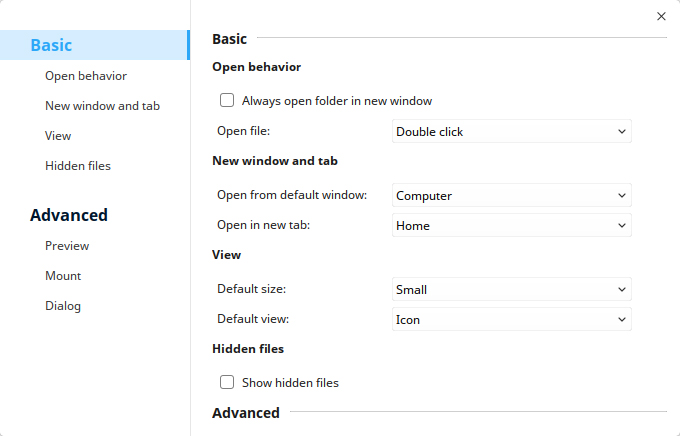

### Help

1. On Deepin File Manager interface, click on .
2. Select **Help**.
3. View the manual.

### About

1. On Deepin File Manager interface, click on .
2. Select **About**.
3. View the version and description.

### Exit

1. On Deepin File Manager interface, click on .
2. Click on **Exit** to exit.
