# Gestor de archvios de Deepin|../common/deepin-file-manager.svg|

## Overview

El gestor de archvios de Deepin es desarrollado por el equipo de Deepin Technology. Como el componente central para administrar archivos en profundidad, es un administrador de archivos poderoso y fácil de usar con una interfaz elegante y simple. El gestor de archivios de Deepin, con sus características completas, bien diseñado y eficientemente mejorado, será de gran ayuda en su vida y trabajo diario.

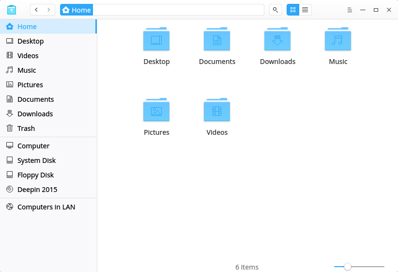

## Guía
Puede ejecutar, cerrar y crear un atajo para gestor de archivos de Deepin de las siguientes maneras.

### Iniciar gestor de archvios de Deepin

1. Clic en  o mueva el puntero del ratón hacia la esquina superior izquierda de la pantalla para ingresar a la interfaz del iniciador.
2. Localizar  desplazando la rueda del mouse o buscando por "gestor de archivos deepin" en la interfaz del Iniciador.
3. Clic derecho en , you can
 - Clic en **Envíar al escritorio** para crear un acceso directo al escritorio.
 - Clic en **Enviar al muelle** para fijar la aplicación al Muelle.
 - Clic en **Añadir al arranque** para añadir la aplicación en el arranque, esta se iniciará automáticamente cuando la computadora inicie.

> : En el Centro de control, puede establecer al Gestor de archivos de Deepin como administrador de archivos predeterminado. Las operaciones específicas son señaladas en [Ajustar aplicaciones predeterminadas](dman:///dde#Ajustar aplicaciones predeterminadas).

### Salir del gestor de archvios de Deepin

- En la interfaz del gestor de archvios de Deepin, clic en  para salir.
- Clic derecho en  en el Muelle, seleccione **Cerrar todo** para salir del gestor de archvios de Deepin.
- Clic en  y seleccione **Salir** para cerrar el gestor de archvios de Deepin.

## Interfaz principal

En la interfaz del gestor de archivos de Deepin, los usuarios pueden ejecutar varias operaciones con las barras funcionales. Está diseñado para ser fácil de usar, fácil de usar y mejorar de manera eficiente.

<table class="block1">
    <caption></caption>
    <tbody>
        <tr>
            <td width="20px">1</td>
            <td width="90px">Barra de navegación</td>
            <td>Muestra el directorio de usuario, discos montados, marcadores y etiquetas.</td>
        </tr>
        <tr>
            <td>2</td>
            <td>Barra de dirección</td>
            <td>Ingrese las palabras claves o ingrese la ruta de dirección para acceder a los contenidos correspondientes. Use   para retroceder y avanzar. Use la barra con miga de papel para pasar entre directorios principales y subdirectorios.</td>
        </tr>
        <tr>
            <td>3</td>
            <td>Vista</td>
            <td>El usuario puede cambiar los modos de vista haciendo clic en  y .</td>
        </tr>
        <tr>
            <td>4</td>
            <td>Menú principal</td>
            <td>El usuario puede crear una nueva ventana, cambiar a un tema oscuro, estaclecer con qué compartir contenido con contraseña, realizar ajustes, ver el manual y la información de la aplicación, y salir de la aplicación.</td>
        </tr>
        <tr>
            <td>5</td>
            <td>Barra de estado</td>
            <td>Muestra la cantidad de archivos o archivos seleccionados. El usuario puede arrastrar el control deslizante para ajustar el tamaño de los iconos en el directorio.</td>
        </tr>
    </tbody>
</table>

> : El usuario puede arrastrar la línea de separación a la derecha de la barra de navegación para cambiar su ancho.

## Funciones básicas

El gestor de archvios de Deepin se presenta con las funciones básicas como administrador de archivos, el usuario puede crear, copiar, renombrar o eliminar archivos/carpetas con facilidad.

### Nuevo Documento/Carpeta

#### Nueva carpeta

1. En la interfaz del gestor de archivos de Deepin, haga clic derecho y seleccione **Nueva carpeta**.
2. Ingrese el nombre de la nueva carpeta, y pulse , o haga clic en el área en blanco.

#### Nuevo documento

1. En la interfaz del gestor de archivos de Deepin, clic derecho y seleccione **Nuevo documento**.
2. En el menú emergente, seleccione el formato de documento que desea crear.
3. Ingrese un nombre para el nuevo documento, y pulse , o haga clic en el área en blanco.

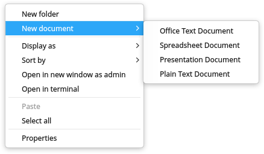

### Rename Archivo/Carpeta

1. Seleccionado el archivo/carpeta, clic derecho para seleccionar **Renombrar**.
2. Input a new name for el archivo/carpeta, y pulse , o haga clic en el área en blanco.

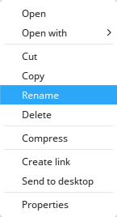

> : Marque "Ocultar extensión de archivo al renombrar" en **Ajustes** para cambiar el nombre del archivo de manera más conveniente.

### Cambio de nombre por lotes

#### Renombrar texto

1. Seleccione varios archivos/carpetas, clic derecho para seleccionar **Renombrar**.
2. Ingrese el contenido que desea remplazar en la Caja de búsqueda, e ingrese el contenido para renombrar en la Caja de reemplazo.
3. Ingrese , o haga clic en el área en blanco.

#### Añadir texto

1. Seleccione varios archivos/carpetas, clic derecho para seleccionar **Renombrar**.
2. Ingrese el contenido a añadir en la Caja de agregados, y seleccione la ubicación.
3. Ingrese , o haga clic en el área en blanco.

#### Personalizar el texto

1. Seleccione varios archivos/carpetas, clic derecho para seleccionar **Renombrar**.
2. Ingrese el nombre del archivo y SN (número de repeticiones).
3. Ingrese , o haga clic en el área en blanco.

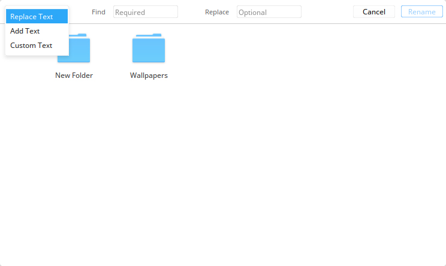

### Copiar Archivo/Carpeta

1. Seleccione varios archivos/carpetas, clic derecho y seleccione **Copiar**.
2. Ingrese la carpeta el directorio al que se pegarán los archivos/carpetas, clic derecho y seleccione **Pegar**.

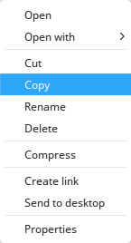 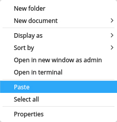

> : Aparecerá una ventana emergente para mostrar el progreso a medida que comienza la copia. Al hacer clic en  puede cancelar el proceso de copiado. Al pasar el puntero del ratón a la barra de progreso redondeada, cambiará a un botón de pausa, puede postergar el proceso de copiado haciendo clic en él.

### Comprimir Archivo/Carpeta

1. Seleccione los archivos/carpetas a comprimir, clic derecho y seleccione **Comprimir**.
2. Ingrese el nombre de archivo y seleccione el formato de archivo para el archivo comprimido.
3. Seleccione la ubicación donde almacenará el archivo comprimido.
4. Seleccione **Crear** para generar el archivo comprimido.

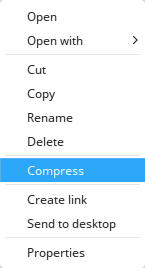

> : En **Otras opciones**, el usuario puede elegir cifrar el archivo comprimido y la lista de archivo, e incluso dividir el archivo compactado en varias partes para reducir el peso individual del archivo.

### Borrar Archivo/Carpeta

1. Clic derecho en archivo/carpeta para seleccionar **Delete**.
2. El archivo/carpeta será movida a la Papelera.
  - Para eliminar permanentemente, abra la Papelera y haga clic derecho en el archivo/carpeta para seleccionar **Borrar** o clic derecho en la Papelera y seleccione **Vaciar**.
  - Para restaurar los archivos/carpetas eliminados, abra la Papelera y haga clic derecho en el archivo/carpeta para seleccionar **Restaurar**, los archivos/carpetas serán movidas a su directorio original.

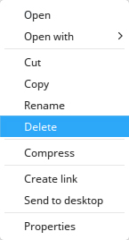

> : El archivo/carpeta en la unidad externa será eliminada permanentemente y no puede ser restaurada cuando seleccione **Borrar**.

### Deshacer operación
En el gestor de archivos,  use  +  para deshacer los pasos anteriores, incluyendo:
- Borrar el ya creado archivo/carpeta.
- Volver al nombre anterior al archivo/carpeta ya renombrado.
- Recuperar el archivo/carpeta borrado de la Papelera.
- Restaurar el ya movido archivo/carpeta (sea arrastrado o cortado) a la anterior ubicación.
- Borrar el archivo/carpeta copiado o movido.

> : Si las operaciones anteriores son continuas, puede deshacerlas todas; si hay sobrescritura de archivos o eliminación permanente de archivos, entonces solo puede regresar a ese paso.

### Opciones para abrir un archivo

Los usuarios pueden seleccionar abrir un archivo con diferentes aplicaciones.

1. En el gestor de archvios de Deepin, haga clic derecho para abrir el archivo.
2. En el menú contextual, seleccione **Abrir con**.
3. Clic en **Seleccionar programa por defecto** para abrir la lista de aplicaciones.
4. Seleccione la aplicación que desea abrir el archivo.
5. Clic en **Elegir** para abrir el archivo por esta aplicación
6. Incluso puede marcar **Establecer por defecto** para establecer la aplicación como predeterminada.

Si la aplicación que desea abrir no está en la lista, puede seguir estos pasos:

1. Haga clic en **Añadir otros programas**.
2. Seleccione una aplicación que desea abrir el archivo.
3. Clic en **Abrir** para abrir el archivo por esta aplicación.

> : La aplicación predeterminada para abrir el archivo será aplicada cuando haga doble clic en él. Los usuarios pueden hacer clic derecho en el archivo, seleccionar **Propiedades** y elegir una aplicación predeterminada en la lista de **Abrir con **. Además, los usuarios pueden establecer las opciones en [Ajustar aplicaciones predeterminadas](dman:///dde#Ajustar aplicaciones predeterminadas) del Centro de control para cambiar de forma glocal la aplicación predeterminada para este tipo de archivos.

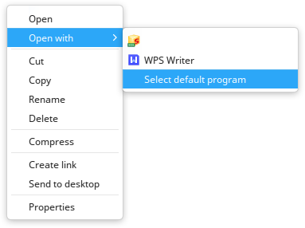

### Modos de visualización

Clic en  o  en la interfaz del gestor de archivos de Deepin para cambiar entre la vista de iconos y la vista de listas.

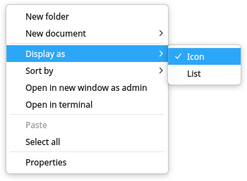

- Visualización de iconos: Solo se mostrará el icono, nombre y miniatura de los archivos.

- Visualización de listas: Se mostrará el icono, nombre, fecha de modificación, tamaño y tipo de los archivos.

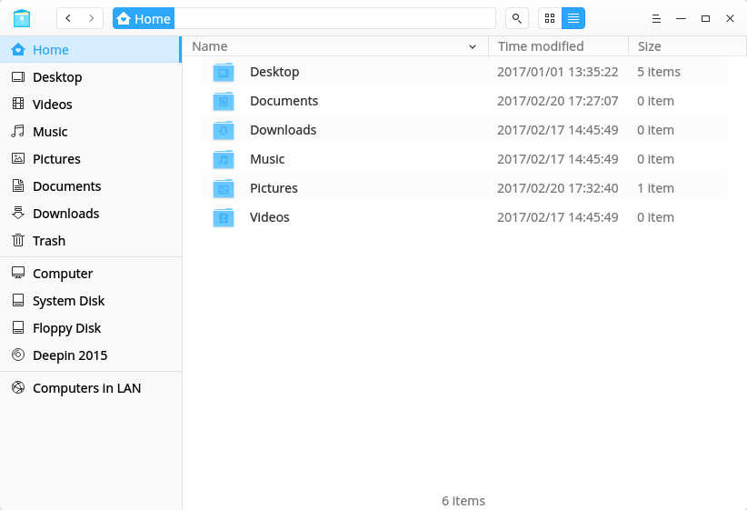

> : El usuario puede arrastrar la línea entre dos columnas para cambiar el ancho de la columna.

> : Pulse  + 1 y  + 2 para intercambiar los modos de vista entre listas e iconos.

### Ordenar

1. Clic derecho en el área de blanco en el gestor de archvios de Deepin, seleccione **Sort by**.
2. Elija entre las opciones de ordenación, que incluyen **Nombre**, **Fecha de modificación**, **Tamaño** y **Tipo**.

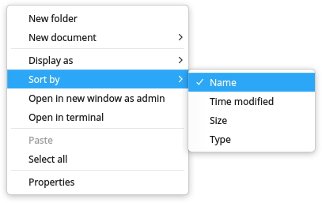

> : Los usuarios pueden hacer clic en el encabezado de las columnas en la vista de lista para cambiar el orden de clasificación.

### Propiedades de Archivo/Carpeta

Los usuarios pueden ver las propiedades de archivo/carpeta.

1. En la interfaz del gestor de archivos de Deepin, clic derecho en un archivo/carpeta o varios y seleccione **Propiedades**.
2. La ventana de propiedades aparecerá según la cantidad de archivos o de la carpeta:
  - Si la cantidad es menor que 16, aparecerá las propiedades de cada archivo o carpeta.
  - Si la cantidad es mayor a 16, aparecerá una ventana general de las propiedades de todos los archivos/carpetas.
3. Si la ventana emergente, puede comprobar la información del archivo/carpeta.

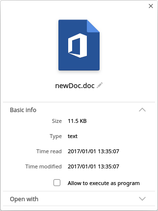

> : La ruta del enlace se agregará en las propiedades del archivo/carpeta vinculado.

## Operaciones frecuentes

gestor de archvios de Deepin is featured with many useful functions, such as breadcrumb bar, tabs, marcadores, file sharing, accessing computers in LAN, opening archivo/carpeta in Terminal and so on. They are all designed to ease the commonly used operations.

### Switch Address Bar

There are three sections in address bar, namely the breadcrumb bar, search bar and directory bar.

By default, breadcrumb bar is displayed in the address bar. By clicing on the blank area in the address bar or clic en , it will switch to directory/search bar, which can be used to access directory and search for target items.

Al ingresar un directorio o palabras clave sea en el directorio o la barra de búsqueda y presionar , el usuario consigue acceder al directorio de destino o buscar los elementos que necesita.

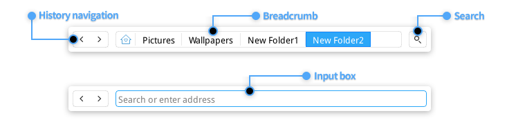

> : Cuando el usuario accede a un subdirectorio, todos los directorios superiores del subdirectorio se convertirán en migas de pan en la barra de direcciones. Al hacer clic en las migas de pan, el usuario puede cambiar fácilmente entre los subdirectorios y sus directorios principales.

### Búsqueda de objetos

Los usuarios pueden buscar o abrir el elemento de destino en la barra de direcciones.

1. En la barra de direcciones del gestor de archvios de Deepin, seleccione la localización para buscar.
  - Para buscar en un directorio de destino, escriba la ruta del directorio e ingréselo.
  - Para buscar todos las carpetas principales, presione  y pulse  para entrar al directorio raíz.
2. Cambie a la búsqueda e ingrese las palabras clave en la barra de búsqueda.
3. Presione , los resultados de búsqueda serán mostrados en la ventana.

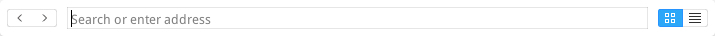

> : También puede abrir un archivo en la barra de direcciones por su ruta absoluta, como /home/desktop/deepin-clone/a.jpg.

> : En **Ajustes**, revise "Autoindizar disco interno" and "Indizar unidades externas después de conectar la computadora" para accelerar la búsqueda rápida.

### Gestionar pestañas

El gestor de archvios de Deepin soporta vista multipestaña.

1. En el gestor de archvios de Deepin, clic derecho en la carpeta para abrir la carpeta en nueva pestaña.
2. En el menú conextual, seleccione **Abrir en una nueva pestaña**.
3. Cuando la ventana tiene varias pestañas, el usuario puede:
 - Clic en + en la barra de pestaña para añadir una nueva pestaña.
 - Clic en × en la parte derecha de la barra de pestaña o clic medio para cerrar la pestaña existente.

> : Cuando el gestor de archvios de Deepin solo tiene una pestaña, la barra desaparecerá, puede presionar  +  para abrir una nueva pestaña.

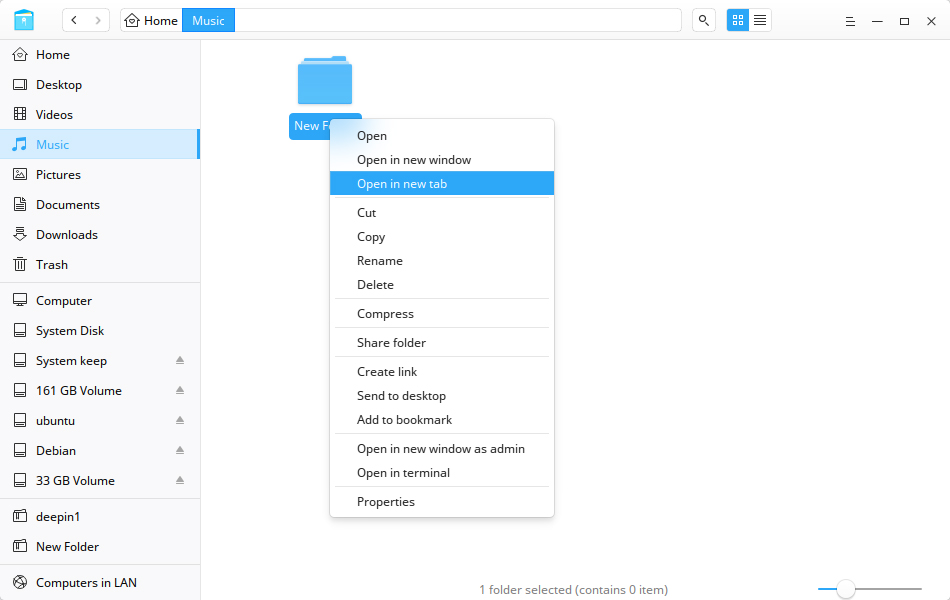

### Administrar marcadores

#### Añadir marcadores

Los usuarios pueden agregar carpetas a marcadores en gestor de archivos de Deepin.

1. En el gestor de archvios de Deepin, clic derecho en la  folder to add as bookmark.
2. En el menú contextual, seleccione **Añadir al marcador**.

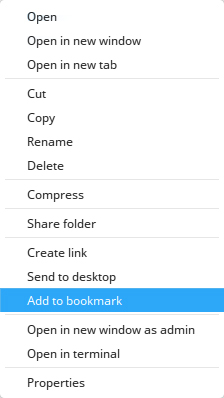

#### Mover marcadores

Los usuarios pueden mover marcadores con el área de marcadores. Arrastre y suelte el marcador a la ubicación designada.

#### Borrar marcadores

Los usuarios pueden borrar marcadores haciendo clic en derecho en el marcador y seleccione **Borrar**, or clic derecho en la carpeta marcada y seleccione **Borrar marcador**, o arrastre o suelte el marcador fuera de la barra de navegación para borrarlo.

### Administrar etiquetas

By adding tags on archivo/carpeta, you can classify and manage your files better.

#### Añadir etiquetas

##### Por etiqueta infomativa

1. Clic derecho en un archivo/carpeta, seleccione **Etiqueta infomativa**.
2. Introduzca la información de la etiqueta, y para seprar las etiqueta use punto y comas.
3. Pulse  para terminar de añadir una etiqueta.

> : El color de la etiqueta se asigna de forma aleatoria a partir de ocho colores predeterminados.

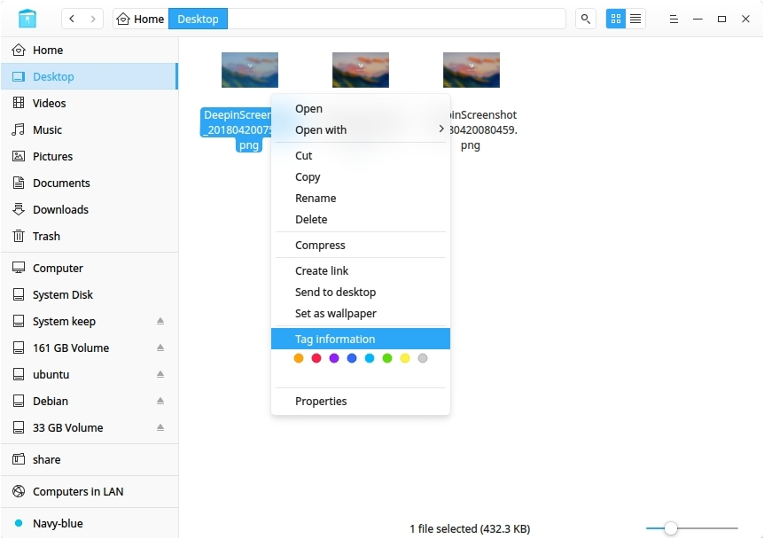

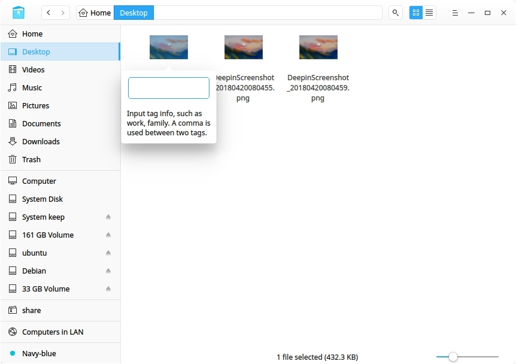

##### Por etiqueta coloreada

Clic derecho en un archivo/carpeta, seleccione un "botón de color" para crear una etiqueta coloreada.

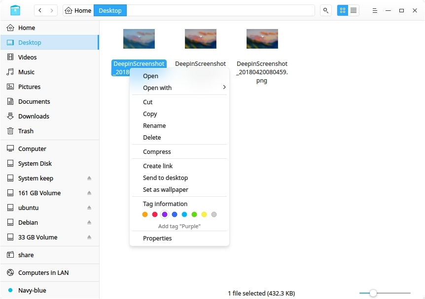

> : Puede añadir una etiqueta a múltiples archivos/carpetas a la vez, o añadir múltiples etiqueta a un solo archivo/carpeta; la etiqueta aparece en la barra de navegación izquierda.

> : Si un archivo tiene una etiqueta, copie o corte y luego péguelo, el nuevo archivo aún tiene la misma etiqueta.

#### Renombrar etiqueta

Clic derecho en una etiqueta en la izquierda de la barra de navegación, seleccione **Renombrar** para cambiar el nombre de la etiqueta.

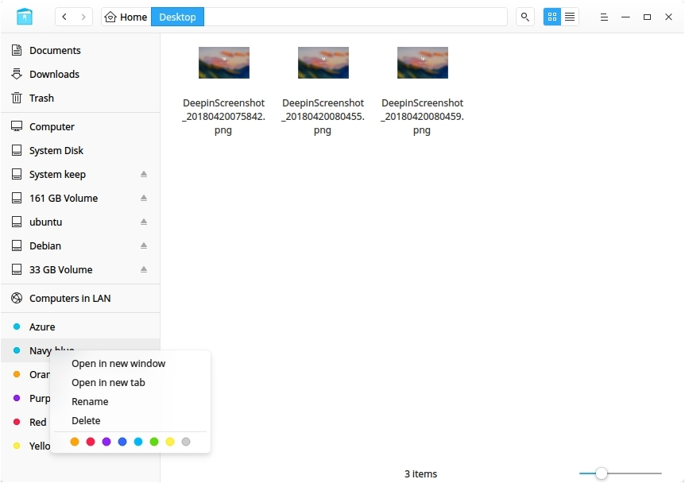

#### Cambiar color de etiqueta

Clic derecho en una etiqueta en la izquierda de la barra de navegación, seleccione un "Botón de color" para cambiar el color de etiqueta.

#### Cambiar orden de etiqueta

Arrastre y suelte la etiqueta hacia arriba o hacia abajo para cambiar su orden.

#### Eliminar etiqueta
Clic derecho en a tag in left navigation bar,  select **Remove** to delete the tag.

### Previsualizar archivos

El gestor de archvios de Deepin admite previsualización de archivos. Seleccione un archivo y pulse la barra espaciadora del teclado para mostrar información breve del archivo, incluyendo resolución gráfica, tipo de documento, contenido del texto, reproducción de audio y vídeo, etcétera.

#### Previsualizar vídeo

1. Seleccione un vídeo y pulse la barra espaciadora para mostrar la previsualización del vídeo.
2. Clic en la ventana previsualizada para pausar la reproducción del vídeo.
3. Arrastre la barra de progreso para avanzar o retroceder la reproducción.
4. Clic en **Abrir** en la parte inferior para abrir el vídeo por el programa predeterminado.

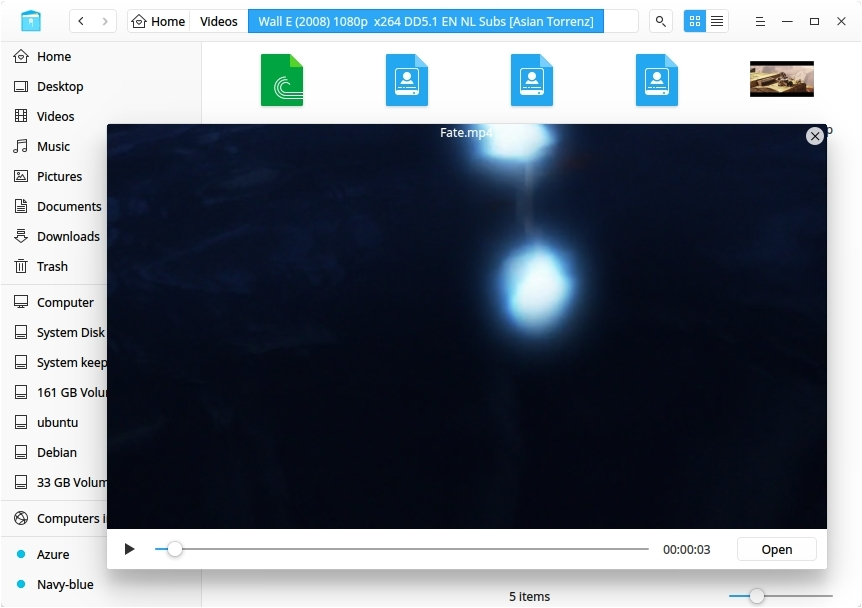

: Cuando seleccione varios archivos para previsualizar, utilice  o  para pasar al anterior o próximo archivo.

### Gestión de permisos
En las propiedades del archivo/carpeta, clic en **Gestión de permisos** para establecer los permisos a diferentes roles.

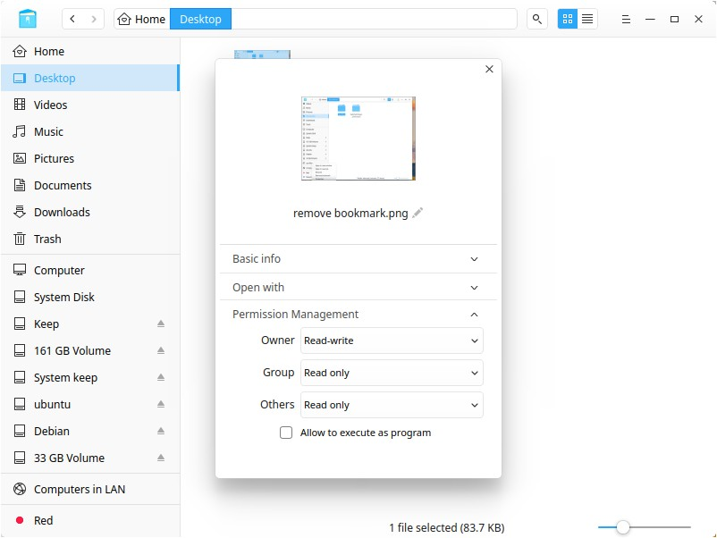

### Computadoras en LAN

Los usuarios pueden visitar computadoras dentro de la Conexión de Área Local para acceder archivos o carpetas.

1. En la interfaz del gestor de archivos de Deepin, clic en .
2. Doble clic en el icono de la computadora para acceder.
3. Seleccione si quiere conectar comos **Anónimo** o **Usuario registrado**. Para **Usuario registrado**, el usuario necesita introducir la cuenta de usuario y la contraseña para conectar.
4. Clic en **Conectar** para establecer la conexión.

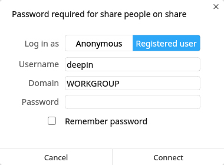

### Mi uso compartido

#### Compartir carpetas

Los usuarios pueden compartir carpetas en el gestor de archvios de Deepin, si hay algunas carpetas compartidas, el ícono para compartir se mostrará en la barra de navegación, de lo contrario, el ícono para compartir se ocultará.

1. En la interfaz del gestor de archivos de Deepin, clic derecho en una carpeta, seleccione **Propiedades**.
2. En la ventana emergente, clic **Gestión de compartición**.
3. Para compartir esta carpeta, haga clic en **Compartir esta carpeta**.
4. Para cambiar los ajustes de compartición, ingrese el **Nombre compartido**, y seleccione si está permitido su visionado en los usuarios (**Permiso**) e invitados (**Anónimo**).
5. Para establecer la contraseña compartida, clic en  y seleccione **Establecer contraseña compartida**.

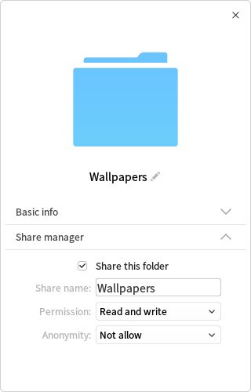

#### Gestión de compartición

Los usuarios pueden gestioanr carpetas compartidos si ha compartido algunas carpetas en el gestor de archvios de Deepin.

1. En la interfaz del gestor de archivos de Deepin, clic en  en la barra de navegación.
2. Todas las carpetas compartidas serán mostradas en el apartado.
3. Los usuarios pueden dejar de compartir haciendo clic derecho a la carpeta y seleccionar **Dejar de compartir**.

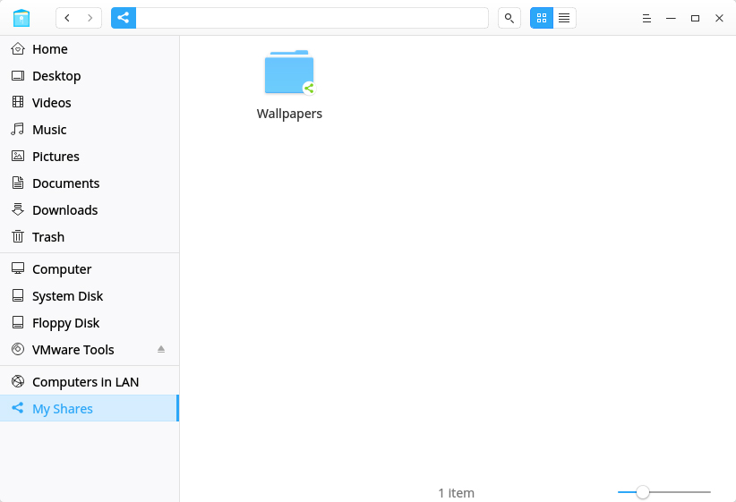

### Abrir en la terminal

1. En la interfaz del gestor de archivos de Deepin, acceda a la carpeta.
2. Clic en la zona en blanco en el folder, y seleccione **Abrir en la terminal**.

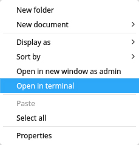

### Crear enlace

Los usuarios pueden compartir enlace para elementos, y colocar los enlaces para acceder fácilmente desde las carpetas (como el Escritorio) y acceder los elementos al instante.

1. En la interfaz del gestor de archivos de Deepin, seleccione el elemento que desea crear el enlace.
2. Clic derecho y seleccione **Crear enlace**.
3. En la ventana emergente, seleccione la carpeta para guardar el enlace.
4. Clic en **Guardar** para finalizar la creación del enlace.

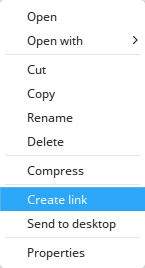

> : Al seleccionar **Enviar al escritorio** para el elemento, el usuario creará un acceso directo al escritorio en un clic.

### Send To Other Device

Cuando hay una unidad de almacenamiento externo insertada, puede directamente enviar archivo/carpeta a ella.

1. Seleccione un archivo/carpeta.
2. Clic derecho y seleccione **Enviar a**.
3. Seleccione el dispositivo que desea enviar.
4. El archivo/carpeta será copiado(a) al dispositivo.

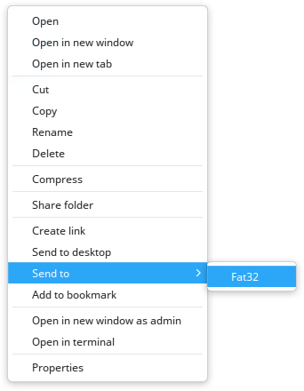

## Administración de discos

En la interfaz del gestor de archivos de Deepin, puede montar/desmontar, remover, formatear y descifrar discos duros.

### Mostrar discos

Los discos montados son mostrados en la barra de navegación izquierda del gestor de archvios de Deepin. Incluyendo:
- Discos locales, dónde extende todas las particiones del disco local.
- Discos externos, incluído discos duros portátiles, unidades CD/DVD y lápiz USB.
- Dispositivos móviles, que incluye almacenamiento del celular, tarjeta de almacenamiento, tarjeta SD y otros.

### Desmontar/Expulsar/Remover discos con seguridad

1. En la barra de navegación del gestor de archvios de Deepin, clic derecho en el disco.
2. Seleccione **Explusar** para expulsar la unidad o disco removible, el disco será retirado de la lista de unidades.
3. Seleccione **Desmontar** para dejar de montar el disco. Éste será retirado de la lista de unidades.
4. Select **Quitar de la PC** para apagar y remover la unidad externa.

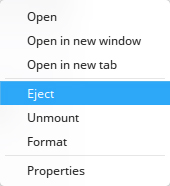 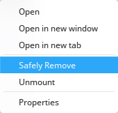

> : Users can clic en  in the navigation bar to eject the disks.

### Renombrar Disco
Desmonte el disco, haga clic derecho y seleccione **Renombrar** para cambiar la etiqueta del disco.

### Formatear Discos

1. En la barra de navegación del gestor de archvios de Deepin In the navigation bar of gestor de archvios de Deepin, clic derecho en the disk to format.
2. Selecciones **Formatear**.
3. En la ventana emergente, elija el tipo y la etiqueta de volumen para el disco.
4. Clic en **Formatear**.

> : El formato rápido se puede finalizar en unos pocos segundos, pero los datos podrían recuperarse mediante herramientas de recuperación de archivos. Si no desea que se recuperen estos datos, puede desmarcar esta casilla de opción y formatear el disco.

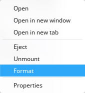

## Menú principal

Los usuarios pueden crear una nueva ventana, cambiar a un tema oscuro, realizar configuraciones, ver el manual y sobre la información, salir de la aplicación.

### Nueva ventana

1. En la interfaz del gestor de archivos Deepin, clic en .
2. Seleccione **Nueva ventana** para abrir a una nueva ventana.

### Cambiar tema

El tema del Gestor de archivos Deepin es luminosa (clara) por defecto, puede hacer clic en **Tema oscuro** para cambiar.

1. En la interfaz del gestor de archivos Deepin, clic en .
2. Seleccione **Tema oscuro**.
3. La interfaz cambiará al tema oscuro.

### Ajustes

1. En la interfaz del gestor de archivos Deepin, clic en .
2. Seleccione **Ajustes** para entrar al apartado detallado de ajustes.
3. Modifique los ajustes arcorde a sus necesidades:
 - En **Orden de apertura**, los usuarios pueden establecer si abrir la carpeta en la ventana actual o en una ventana nueva, hacer clic o hacer doble clic para abrirla.
 - En **Nueva vent. y pestaña**, los usuarios pueden establecer la ruta predeterminada para abrir en una nueva ventana/pestaña.
 - En **Vista**, los usuarios pueden configurar el tamaño del icono del archivo y la vista predeterminada.
 - En **Archivos ocultos**, los usuarios pueden establecer si mostrar el archivo oculto y ocultar la extensión del archivo al cambiar el nombre.
 - En **Indización**, los usuarios pueden establecer si indexar automáticamente el disco interno y el dispositivo de almacenamiento externo conectado.
 - In **Previsualización**, los usuarios pueden establecer si mostrar la imagen de vista previa de los tipos de archivos especificados.
 - In **Montado**, los usuarios pueden configurar el montaje automático y abrir después del montaje automático.
 - In **Diálogo**, los usuarios pueden establecer si se usa el diálogo selector de archivo del Gestor de archivos de Deepin.
 - In **Otros**, los usuarios pueden establecer si ocultar el disco del sistema.
 - Si necesita haga clic en **Restaurar valores predeterminados** para restablecer todos los ajustes.

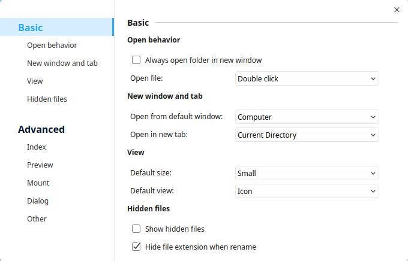

### Ayuda

1. En la interfaz de la Calculadora Deepin, clic en .
2. Seleccione **Ayuda**.
3. Observe el manual.

### Acerca de

1. En la interfaz de la Calculadora Deepin, clic en .
2. Seleccione **Acerca de**.
3. Observe la descripción de la versión.

### Salida

1. En la interfaz de la Calculadora Deepin, clic en .
2. Clic en **Salir** para cerrar.
