# 打印管理器|../common/dde-printer.svg|

## 概述

打印管理器是一款管理打印设备的工具，可同时管理多个打印机。界面可视化，操作简单，方便用户快速添加打印机及安装驱动。

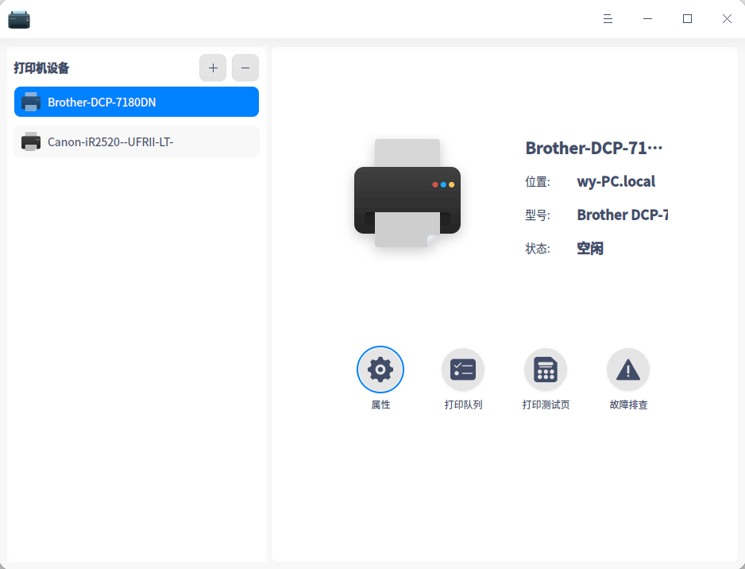

## 使用入门

您可以通过以下方式运行或关闭打印管理器，或者创建快捷方式。

### 运行打印管理器

1. 点击任务栏上的 进入启动器界面。
2. 通过浏览找到  点击运行。
3. 右键单击，您可以：
   - 点击 **发送到桌面**，在桌面创建快捷方式。
   - 点击 **发送到任务栏**，将应用程序固定到任务栏。
   - 点击 **开机自动启动**，将应用程序添加到开机启动项，在电脑开机时自动运行该应用程序。

### 关闭打印管理器

- 在打印管理器界面，点击   ，退出打印管理器。
- 右键单击任务栏上的  图标，选择 **关闭所有** 来退出打印管理器。
- 在打印管理器界面点击  ，选择 **退出** 来退出打印管理器。

## 操作介绍

### 添加打印机

在打印管理器界面，点击，可选择 **自动查找**、**手动查找**、**URI查找**，添加打印机。

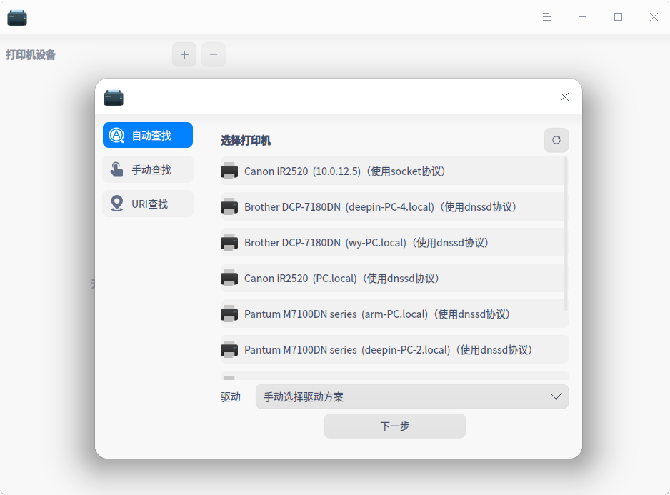

#### 自动查找

1. 点击 **自动查找** 按钮，会加载出打印机列表，选择需要添加的打印机。

2. 选好打印机后，会加载出驱动列表，默认选择推荐打印机驱动。若选择手动驱动方案，则会跳转到手动选择打印机驱动界面。

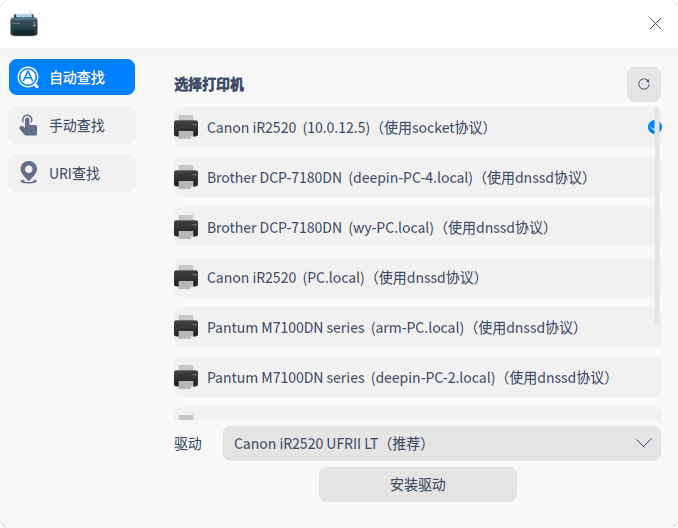

3. 点击 **开始安装**，进入安装界面。

#### 手动查找

1. 点击 **手动查找** 按钮，输入主机名或IP查找打印机，系统通过各种协议扫描打印机。

> ：如果使用SAMBA协议时，在查找打印机时，会弹出用户名、密码、群组输入框。其中群组默认当前用户域，如果没有，则默认为workgroup。

2. 选好打印机后，会加载出驱动列表，默认选择推荐打印机驱动。若选择手动驱动方案，则会跳转到手动选择打印机驱动界面。

3. 点击 **开始安装**，进入安装界面。

#### URI查找

1. 在 **自动查找** 和 **手动查找** 的情况下都不能查询到打印机时，可通过URI查找并安装打印驱动。

2. 点击 **URI查找** 按钮，输入打印机的URI。

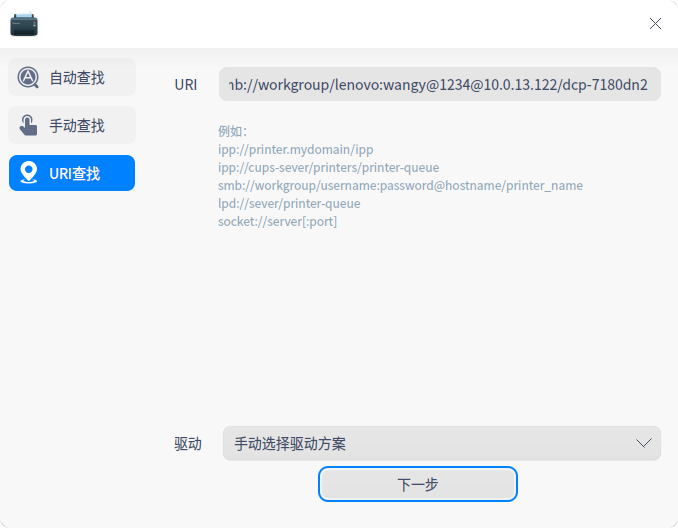

3. 系统默认选择手动驱动方案安装，用户选择对应的驱动。

4. 点击 **开始安装**，进入安装界面。

> ：使用前提是用户知道打印机的URI与使用的协议，直接安装驱动程序来使用打印机。

### 选择驱动

1. 系统默认驱动：选择打印机后，如果有匹配的驱动，系统会默认选择推荐驱动。

2. 手动选择驱动：选择打印机后，选择手动选择驱动，驱动来源有三种。

   * 本地驱动：通过下拉框选择厂商及型号，查询本地驱动。

     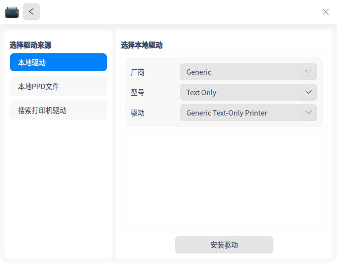

   * 本地PPD文件：将本地文件PPD文件拖放到对应地方，或点击 **选择一个PPD文件** 在本地文件夹查找，比如在/usr/share/ppd目录下选择ppd文件。

     

     > ：使用前提是用户必须在本地安装了驱动，才可以使用PPD文件安装。否则，会提示驱动安装失败。

     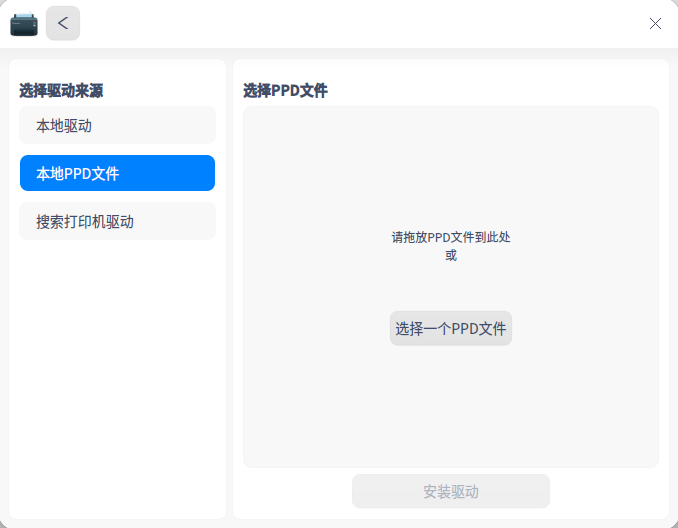

   * 搜索打印机驱动：输入精确的厂商和型号，系统会在后台驱动库中探测搜索，搜索结果会显示在下拉框中。

     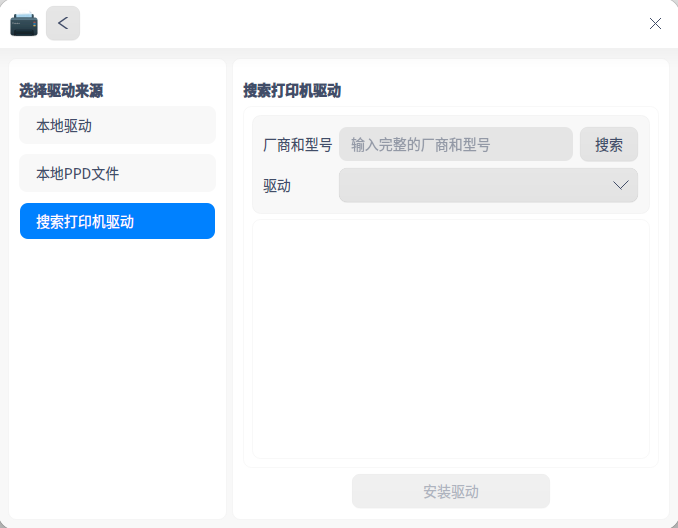

### 安装打印机

添加打印机选择驱动后，点击 **开始安装**，进入安装界面。

- 安装成功
  弹出窗口提示安装成功，可以点击 **打印测试页**，查看是否可以正常打印；或点击 **查看打印机**，跳转到打印机管理界面。

  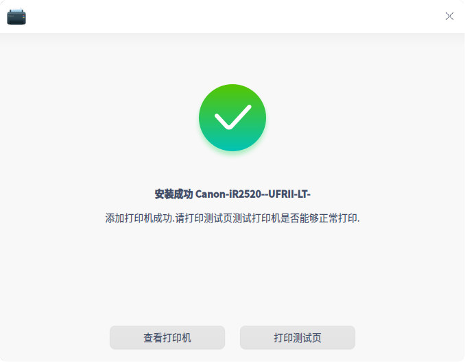

- 安装失败
  弹出窗口提示安装失败，则可选择重新安装。

  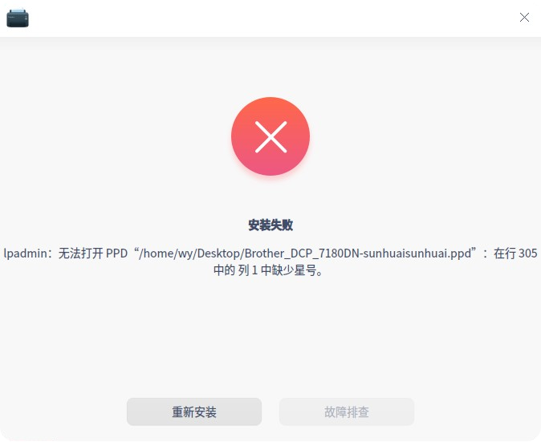

### 打印管理界面

若已经成功添加了打印机，打开应用，进入打印管理界面。选中打印机，可选择打印设置、打印队列、打印测试页及故障排查。

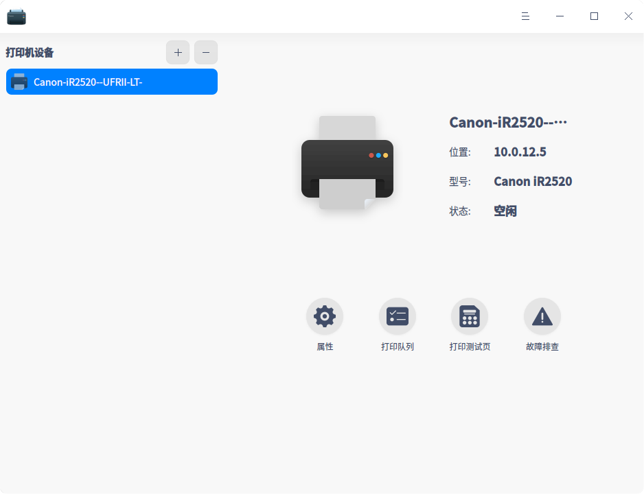

#### 设置 

1. 点击 **设置**，跳转到打印设置列表界面。

2. 不可设置仅可查看项为：打印机驱动、URI、位置、描述、颜色及分辨率。

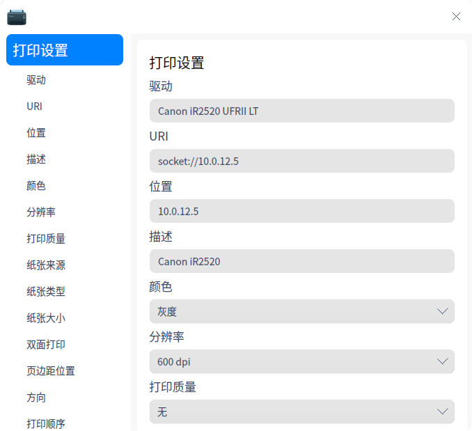

3. 可设置项为：纸张来源、纸张类型、纸张大小、双面打印、页边距位置、方向、打印顺序、装订。

   - 纸张来源：纸张来源默认选中 **自动**，用户可以根据实际情况选择相应的纸盒。

   - 纸张类型：纸张类型默认选中 **自动**，可选普通纸、再生纸、彩色纸、胶片等，用户可以根据需求和打印机支持的纸张选择。

   - 纸张大小：纸张大小默认选中 **A4**，可选A5、B5、A3、Letter等，用户可以根据需求和打印机支持的情况选择。

   - 双面打印：打印方式默认选中 **单面打印**，可选双面长边翻转打印、双面短边翻转打印。

   - 页边距位置：页边距位置默认选中 **左侧**，可选顶部，打印时会留出一定的空间。

   - 方向：进纸方向默认选中 **纵向（无旋转）**，可选横向、反横向、反纵向。

   - 打印顺序：打印顺序默认选中 **从前向后**，可选从后向前，用户根据实际需求选择。

   - 装订：默认选中无装订，可选装订（左）、装订（右）。若选择装订，打印时会标示装订位置。

     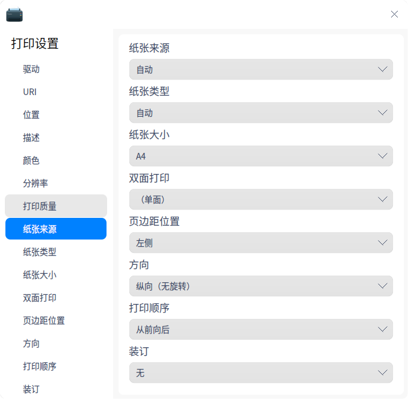

#### 打印队列

1. 点击 **打印队列**，进入主界面，可选择全部列表、打印队列、已完成列表和刷新列表操作。系统默认选择 **打印队列** 界面。

2. 列表内容为：任务ID、用户、文档名称、打印机、大小、提交时间、状态及操作。

3. 操作选项：

   - 开始/暂停打印：开始或暂停当前任务。

   - 删除任务：删除当前打印任务。

     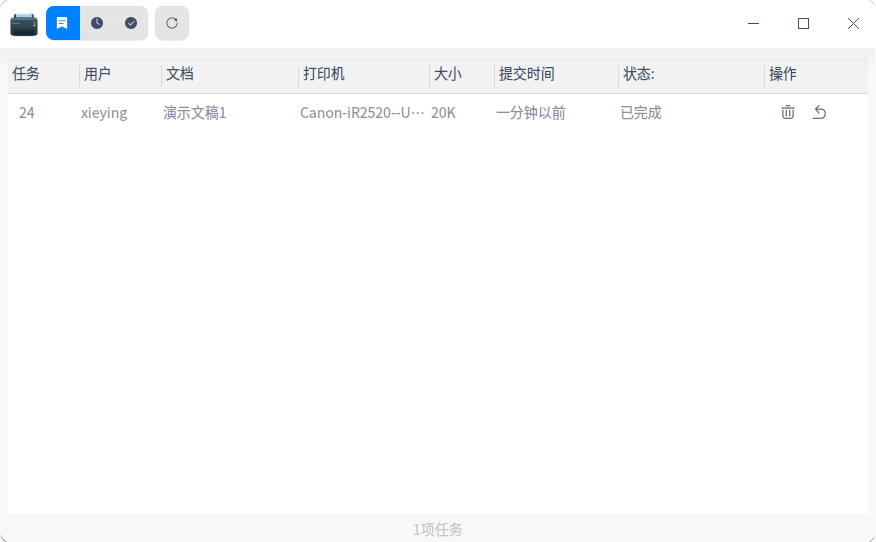

4. 右键操作：

​       选择一个打印任务后，右键可进行 **取消**、**删除**、**暂停打印**、**恢复打印**、**优先打印**、**重新打印** 操作。

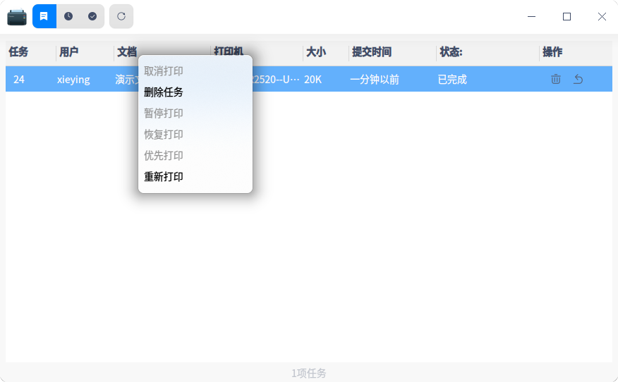

#### 打印测试页

点击 **打印测试页**，测试是否打印成功。

   - 打印成功：测试页打印成功，可进行其他的打印任务。

   - 打印失败：测试页打印失败，选择重新安装或故障排查。

#### 故障排查

打印失败时，可点击 **故障排查**，排查内容如下：

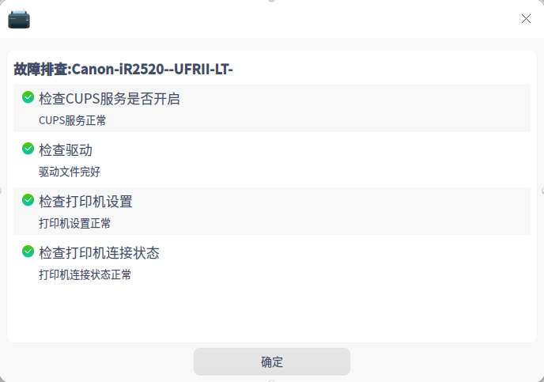

   - 检查cups服务是否开启。

   - 检查驱动文件是否完整。

   - 检查打印机设置：打印机是否启动、是否接受任务。

   - 检查打印机连接状态是否正常。

     
#### 右键设置

选中打印机型号，点击右键，可设置打印机是否共享、是否启动、是否接受任务、是否设为默认打印机。

### 删除打印机

在打印管理界面，点击，可删除选中的打印机。

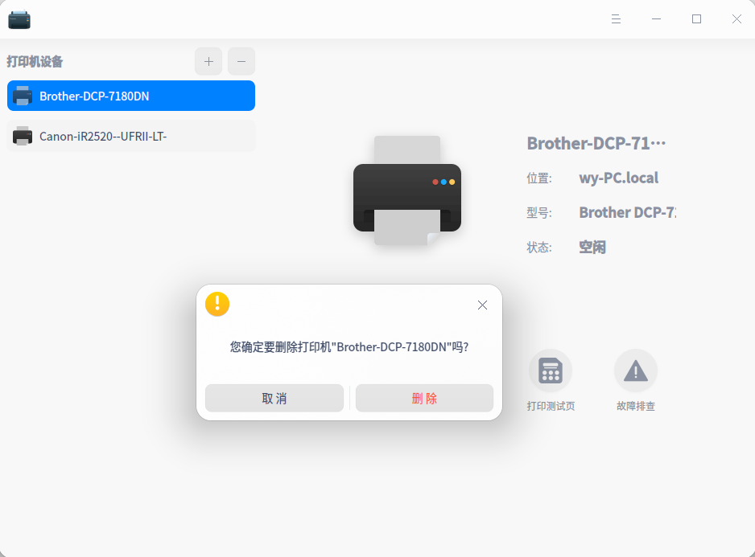

## 主菜单

在主菜单中，您可以进行基本服务器设置，切换窗口主题，查看帮助手册等操作。

### 主题

窗口主题包含浅色主题、深色主题和系统主题，其中系统主题为默认设置。

1. 在打印管理界面，点击。
2. 点击 **主题**，选择一个主题颜色。

### 设置

1. 在打印管理界面，点击 。

2. 点击 **设置**。

3. 可以进行基本服务器设置。

   - 是否发布连接到这个系统的共享打印机，是否允许从互联网打印
   - 是否允许远程管理打印机
   - 是否保留调试信息用于故障排除

   

### 帮助

查看帮助手册，通过帮助进一步让您了解和使用打印管理器。

1. 在打印管理界面，点击 。
2. 点击 **帮助**。
3. 查看关于打印管理器的帮助手册。

### 关于

1. 在打印管理界面，点击 。
2. 点击 **关于**。
3. 查看关于打印管理器的版本和介绍。

### 退出

1. 在打印管理界面，点击 。
2. 点击 **退出**。
