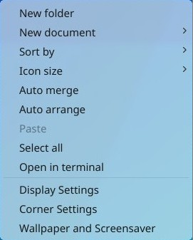
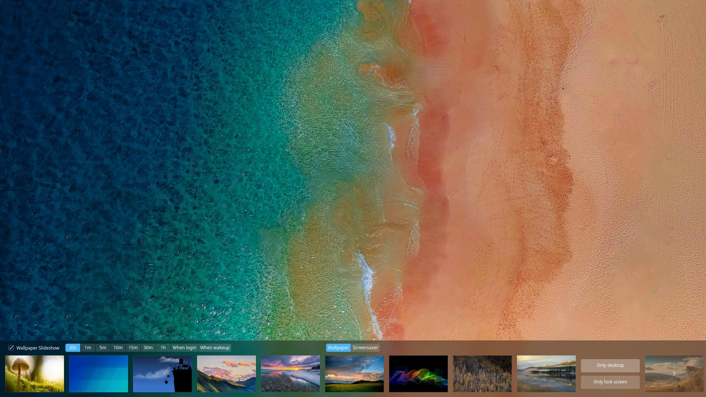
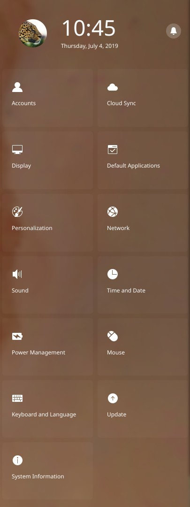

# Desktop Environment|../common/deepin-system.svg|

## Overview
deepin is an elegant, easy to use and reliable Linux desktop operating system developed by Deepin Technology Co., Ltd.  Many polpular software and deepin applications have been preinstalled. It not only meets your office needs, but also allows you to experience a variety of recreational activities. With continually improved and perfected functions, we believe deepin will be loved and used by more and more users.

### Welcome

When you login deepin for the first time, a welcome program will automatically start. View the introduction to get deepin new features, select desktop mode and icon theme, enable window effect, and know more about deepin.

### Activation

After deepin installation, restart the computer, a prompt will pop up asking for activation. You can use it normally without activation, but to upgrade or to get technical support, activation is required.

1. Click on **Activate** in the prompt or  in the dock to enter deepin activation interface.

2. Click on **Input the serial number**.

3. Input your serial number, click **Authorize**.

4. After successful activation,  will be shown on the dock.

> : You can also **Import the authorization file** obtained from service providers or agents to activate deepin.

## Desktop

You can create a new file/folder, sort files, set hot corners and wallpapers, etc. on desktop.

### Create New File/Folder
You can create a new folder, common documents, or doing general operations for files on the desktop, just like in file manager.

- Right click on desktop and click on **New folder**, enter the name for it.
- Right click on desktop and click on **New document**, select the type and enter its name.

<table class="block1">
    <tbody>
        <tr>
            <td width="20px">Open with</td>
            <td width="100px">Select the default one or choose another software to open the file.</td>
        </tr>
        <tr>
            <td>Cut</td>
            <td>Select one or more files/folders and move to another location.</td>
        </tr>
        <tr>
            <td>Copy</td>
            <td>Select one or more files/folders and copy to another location.</td>
        </tr>
        <tr>
            <td>Rename</td>
            <td>Select one file/folder to rename.</td>
        </tr>
        <tr>
            <td>Delete</td>
            <td>Select one or more files/folders to delete.</td>
        </tr>
        <tr>
            <td>Compress/Extract</td>
            <td>Select one or more files/folders to compress, or extract a compressed file.</td>
        </tr>
        <tr>
            <td>Create link</td>
            <td>Select one file/folder to create a link.</td>
        </tr>

​    	<tr>
        <td>Tag information</td>
        <td>Select one file/folder to add a tag.</td>
    </tr>

​       <tr>

​            <td>Properties</td>
            <td>View the basic info of a file/folder, or to change the permission and open with options.</td>
        </tr>
    </tbody>
 </table>

### Sort Files
You can sort the files on desktop to fit your needs.

1. Right click on desktop.
2. Click on **Sort by**, you can:

 - Click on **Name** to display files in the order of name.
 - Click on **Time modified** to display files in the order of last modified date.
 - Click on **Size** to display files in the order of size.
 - Click on **Type** to display files in the order of type.

> : You can also check **Auto arrange**, the desktop icons will be arranged automatically, and when some of the icons are removed, others will fill in the blanks.

### Adjust Icon Size

1. Right click on desktop.
2. Click on **Icon size**, you can:

 - Click on **Tiny** to display icons in tiny size.
 - Click on **Small** to display icons in small size.
 - Click on **Medium** to display icons in medium size. 
 - Click on **Large** to display icons in large size. 
 - Click on **Super large** to display icons in super large size.

> ：Press  + / to adjust icon size on desktop and that in launcher.

### Set Display
You can set the screen resolution, brightness and so on.

1. Right click on desktop.
2. Click on **Display settings** to open the interface of display settings in Control Center.

> : Specific operations refer to [Display Settings](#Display Settings).

### Set Hot Corners
Hot Corner is to simplify your operations and helps you quickly enter the main interface.

1. Right click on desktop.
2. Click on **Corner Settings**, then the whole screen will get dark and the corresponding hot corner function will be displayed on the four corners.
3. Move the mouse pointer to a corner and select one option to set the corner.
4. Click on the desktop blank area to exit.

 

> : Please pay attention to the animation of corner settings.

### Set Wallpaper
You can select some elegant and fashionable wallpapers to beautify desktop and make it distinctive.

1. Right click on desktop.
2. Click on **Wallpaper and Screensaver** to preview all the wallpapers at the bottom of the desktop.
3. Click your favorite one and it will apply in desktop and lock screen.
4. You can also choose **Only desktop** or **Only lock screen**.

> : Check **Wallpaper Slideshow**, and set the time interval to change wallpaper automatically, or set to change the wallpaper when login or wakeup. 

### Set Screensaver
The screensaver was used to protect the monitor before, now it is mainly for protecting personal privacy from peeing.

1. Right click on desktop.
2. Click on **Wallpaper and Screensaver**, and select **Screensaver** to preview all the screensavers at the bottom of the desktop.
3. Select one and click **Apply**, and set the waiting time for the screensaver to start.
4. You can also tick the box of **Require a password on wakeup** for better privacy protection.
5. After that idle time, the screensaver will start.

## Dock
Dock is usually displayed at the bottom of the desktop to help you quickly open frequently used applications, which includes Launcher, application icons, tray, shutdown button and system datetime, etc.

### Dock Icons
You can add application shortcuts to Dock from Launcher and do related operations on it.

<table class="block1">
    <caption>Icon Description</caption>
 <tbody>
        <tr>
            <td></td>
            <td>Click to enter into Launcher interface</td>
            <td class="blank"></td>
            <td></td>
            <td>Click to open Deepin File Manager</td>
        </tr>
        <tr>
            <td></td>
            <td>Click to open Deepin Music</td>
            <td class="blank"></td>
 <td></td>
            <td>Click to open webpages</td>
        </tr>
        <tr>
           <td></td>
            <td>Click to open Control Center</td>
            <td class="blank"></td>
             <td></td>
            <td>Click to enter shutdown interface</td>
        </tr>
        <tr>
            <td></td>
            <td>Click to open Deepin Calendar</td>
            <td class="blank"></td>
            <td></td>
            <td>Click to open the trash</td>
        </tr>

</tbody>
</table>

### Switch Display Mode
There are two display modes of Dock, which are fashion mode and efficient mode.

- **Fashion Mode**: The display mode is similar to Mac OS and shown as a dock at the bottom of the screen. All fixed application icons will be on Dock, and the tray area can be folded or expanded.
- **Efficient Mode**: The display mode is similar to Windows 7 and shown as a small strip at the bottom of the screen. Application icons on Dock will be displayed in smaller ones. Click the right corner to show desktop.

 

 

You can switch the display mode by the following operations:

1. On the desktop, move the mouse pointer over Dock.
2. Right click to select **Mode**.
3. Select a display mode.

### Set Dock Location
You can place the Dock on any direction of your desktop.

1. On the desktop, move the mouse pointer over Dock.
2. Right click to select **Location**.
3. Select a location.

### Adjust Dock Size

1. On the desktop, move the mouse pointer over Dock.
2. Right click to select **Size**.
3. Select a size.

### Show/Hide Dock

1. On the desktop, move the mouse pointer over Dock.
2. Right click to select **Status**.
3. On the submenu, you can:
   - Select **Keep Shown**, Dock will be displayed at the bottom of the desktop all the time.
   - Select **Keep Hidden**, Dock will be hidden and only displayed when mouse hovering on Dock.
   - Select **Smart Hide**, Dock will be automatically hidden when the Dock area needs to be used.

### Show/Hide Plugins

1. On the desktop, move the mouse pointer over Dock.
2. Right click to select **Plugins**.
3. On the submenu, you check or uncheck **Power, Onboard, Datetime** to show or hide the corresponding icon on Dock.

> : Uncheck the plugin icon, it will be hidden on Dock.

### Shutdown Interface
There are two ways to shut down:

1. Click on the power icon on Dock.
2. Click on the power icon at the bottom right corner of Launcher mini mode.

On desktop, click  on Dock.

<table class="block1">

    <tbody>
        <tr>
            <td width="30px">Shut down</td>
            <td width="100px">Click on  on the Shutdown Interface or press  on keyboard.</td>
        </tr>
        <tr>
            <td>Restart</td>
            <td>Click on  on the Shutdown Interface, to run you computer again after shutdown</td>
        </tr>
        <tr>
            <td>Suspend</td>
            <td>Click on  on the Shutdown Interface, the entire system will be running with low consumption.</td>
        </tr>
        <tr>
            <td>Lock Screen</td>
            <td>Click on  on the Shutdown Interface or press + combination key on keyboard.</td>
        </tr>
        <tr>
            <td>Switch User</td>
            <td>Click on  on the Shutdown Interface, to use another account to log in.</td>
        </tr>
        <tr>
            <td>Log Out</td>
            <td>Click on  on the Shutdown Interface, to clear the current account information by logging out.</td>
        </tr>
        <tr>
            <td>Start system monitor</td>
            <td>Click on  on the Shutdown Interface, to start system monitor.</td>
    </tbody>
 </table>

> :  will be shown when there are multiple accounts on the system. 

### Trash
You can find all deleted files in trash which can be resumed or emptied.

> : Using fashion mode, Trash will be displayed on Dock, if you switch to efficient mode, you can open it in Launcher or create a shortcut on desktop.

#### Restore Files
You can restore files deleted by executing the following operations:

1. Select the file to restore in trash.
2. Right click on the file and select **Restore**.
3. The file will be in its original path.

> : To restore file/folder just deleted, press  +   to undo it.

> : If the original path does not exist anymore, it will automatically create the folders.

#### Empty Trash
Empty trash to release more usable space in your disk.

1. In Trash, right click on the blank area.
2. Select **Empty Trash** to completely delete all the files in Trash.

## Launcher
Launcher can help you to manage all installed applications, you can quickly find the needed application by the categorized navigation or searching function.

> : A newly installed application in Launcher is followed with a blue point.

### Switch Modes

- Users can switch between fullscreen mode and mini mode manually. Click the icon at the upper right corner to switch modes.
- Both the modes support searching applications and sending it to desktop or dock.
- Mini mode also supports opening File Manager, Control Center and shutdown interface directly.

 

### Sort Applications

In fullscreen mode, all applications in Launcher are ordered by installation time by default.

- Move the mouse pointer over the application icon, press and hold the mouse left button, then drag and drop to arrange the application icon freely.
- Click on the category icon  on the upper left in Launcher to arrange the icons by category.

 

In mini mode,  applications are displayed by use frequency by default.

### Search Applications

In Launcher, scroll up and down the mouse wheel to find the application. You may also locate the application faster with the category navigation.

If you already know the application name, you can locate it even faster by entering the keywords!

1. In Launcher, type in a word such as "deepin".
2. The system will automatically search for all applications which contain the keyword "deepin", and then display the searched result in Launcher.

 

### Set Shortcut
The shortcut is an easy and convenient way to launch applications.

#### Create Shortcut
You can select to send the application to desktop or dock to facilitate follow-up operations.

1. In Launcher, move the mouse pointer over the application icon.
2. Right click the icon, you can:
   * Click on **Send to desktop** to create a shortcut on the desktop.
   * Click on **Send to dock** to fix the application on Dock.
   * Click on **Add to startup** to add the application to the startup, it will automatically run when the computer boots.

 

> : You can drag the application icon from Launcher to Dock. But, you can not drag and drop the application while it is running. At this time you can right click the application icon on Dock and select **Dock** to fix. So that you can quickly open it next time.

#### Delete Shortcut
You can delete the application shortcut from the desktop, Dock and so on.

1. In Launcher, move the mouse pointer over the application icon.
2. Right click the icon, you can:
   * Click on **Remove from desktop** to delete the shortcut on the desktop.
   * Click on **Remove from dock** to remove the application fixed on Dock.
   * Click on **Remove from startup** to remove the application from startup.

 

> : Application fixed on Dock can be removed by dragging and dropping the icon away from Dock. You can not drag and remove the application while it is running. Then you can right click on the application icon on Dock and select **Undock** to remove it.

### Run Applications
For those whose desktop shortcuts have been created or fixed on Dock, you can open them in the following ways:

- Double click the desktop icon or right click the desktop icon to select **Open**.
- Click the application icon on Dock or right click to select **Open**.

To open the application only shown in Launcher, click the icon or right click to select **Open**.

### Uninstall Applications
You can choose to uninstall applications you no longer use to save disk space.

1. In Launcher, right click the application icon.
2. Click on **Uninstall**.

> : In **Fashion mode**, drag the application icon in Launcher fullscreen mode to  on dock to uninstall the application.

## Control Center
You can manage the basic settings of deepin in Control Center. It includes account management, network settings, date and time, personalization, display settings, system and application update, etc. When you enter Deepin Desktop Environment, click  to open Control Center.

### Homepage Introduction
The homepage of Control Center displays the datetime and provides several modules for users to quickly set. You can also view all messages in the notification list.

<table class="block1">
    <tbody>
        <tr>
            <td width="120px">Top Info Bar</td>
            <td>Display the account avatar, current date and time. Click the button behind to switch to notification list.</td>
        </tr>
        <tr>
            <td>Settings Area</td>
            <td>Display the settings navigation. Click to jump to related settings.</td>
        </tr>
         </tbody>
 </table>

Once you open a setting module in Control Center, the navigation bar appears on the left. Click the icon to quickly switch to other settings.

### Account Settings
You can protect your privacy and data and get security protection by setting accounts.

#### Create New Account

1. On the homepage of Control Center, click on .
2. Click on **Create Account**.
3. Input the new user's name, type password twice.
4. Click on **Create**.
5. Input password on the auth page and the new account will be added to the account list.

#### Modify Account Avatar

1. On the homepage of Control Center, click on .
2. Click on an existed account in the list.
3. Click on **Modify Avatar** to enter the interface for modifying avatar.
4. Select a default avatar or local avatar to finish.

>: You can click on the user avatar to directly enter the **Accounts** interface.

#### Modify Account Password

1. On the homepage of Control Center, click on .
2. Click on an existed account in the list.
3. Click on **Modify Password** enter the interface for modifying password.
4. Input new password twice and confirm.

#### Auto Login

1. On the homepage of Control Center, click on .
2. Click on an existed account in the list.
3. Click on **Auto Login** to switch it on.

#### Login without Password

1. On the homepage of Control Center, click on .
2. Click on an existed account in the list.
3. Click on **Login without password**, you can enter into the system without a password.

#### Set Fingerprint Password

1. On the homepage of Control Center, click on .
2. Click on an existed account in the list.
3. Click on **Fingerprint Password**.
4. Click on **Add Fingerprint** to enter the adding interface.
5. Put the finger in fingerprint reader, and then click on **Done** after added successfully.

#### Delete Account

1. On the homepage of Control Center, click on .
2. Click on an existed account in the list.
3. Click on **Delete Account**.
4. In the confirm interface, click on **Delete**.

> : The current login user can not be deleted.

### Display Settings

You can set screen resolution, direction and display scaling to make your screen reach the best performance.

#### Single Screen Settings
You can adjust the visual perception by setting the screen resolution, brightness and so on.

##### Set Display Scaling

1. On the homepage of Control Center, click on .
2. Click on the scaleplate to adjust the display scaling.
3. It will take effect after reboot.

> : When a HiDPI screen is detected, the display scaling will be automatically switched.

> : Some applications do not support display scaling, you can right click it in Launcher and select **Disable display scaling** to get better display effect.

##### Set Resolution

1. On the homepage of Control Center, click on .
2. Click on **Resolution** to enter the interface for resolution settings.
3. Select the proper resolution in the list.

##### Set Brightness

1. On the homepage of Control Center, click on .
2. Click on **Brightness** to enter the interface for brightness settings.
   - Enable **Night Shift**, the color temperature of the screen will be auto-adjusted by figuring out your location.
   - Enable **Auto Brightness**, the monitor will change the brightness automatically (support PC with light sensor).
   - Drag the slider to set screen brightness.

##### Set Screen Direction

1. On the homepage of Control Center, click on .
2. Click on **Rotate** to rotate the screen.
3. Everytime you click the mouse, the screen will rotate 90 degrees clockwise.
4. Click on the right mouse button to exit the rotate screen interface.

#### Multiple Screen Settings
Widen your horizon by multiple screens! You can use VGA cable to connect your computer to other display devices.

1. On the homepage of Control Center, click on .
2. Select a multiple screen mode:
    - **Copy** to copy the setting of main screen to others.
    - **Extend** to extend the display area of main screen.
    - **Only Displayed on xxx** to display screen content only on one screen.
    - **Custom Settings** to set the screen and its resolutions.

##### Custom Settings

1. On the homepage of Control Center, click on .
2. Click on **Custom Settings**.
3. Set custom settings on the popup menu.
4. Click on **Save**.

> : Click **Apply** to use the settings temporarily, it does not save the settings.

### Default Application Settings
If several applications in the same type are installed, you can choose one of them to be the default application to open files.

#### Select Default Applications

1. On the homepage of Control Center, click on .
2. Click on **Default Applications** to enter the settings interface for modifying default applications.
3. Select the applications in the list.

#### Add Default Applications

1. On the homepage of Control Center, click on .
2. Click on **Default Applications** to enter the settings interface for modifying default applications.
3. Click on **Add** in different types:
   - When you selected a *.desktop file for default application, the icon and name will be added to the list automatically.
   - When you selected a specified binary file, the icon, name and path will be added to the list automatically.

> : The type lists will show an **Edit** button at right when the user has added default applications.

#### Delete Default Applications

System default applications cannot be deleted, if you wanted to delete an installed application from the list, you can only uninstall this application.

1. On the homepage of Control Center, click on .
2. Click on **Default Applications** to enter the settings interface for modifying default applications.
3. Click on **Edit** to delete the added default applications.
4. Click on **Delete**.

### Personalization Settings
You can change the appearance of desktop by adjusting the transparency of Launcher (in mini mode), Dock and Control Center, and using different desktop icons, window style and font, etc. 

#### Set Transparency
Move the slider to set the transparency of Launcher (in mini mode), Dock and Control Center. When the slider is on left, it is transparent.
1. On the homepage of Control Center, click on .
2. Click on the bar to adjust the transparency and view it in real time.

#### Set Theme
You can set the window theme, icon theme and cursor theme of the system respectively.

1. On the homepage of Control Center, click on .
2. Click on **Theme** to enter the interface for setting themes.
 - In window theme list, select a window style to switch.
 - In icon theme list, select an icon style to switch.
 - In cursor theme list, select a set of cursors to switch.

#### Set Font

1. On the homepage of Control Center, click on .
2. Click on **Font** to enter the interface for setting fonts.
3. Set the font type and size for the system.

#### Enable Window Effect

1. On the homepage of Control Center, click on .
2. Click on **Enable window effect** to enable the window effect.
3. Click again to disable.

### Bluetooth Settings
You can do short-distance wireless communication by Bluetooth by connecting to other Bluetooth devices. Common Bluetooth devices are Bluetooth keyboard, Bluetooth mouse, Bluetooth earphones and Bluetooth speakers, etc.

> : Most laptops have Bluetooth module, you just need to enable it, but most desktop computers do not have it, you can purchase one adapter and plug it into a USB port to get the function.

#### Enable Bluetooth

1. On the homepage of Control Center, click on .
2. Click on **Bluetooth** to enter the interface for setting Bluetooth.
3. Click on the Bluetooth switch to enable the Bluetooth adapter.

#### Bluetooth Name

1. On the homepage of Control Center, click on .
2. Click on **Bluetooth** to enter the interface for setting Bluetooth.
3. Click on the edit icon near the Bluetooth name, enter the new name.

> : After successfully modified the name, the Bluetooth adapter will broadcast its new name, and other devices have to search for the new name.

#### Bluetooth Device

1. On the homepage of Control Center, click on .
2. Click on **Bluetooth** to enter the interface for setting Bluetooth.
3. In **Other Devices** list, the system will scan the nearby devices and auto connect them.
4. The device will be added to the **My Device** list after successfully connected.
5. In **My Device** list, you can **Disconnect** and **Ignore this Device**.

### Network Settings
Experience the enjoyment of surfing the Internet! You can browse news, play online videos, download files, chat and shopping, etc.

#### Wired Network

1. Plug the cable into the network slot on computer.
2. Plug another end of the cable into the router or network port.
3. On the homepage of Control Center, click on .
4. Click on **Wired Network Card** switch to enable wired network.
5. After successfully connected to the network, it will prompt "Wired Connection Connected".

#### Wireless Network

##### Connect to Wi-Fi Network

1. On the homepage of Control Center, click on .
2. Click on **Wireless Network Card** switch to enable the wireless network.
3. Click on **Wireless Network** to enter the wireless network list.
4. The computer will auto search the nearby available wireless network.
5. Select the wireless network to connect.
   - If the network is opened, it will auto connect to the network.
   - If the network is encrypted, please enter the password and click on **Connect** to finish the work.

##### Connect to Hidden Network

1. On the homepage of Control Center, click on .
2. Click on **Wireless Network Card** switch to enable the wireless network.
3. Click on **Wireless Network** to enter wireless network list.
4. Click on **Connect to Hidden Network** to enter the interface for connecting to the hidden network.
5. Enter the name of the network and choose the encrypt method, then enter the password.

#### Hotspot

1. On the homepage of Control Center, click on .
2. Click on **Hotspot** to enter the hotspot interface.
3. Click on the switch to enable or disable hotspot.
4. Click on **Hotspot Settings** to view the details or custom name and password.

#### Mobile Network

1. Plug the mobile network card to the USB port.
2. On the homepage of Control Center, click on .
3. The system will auto connect to the network based on the mobile network card and operator info.
4. Click on **Mobile Network** to view the detailed settings info.

#### DSL/PPPoE Connections

##### Create New DSL/PPPoE Connection

1. On the homepage of Control Center, click on .
2. Click on **DSL**.
3. Click on **Create PPPoE Connection**.
4. Enter the name, account and password.
5. Click on **Save** and the system will create the connection and try to connect to it.

##### Set DSL/PPPoE Connection

1. On the homepage of Control Center, click on .
2. Click on **DSL**.
3. Click on **PPPoE Connection** to enter the interface for setting DSL/PPPoE connections.
4. Modify name, account, password, open automatically connect, set IP address or open other auth services.

#### VPN

1. On the homepage of Control Center, click on .
2. Click on **VPN** and **Create VPN** to enter the interface for creating VPN connections.
3. After creating a VPN, you can click on **Export** to export the configured file.
  You can also click on **Import VPN** to import the existed VPN file.

> : If you don't want to use the VPN as the default routing, click on **Only applied in corresponding resources**.

#### Application Proxy

1. On the homepage of Control Center, click on .
2. Click on **Application Proxy** to enter the interface for setting application proxy.
 - Click on **Proxy Type** to select the proxy type.
 - Fill in IP address, port, username, and password.
3. Click on **Confirm** to save and click on **Cancel** to return to the previous interface.

> : After configured, right click on an application in Launcher to check **Use a proxy**, then the application will be opened by proxy.

#### System Proxy

1. On the homepage of Control Center, click on .
2. Click on **System Proxy** to enter the interface for setting system proxy.
 - Click on **None** to disable the proxy function.
 - Click on **Manual** and enter the address and port for proxy servers.
 - Click on **Auto** and enter URL to let the system configure the proxy info automatically.

#### Network Info

1. On the homepage of Control Center, click on .
2. Click on **Network Details** to enter the network info interface.
3. View the network info for the current wired or wireless network.

### Sound Settings
Set your speaker and microphone to let you hear more comfortable and sing better.

#### Set Speaker

1. On the homepage of Control Center, click on .
2. Click on **Speaker** switch to enable the speaker.
3. Adjust the output volume and left/right balance.

#### Set Microphone

1. On the homepage of Control Center, click on .
2. Click on **Microphone** switch to enable the microphone.
3. Adjust the input volume.

#### Advanced Settings

1. On the homepage of Control Center, click on .
2. Click on **Advanced**.
3. Select input and output mode.

#### Set System Sound Effect

1. On the homepage of Control Center, click on .
2. Click on **Sound Effects** to enter the setting page, switch on or off the sound effect as you like.

### Date and Time

#### Auto Sync

1. On the homepage of Control Center, click on .
2. Click on **Auto-Sync** switch to enable time sync function.
3. The system will auto sync the time and date based on local timezone and remote time.

#### Set Date and Time
Set the date and time manually to disable the auto sync function.

1. On the homepage of Control Center, click on .
2. Click on **Time Settings** button to set the time manually.
3. Enter the correct date and time.
4. Click on **Confirm**.

#### Add Timezone

1. On the homepage of Control Center, click on .
2. Click on **Add Timezone**.
3. Select a timezone by searching or clicking on the map.
4. Click on **Confirm**.

#### Edit Timezone List

1. On the homepage of Control Center, click on .
2. Click on the **Edit** at the end of the timezone list.
3. Click on the delete button to remove an added timezone.

### Power Management

#### Set Power Saving Mode
To reduce the power consumption of laptops, you can turn on power saving mode.
1. On the homepage of Control Center, click on .
2. Turn on **Power Saving Mode** switch to enter power saving mode.
3. Click on **Auto Mode Switch**, your laptop will enter power saving mode automatically when unplug, and recover to normal mode when plug in.

> : Power saving mode is only for laptops.

#### Set Monitor Suspend Time

1. On the homepage of Control Center, click on .
2. Set the monitor suspend time.

#### Set Lock Time After Suspend

1. On the homepage of Control Center, click on .
2. Set the computer suspend time.

> : There is an option for laptops, named **Suspend on lid close**, you can set it by your needs.

#### Security Settings

1. On the homepage of Control Center, click on .
2. Click on **Password required to wake up the monitor**/**Password required to wake up the computer** switch to enable security settings.

### Mouse and Touchpad

#### Mouse

1. On the homepage of Control Center, click on .
2. Switch on **Left Hand**/**Natural Scrolling**/**Mouse Acceleration** to enable functions.
3. Adjust **Scroll Speed**, **Double-click Speed** and **Pointer Speed**.

> : **Left Hand** switches the left and right mouse button and Natural Scrolling is the scrolling function behaved like in Mac OS.

> : **Mouse Acceleration** is a form of pointer acceleration that determines how fast the pointer moves in response to movements of the mouse or finger on a touchpad. It can make your pointer more precise in some situations, but it can make the pointer less precise in many others. 

#### Touchpad

If you are using a laptop, switch on **Disable the touchpad while typing**/**Disable the touchpad when inserting the mouse**/**Palm Detection**, and set **Minimum contact surface ** and **Minimum pressure value**, to avoid misoperation on your touchpad.

### Keyboard and Language
You can choose your keyboard and its layout for different countries and regions or view, search, modify and custom shortcuts.

#### Set Keyboard Properties

1. On the homepage of Control Center, click on .
2. Adjust **Repeat Delay**/**Repeat Speed**.
3. Click on **Please Test Here** to test the effect.
4. Click on **Caps Lock Prompt** switch to enable the function.

#### Set Keyboard Layout
The system default keyboard layout is US keyboard, but you can add other layouts.

##### Add Keyboard Layout

1. On the homepage of Control Center, click on .
2. Click on **Keyboard Layout** to enter the interface for setting layouts.
3. Click on **Add Keyboard Layout**.
4. Search the keyboard layout you want to add.

##### Delete Keyboard Layout

1. On the homepage of Control Center, click on .
2. Click on **Keyboard Layout** to enter the interface for setting layouts.
3. Click on **Edit** > **Delete** on the keyboard layout to delete it.

##### Switch Keyboard Layout

1. On the homepage of Control Center, click on .
2. Click on **Keyboard Layout** to enter the interface for setting layouts.
3. Select a Layout to switch.
4. When successfully switched a layout, it will display the selected layout.

#### Set System Language

1. On the homepage of Control Center, click on .
2. Click on ** System Language** to enter the interface for choosing system language.
3. Select or search the language to switch and the system will install the language package automatically.
4. The selected language will be displayed after successfully installed.

> : The keyboard layout could also be changed by switching the system language. Please make sure that you used a correct layout to enter the password when restarted the system.

#### Set Shortcuts
##### View Shortcuts

1. On the homepage of Control Center, click on .
2. Click on **Shortcut** to enter the interface for setting the shortcuts.
3. You can view the default shortcuts for system, window and workspace.

##### Search Shortcuts

1. On the homepage of Control Center, click on .
2. Click on **Shortcut** to enter the interface for setting the shortcuts.
3. Enter keywords on the top search box and it will show all the found shortcuts.

##### Modify Shortcuts

1. On the homepage of Control Center, click on .
2. Click on **Shortcut** to enter the interface for setting the shortcuts.
3. Click on the shortcut you want to modify.
4. Enter new shortcuts by the keyboard.

> : If you want to disable a shortcut, please press  on the keyboard.

##### Custom Shortcuts

1. On the homepage of Control Center, click on .
2. Click on **Shortcut** to enter the interface for setting the shortcuts.
3. Click on **Add Custom Shortcut** to enter the interface for adding shortcuts.
4. Enter the name, related command and shortcut.
5. When successfully added a shortcut, you can click on **Edit** > **Delete** on the custom shortcut to delete it.

### Update Settings
You can check the updates for system and applications manually, or auto-download updates.

> : If you do not want to get the updates prompt, switch off "Updates Notification" in Update Settings.

#### Update and Upgrade

1. On the homepage of Control Center, click on .
2. Click on **Update** to check the current system status.
 - It will prompt "Your system is up to date " when there is no update.
 - It will show **Download and install updates** button, size and detailed information if there's an update.
4. Click the button to download and install updates.
5. After updated successfully, shut down or reboot your computer to make the updates come into effect.

> : There will be a progress bar during the update, and you can choose to download in background or pause.

#### Auto-download Updates

1. On the homepage of Control Center, click on .
2. Click on **Update Settings** to enter the detailed interface.
3. Click on **Auto-download Updates** to enable the function.
4. When there are system updates, it will automatically download the updates.

#### Auto Clear Package Cache

1. On the homepage of Control Center, click on .
2. Click on **Update Settings** to enter the detailed interface.
3. Click on **Auto clear package cache**.
4. The system cache will be auto cleared.

### System Info
You can view system version, hardware info and system license agreement.

#### View System Info

1. On the homepage of Control Center, click on .
2. Under **System Information**, you can view:
 - System version.
 - System type, 64Bit/32Bit.
 - CPU brand.
 - Memory size.
 - Hard disk capacity.

#### View Copyright License

1. On the homepage of Control Center, click on .
2. Click on **End User License Agreement**.
3. View the detailed information of EULA.

## Window Manager
The Window Manager can show different windows on different workspaces, you can manage the windows by it.

 

### Open Workspace
Workspace can divide your desktop windows as groups to enlarge your working areas.

On Desktop, press  +  to open the workspace management interface.

#### Move Windows among Workspaces
On the workspace management interface, you can move one window in the current workspace to another.

1. Move the mouse pointer to the window.
2. Press and hold the left mouse button to drag and drop the window on the workspace.
3. Release the left mouse button to finish the moving operation.

### Add Workspace
On the workspace management interface, you can add workspace in the following ways:

- Click on  below.
- Press  on the keyboard.

> : When the workspace has reached its limit, you cannot add more workspaces. 

### Switch Workspace
On the workspace management interface and desktop, you can switch workspace in the following ways:

- On Desktop, press  +  /  to switch to Previous/Next workspace.
- On the workspace management interface, click on the preview window to switch to a specified workspace.
- On the workspace management interface, press  /  to switch to Previous/Next workspace directly.

### Delete Workspace
After you delete a workspace, all windows in the workspace will be shown in a nearby workspace. You cannot delete the workspace when there is only one.

- On the workspace management interface, click on below to delete a workspace.
- On the workspace management interface, every time you press , it will delete the right workspace one by one.

### Quit Workspace
After you finished the operations on the workspace management interface, you can quit it in the following ways:

- Press .
- Click on the blank area on the workspace management interface.
- Press  +  again.

### Show Desktop Windows
You can show the desktop windows in the following ways:

- Press  +  to show the windows of all the workspaces.
- Press  +  to show the windows of the current workspace.

### Switch Desktop Windows
You can switch the desktop windows in the following ways:

- On Desktop, press and hold  and press  continually, it will show the right windows one by one; press and hold  +  and press  continually, it will show the left windows one by one.
- On Desktop, press and hold  and press  continually, it will show the same type of windows one by one.

### Move Desktop Windows
You can move the desktop windows to other workspaces in the following ways:

- On Desktop, press  +  +  /  to move the current window to the Previous/Next workspace.

