# Desktop Environment|../common/deepin-system.svg|

## Vistazo
deepin es un elegante, fácil de usar y productivo sistema operativo Linux para escritorio desarrollado por Deepin Technology Co., Ltd. WPS Office, el editor de texto, Google Chrome y otras aplicaciones de deepin vienen preinstaladas. Este permite vivir variadas experiencias recreativas, pero también conoce tus necesidades cotidianas. Con las continuas correcciones y mejoras en sus funciones, creemos que deepin será amado y usado por muchísimos usuarios.

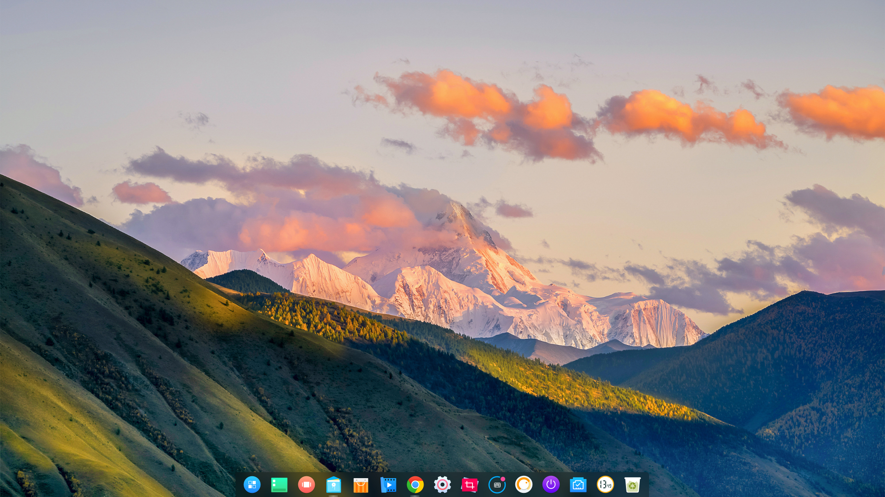

### Bienvenida

Cuando inicie sesión en Deepin después de una instalación correcta, se iniciará automáticamente un programa de bienvenida. Puede ver el vídeo de introducción para profundizar en las nuevas funciones, seleccionar el modo de escritorio y el tema de iconos, habilitar los efectos de ventana y obtener más información sobre deepin.

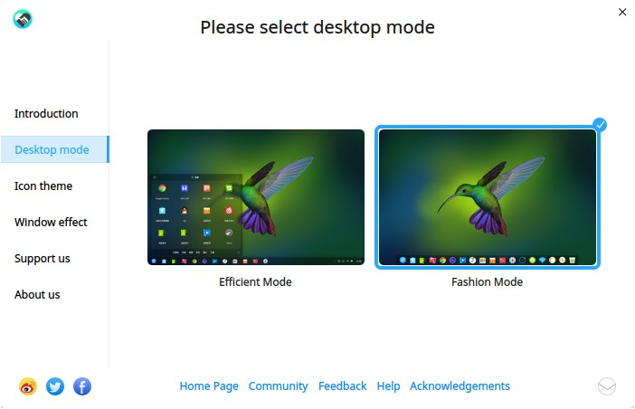

## Escritorio

Puede crear nuevo archivo y nueva carpeta, ordenar archivos, establecer esquinas de acceso rápido (hot corners) y fondos de pantalla, etc. en el escritorio.

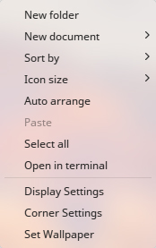

### Crear nuevo archivo/nueva carpeta
Puede crear nueva carpeta, archivar documentos, o hacer operaciones en general para el escritorio, como lo haría en el gestor de archivos.

- Clic derecho en el escritorio y seleccione **Nueva carpeta**; luego, nómbrala.
- Clic derecho en el escritorio y seleccione **Nuevo documento**, seleccione cual tipo e ingrese su nombre.

<table class="block1">
<tbody>
    <tr>
        <td width="20px">Abrir con</td>
        <td width="100px">Selecciona el software predeterminado u otro para abrir el archivo.</td>
    </tr>
    <tr>
        <td>Cortar</td>
        <td>Selecciona uno o varios archivos/carpetas y muévelas a otra ubicación.</td>
    </tr>
    <tr>
        <td>Copiar</td>
        <td>Selecciona uno o varios archivos/carpetas y cópialas a otra ubicación.</td>
    </tr>
    <tr>
        <td>Renombrar</td>
        <td>Selecciona un archivo/carpeta para renombrar.</td>
    </tr>
    <tr>
        <td>Eliminar</td>
        <td>Selecciona un archivo/carpeta para eliminar.</td>
    </tr>
    <tr>
        <td>Comprimir/Extraer</td>
        <td>Selecciona un archivo/carpeta para comprimir, o extrae un archivo ya comprimido.</td>
    </tr>
    <tr>
        <td>Crear enlace</td>
        <td>Selecciona un archivo/carpeta para crear un enlace.</td>
    </tr>
    	<tr>
        <td>Etiqueta informativa</td>
        <td>Selecciona un archivo/carpeta para añadir una etiqueta.</td>
    </tr>
    <tr>
        <td>Propiedades</td>
        <td>Revisa la información básica de un archivo/carpeta, cambia los permisos y sus opciones para abrirlos.</td>
    </tr>
</tbody>

 </table>

### Ordenar archivos
Puede ordenar los archivos en el escritorio acorde a sus necesidades.

1. Clic derecho al escritorio.
2. Clic en **Ordenar por**, puede escoger:

 - Clic en  **Nombre** para mostrar archivos en orden alfabético.
 - Clic en **Fecha de modificación** para mostrar archivos en orden de la fecha de modificación.
 - Clic en **Tamaño** para mostrar archivos en orden de tamaño.
 - Clic en **Tipo** para mostrar archivos ordenados por su tipo.

> : También, puede usar la opción **Organizar automáticamente**, los iconos del escritorio serán ordenados automáticamente, y cuando algunos de los iconos son retirados, otros serán reubicados en el espacio faltante.

### Ajustar tamaño del icono

1. Clic derecho al escritorio.
2. Clic en **Tamaño de icono**, puede escoger:

 - Clic en **Minúsculo** para mostrar iconos en un tamaño minúsculo.

 - Clic en **Pequeño** para mostrar iconos en un tamaño pequeño o reducido.

 - Clic en **Mediano**  para mostrar iconos en un tamaño mediano o normal.

 - Clic en **Grande**  para mostrar iconos en un tamaño grande.

 - Clic en **Enorme**  para mostrar iconos en un tamaño enorme o gigantesco.

> : Presiona  + / para ajustar el tamaño del icono del escritorio y su lanzador.

### Ajustes de pantalla
Puede establecer la resolución de pantalla, brillo y otros.

1. Clic derecho en el escritorio.
2. Clic en **Configuración de pantalla** para abrir la interfaz de configuración de pantalla desde el Centro de control.

> : Para operaciones específicas véase [Configuración de pagada](#Configuración de pantalla).

### Estabelce esquinas de acceso rápido
Una esquina de acceso rápido (***hot corner***) simplifica las actividades y le ayuda a acceder la interfaz principal rápidamente.

1. Clic derecho en el escritorio.
2. Clic en **Configuración de esquinas**, entonces toda la pantalla se oscurecerá y las funciones de acceso rápido serán mostradas entre las cuadro esquinas.
3. Mueve el puntero del raton a la esquina y seleccione una opción para configurar la esquina.
4. Clic en zona vacía del escritorio para salir.

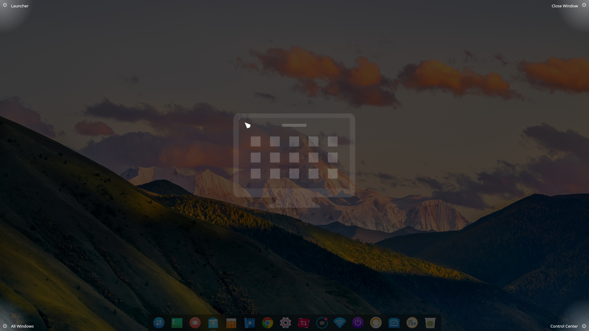

> : Por favor, presta atención a la animación al configurar las esquinas.

### Establecer fondo de pantalla
Puede seleccionar algunos elegantes y atractivos fondos de pantalla (***wallpapers***) para embellecer el escritorio y hacer más distintivo.

1. Clic derecho al escritorio.
2. Clic en **Establecer fondo de pantalla** para previsualizar todos los fondos de pantalla debajo del escritorio.
3. Selecciona uno y aplícalo en el escritorio y la pantalla de bloqueo.
4. Puede escoger **Solo escritorio** o **Solo pantalla de bloqueo**.

### Arrastrar y soltar en iconos

Puede arrastrar y soltar iconos a la ubicación que prefieras en el escritorio:
- Arrastra y suelta el icono entre dos iconos, el icono será mostrado entre ambos;
- Arrastra y suelta al programa para abrir el archivo con el programa;
- Arrastra y suelta a la Papelera para mover a la Papelera;
- Arrastra y suelta a la carpeta para mover el archivo a la carpeta.

## Muelle
El muelle es mostrado comúnmente debajo del escritorio para ayudarle a abrir aplicaciones de uso frecuente, que incluye el lanzador, iconos de aplicaciones, bandeja, botón de apagado, fecha y hora del sistema, etc.

### Iconos de muelle
Puede crear atajos de la aplicación en el muelle del lanzador y realizar operaciones de las aplicaciones.

<table class="block1">
    <caption>Descripción de los iconos</caption>
    <tbody>
        <tr>
            <td></td>
            <td>Clic para entrar a la interfaz del Lanzador</td>
            <td class="blank"></td>
            <td></td>
            <td>Clic para abrir la Deepin Store (tienda Deepin)</td>
        </tr>
        <tr>
            <td></td>
            <td>Clic para abrir Deepin Movie</td>
            <td class="blank"></td>
            <td></td>
            <td>Clic para abrir el visor de imágenes Deepin</td>
        </tr>
        <tr>
            <td></td>
            <td>Clic para abrir el navegador web</td>
            <td class="blank"></td>
            <td></td>
            <td>Clic para abrir el Centro de Control</td>
        </tr>
        <tr>
            <td></td>
            <td>Clic para abrir el gestor de archivos Deepin</td>
            <td class="blank"></td>
            <td></td>
            <td>Clic para la abrir los ajustes de red</td>
        </tr>
        <tr>
            <td></td>
            <td>Clic para abrir los ajustes de sonido</td>
            <td class="blank"></td>
            <td></td>
            <td>Click to open la Terminal Deepin</td>
        </tr>
        <tr>
            <td></td>
            <td>Muestra la información de la batería, haga clic para apagar el equipo rápidamente</td>
            <td class="blank"></td>
            <td></td>
            <td>Clic para abrir el Calendario Deepin</td>
        </tr>
        <tr>
            <td></td>
            <td>Clic para ajustar rápidamente la conexión inalámbrica</td>
            <td class="blank"></td>
            <td></td>
            <td>Clic para abrir la Papelera</td>
        </tr>
    </tbody>
</table>

> : Cuado estás usando la computadora de escritorio, el icono solo se mostrará como ; si estás usando una laptop, el icono mostrará el estado de batería como . Puede mirar el porcentaje de batería moviendo el puntero del ratón sobre el icono, y podrás ingresar a las opciones de apagado haciendo clic en ello.

### Mostrando modos de escritorio
Hay dos modos para mostrar el muelle, las cuales son el modo elegante y el modo eficiente.

- **Modo elegante**: Este modo de escritorio es similar al reconocido Mac OS y se muestra en una bandeja en la parte inferior de la pantalla. Todos los íconos de aplicaciones fijas se mostrarán en el Muelle.

- **Modo eficiente**: Este modo de escritorio es similar a la de Windows 7 y se muestra con una pequeña franja en la parte inferior de la pantalla. Los iconos de aplicaciones fijados en Muelle de forma predeterminada se mostrarán en un tamaño reducido, y los íconos del mismo tipo se fusionarán para ganar más espacio a otras aplicaciones.

Puede cambiar los modos de escritorio mediante las siguientes operaciones:

1. En el escritorio, mueve el puntero del ratón sobre el Muelle.
2. Clic derecho y seleccione el **Modo**.
3. Elige el modo de escritorio.

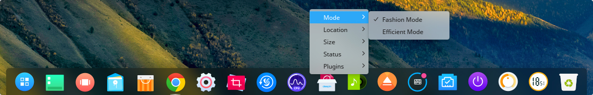

### Establecer la ubicación del Muelle
You can place the Dock on any direction of your desktop.

1. En el escritorio, mueve el puntero del ratón sober el Muelle.
2. Clic derecho y seleccione la **Ubicación**.
3. Elige la ubicación.

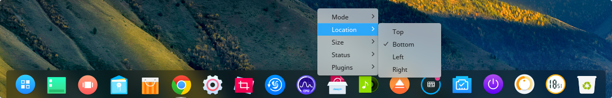

### Ajustar el tamaño del Muelle

1. En el escritorio, mueve el puntero sobre el Muelle.
2. Clic derecho y seleccione el **Tamaño**.
3. Elige el tamaño.

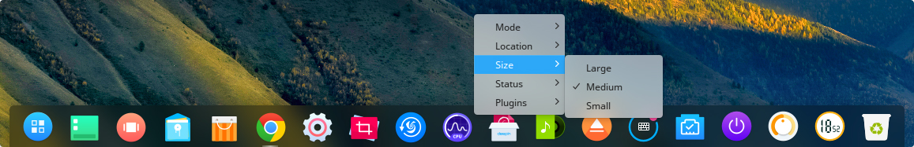

### Mostrar/Ocultar el Muelle

1. En el escritorio, mueve el puntero sobre el Muelle.
2. Clic derecho y seleccione **Estado**.
3. En el submenú, puede:
- Seleccionar **Mantener visible**, el Muelle será mostrado debajo del escritorio todo el tiempo.
- Seleccionar **Mantener oculto**, el Muelle será ocultado y solo se muestra cuando el ratón pasa al Muelle.
- Seleccionar **Ocultado inteligente**, el Muelle se ocultará automáticamente cuando el área del Muelle está ocupado.

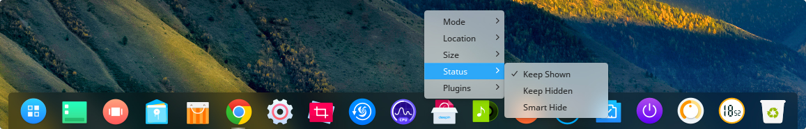

### Mostrar/Ocultar Complementos

1. En el escritorio, mueve el puntero sobre el Muelle.
2. Clic derecho y seleccione **Complementos**.
3. En el submenú puede:
- Marcar **Redes**, el icono de conexión será mostrado en el Muelle.
- Marcar **Energía**, el icono de energía será mostrado en el Muelle.
- Marcar **Sonido**, el icono de sonido será mostrado en el Muelle.
- Marcar **Fecha y hora**, el icono de fecha y hora será mostrado en el Muelle.

> : Uncheck the plugin icon, it will be hidden on Dock.

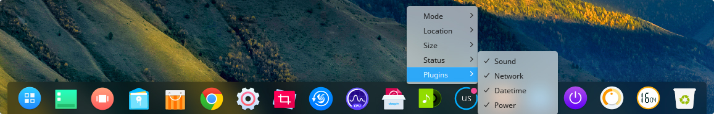

### Interfaz de apagado
Hay dos formas de apagar el equipo:

1. Clic en el icono de la batería del Muelle.
2. Clic en el icono de batería en la parte inferior derecha del modo eficiente.

En el escritorio, haga clic en el icono  del Muelle.

<table class="block1">

    <tbody>
        <tr>
            <td width="30px">Apagar</td>
            <td width="100px">Clic en  en la Interfaz de apagado o presiona  en el teclado.</td>
        </tr>
        <tr>
            <td>Reiniciar</td>
            <td>Clic en  en la Interfaz de apagado, volverá a iniciar su computadora después de apagarse</td>
        </tr>
        <tr>
            <td>Suspender</td>
            <td>Clic en  en la Interfaz de apagado, todo el sistema se ejecutará con bajo consumo.</td>
        </tr>
        <tr>
            <td>Bloquear</td>
            <td>Clic en  en la Interfaz de apagado o presione la combinación de teclas + en el teclado.</td>
        </tr>
        <tr>
            <td>Cambiar usuario</td>
            <td>Click on  en la Interfaz de apagado, para usar otra cuenta de usuario con que ingresar.</td>
        </tr>
        <tr>
            <td>Cerrar sesión</td>
            <td>Clic en  en la Interfaz de apagado, para finalizar la cuenta actual al cerrar sesión.</td>
        </tr>
        <tr>
            <td>Iniciar monitor del sistema system monitor</td>
            <td>Clic en  en la Interfaz de apagado, para iniciarto start system monitor.</td>
    </tbody>
 </table>

> : el icono  será mostrado cuando hay varias cuentas de usuario en el sistema. Después de estas operaciones, debe ingresar la contraseña de la cuenta correspondiente en la pantalla de inicio de sesión y presionar  o hacer clic en  para ingresar al sistema.

### Papelera
Puede encontrar todos los archivos eliminados que serían recuperados o descartados.

> : Usando el modo elegante, la Papelera será mostrada en el Muelle, su cambias al modo eficiente, puedes abrirla desde el Lanzador o creando un atajo en el escritorio.

#### Restaurar archivos
Puede recuperar archivos eliminados realizando las siguientes acciones:

1. Seleccione el archivo a restaurar en la papelera.

2. Clic derecho en el archivo y seleccione **Restaurar**.

3. El archivo estará en su ruta original.

> : Para restaurar el archivo/carpeta ya eliminado, pulse  +   para deshacer.

> : Si la ruta original ya no existe, creará automáticamente las carpetas.

#### Vaciar la Papelera
Vaciar la papelera liberará más espacio útil al disco duro.

1. En la Papelera, haga clic derecho en el área en blanco.
2. Seleccione **Vaciar papelera** para eliminar por completo todos los archivos de la Papelera.

## Lanzador
El Lanzador puede ayudarle a gestionar todas las aplicaciones instaladas, puede acceder rápidamente las aplicaciones que necesita mediante la navegación por categorías o la función de búsqueda.

> : Puede ver las aplicaciones recién instaladas en el lanzador con un punto azul después de nombrarlas.

### Cambio de modalidad

* Los usuarios pueden cambiar entre modo de pantalla completa y el modo mini de forma manual. Haga clic en el icono en la esquina superior derecha para cambiar de modo.
* Ambos modos son compatibles con la búsqueda de aplicaciones y el envío al escritorio o al Muelle.
* El modo Mini también admite abrir el Gestor de archivos, el Centro de control y la interfaz de apagado directamente.

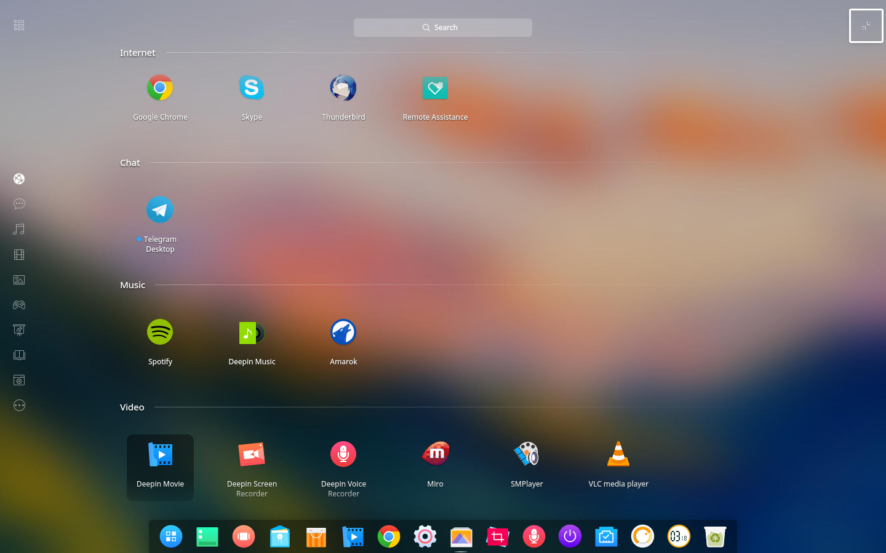
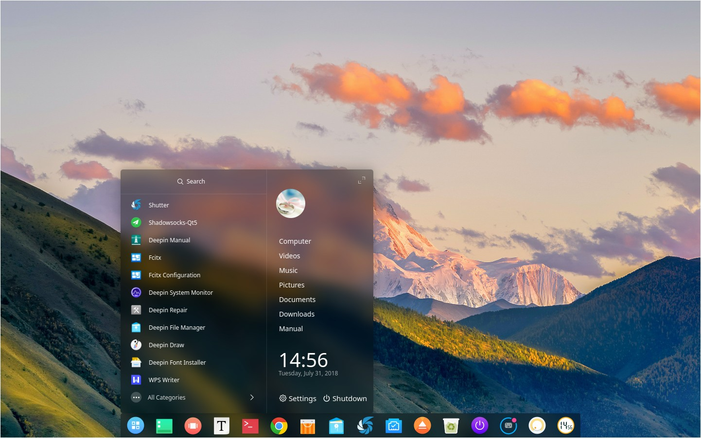

### Sort Applications

In fullscreen mode, all applications in Launcher are displayed by name by default.

- Move the mouse pointer over the application icon, press and hold the mouse left button, then drag and drop to arrange the application icon freely.
- Click on the category icon  on the upper left in Launcher to arrange the icons by categories.

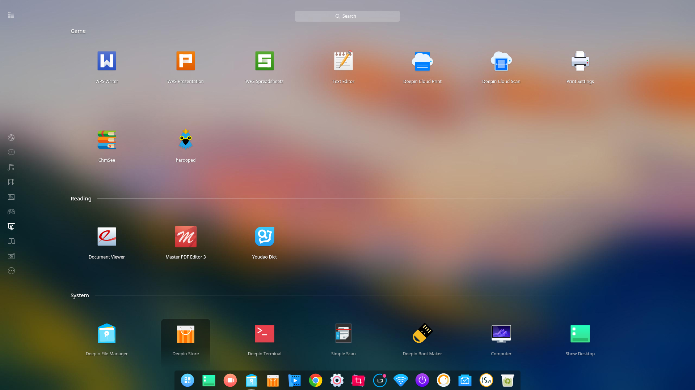

In mini mode,  applications are displayed by use frequency by default.

### Search Applications

In Launcher, scroll up and down the mouse wheel to find the application. You may also locate the application faster with the category navigation.

If you already know the application name, you can locate it even faster by entering the keywords!

1. In Launcher, type in a word such as "deepin" with keyboard.
2. System will automatically search for all applications which contain the keyword "deepin", and then display the searched result in Launcher.

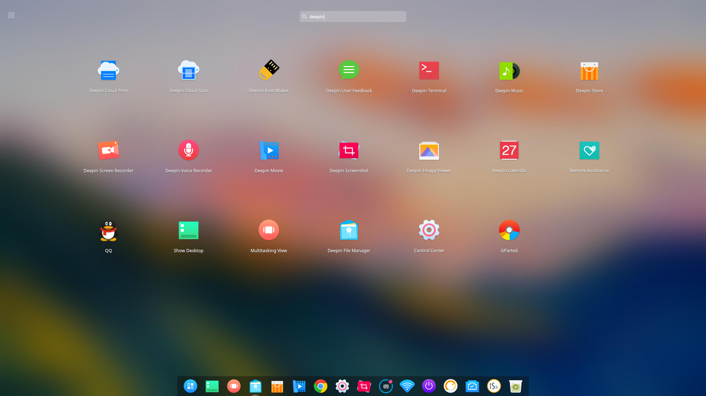

### Set Shortcut
Shortcut is an easy and convenient way to launch applications.

#### Create Shortcut
You can select to send the application to desktop or Dock to facilitate follow-up operations.

1. In Launcher, move the mouse pointer over the application icon.
2. Right click the icon, you can:
   * Click on **Send to desktop** to create a shortcut on desktop.
   * Click on **Send to dock** to fix the application on Dock.
   * Click on **Add to startup** to add the application to startup, it will automatically run when the computer boots.

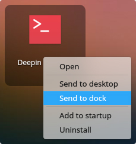

> : You can drag the application icon from Launcher to Dock. But, you can not drag and drop the application while it is running. At this time you can right click the application icon on Dock and select **Dock** to fix. So that you can quickly open it next time.

#### Delete Shortcut
You can delete the application shortcut from desktop, Dock and so on.

1. In Launcher, move the mouse pointer over the application icon.
2. Right click the icon, you can:
   * Click on **Remove from desktop** to delete the shortcut on desktop.
   * Click on **Remove from dock** to remove the application fixed on Dock.
   * Click on **Remove from startup** to remove the application from startup.

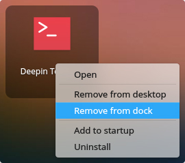

> : Application fixed on Dock can be removed by pressing and holding left mouse button to drag the application icon away from Dock. You can not drag and remove the application while it is running. At this time you can right click on the application icon on Dock and select **Undock** to remove.

### Run Applications
For those whose desktop shortcuts have been created or fixed on Dock, you can open them by the following ways:

- Double click the desktop icon or right click the desktop icon to select **Open**.
- Click the application icon on Dock or right click to select **Open** .

And for those who still is in Launcher, you can open them by:

1. Move the mouse pointer over the application icon.
2. Click the application icon or right click to select **Open**.

### Uninstall Applications
You can choose to uninstall applications you no longer use to save disk space.

1. In Launcher, right click the application icon.
2. Click on **Uninstall**.

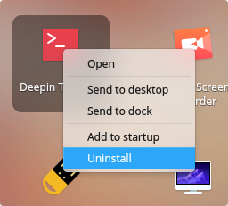

> : In **Fashion mode**, drag the application icon in Launcher fullscreen mode to  on dock to uninstall applications.

## Control Center
You can manage the basic settings of deepin by Control Center. It includes widget, common settings, account management, network settings, date and time, personalization, display settings, system and application update, etc. When you enter Deepin Desktop Environment, you can open the Control Center by moving the mouse pointer to the right bottom corner on desktop.

### Homepage Introduction
The homepage of Control Center displays the common information for users to daily check and quickly set.

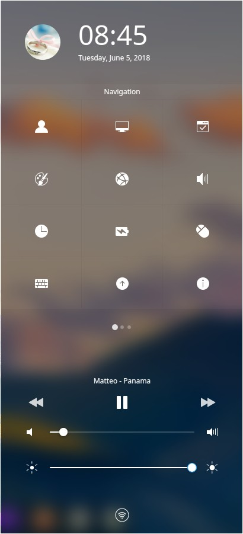

<table class="block1">
    <tbody>
        <tr>
            <td>1</td>
            <td width="80px">Top Info Bar</td>
            <td>Display the account avatar, current date and time.</td>
        </tr>
        <tr>
            <td>2</td>
            <td>Application Widget Area</td>
            <td>Display the setting navigation of Control Center, weather info and notification list.</td>
        </tr>
        <tr>
            <td>3</td>
            <td>System Widget Area</td>
            <td>Display the widgets of music player, volume and brightness, etc.</td>
        </tr>
        <tr>
            <td>4</td>
            <td>Bottom Tool Bar</td>
            <td>Display Bluetooth, VPN, wireless network,screen projection and multiple screen settings, etc.</td>
        </tr>
    </tbody>
 </table>

Once you open a setting module in Control Center, the navigation bar appears on the left. Click the icon to quickly switch to other settings.

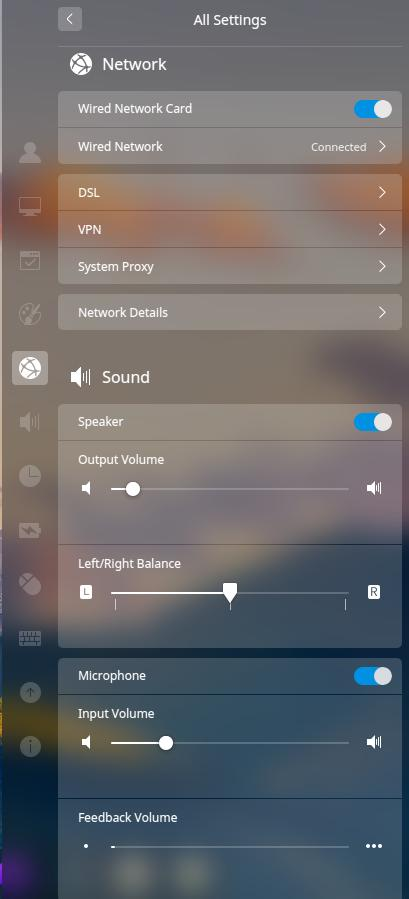

### Account Settings
You can protect your privacy and data and get security protection by setting accounts.

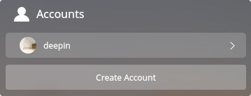

#### Create New Account

1. On the homepage of Control Center, click on .
2. Click on **Create Account**.
3. Input the new user's name, type password twice.
4. Click on **Create**.
5. Input password on the auth page and the new account will be added to the account list.

#### Modify Account Avatar

1. On the homepage of Control Center, click on .
2. Click on an existed account in the list.
3. Click on **Modify Avatar** to enter the interface for modifying avatar.
4. Select a default avatar or local avatar to finish.

> : You can click on the user avatar to directly enter the **Accounts** interface.

#### Modify Account Password

1. On the homepage of Control Center, click on .
2. Click on an existed account in the list.
3. Click on **Modify Password** enter the interface for modifying password.
4. Input new password twice and confirm.

#### Auto Login

1. On the homepage of Control Center, click on .
2. Click on an existed account in the list.
3. Click on **Auto Login** to open auto login function.

#### Login without Password

1. On the homepage of Control Center, click on .
2. Click on an existed account in the list.
3. Click on **Login without password**, you can enter into the system without password.

#### Set Fingerprint Password

1. On the homepage of Control Center, click on .
2. Click on an existed account in the list.
3. Click on **Fingerprint Password** to open auto login function.
4. Click on **Add Fingerprint** to enter the adding interface.
5. Put the finger in fingerprint reader, and then click on **Done** after added successfully.

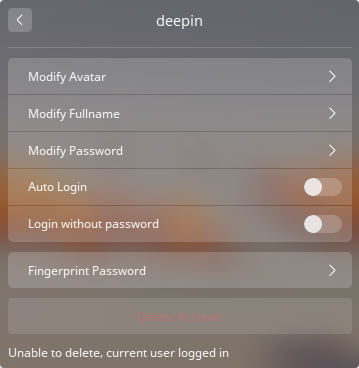

#### Delete Account

1. On the homepage of Control Center, click on .
2. Click on an existed account in the list.
3. Click on **Delete Account** .
4. In the confirm interface, click on **Delete**.

> : The current login user can not be deleted.

### Configuración de pantalla
Your computer can reach the best performance by setting its resolution, direction and extend screens of the monitor(s).

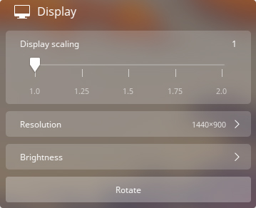

#### Single Screen Settings
You can adjust the visual perception by setting the screen resolution, brightness and so on.

##### Set Display Scaling

1. On the homepage of Control Center, click on .
2. Click on the scaleplate to adjust the display scaling (1, 1.25, 1.5, 1.75, 2.0).
3. It will take effect after reboot.

> : When HiDPI screen is detected, the display scaling will be automatically switched.

> : Some applications do not support display scaling, you can right click it in Launcher and select **Disable display scaling** to get better display effect.

##### Set Resolution

1. On the homepage of Control Center, click on .
2. Click on **Resolution** to enter the interface for resolution settings.
3. Select the proper resolution in the list.

##### Set Brightness

1. On the homepage of Control Center, click on .
2. Click on **Brightness** to enter the interface for brightness settings.
   - Enable **Night Shift**, the screen tone will be auto adjusted by help of figuring out your location.

##### Set Screen Direction

1. On the homepage of Control Center, click on .
2. Click on **Rotate** to rotate the screen.
3. Everytime you click the mouse, the screen will rotate 90 degrees clockwise.
4. Click on the right mouse button to exit the rotate screen interface.

#### Multiple Screen Settings
Widen your horizon by multiple screens! You can use VGA cable to connect your computer to other display devices.

1. On the homepage of Control Center, click on .
2. Select an multiple screen mode:
   - **Copy** to copy the setting of main screen to others.
   - **Extend** to extend the display area of main screen.
   - **Only Displayed on xxx** to display screen content only on xxx screen.
   - **Custom Settings** to add custom settings in Control Center.

##### Custom Settings

1. On the homepage of Control Center, click on .
2. Click on **Custom Settings**.
3. Set custom settings on the popup menu.
4. Click on **Apply**.

#### Screen Projection

1. On the homepage of Control Center, click on  to open the display settings.
2. Move the mouse pointer to .
3. Select the device to project.
4. There will be a icon followed the device name, click again to cancel projection.

> : Screen projection needs the support from NIC, so WIFI will be disconnected when screen projection is enabled.

### Default Application Settings
When installed multiple applications in the same type, you can choose one of them to be the default application to run.

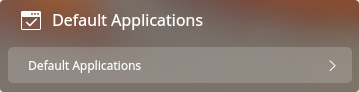

#### Select Default Applications

1. On the homepage of Control Center, click on .
2. Click on **Default Applications** to enter the settings interface for modifying default applications.
3. Select the applications in the list.

#### Add Default Applications

1. On the homepage of Control Center, click on .
2. Click on **Default Applications** to enter the settings interface for modifying default applications.
3. Click on **Add** in different types:
   - When you selected a *.desktop file for default application, the icon and name will be added to the list automatically.
   - When you selected a specified binary file, the icon, name and path will be added to the list automatically.

> : The type lists will show an **Edit** button at right when user has added default applications.

#### Delete Default Applications

System default applications cannot be deleted, if you wanted to delete an installed application from the list, you can only uninstall this application.

1. On the homepage of Control Center, click on .
2. Click on **Default Applications** to enter the settings interface for modifying default applications.
3. Click on **Edit** to delete the added default applications.
4. Click on **Delete**.

### Personalization Settings
You can change the appearance of desktop by using different desktop icons, window style and font, etc. and set it to fit your needs.

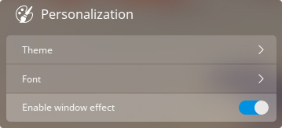

#### Set Theme
You can set the window theme, icon theme and cursor theme of the system respectively.

1. On the homepage of Control Center, click on .
2. Click on **Theme** to enter the interface for setting themes.
- In window theme list, select a window style to switch.
- In icon theme list, select a icon style to switch.
- In cursor theme list, select a set of cursor to switch.

#### Set Font

1. On the homepage of Control Center, click on .
2. Click on **Font** to enter the interface for setting fonts.
3. Set the font type and size for the system.

#### Enable Window Effect

1. On the homepage of Control Center, click on .
2. Click on **Enable window effect** to enable the window effect.
3. Click again to disable.

### Bluetooth Settings
You can do short distance wireless communication by Bluetooth by connecting to other Bluetooth devices. Common Bluetooth devices are Bluetooth keyboard, Bluetooth mouse, Bluetooth earphones and Bluetooth speakers, etc.

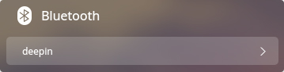

> : Most laptops have Bluetooth module, you just need to enable it, but most desktop computers do not have it, you can purchase one adapter and plug it into USB port to get the function.

#### Enable Bluetooth

1. On the homepage of Control Center, click on .
2. Click on **Bluetooth** to enter the interface for setting Bluetooth.
3. Turn on the Bluetooth switch to enable the Bluetooth adapter.

#### Bluetooth Name

1. On the homepage of Control Center, click on .
2. Click on **Bluetooth** to enter the interface for setting Bluetooth.
3. Click on the edit icon near the Bluetooth name, enter the new name.

> : After successfully modified the name, the Bluetooth adapter will broadcast its new name, other devices need to search for the new name.

#### Bluetooth Device

1. On the homepage of Control Center, click on .
2. Click on **Bluetooth** to enter the interface for setting Bluetooth.
3. In **Other Devices** list, the system will scan the nearby devices and auto connect them.
4. The device will be added to the **My Device** list after successfully connected.
5. In **My Device** list, you can **Disconnect** and **Ignore this Device**.

### Network Settings
Experience the enjoyment of surfing the Internet! You can browse news, play video online or do file download, chat and shopping, etc.

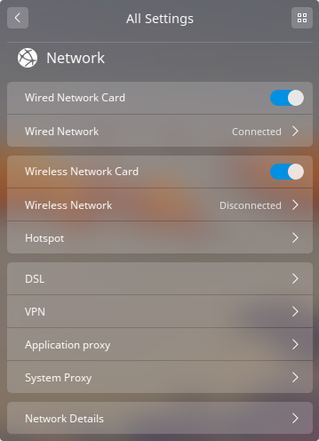

#### Wired Network

1. Plug the cable into the network slot on computer.
2. Plug another end of the cable into the router or network port.
3. On the homepage of Control Center, click on .
4. Turn on **Wired Network Card** switch to enable wired network.
5. After successfully connected to the network, it will prompts "Wired Connection Connected".

#### Wireless Network

##### Connect to Wi-Fi Network

1. On the homepage of Control Center, click on .
2. Turn on **Wireless Network Card** switch to enable wireless network.
3. Click on **Wireless Network** to enter wireless network list.
4. The computer will auto search the nearby available wireless network.
5. Select the wireless network to connect.
- If the network is opened, it will auto connect to the network.
- If the network is encrypted, please enter the password and click on **Connect** to finish the work.

##### Connect to Hidden Network

1. On the homepage of Control Center, click on .
2. Turn on **Wireless Network Card** switch to enable wireless network.
3. Click on **Wireless Network** to enter wireless network list.
4. Click on **Connect to Hidden Network** to enter the interface for connecting to the hidden network.
5. Enter the name of the network and choose the encrypt method, then enter the password.

#### Hotspot

1. On the homepage of Control Center, click on .
2. Click on **Hotspot** to enter hotspot interface.
3. Click on the switch to enable or disable hotspot.
4. Click on **Hotspot Settings** to view the details or custom name and password.

#### Mobile Network

1. Plug the mobile network card to the USB port.
2. On the homepage of Control Center, click on .
3. The system will auto connect to the network based on the mobile network card and operator info.
4. Click on **Mobile Network** to view the detailed settings info.

#### DSL/PPPoE Connections

##### Create New DSL/PPPoE Connection

1. On the homepage of Control Center, click on .
2. Click on **DSL**.
3. Click on **Create PPPoE Connection**.
4. Enter the name, account and password.
5. Click on **Save** and the system will create the connection and try to connect to it.

##### Set DSL/PPPoE Connection

1. On the homepage of Control Center, click on .
2. Click on **DSL**.
3. Click on **PPPoE Connection** to enter the interface for setting DSL/PPPoE connections.
4. Modify name, account, password, open automatically connect, set IP address or open other auth services.

#### VPN

1. On the homepage of Control Center, click on .
2. Click on **VPN** and **Create VPN** to enter the interface for creating VPN connections.
3. After created a VPN, you can click on **Export** to export the configured file.
  You can also click on **Import VPN** to import the existed VPN file.

> : If you don't want to use the VPN as the default routing, click on **Only applied in corresponding resources**.

#### Application Proxy

1. On the homepage of Control Center, click on .
2. Click on **Application Proxy** to enter the interface for setting application proxy.
- Click on **Proxy Type** to select the proxy type.
- Fill in IP address, port, username, and password.
3. Click on **Confirm** to save and click on **Cancel** to return to previous interface.

> : After configured, right click on an application in Launcher to check **Open by proxy**, then the application will be opened by proxy.

#### System Proxy

1. On the homepage of Control Center, click on .
2. Click on **System Proxy** to enter the interface for setting system proxy.
- Click on **None** to disable the proxy function.
- Click on **Manual** and enter the address and port for proxy servers.
- Click on **Auto** and enter URL to let the system configure the proxy info automatically.

#### Network Info

1. On the homepage of Control Center, click on .
2. Click on **Network Details** to enter the network info interface.
3. View the network info for current wired or wireless network.

### Sound Settings
Set your speaker and microphone to let you hear more comfortable and sing better.

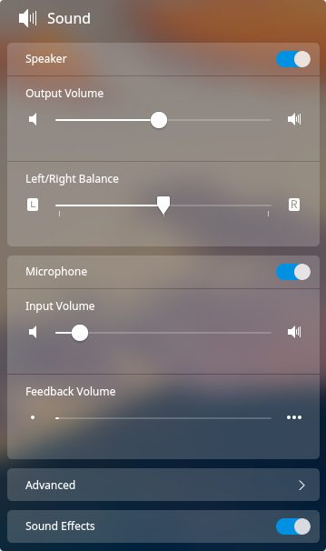

#### Set Speaker

1. On the homepage of Control Center, click on .
2. Turn on **Speaker** switch to enable the speaker.
3. Adjust the output volume and left right balance.

#### Set Microphone

1. On the homepage of Control Center, click on .
2. Turn on **Microphone** switch to enable the microphone.
3. Adjust the input volume.

#### Set System Sound Effect

1. On the homepage of Control Center, click on .
2. Turn on **Sound Effects** switch to enable sound effects.

#### Advanced Settings

1. On the homepage of Control Center, click on .
2. Click on **Advanced**.
3. Select input and output mode.

### Date and Time

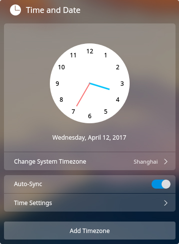

#### Auto Sync

1. On the homepage of Control Center, click on .
2. Turn on **Auto-Sync** switch to enable time sync function.
3. The system will auto sync the time and date based on local timezone and remote time.

#### Set Date and Time
Set the date and time manually to disable the auto sync function.

1. On the homepage of Control Center, click on .
2. Click on **Time Settings** button to set the time manually.
3. Enter the correct date and time.
4. Click on **Confirm**.

#### Add Timezone

1. On the homepage of Control Center, click on .
2. Click on **Add Timezone**.
3. Select a timezone by searching or clicking on the map.
4. Click on **Confirm**.

#### Edit Timezone List

1. On the homepage of Control Center, click on .
2. Click on the **Edit** in the end of the timezone list.
3. Click on the delete button to remove an added timezone.

### Power Management

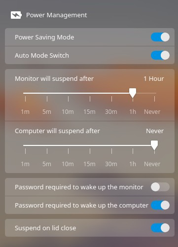

#### Set Power Saving Mode
To reduce the power consumption of laptop, you can turn on power saving mode.
1. On the homepage of Control Center, click on .
2. Turn on **Power Saving Mode** switch to enter power saving mode.
3. Click on **Auto Mode Switch**, your laptop will enter power saving mode automatically when unplug, and recover to normal mode when plug in.

> : Power saving mode is only for laptop.

#### Set Monitor Suspend Time

1. On the homepage of Control Center, click on .
2. Set the monitor suspend time.

#### Set Lock Time After Suspend

1. On the homepage of Control Center, click on .
2. Set the computer suspend time.

#### Security Settings

1. On the homepage of Control Center, click on .
2. Click on **Password required to wake up the monitor**/**Password required to wake up the computer** switch to enable security settings.

> : There is an option for laptop, named **Suspend on lid close**, you can set it by your needs.

### Mouse and Touchpad

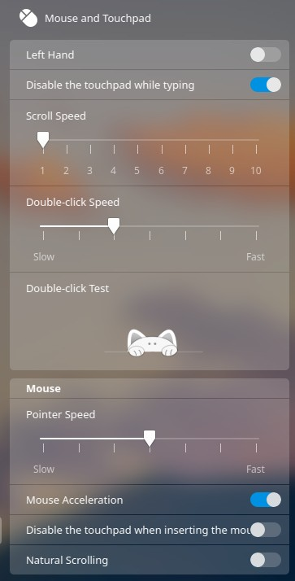

1. On the homepage of Control Center, click on .
2. Click on **Left Hand** / **Mouse Acceleration** / **Natural Scrolling** switch to enable functions.
3. Adjust **Scroll Speed**, **Double-click Speed** and **Pointer Speed**.

> : **Left Hand** switches the left and right mouse button, and Natural Scrolling is the scrolling function behaved as in Mac OS.

> : **Mouse Acceleration** is a form of pointer acceleration that determines how fast the pointer moves in response to movements of the mouse or finger on a touchpad. It can make your pointer more precise in some situations, but it can make the pointer less precise in many others.

You can enable **Disable the touchpad while typing**, **Disable the touchpad when inserting the mouse**, **Palm Detect** on laptop, and set **Minimun contact surface** and **Minimum pressure value** to avoid misopreation on touchpad.

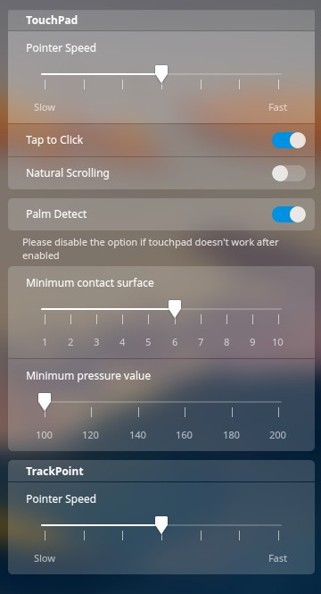

### Keyboard and Language
You can choose your keyboard and its layout for different countries and regions or view, search, modify and custom shortcuts.

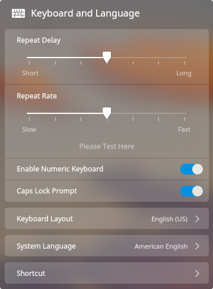

#### Set Keyboard Properties

1. On the homepage of Control Center, click on .
2. Adjust **Repeat Delay**/**Repeat Speed**.
3. Click on **Please Test Here** to test the effect.
4. Click on **Caps Lock Prompt** switch to enable the function.

#### Set Keyboard Layout
The system default keyboard layout is US keyboard, but you can add other layouts.

##### Add Keyboard Layout

1. On the homepage of Control Center, click on .
2. Click on **Keyboard Layout** to enter the interface for setting layouts.
3. Click on **Add Keyboard Layout**.
4. Search the keyboard layout you want to add.

##### Delete Keyboard Layout

1. On the homepage of Control Center, click on .
2. Click on **Keyboard Layout** to enter the interface for setting layouts.
3. Click on **Edit** > **Delete** on the keyboard layout to delete it.

##### Switch Keyboard Layout

1. On the homepage of Control Center, click on .
2. Click on **Keyboard Layout** to enter the interface for setting layouts.
3. Select a Layout to switch.
4. When successfully switched a layout, it will display the selected layout.

#### Set System Language

1. On the homepage of Control Center, click on .
2. Click on ** System Language** to enter the interface for choosing system language.
3. Select or search the language to switch and the system will install the language package automatically.
4. The selected language will be displayed after successfully installed.

> : The keyboard layout could also be changed by switching the system language. Please make sure that you used a correct layout to enter the password when restarted the system.

#### Set Shortcuts
##### View Shortcuts

1. On the homepage of Control Center, click on .
2. Click on **Shortcut** to enter the interface for setting the shortcuts.
3. You can view the default shortcuts for system, window and workspace.

##### Search Shortcuts

1. On the homepage of Control Center, click on .
2. Click on **Shortcut** to enter the interface for setting the shortcuts.
3. Enter keywords on the top search box and it will show all the found shortcuts.

##### Modify Shortcuts

1. On the homepage of Control Center, click on .
2. Click on **Shortcut** to enter the interface for setting the shortcuts.
3. Click on the shortcut you want to modify.
4. Enter new shortcuts by keyboard.

> : If you want to disable a shortcut, please press  on keyboard.

##### Custom Shortcuts

1. On the homepage of Control Center, click on .
2. Click on **Shortcut** to enter the interface for setting the shortcuts.
3. Click on **Add Custom Shortcut** to enter the interface for adding shortcuts.
4. Enter the name, related command and shortcut.
5. When successfully added a shortcut, you can click on **Edit** > **Delete** on the custom shortcut to delete it.

### Update Settings
You can check the updates for system and applications, and also can modify mirror, upgrade the system and applications.

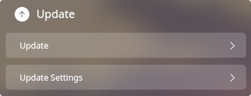

#### Detect System Source

Enable **System source detection**, once you switch the mirror, you will get the prompt notifying that "Your system source has been modified".

#### Auto Download Updates

1. On the homepage of Control Center, click on .
2. Click on **Update Settings** to enter the detailed interface.
3. Click on **Auto-download Updates** to enable the function.
4. When there are system updates, it will prompt a message.

#### Auto Clear Package Cache

1. On the homepage of Control Center, click on .
2. Click on **Update Settings** to enter the detailed interface.
3. Click on **Auto clear package cache**.
4. The system cache will be auto cleared.

#### Switch Mirror

1. On the homepage of Control Center, click on .
2. Click on **Update Settings** to enter the detailed interface.
3. Click on **Switch Mirror** to enter the switching mirror interface.
4. The system will detect the connecting speed.
5. Switch to a new mirror to refresh the package list.

#### Update and Upgrade

1. On the homepage of Control Center, click on .
2. Click on **Update** to check the current system status.
- It will prompt "Your system is up to date " when there is no update.
- It will show **Download and install updates** button, size and detailed information if there's an update.
4. Click the button to download and install updates.
5. After updated successfully, shutdown or reboot your computer to make the updates come into effect.

> : There will be a progress bar during the update, and you can choose to download in background or pause.

### System Info
You can view system version, hardware info or set boot menu.

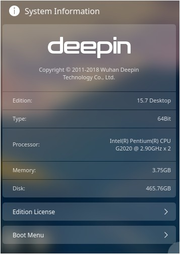

#### View System Info

1. On the homepage of Control Center, click on .
2. Under **System Information**, you can:
- View current system version.
- View current system type, 64Bit/32Bit.
- View CPU brand.
- View memory size.
- View hard disk capacity.

#### View Copyright License

1. On the homepage of Control Center, click on .
2. Click on **License** to enter the License interface.
3. View detailed information of GNU License.

#### Set Boot Menu

- When there are multiple systems in computer, the startup delay switch will open automatically, the boot menu will show 5 seconds to let users adjust boot order.
- When there is only one system in computer, the startup delay switch will close by default, the boot menu will show 1 second, and it is no need to adjust boot order.

##### Default Boot System

1. On the homepage of Control Center, click on .
2. Click on **Boot Menu** to enter the boot menu interface.
3. Click to select boot entry and drag and drop to adjust boot order.

##### Boot Splash Background

1. On the homepage of Control Center, click on .
2. Click on **Boot Menu** to enter the boot menu interface.
3. Press and hold the left mouse button to drag the background image and drop it over the preview image to change the background.

## Window Manager
The Window Manager can show different windows on different workspaces, you can manage the windows by it.

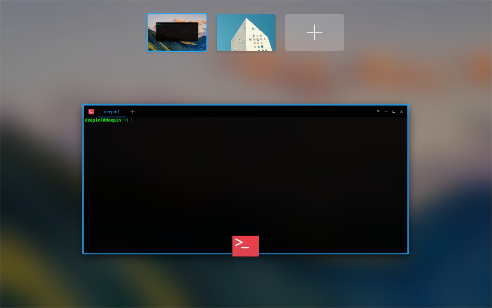

### Open Workspace
Workspace can divide your desktop windows as groups to enlarge your working areas.

On Desktop, press  +  to open the workspace management interface.

#### Switch Windows among Workspaces
On the workspace management interface, all the opened windows in the current workspace will tiled to display.

- Press  to switch to next window.
- Press  +  to switch to the previous window.

#### Move Windows among Workspaces
On the workspace management interface, you can move one window in current workspace to another.

1. Move the mouse pointer to the window and the selected window will show  on the right top corner.
2. Press and hold the left mouse button to drag and drop the window on the specified preview window.
3. Release the left mouse button to finish the moving operation.

#### Close Windows in Workspaces
On the workspace management interface, you can close the opened windows on desktop very quickly.

1. Move the mouse pointer to the window and the selected window will show  on the right top corner.
2. Click on  to close the specified window.

### Add Workspace
On the workspace management interface, you can add workspace by the following ways:

- Click on  at the right of the preview window, and press  .
- Press  +  and press .

When the workspace has reached its limit,  at the right of the preview window will hide automatically, and you cannot add more workspaces. After deleted one workspace,  will show automatically.

> : The window manager supports 7 workspaces at most.

### Switch Workspace
On the workspace management interface and desktop, you can switch workspace by the following ways:

- On Desktop, press  +  /  to switch to Previous/Next workspace.
- On the workspace management interface, scroll up/ down to switch to Previous/Next workspace.
- On the workspace management interface, click on the preview window or press  + **Numeric Keys** to switch to a specified workspace.
- On the workspace management interface, press  /  to switch to Previous/Next workspace directly.

### Delete Workspace
After you delete a workspace, all windows in the workspace will be shown in a nearby workspace. You cannot delete the workspace when there is only one.

- On the workspace management interface, click on  at the right top corner to delete a workspace.
- On the workspace management interface, select a preview window, press and hold the left mouse button and drag it up to delete a workspace.
- On the workspace management interface, everytime you press  + , it will delete the left or right workspace one by one.

### Quit Workspace
After you finished the operations on the workspace management interface, you can quit it by the following ways:

- Press .
- Click on the blank area on the workspace management interface.
- Press  +  again.

### Show Desktop Windows
You can show the desktop windows by the following ways:

- Press  +  to show the windows of all the workspaces.
- Press  +  to show the windows of the current workspace.

### Switch Desktop Windows
You can switch the desktop windows by the following ways:

- On Desktop, press and hold  and press  continually, it will show the right windows one by one; press and hold  +  and press  continually, it will show the left windows one by one.
- On Desktop, press and hold  and press  continually, it will show the same type of the right windows one by one; press and hold  +  and press  continually, it will show the same type of the left windows one by one.

### Move Desktop Windows
You can move the desktop windows to other workspaces by the following ways:

- On Desktop, press  +  +  /  to move current window to the Previous/Next workspace.
- On Desktop, press  +  + **Numeric Keys** to move current window to the specified workspace.
