# 深度桌面环境|../common/deepin-system.svg|

## 概述
深度操作系统是深度科技发行的美观易用、安全可靠的国产桌面操作系统。深度系统预装了Google Chrome、WPS Office、搜狗输入法以及一系列深度特色应用。它既能让您体验到丰富多彩的娱乐生活，也可以满足您的日常工作需要。相信随着功能的不断升级和完善，深度操作系统将会被越来越多的用户所喜爱和使用。

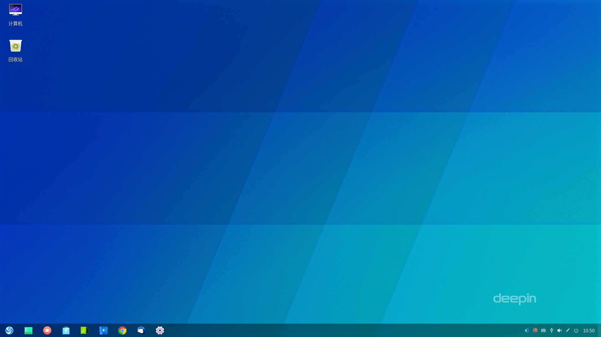

### 系统简介
初次进入深度操作系统，会自动打开欢迎程序。您可以观看视频了解系统的新功能，选择桌面模式和图标主题，开启窗口特效，获得更多关于深度操作系统的知识。
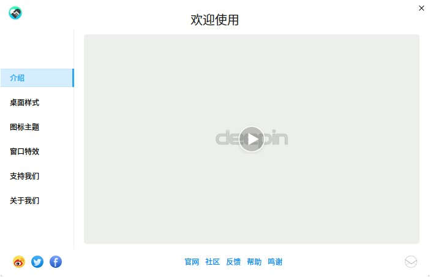

## 桌面
在桌面上可以新建文件/文件夹、排列文件、设置热区、设置壁纸等进行相关操作。

### 新建文件夹/文档
您可以在桌面上新建文件夹以及常用文档，也可以对文件进行常规操作，和在文件管理器中一样。

- 在桌面上，点击鼠标右键，点击 **新建文件夹**，输入新建文件夹的名称。
- 在桌面上，点击鼠标右键，点击 **新建文档**，选择新建文档的类型，输入新建文档的名称。

<table class="block1">
    <tbody>
        <tr>
            <td width="20px">打开方式</td>
            <td width="100px">选定系统默认打开方式，也可以通过选择其他已有的关联应用程序来打开。</td>
        </tr>
        <tr>
            <td>复制</td>
            <td>选定文件或文件夹后，粘贴到指定的目标存储位置。</td>
        </tr>
        <tr>
            <td>剪切</td>
            <td>选定文件或文件夹后，移动到指定的目标存储位置。</td>
        </tr>
    	<tr>
            <td>重命名</td>
            <td>选定文件或文件夹后进行重命名操作。</td>
        </tr>
    	<tr>
            <td>删除</td>
            <td>选定文件或文件夹后进行删除操作。</td>
        </tr>
    	<tr>
            <td>压缩/解压缩</td>
            <td>选定文件或文件夹后进行压缩操作，压缩文件也可以进行解压操作。</td>
        </tr>
    	<tr>
            <td>创建链接</td>
            <td>选定文件或文件夹，创建一个快捷方式。</td>
        </tr>
       	<tr>
            <td>标记信息</td>
            <td>选定文件或文件夹，添加标记信息。</td>
        </tr> 
    	<tr>
            <td>属性</td>
            <td>查看文件或文件夹基本信息，以及更改权限和打开方式。</td>
        </tr>
    </tbody>
 </table>

### 设置排列方式
您可以对桌面上的文件按照需要进行排序。

1. 在桌面上，点击鼠标右键。
2. 点击 **排序方式**，您可以：
  - 点击 **名称**，将按文件的名称顺序显示。
  - 点击 **大小**，将按文件的大小顺序显示。
  - 点击 **类型**，将按文件的类型顺序显示。
  - 点击 **修改时间**，文件将按最近一次的修改日期顺序显示。

> ：您也可以勾选 **自动排列**，桌面图标会自动排列，有图标被删除时后面的图标会自动缩进。

### 设置图标大小
您可以调整桌面图标大小。

1. 在桌面上，点击鼠标右键。
2. 点击 **图标大小**。
3. 选择一个合适的图标大小。

> ：您也可以用  + //鼠标滚动来调整桌面和启动器中的图标大小。

### 设置显示器
您可以通过快速进入控制中心设置显示器的分辨率、亮度。

1. 在桌面上，点击鼠标右键。
2. 点击 **显示设置**，快速进入控制中心显示设置界面。

> ：关于显示的设置，具体操作请参阅 [显示设置](#显示设置)。

### 设置热区
热区是为了简化您的操作，方便您快速进入系统的主要界面。桌面的四个角落默认没有热区，设置后通过热区您可以快速打开启动器和控制中心。

1. 在桌面上，点击鼠标右键。
2. 点击 **热区设置**。
3. 整个屏幕会变暗并且在屏幕的四个角落将显示对应的热区功能。
4. 将鼠标指针置于桌面的某个角落，在选项中重新选择一项。
5. 在桌面的空白处点击一下鼠标，退出热区设置。

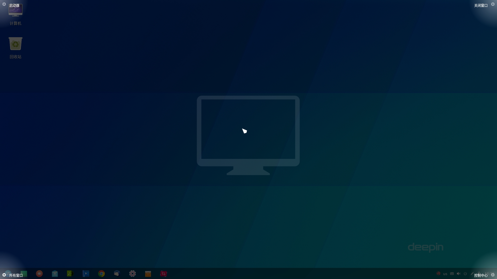

> ：请留意热区设置界面的动画学习热区使用方法，将鼠标移动到屏幕一角并继续向外拖动就可以唤醒对应的热区功能。

### 设置壁纸
您可以选择一些精美、时尚的壁纸来美化桌面，让您的电脑显示与众不同。

1. 在桌面上，点击鼠标右键。
2. 点击 **设置壁纸**，在桌面底部预览所有壁纸。
3. 选择其中的壁纸后，壁纸就会在桌面和锁屏中生效。
4. 可以选择壁纸上出现的 **仅设置桌面** 和 **仅设置锁屏** 来控制壁纸生效范围。

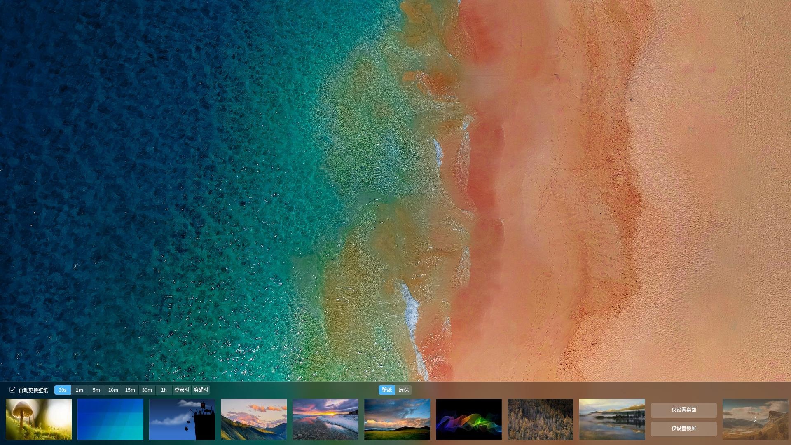

## 任务栏
任务栏是指位于桌面最下方的小长条，主要由启动器、应用程序图标、托盘区、关机按钮、系统时间等组成。

### 任务栏图标
您可以在启动器中将应用图标创建快捷方式到任务栏上，同时对任务栏上的应用程序进行相关操作。

<table class="block1">
    <caption>图标说明</caption>
    <tbody>
        <tr>
            <td></td>
            <td>点击可进入启动器界面</td>
            <td class="blank"></td>
            <td></td>
            <td>点击可打开网页</td>
        </tr>
        <tr>
            <td></td>
            <td>点击可打开深度商店</td>
            <td class="blank"></td>
            <td></td>
            <td>点击可打开文件管理器</td>
        </tr>
        <tr>
            <td></td>
            <td>点击可打开深度看图</td>
            <td class="blank"></td>
            <td></td>
            <td>点击可打开深度影院</td>
        </tr>
       <tr>
            <td></td>
            <td>点击可打开控制中心面板</td>
            <td class="blank"></td>
            <td></td>
            <td>点击可打开回收站</td>
        </tr>
    	<tr>
            <td></td>
            <td>点击可快速进入关机界面</td>
            <td class="blank"></td>
            <td></td>
            <td>点击可打开深度日历</td>
        </tr>
    </tbody>
</table>

> ：在时尚模式下，当您使用台式机电脑时，关机图标显示为，当您使用笔记本电脑时，关机图标显示为。

### 切换显示模式
任务栏提供两种显示模式：时尚模式和高效模式。

- **时尚模式**：任务栏的显示风格类似于Mac OS，以托盘的形式停靠在屏幕下方。任务栏上会显示所有固定在任务栏的应用图标。在时尚模式下，托盘区可以展开或折叠。
- **高效模式**：任务栏的显示风格类似于Windows 7，以小长条的形式显示在屏幕下方。固定在任务栏上的应用图标默认为小图标显示。点击任务栏的最右边可以显示桌面。

您可以通过以下操作来切换显示模式：

1. 在桌面上，将鼠标指针置于任务栏图标以外区域。
2. 点击鼠标右键。
3. 在 **模式** 子菜单中选择一种显示模式。

### 设置任务栏位置
您可以将任务栏放置在桌面的任意方向。

1. 在桌面上，右键单击任务栏。
2. 在 **位置** 子菜单中选择一个方向。

### 调整任务栏大小
您可根据个人习惯调整任务栏的大小。

1. 在桌面上，右键单击任务栏。
2. 在 **大小** 子菜单中选择一个大小。

### 显示/隐藏任务栏
您可以将任务栏隐藏起来，最大程度的扩展桌面的可操作区域。

1. 在桌面上，右键单击任务栏。
2. 在 **状态** 子菜单中您可以：
  - 选择 **一直显示**，任务栏将会一直显示在桌面底部。
  - 选择 **一直隐藏**，任务栏将会隐藏起来，只有在鼠标移至任务栏区域时才会显示。
  - 选择 **智能隐藏**，当需要占用任务栏区域时任务栏将会自动隐藏。

### 设置插件显示
1. 在桌面上，右键单击任务栏。
2. 在 **插件** 子菜单中勾选或取消勾选 **电源、网络、声音、时间** ，可以设置电源、网络、声音、时间等插件在任务栏上的显示和隐藏效果。

### 关机界面
您可以通过任务栏中的电源图标进入关机界面进行相关操作，也可以在启动器的小窗口模式中点击电源图标。

在桌面上，点击任务栏上的  图标。

<table class="block1">
    <tbody>
        <tr>
            <td width="30px">关机</td>
            <td width="100px">在关机界面中点击  或按下键盘上的  键。</td>
        </tr>
        <tr>
            <td>重启</td>
            <td>在关机界面中点击 ，关机后再次重新运行您的电脑。</td>
        </tr>
        <tr>
            <td>待机</td>
            <td>在关机界面中点击 ，整个系统将处于低能耗运转的状态。</td>
        </tr>
    	<tr>
            <td>锁定</td>
            <td>在关机界面中点击 或按下键盘上的 + 组合键。</td>
        </tr>
    	<tr>
            <td>切换用户</td>
            <td>在关机界面中点击 ，选择一个用户帐户进行登录。</td>
        </tr>
    	<tr>
            <td>注销</td>
            <td>在关机界面中点击 ，清除当前登录用户的信息。</td>
        </tr>
        <tr>
            <td>启动系统监视器</td>
            <td>在关机界面中点击 ，可以快速启动系统监视器。</td>
        </tr>
    </tbody>
 </table>

> ：当系统用户存在多个账户时才显示 ，点击进入登录界面时，输入登录帐户的对应密码，按下键盘上的  键或点击  即可登录系统。

### 回收站
电脑中临时被删除的所有文件您都可以在回收站中找到，回收站中的文件可以被恢复或清空。

> ：在时尚模式中回收站是固定在任务栏上的，如果您使用的是高效模式可以在启动器中打开回收站，或者在桌面上创建回收站的快捷方式。

#### 还原文件
对于已删除的文件，您可以进入回收站进行恢复操作，或使用  +   还原刚删除的文件。

1. 在回收站中，选择要恢复的文件。
2. 点击鼠标右键，选择 **还原**。
3. 回收站中的文件还原到原来的存储路径下。

> ：如果原来所在的文件夹已经删除，放回原位的过程中自动新建新文件夹。

#### 清空回收站
清空回收站中文件，可以让您的硬盘释放更多的可用空间。

1. 在回收站中，点击鼠标右键。
2. 选择 **清空回收站**，将彻底删除回收站所有内容。

## 启动器
启动器帮助您管理系统中已安装的所有应用，在启动器中使用分类导航或搜索功能可以快速找到需要的应用程序。

> ：如果系统中有新安装的应用，您可以进入启动器中去查看。对于新安装的应用，它的旁边会出现一个小蓝点提示。

### 切换模式
- 启动器有全屏和小窗口两种模式。可以通过点击启动器界面右上角的图标切换模式。
- 两种模式均支持搜索应用、设置快捷方式等操作。
- 小窗口模式还支持快速打开文件管理器，控制中心和快速进入关机界面等功能。

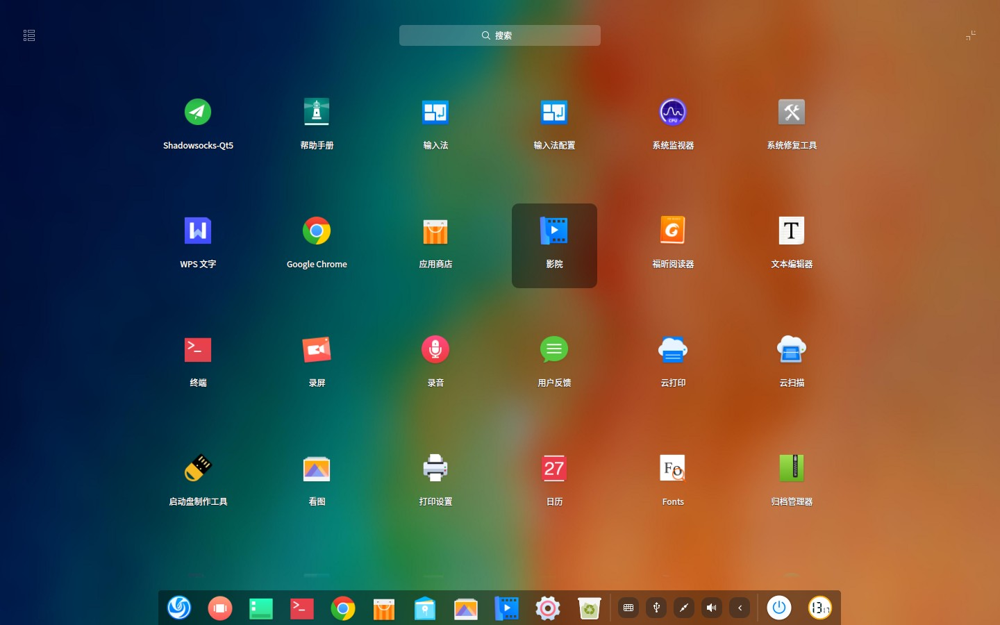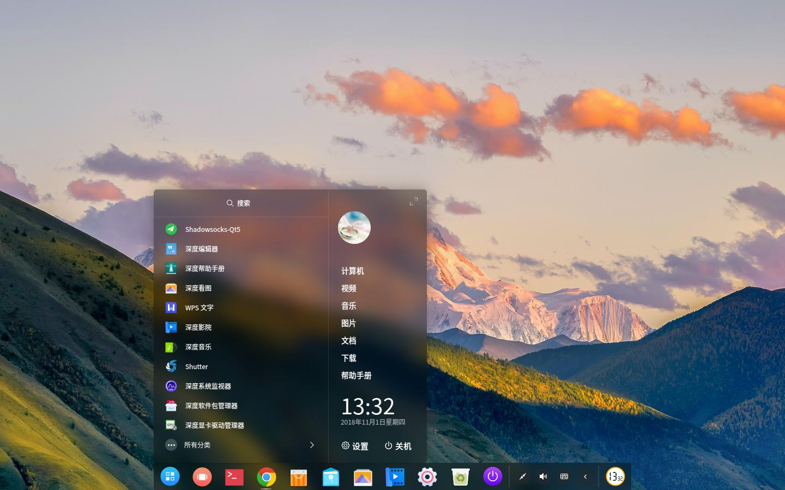

### 排列应用

在全屏模式下，系统默认按照名称排列所有应用。

- 将鼠标悬停在应用图标上，按住鼠标左键不放，将应用图标拖拽到指定的位置自由排列。
- 点击启动器界面左上角分类图标进行排列。

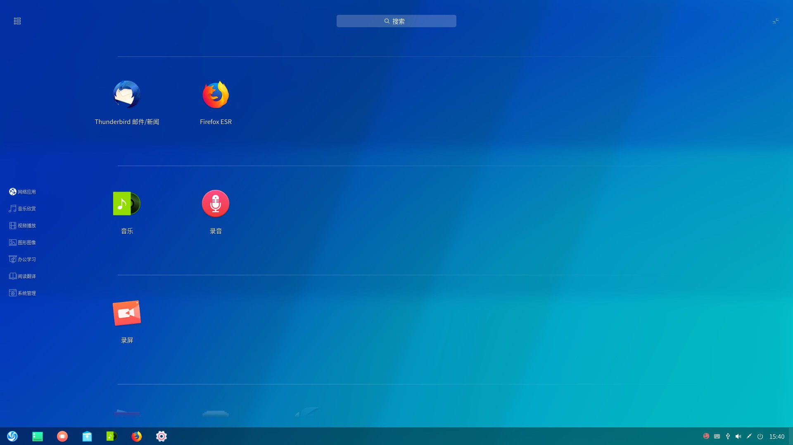

在小窗口模式下，默认按照使用频率排列应用。

### 查找应用

在启动器中上下滚动鼠标滚轮可以找到您需要的应用，您也可以通过切换分类导航来更快的找到需要的应用。

如果您已经知道了应用的名称，通过直接在搜索框中输入关键字快速定位到需要的应用。

1. 在启动器中，通过顶部的搜索框中输入关键字，例如“deepin”。
2. 系统会自动搜索包含关键字“deepin”的所有应用，并且将搜索的结果显示在启动器界面中。

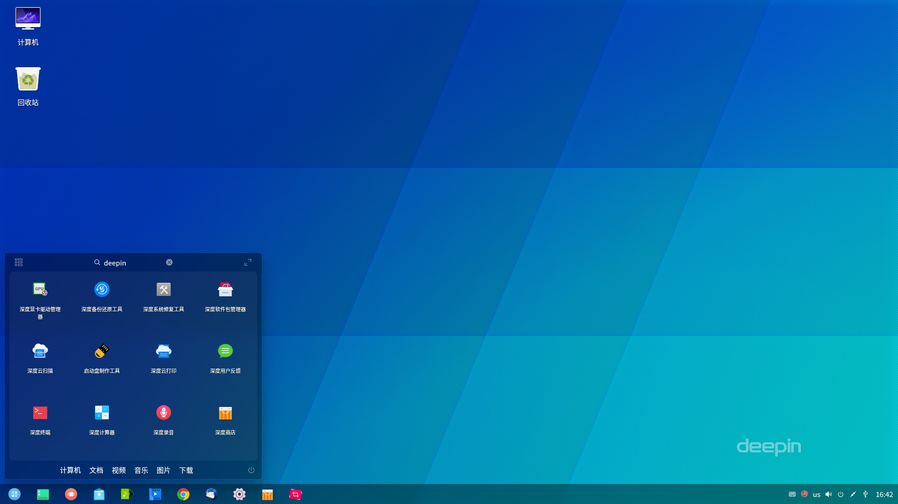

### 设置快捷方式
快捷方式提供了一种简单快捷地启动应用的方法。

#### 创建快捷方式
您可以选择将应用发送到桌面或任务栏上，便捷您的后续操作。

1. 在启动器中，将鼠标指针置于应用的图标上。
2. 右键单击应用图标，您可以：
   - 点击 **发送到桌面**，在桌面创建快捷方式。
   - 点击 **发送到任务栏**，将应用固定到任务栏。
   - 点击 **开机自动启动**，将应用添加到开机启动项，在电脑开机时自动运行该应用。

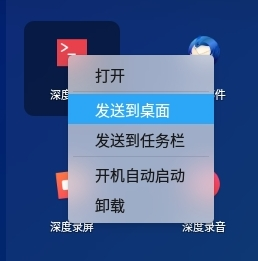

> ：您可以通过鼠标将应用的图标从启动器拖拽到任务栏上放置。但是当应用处于运行状态时您将无法拖拽固定，此时您可以右键单击任务栏上的应用图标，选择 **驻留** 将应用固定到任务栏，以便在下次使用时能够从任务栏上快速打开。

#### 删除快捷方式
您可以从桌面、任务栏等删除应用的快捷方式。

1. 在启动器中，将鼠标指针置于应用的图标上。
2. 右键单击应用图标，您可以：
   - 点击 **从桌面上移除**，删除桌面快捷方式。
   - 点击 **从任务栏上移除**，将固定到任务栏上的应用移除。
   - 点击 **取消开机自动启动**，从开机启动项中移除该应用。

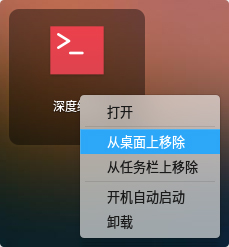

> ：按住鼠标左键不放，将应用图标拖拽到任务栏以外的区域进行移除，当应用处于运行状态时您将无法拖拽移除，此时可以右键单击任务栏上的应用图标，选择 **移除驻留** 将应用从任务栏上移除。

### 运行应用
对于已经创建了桌面快捷方式或固定到任务栏上的应用，您可以通过以下途径来打开应用。

- 双击桌面图标或右键单击桌面图标选择 **打开**。
- 直接点击任务栏上的应用图标或右键单击任务栏上的应用图标选择 **打开**。

如果该应用在启动器界面中，可以通过以下步骤来打开应用。

1. 在启动器中，将鼠标指针置于应用图标上。
2. 直接点击应用图标或右键单击应用图标选择 **打开**。

### 卸载应用
对于不再使用的应用，您可以选择将其卸载，以节省硬盘空间。

1. 在启动器中，右键单击应用图标。
2. 点击 **卸载**。

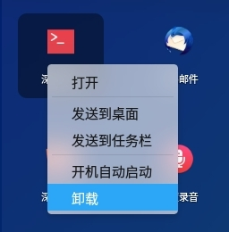

> ：在 **时尚模式** 下，您还可以在启动器的全屏模式界面，按住鼠标左键不放，将应用图标拖拽到任务栏的  中卸载应用。

## 控制中心
深度操作系统通过控制中心来管理系统的基本设置，包括帐户管理、网络设置、日期和时间、个性化设置、屏幕显示设置、系统和应用更新升级等更多设置。当您进入深度桌面环境后，点击 即可打开控制中心面板。

### 首页介绍
控制中心首页主要展示各个设置模块，方便日常查看和快速设置。您还可以进入消息列表查看所有通知。

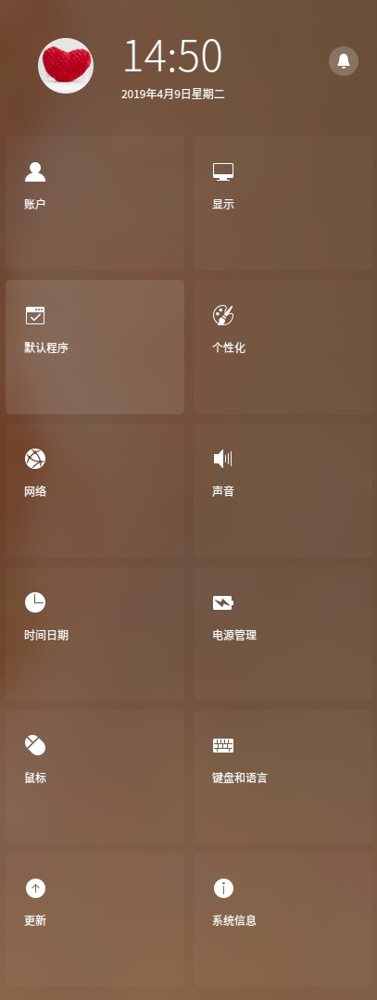

<table class="block1">
    <tbody>
        <tr>
            <td width="80px">顶部信息栏</td>
            <td>显示用户头像、当前系统时间和日期。您可以点击后面的按钮，切换到通知列表查看消息。</td>
        </tr>
        <tr>
             <td>应用控件区</td>
            <td>显示控制中心设置导航，可以点击鼠标快速跳转到对应的设置模块。</td>
        </tr>
    </tbody>
 </table>

打开控制中心的某一设置模块后，可以通过左侧导航栏快速切换到另一设置模块。

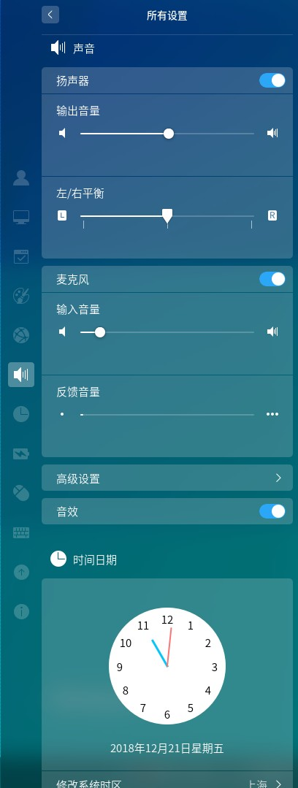

### 账户设置
通过设置帐户为您的计算机提供安全保障，保护您的个人隐私和数据。

#### 创建新帐户

1. 在控制中心面板首页，点击 。
2. 点击 **创建帐户**。
3. 输入新帐户的用户名、密码和重复密码。
4. 点击 **创建**。
5. 在授权界面输入密码，新账户就会添加到账户列表。

#### 更改帐户头像

1. 在控制中心面板首页，点击 。
2. 点击列表中已有的帐户。
3. 点击 **修改头像**，进入修改头像界面。
4. 选择系统自带头像或添加本地头像，头像就替换完成了。

> ：在控制中心首页，可以直接点击用户头像图标，自动跳转到 **账户设置** 界面。

#### 更改帐户密码

1. 在控制中心面板首页，点击 。
2. 点击列表中已有的帐户。
3. 点击 **修改密码**，进入修改密码页面。
4. 输入当前密码、新密码、重复密码。

#### 自动登录

1. 在控制中心面板首页，点击。
2. 点击列表中已有的帐户。
3. 点击 **自动登录** 开关按钮，开启自动登录功能。

#### 无密码登录

1. 在控制中心面板首页，点击。
2. 点击列表中已有的帐户。
3. 点击 **无密码登录** 开关按钮，开启后可以不用输入密码登录系统。

#### 设置指纹密码

指纹密码可以用来登录系统、解锁屏幕、特殊操作授权。

1. 在控制中心面板首页，点击 。
2. 点击列表中已有的帐户。
3. 点击 **指纹密码** 。
4. 点击 **添加指纹** 。
5. 使用指纹设备录入指纹。
6. 待指纹添加成功之后点击 **完成**。

> ：您可以添加多个指纹密码，**清除指纹** 会将所有指纹密码全部清空。

#### 删除帐户

1. 在控制中心面板首页，点击 。
2. 点击列表中已有的帐户。
3. 点击 **删除账户** 。
4. 在弹出的确认界面中点击 **删除**。

> : 已登录的账户无法被删除。

### 显示设置
通过设置显示器的分辨率、屏幕方向以及缩放倍数，让您的电脑显示到达最佳状态。

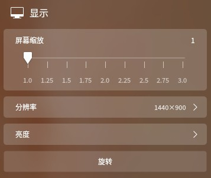

#### 单屏设置
您可以通过设置显示器的分辨率、亮度等来调节屏幕的视觉观感。

##### 设置屏幕缩放

1. 在控制中心面板首页，点击 。
2. 点击缩放数值来调整缩放倍数。

> ：当检测到屏幕为高分屏时，会自动调整缩放倍数。

> ：由于部分应用不支持屏幕缩放，可以在启动器中右键单击应用，选择 **禁用屏幕缩放**，以获得更好的显示效果。

##### 设置分辨率

1. 在控制中心面板首页，点击 。
2. 点击 **分辨率**，进入分辨率设置界面。
3. 在列表中选择合适的分辨率参数。

##### 设置亮度

1. 在控制中心面板首页，点击 。
2. 点击 **亮度**，进入分亮度设置界面。
 - 打开 **自动调节色温** 开关，开启进入护眼模式，自动调节色温。
 - 打开 **自动调节亮度** 开关，自动调节屏幕亮度 （支持有光线传感器的设备）。
 - 拖动亮度条滑块，调节屏幕亮度。

##### 设置屏幕方向

1. 在控制中心面板首页，点击 。
2. 点击 **旋转**，开始旋转屏幕。
3. 每点击一下鼠标左键屏幕顺时针旋转90°。
4. 旋转完成后点击鼠标右键退出旋转界面。

#### 多屏设置

多屏显示，让您的视野无限延伸！您可以使用VGA线缆将您的电脑和另一台显示器、投影仪等连接起来，同时在多个屏幕上来显示您电脑上的内容。

1. 在控制中心面板首页，点击 。
2. 选择一种多屏模式。
 - **复制模式 **将主屏的设置复制到其他显示屏。
 - **扩展模式** 将主屏的显示扩展到其他显示屏。
 - **只在xxx显示 **将只在某个显示屏显示屏幕内容。
 - **自定义设置** 设置显示屏和分辨率。

##### 自定义设置

1. 在控制中心面板首页，点击 。
2. 点击显示设置中的 **自定义设置**。
3. 在弹出的菜单中设置自定义参数。
4. 点击 **保存**。

> ：点击 **应用**为临时应用，该设置不会被保存。

#### 屏幕投射

1. 在控制中心面板首页，点击 。
2. 选择 **屏幕投射**。
3. 选择想要投射到的设备。
4. 投射成功后，设备名称后面显示已选择图标，再次点击可以取消屏幕投射。

> ：屏幕投射需要无线网卡来支持相关功能，屏幕投射到其他设备上会占用无线网卡，此时电脑无法使用Wi-Fi网络。

### 默认程序设置
当系统中同一类型的应用程序安装多个时，您可以通过选择其中的一个程序来作为默认启动的应用程序。

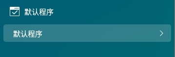

#### 选择默认程序

1. 在控制中心面板首页，点击 。
2. 点击 **默认程序**，进入修改默认程序设置界面。
3. 在列表中选择默认应用程序，以打开各种文件。

#### 添加默认程序

1. 在控制中心面板首页，点击 。
2. 点击 **默认程序**，进入修改默认程序设置界面。
3. 点击各类型列表下的 **添加**。
 - 选择默认程序是*.desktop文件时，在列表中自动添加新的图标和名称。
 - 选择默认程序是特定的二进制文件时，在列表中自动添加新的图标和名称以及在括号中显示路径。

> ：当用户添加默认程序后，在分类列表右边会显示一个 **编辑** 按钮。

#### 删除默认程序

系统默认程序不能删除，如果要从默认程序列表中删除系统已经安装的应用，只能通过卸载对应的应用，默认程序列表会自动删除该应用。

1. 在控制中心面板首页，点击 。
2. 点击 **默认程序**，进入修改默认程序设置界面。
3. 点击 **编辑**，添加的默认程序可以被删除。
4. 点击删除，删除默认程序。

### 个性化设置
您可以通过调节透明度，设置启动器（小窗口模式下）、任务栏和控制中心的透明度；还能使用不同的桌面图标、窗口样式、字体等来改变桌面的外观，设置成您喜欢的显示风格。

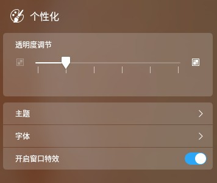

#### 调节透明度

您可以设置任务栏、启动器（小窗口模式下）、和控制中心的透明度。数值越小越透明，数值越大越不透明。

1. 在控制中心面板首页，点击 。
2. 点击数值，调节透明度，可实时体验透明效果。

#### 设置主题

您可以分别设置系统的窗口主题、图标主题、光标主题。

1. 在控制中心面板首页，点击 。
2. 点击 **主题**，进入设置主题界面。
 - 在窗口主题列表中，选择一款窗口样式进行切换。
 - 在图标主题列表中，选择一款图标样式进行切换。
 - 在光标主题列表中，选择一款光标进行切换。

> ：若想使用其他主题，参考 [自定义主题](https://wiki.deepin.org/wiki/%E8%87%AA%E5%AE%9A%E4%B9%89%E4%B8%BB%E9%A2%98)，设计您自己的桌面风格。

#### 设置字体

1. 在控制中心面板首页，点击 。

2. 点击 **字体**，进入设置字体界面。

3. 设置系统显示字体的类型和大小。

#### 设置窗口特效

您可以点击 **开启窗口特效** 开关，来开启或关闭窗口特效。

### 蓝牙设置
蓝牙能够实现短距离的无线通信，您可以通过蓝牙与附近的其它蓝牙设备连接，常见的蓝牙设备包括：蓝牙键盘、蓝牙鼠标、蓝牙耳机、蓝牙音响等。

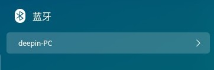

> ：大多数笔记本电脑都配备有蓝牙模块，您只要开启蓝牙功能开关，而大部分台式电脑都没有配备蓝牙，您可以购买相关蓝牙适配器插入到电脑的USB端口中使用。

#### 蓝牙开关

1. 在控制中心面板首页，点击 。
2. 点击 **蓝牙**，进入设置蓝牙界面。
3. 点击蓝牙开关按钮，开启蓝牙功能。

#### 蓝牙名称

1. 在控制中心面板首页，点击  。
2. 点击 **蓝牙**，进入设置蓝牙界面。
3. 点击蓝牙名称旁边的编辑图标,输入新的蓝牙名称。

> ：修改蓝牙名称成功后同时自动对外广播蓝牙设备的新名字，需要其他设备重新进行搜索。

#### 蓝牙设备

1. 在控制中心面板首页，点击 。
2. 点击 **蓝牙**，进入设置蓝牙界面。
3. 在 **其他设备** 列表中，系统扫描附近的蓝牙设备并自动连接。
4. 连接成功后自动添加到 **我的设备** 列表中。
5. 在 **我的设备** 列表中，可以 **断开连接** 和 **忽略此设备** 操作。

### 网络设置
连接网络后，您可以办公学习、浏览新闻、在线视频播放，也可以聊天、网上购物等。

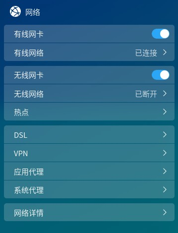

#### 有线网络

1. 将网线插入电脑上的网络插孔。
2. 将网线的另一端插入路由器或网络端口。
3. 在控制中心面板首页，点击  。
4. 点击 **有线网卡** 开关按钮，开启有线网络连接功能。
5. 当网络连接成功后，在桌面将会弹出“已连接有线连接”的提示信息。

#### 无线网络

##### 连接无线网络

1. 在控制中心面板首页，点击  。
2. 点击 **无线网卡** 开关按钮，开启无线网络连接功能。
3. 电脑会自动搜索并显示附近可用的无线网络。
4. 选择需要连接的无线网络。
 - 如果该网络是开放的，将自动连接到此网络。
 - 如果该网络是加密的，请根据提示输入密码，点击 **连接**，然后将自动完成连接。

##### 连接隐藏网络

1. 在控制中心面板首页，点击  。
2. 点击 **无线网络**，进入网络信息界面。
3. 点击 **连接到隐藏网络**，进入连接到隐藏网络界面。
4. 输入隐藏网络名称、选择加密方式和密码。

#### 无线热点（需无线网卡支持）

1. 在控制中心面板首页，点击  。
2. 点击 **热点** ，打开热点开关。
3. 点击 **热点设置**，设置热点信息。
4. 点击 **保存** 。

#### 移动网络

1. 将移动网卡插入电脑上的USB接口中。
2. 在控制中心面板首页，点击  。
3. 系统根据移动网卡和运营商信息自动适配并自动连接网络。
4. 点击 **移动网络**，查看详细设置信息。

#### 宽带连接

##### 新建宽带连接

1. 在控制中心面板首页，点击  。
2. 点击 **DSL**，点击**创建PPPoE连接**。
3. 输入宽带名称、帐户、密码。
4. 点击 **保存**，系统自动创建宽带连接并尝试连接。

##### 设置宽带连接

1. 在控制中心面板首页，点击  。
2. 点击**DSL**，点击宽带名称，进入宽带连接设置界面。
3. 修改名称、帐户、密码、开启自动连接、设置IP地址以及开启其他认证服务。

#### VPN

1. 在控制中心面板首页，点击  。
2. 点击 **VPN**，选择 **创建** 或 **导入VPN**。
3. 选择VPN协议类型，并输入名称、网关、账号、密码等信息。（导入VPN会自动填充信息）
4. 点击 **保存**，系统自动尝试连接VPN网络。
5. 您可以将VPN设置导出，备用或共享给其他用户。

> ：打开 **仅用于相对应的网络上的资源** 开关，可以不将VPN设置为默认路由，只在特定的网络资源上生效。

#### 应用代理

1. 在控制中心面板首页，点击  。
2. 点击 **应用代理**。
3. 设置应用代理参数。
4. 点击 **确定**。
5. 应用代理设置成功后打开启动器，右键单击应用图标，可以选择 **使用代理打开**。

#### 系统代理

1. 在控制中心面板首页，点击  。
2. 点击 **系统代理**，进入系统代理界面。
 - 点击 **无**，关闭代理服务器功能。
 - 点击 **手动**，输入代理服务器的地址和端口信息。
 - 点击 **自动**，输入URL，系统将自动配置代理服务器的信息。

#### 网络信息

1. 在控制中心面板首页，点击 。
2. 点击 **网络详情**，进入网络信息界面。
3. 查看当前网卡的有线网络或无线网络信息。

### 声音设置
设置您的扬声器和麦克风，让您听的更舒适，唱的更动听。

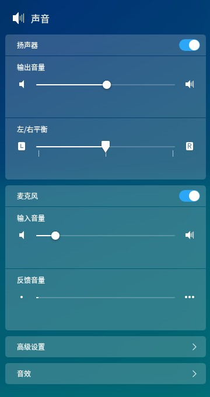

#### 设置扬声器

1. 在控制中心面板首页，点击 。
2. 点击 **扬声器 **开关按钮，打开扬声器。
3. 调节输出音量，和左右声道平衡。

#### 设置麦克风

1. 在控制中心面板首页，点击 。
2. 点击 **麦克风 **开关按钮，打开麦克风。
3. 调节输入音量。

#### 设置系统音效

1. 在控制中心面板首页，点击 。
2. 点击 **音效** 开关按钮，开启系统音效。

#### 高级设置

1. 在控制中心面板首页，点击 。
2. 点击 **高级设置**。
3. 选择输入和输出模式。

### 日期和时间

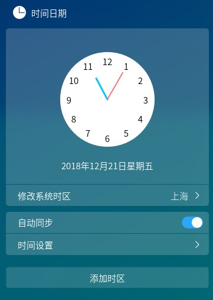

#### 自动同步

1. 在控制中心面板首页，点击  。
2. 点击 **自动同步 **开关按钮，开启时间自动同步功能。
3. 系统会通过网络自动同步系统默认时区的本地时间和日期。

#### 设置时间和日期
手动设置时间和自动同步功能相互排斥，手动设置后自动同步功能会被关闭。

1. 在控制中心面板首页，点击 。
2. 点击 **时间设置** 。
3. 输入正确的时间和日期。
4. 点击 **确定**。

#### 添加时区

1. 在控制中心面板首页，点击 。
2. 点击 **添加时区**。
3. 通过搜索或点击地图选择时区。
4. 点击 **确定**。

#### 编辑时区列表

1. 在控制中心面板首页，点击 。
2. 点击时区列表行末尾的 **编辑**。
3. 此时时区列表上的时区行出现删除图标。
4. 点击删除图标删除已添加的时区。

### 电源管理

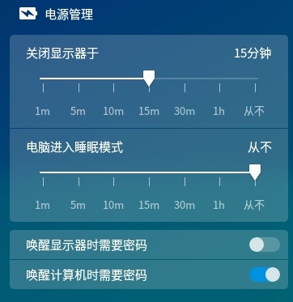

#### 设置节能模式
为降低笔记本的能耗，可以打开节能模式。
1. 在控制中心面板首页，点击 。
2. 点击 **节能模式 **开关按钮，打开节能模式。
3. 打开 **自动切换节能模式**，拔掉电源则直接进入节能模式，插上电源后自动退出节能模式。

> ：仅笔记本电脑有节能模式。

#### 设置显示器休眠时间

1. 在控制中心面板首页，点击 。
2. 选择显示器进入休眠的时间。

#### 设置电脑休眠时间

1. 在控制中心面板首页，点击 。
2. 选择电脑进入休眠的时间。

#### 安全设置

1. 在控制中心面板首页，点击 。
2. 点击 **唤醒显示器时需要密码**/**唤醒计算机时需要密码** 开关按钮，开启相关安全设置。

> ：笔记本的电源管理还有 **合盖时待机** 开关按钮，您可以根据需要设置。

### 鼠标和触控板

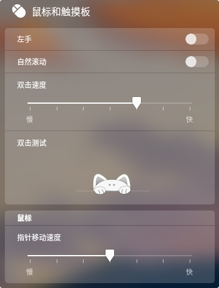

1. 在控制中心面板首页，点击 。

2. 点击 **左手** / **自然滚动** / **鼠标加速** 开关按钮，开启相关功能。

3. 调节 **滚动速度**，**双击速度** 和 **指针速度**。

> ：请注意左手使用鼠标时左键和右键功能互换，自然滚动功能和苹果系统的滚动效果类似。

> ：开启鼠标加速，提高了指针精确度，鼠标指针在屏幕上的移动距离会根据移动速度的加快而增加。可以根据使用情况开启或关闭。

您还可以开启触控板的 **输入时禁用触控板** / **插入鼠标时禁用触控板** / **掌压检测**，设置 **最小接触面** 和 **最小压力值**，以避免误触触控板。

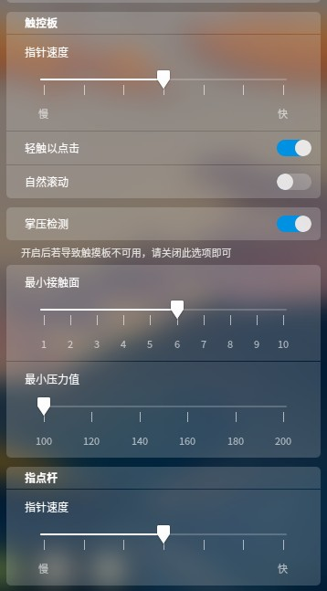

### 键盘和语言
您可以根据国家和地区，选择您的键盘输入习惯和布局以及查看、搜索、修改和自定义快捷键。

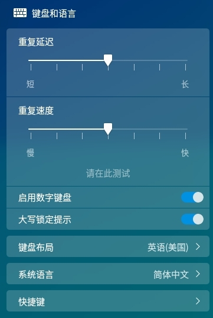

#### 设置键盘属性

1. 在控制中心面板首页，点击 。
2. 调节 **重复延迟**/**重复速度**。
3. 点击 **请在此测试**，按下键盘上任意字母不松，查看调节效果。
4. 点击 **大写锁定提示** 开关按钮，开启相关功能。

#### 设置键盘布局
系统默认的键盘布局一般是美式键盘，您可以添加其他的键盘布局。

##### 添加键盘布局

1. 在控制中心面板首页，点击 。
2. 点击 **键盘布局**，进入键盘布局界面。
3. 点击 **添加键盘布局**，进入添加键盘布局列表界面。
4. 按字母或搜索需要添加的语言键盘布局。

##### 删除键盘布局

1. 在控制中心面板首页，点击 。
2. 点击 **键盘布局**，进入键盘布局界面。
3. 点击键盘布局后的 **编辑** > **删除**，选中需要删除的键盘布局。

##### 切换键盘布局

1. 在控制中心面板首页，点击 。
2. 点击 **键盘布局**，进入键盘布局界面。
3. 选择一个键盘布局进行切换。
4. 当切换键盘布局成功后，在使用的语言后将显示为已选择。

#### 设置系统语言

1. 在控制中心面板首页，点击 。
2. 点击 **系统语言**，进入系统语言界面。
3. 选择或搜索需要切换的语言，系统将自动开始安装语言包。
4. 语言包安装完成后，在使用的语言后将显示为已选择。

> ：更改系统语言时，键盘布局可能也会发生改变。重新登录时，请确保使用正确的键盘布局来输入密码。

#### 设置快捷键
##### 查看快捷键

1. 在控制中心面板首页，点击 。
2. 点击 **快捷键**，进入快捷键设置界面。
3. 查看默认的系统快捷键、窗口快捷键和工作区快捷键。

##### 搜索快捷键

1. 在控制中心面板首页，点击 。
2. 点击 **快捷键**，进入快捷键设置界面。
3. 在顶部的搜索框中输入关键字，搜索栏会自动列出包含关键字的所有快捷键。

##### 修改快捷键

1. 在控制中心面板首页，点击 。
2. 点击 **快捷键**，进入快捷键设置界面。
3. 点击需要修改的快捷键。
4. 使用键盘输入新的快捷键。

> ：如果需要禁用快捷键，请按下键盘上的 。

##### 自定义快捷键

1. 在控制中心面板首页，点击 。
2. 点击 **添加自定义快捷键**，进入添加快捷键界面。
3. 输入快捷键名称、快捷键对应的命令行、快捷键。
4. 添加成功后，点击自定义快捷键后的 **编辑** > **删除**， 删除自定义的快捷键。

### 更新设置
当系统存在更新时会在控制中心首页提示，您可以手动更新也可以设置成自动更新，同时还可以修改镜像源、升级系统和应用。

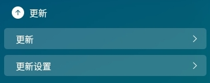

#### 检测系统源

开启 **系统源检测**，当系统源被更改时，会弹出提示“检测到您的系统源已被修改”。

#### 自动下载更新

1. 在控制中心面板首页，点击 。
2. 点击 **更新设置**。
3. 点击 **自动下载更新** 开关按钮，开启自动检查更新功能。
4. 当系统存在更新时，将自动下载更新。

> ：打开 **自动清除软件包缓存** 开关，系统会定期清理缓存包。

#### 切换镜像源

1. 在控制中心面板首页，点击 。
2. 点击 **更新设置**。
3. 点击 **切换镜像源**。
4. 系统自动进行速度检测。
5. 切换新的服务器来刷新软件包列表。

#### 更新和升级

1. 在控制中心面板首页，点击 。
2. 点击 **更新**，进入检查系统更新界面。
 - 如果系统没有更新将会提示“您的系统已经是最新的”。
 - 如果系统存在更新，将显示 **下载并安装更新** 按钮，更新数据大小和更新详情列表。
3. 点击按钮，系统将自动开始下载并安装更新。
4. 更新完成后，会出现 **更新成功** 提示。

> ：更新完成后，会弹出对话框提醒用户 **重启** 或 **关机** 。

### 系统信息
您可以查看系统版本和电脑硬件等信息，以及设置启动菜单。

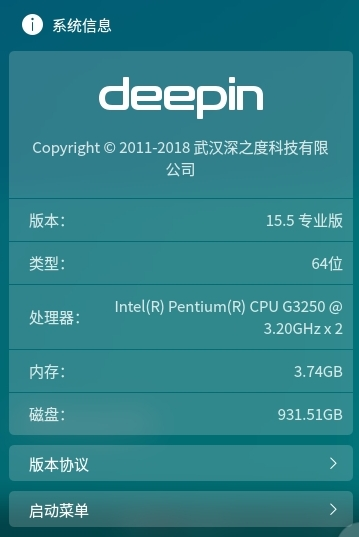

#### 查看系统信息

1. 在控制中心面板首页，点击 。
2. 在 **系统信息** 下，您可以：
 - 查看当前使用的操作系统的版本号。
 - 查看当前使用的操作系统是64位/32位。
 - 查看电脑CPU的型号。
 - 查看电脑内存大小。
 - 查看电脑硬盘容量。

#### 查看版权协议

1. 在控制中心面板首页，点击 。
2. 点击 **版权协议**，进入版权协议详情界面。
3. 查看GNU通用公共许可协议详细信息。

#### 设置启动菜单

- 当系统存在多个系统时，启动延时开关默认开启，开机后在启动菜单停留5秒钟，才能通过启动菜单设置启动顺序。
- 当系统仅存在一个系统时，启动延时开关默认关闭，开机后在启动菜单停留1秒钟，不需要调整启动顺序。

##### 默认启动项

1. 在控制中心面板首页，点击 。
2. 点击 **启动菜单**，进入启动菜单界面。
3. 点击选中某一菜单项后，该项将成为默认启动项。

##### 启动界面背景

1. 在控制中心面板首页，点击 。
2. 点击 **启动菜单**，进入启动菜单界面。
3. 开启 **主题** 开关按钮，使用该主题为启动界面的背景。

## 窗口管理器
窗口管理器可以在不同的工作区内展示不同的窗口内容，通过窗口管理器您可以对桌面窗口进行分组管理。

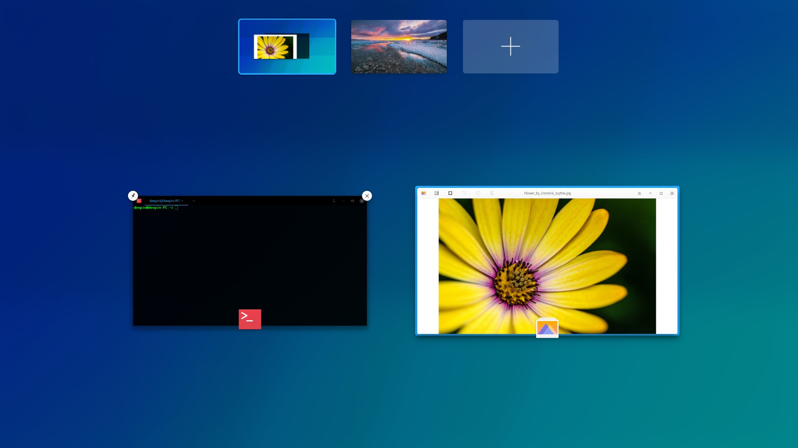

### 打开工作区
工作区是将您的桌面窗口进行分组管理，通过划分工作区可以增大您的工作区域。

在桌面上，按下键盘上的  +  组合键打开工作区的管理界面。

#### 在工作区切换窗口
在工作区的管理界面，当前工作区中所有打开的窗口都将平铺展开来显示。

- 按下键盘上的  键，将切换到当前窗口的下一个窗口。
- 按下键盘上的  +  组合键，将切换到当前窗口的上一个窗口。

#### 在工作区移动窗口
在工作区的管理界面，将当前工作区中的窗口移动到另一个工作区。

1. 在工作区的管理界面，将鼠标指针置于窗口上，此时选中窗口的右上角会出现 。
2. 按住鼠标左键不放，将窗口拖拽到指定的预览窗口中。
3. 释放鼠标左键，完成窗口的移动。

#### 在工作区关闭窗口
在工作区的管理界面，您可以非常快速的关闭在桌面上已经打开的窗口。

1. 在工作区的管理界面，将鼠标指针置于窗口上，此时选中窗口的右上角会出现 。
2. 点击 ，关闭工作区中指定窗口。

### 添加工作区
在工作区的管理界面，您可以通过以下方式添加工作区。

- 点击预览窗口右侧的 ，按下键盘上的   键。
- 按下键盘上的  +  组合键，再按下  键。

当您添加的工作区达到最大值时，预览窗口右侧的  会自动隐藏，此时将不能再执行添加工作区的操作。当删除1个工作区后， 又会自动显示。

> ：窗口管理器最多支持7个工作区。

### 切换工作区
在工作区的管理界面和桌面上，您可以通过以下方式切换工作区。

- 在桌面上，按下键盘上的  +  /  组合键，可以切换到上一个/下一个工作区。
- 在工作区的管理界面，通过上下滚动鼠标滚轮来切换到上一个/下一个工作区。
- 在工作区的管理界面，通过点击对应的预览窗口或按下键盘上的  + **数字键** 来切换到指定工作区。
- 在工作区的管理界面，您还可以直接按下键盘上的  / 键来切换到上一个/下一个工作区。

### 删除工作区
当您执行删除工作区操作后，该工作区中的所有窗口将自动转移到相邻的工作区中显示，当桌面环境中只存在一个工作区时，将不能执行删除工作区的操作。

- 在工作区的管理界面，点击预览窗口右上角的 ，删除指定的工作区。
- 在工作区的管理界面，选中预览窗口，按住鼠标左键不放，将预览窗口向上拖拽，删除指定的工作区。
- 在工作区的管理界面，每按下一次键盘上的  +  组合键，将向左或向右逐次删除工作区。

### 退出工作区
当您在工作区管理界面完成相关操作后，可以通过以下方式退出工作区。

- 按下键盘上的  键。
- 在当前工作区管理界面区域内的任意位置点击一下鼠标。
- 再次按下键盘上的  +  组合键。

### 显示桌面窗口
在桌面上，您可以通过以下方式显示桌面窗口。

- 在桌面上，按下键盘上的  +  组合键，显示所有工作区的窗口。
- 在桌面上，按下键盘上的  +  组合键，显示当前工作区的窗口。

### 切换桌面窗口
在桌面上，您可以通过以下方式切换桌面窗口。

- 在桌面上，按住键盘上的  键不放，连续按下键盘上的  键，窗口依次向右切换显示；按住键盘上的  +  键不放，连续按下键盘上的  键，窗口依次向左切换显示。
- 在桌面上，按住键盘上的  键不放，连续按下键盘上的  键，当前同类型窗口依次向右切换显示；按住键盘上的  +  键不放，连续按下键盘上的  键，当前同类型的窗口依次向左切换显示。

### 移动桌面窗口
在桌面上，您可以通过以下方式移动桌面窗口。

- 在桌面上，按下键盘上的  +  +  /  键，将当前窗口移动到上一个/下一个工作区。
- 在桌面上，按下键盘上的  +  + **数字键**，可以将当前窗口移动到指定的工作区。
