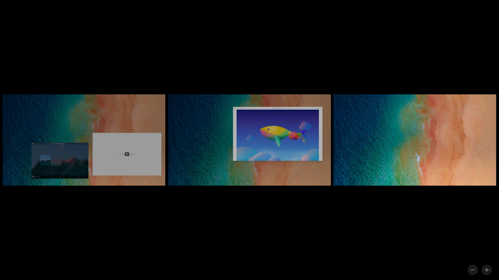

# 深度桌面环境|../common/deepin-system.svg|

## 概述
深度操作系统是深度科技发行的美观易用、安全可靠的国产桌面操作系统。深度系统预装了Google Chrome、WPS Office、搜狗输入法以及一系列深度特色应用。它既能让您体验到丰富多彩的娱乐生活，也可以满足您的日常工作需要。随着功能的不断升级和完善，深度操作系统已成为国内最受欢迎的桌面操作系统之一。

### 系统简介
初次进入深度操作系统，会自动打开欢迎程序。您可以观看视频了解系统功能，选择桌面模式和图标主题，开启窗口特效，获得更多关于深度操作系统的知识。

用户成功登录系统后，即可体验深度桌面环境。深度桌面环境主要由桌面、任务栏、启动器、控制中心和窗口管理器等组成，是您使用深度操作系统的基础。

## 桌面
桌面是您登录后看到的主屏幕区域。在桌面上，您可以新建文件/文件夹、排列文件、打开终端、设置热区、设置壁纸和屏保等，还可以通过 [发送到桌面](#创建快捷方式) 向桌面添加应用的快捷方式。

### 新建文件夹/文档
在桌面新建文件夹或文档，也可以对文件进行常规操作，和在文件管理器中一样。

- 在桌面上，点击鼠标右键，点击 **新建文件夹**，输入新建文件夹的名称。
- 在桌面上，点击鼠标右键，点击 **新建文档**，选择新建文档的类型，输入新建文档的名称。
- 在桌面文件或文件夹上，点击鼠标右键，您可以使用文件管理器的相关功能：

|| |
| ----------- |------------------------------------------ |
| 打开方式    | 选定系统默认打开方式，也可以选择其他关联应用程序来打开。 |
| 复制        |复制文件或文件夹。             |
| 剪切        |移动文件或文件夹。             |
| 重命名      |重命名文件或文件夹。            |
| 删除        |删除文件或文件夹。              |
| 压缩/解压缩 |压缩文件或文件夹，或对压缩文件进行解压。 |
| 创建链接    |创建一个快捷方式。                         |
| 标记信息    |添加标记信息，以对文件或文件夹进行标签化管理。      |
| 属性        |查看文件或文件夹的基本信息，共享方式，及其权限。      |

### 设置排列方式
您可以对桌面上的图标按照需要进行排序。

1. 在桌面上，点击鼠标右键。
2. 点击 **排序方式**，您可以：
  - 点击 **名称**，将按文件的名称顺序显示。
  - 点击 **大小**，将按文件的大小顺序显示。
  - 点击 **类型**，将按文件的类型顺序显示。
  - 点击 **修改时间**，文件将按最近一次的修改日期顺序显示。

> ：您也可以勾选 **自动排列**，桌面图标将从上往下，从左往右按照当前排序规则排列，有图标被删除时后面的图标会自动向前填充。

#### 自动整理文件

勾选 **自动整理**，桌面上的文件和文件夹将按照音乐、视频、图片、文档、应用、其他、文件夹这几个类型自动归类到相应的文件夹。

### 调整图标大小
1. 在桌面上，点击鼠标右键。
2. 点击 **图标大小**。
3. 选择一个合适的图标大小。

> ：您也可以用  + //鼠标滚动来调整桌面和启动器中的图标大小。

### 设置显示器
从这里快速进入控制中心设置显示器的缩放比例、分辨率和亮度等。

1. 在桌面上，点击鼠标右键。
2. 点击 **显示设置**，快速进入控制中心显示设置界面。

> ：关于显示的设置，具体操作请参阅 [显示设置](#显示设置)。

### 设置热区
热区可以简化您的操作，方便您快速进入系统的主要界面。桌面的四个角落默认没有热区，设置热区后您可以快速打开启动器和控制中心，关闭屏幕，显示桌面等。

1. 在桌面上，点击鼠标右键。
2. 点击 **热区设置**。
3. 整个屏幕会变暗并且在屏幕的四个角落将显示对应的热区功能。
4. 将鼠标指针置于桌面的某个角落，在选项中重新选择一项。
5. 在桌面的空白处点击一下鼠标，退出热区设置。

> ：请留意热区设置界面的动画，学习热区使用方法。将鼠标移动到屏幕一角并继续向外拖动就可以唤醒对应的热区功能。

 ### 更改壁纸
您可以选择一些精美、时尚的壁纸来美化桌面，让您的电脑显示与众不同。

1. 在桌面上，点击鼠标右键。
2. 点击 **壁纸与屏保**，在桌面底部预览所有壁纸。
3. 选择某一壁纸后，壁纸就会在桌面和锁屏中生效。
4. 您可以点击 **仅设置桌面** 和 **仅设置锁屏** 来控制壁纸的生效范围。

> ：勾选 **自动更换壁纸**，设置自动更换壁纸的时间间隔。您还可以设置在“登录时”和“唤醒时”自动更换壁纸。
> ： 您还可以在看图中设置您喜欢的图片为桌面壁纸。

### 设置屏保
屏幕保护程序原本是为了保护显像管，现在一般用来防范他人偷窥您电脑上的一些隐私。

1. 在桌面上，点击鼠标右键。
2. 点击 **壁纸与屏保**，点击 **屏保**，在桌面底部预览所有屏保。
3. 选择其中一个屏保，点击 **设置屏保**，在上方选择 **闲置时间**。
4. 您可以勾选 **恢复时需要密码**，以便更好地保护您的隐私。
5. 待电脑空闲指定时间后，将启动您选择的屏幕保护程序。

## 任务栏
任务栏是指位于桌面底部的长条，主要由启动器、应用程序图标、托盘区、系统插件等组成。在任务栏，您可以打开启动器、显示桌面、进入工作区，对其上的应用程序进行打开、新建、关闭、强制退出等操作，还可以设置音量，连接Wi-Fi，查看日历，进入关机界面等。

### 认识任务栏图标
任务栏图标包括启动器图标、应用程序图标、托盘区图标、系统插件图标等。

> ：将鼠标指针移到任务栏上已打开窗口的图标时，会显示相应的预览窗口。

### 切换显示模式
任务栏提供两种显示模式：时尚模式和高效模式。两种模式下的应用窗口激活效果显示不同。

您可以通过以下操作来切换显示模式：

1. 右键单击任务栏。
2. 在 **模式** 子菜单中选择一种显示模式。

### 设置任务栏位置
您可以将任务栏放置在桌面的任意方向。

1. 右键单击任务栏。
2. 在 **位置** 子菜单中选择一个方向。

### 调整任务栏高度 
鼠标拖动任务栏边缘，改变任务栏高度。

### 显示/隐藏任务栏
任务栏可以隐藏，以便最大程度的扩展桌面的可操作区域。

1. 右键单击任务栏。
2. 在 **状态** 子菜单中您可以：
  - 选择 **一直显示**，任务栏将会一直显示在桌面上。
  - 选择 **一直隐藏**，任务栏将会隐藏起来，只有在鼠标移至任务栏区域时才会显示。
  - 选择 **智能隐藏**，当占用任务栏区域时，任务栏自动隐藏。

### 显示/隐藏插件
1. 右键单击任务栏。
2. 在 **自定义** 子菜单中勾选或取消勾选 **回收站、电源、屏幕键盘、时间** ，可以设置回收站、电源、屏幕键盘、时间等插件在任务栏上的显示和隐藏效果。

### 进入关机界面
您可以通过任务栏中的电源图标进入关机界面，也可以在启动器的小窗口模式中点击电源图标。

点击任务栏上的  图标。

|||
|--|---|
|关机|关闭电脑。|
|重启|关机后再次重新运行您的电脑。|
|待机|整个系统将处于低能耗运转的状态。|
|锁定|锁定电脑，或按下键盘上的 + 组合键锁定。|
|切换用户|选择另一个用户帐户登录。|
|注销|清除当前登录用户的信息。|
|系统监视器|快速启动系统监视器。|

> ：当系统用户存在多个账户时才显示 。当系统有swap分区才显示 “休眠”。

### 回收站
电脑中临时被删除的所有文件您都可以在回收站中找到，回收站中的文件可以被恢复或清空。

> ：在时尚模式中回收站是固定在任务栏上的，如果您使用的是高效模式可以在启动器中打开回收站，或者在桌面上创建回收站的快捷方式。

#### 还原文件
对于已删除的文件，您可以进入回收站进行还原，或使用  +   还原刚删除的文件。

1. 在回收站中，选择要恢复的文件。
2. 点击鼠标右键，选择 **还原**。
3. 回收站中的文件还原到原来的存储路径下。

> ：如果原来所在的文件夹已经删除，放回原位的过程中自动新建新文件夹。

#### 清空回收站
1. 在回收站中，点击鼠标右键。
2. 选择 **清空回收站**，将彻底删除回收站所有内容。

## 启动器
启动器帮助您管理系统中已安装的所有应用，在启动器中使用分类导航或搜索功能可以快速找到您需要的应用程序。

> ：您可以进入启动器查看新安装的应用。新安装应用的旁边会出现一个小蓝点提示。

### 切换启动器模式
启动器有全屏和小窗口两种模式。点击启动器界面右上角的图标来切换模式。

两种模式均支持搜索应用、设置快捷方式等操作。

小窗口模式还支持快速打开文件管理器，控制中心和进入关机界面等功能。

### 排列应用

在全屏模式下，系统默认按照安装时间排列所有应用。

- 将鼠标悬停在应用图标上，按住鼠标左键不放，将应用图标拖拽到指定的位置自由排列。
- 点击启动器界面左上角分类图标进行排列。

在小窗口模式下，默认按照使用频率排列应用。

### 查找应用

在启动器中您可以滚动鼠标滚轮查找应用，也可以切换分类导航来更快找到所需的应用。

如果知道应用名称，直接在搜索框中输入关键字快速定位到需要的应用。

1. 在启动器的搜索框中输入关键字，例如“deepin”。
2. 系统会自动搜索包含关键字“deepin”的所有应用，并将搜索结果显示在启动器界面中。

### 设置应用的快捷方式
快捷方式提供了一种简单快捷地启动应用的方法。

#### 创建应用的快捷方式
您可以选择将应用发送到桌面或任务栏上，方便您的后续操作。

在启动器中，右键单击应用图标，您可以：

- 点击 **发送到桌面**，在桌面创建快捷方式。
- 点击 **发送到任务栏**，将应用固定到任务栏。

> ：您还可以从启动器拖拽应用图标到任务栏上放置。但是当应用处于运行状态时您将无法拖拽固定，此时您可以右键单击任务栏上的应用图标，选择 **驻留** 将应用固定到任务栏，以便在下次使用时能够从任务栏上快速打开。

#### 删除应用的快捷方式
您既可以在桌面直接删除应用的快捷方式，也可以在任务栏和启动器中删除。

从任务栏上删除：

- 在任务栏上，按住鼠标左键不放，将应用图标拖拽到任务栏以外的区域移除快捷方式。
- 当应用处于运行状态时您将无法拖拽移除，此时可以右键单击任务栏上的应用图标，选择 **移除驻留** 将应用从任务栏上移除。

从启动器中删除：

在启动器中，右键单击应用图标，您可以：

- 点击 **从桌面上移除**，删除桌面快捷方式。
- 点击 **从任务栏上移除**，将固定到任务栏上的应用移除。

> ：以上操作，只会删除应用的快捷方式，而不会卸载应用。

### 安装应用
如果启动器中没有您需要的应用，可以在应用商店一键下载安装。

### 运行应用
对于已经创建了桌面快捷方式或固定到任务栏上的应用，您可以通过以下途径来打开应用。

- 双击桌面图标，或右键单击桌面图标选择 **打开**。
- 直接点击任务栏上的应用图标，或右键单击任务栏上的应用图标选择 **打开**。

在启动器中，直接点击应用图标打开，或右键单击应用图标选择 **打开**。

> ：对于经常使用的应用，您可以在启动器中，右键单击应用图标选择 **开机自动启动**。

### 卸载应用
对于不再使用的应用，您可以选择将其卸载，以节省硬盘空间。

1. 在启动器中，右键单击应用图标。
2. 点击 **卸载**。

> ：在 **时尚模式** 下，您还可以在启动器的全屏模式界面，按住鼠标左键不放，将应用图标拖拽到任务栏的  中卸载应用。

## 窗口管理器
窗口管理器可以在不同的工作区内展示不同的窗口内容。通过窗口管理器您可以同时使用多个桌面，以便对桌面窗口进行分组管理。

### 打开工作区
工作区将您的桌面窗口进行分组管理，通过划分工作区可以增大您的工作区域。

按下 +  组合键，或点击  打开工作区界面。

### 添加工作区
在工作区界面，您可以通过以下方式添加工作区。

- 点击工作区下方的 。
- 按下键盘上的。

> ：当您添加的工作区达到最大值时，将不能再添加工作区。

### 切换工作区
在桌面和工作区界面，您可以通过以下方式切换工作区。

- 在桌面，按下键盘上的  +  /  组合键，切换到上一个/下一个工作区。
- 在桌面，按下键盘上的  + 数字键 (1-7) ， 切换到指定顺序的工作区。
- 在工作区界面，滚动鼠标滚轮切换到上一个/下一个工作区。
- 在工作区界面，按下键盘上的  / 键来切换到上一个/下一个工作区。
- 在工作区界面，点击对应的预览窗口或按下数字键（1-7）来切换到指定工作区。

### 删除工作区
当您执行删除工作区操作后，该工作区中的所有窗口将自动转移到相邻的工作区中显示，当桌面环境中只存在一个工作区时，将不能执行删除工作区的操作。

- 在工作区界面，点击或按下键盘上的 ，向左删除工作区。

### 退出工作区
当您在工作区界面完成相关操作后，可以通过以下方式退出工作区。

- 按下键盘上的  键。
- 在当前工作区界面区域内的任意位置点击一下鼠标。
- 再次按下键盘上的  +  组合键。

### 查看所有窗口
您可以通过以下方式查看工作区的所有窗口。

- 按下键盘上的  +  组合键，查看所有工作区的窗口。
- 按下键盘上的  +  组合键，查看当前工作区的窗口。

### 移动工作区窗口
您可以通过以下方式移动窗口到另一工作区。

- 在工作区界面，拖拽窗口到指定的工作区。
- 在桌面，按下键盘上的  +  +  /  键，将当前窗口移动到上一个/下一个工作区。
- 在桌面，按下键盘上的  +  + 数字键，将当前窗口移动到对应顺序的工作区。
- 在桌面，按下键盘上的  +  或在窗口标题栏上点击右键，打开窗口快捷操作菜单，选择 **总在可见工作区**，或 **移至右边的工作区** 或 **移至左边的工作区**，将当前窗口移动到指定的工作区。

> ：在窗口快捷操作菜单，您还可以选择最小化，最大化，移动窗口，改变窗口大小，置顶窗口和关闭窗口。

### 切换桌面窗口
您可以通过以下方式切换当前工作区的桌面窗口。

#### 快速切换相邻窗口

同时按下  +  并快速释放，快速切换当前窗口和相邻程序窗口；

同时按下  + + 并快速释放，快速反向切换当前窗口和相邻程序窗口。

#### 快速切换同类型窗口

同时按下  +  并快速释放，快速切换当前同类型窗口；

同时按下  + + 并快速释放，快速反向切换当前同类型窗口。

#### 切换所有窗口
按住键盘上的  键不放，连续按下键盘上的  键，所有窗口依次向右切换显示；按住键盘上的  +  键不放，连续按下键盘上的  键，所有窗口依次向左切换显示。

#### 切换同类型窗口
按住键盘上的  键不放，连续按下键盘上的  键，当前同类型窗口依次向右切换显示；按住键盘上的  +  键不放，连续按下键盘上的  键，窗口依次向左切换显示。