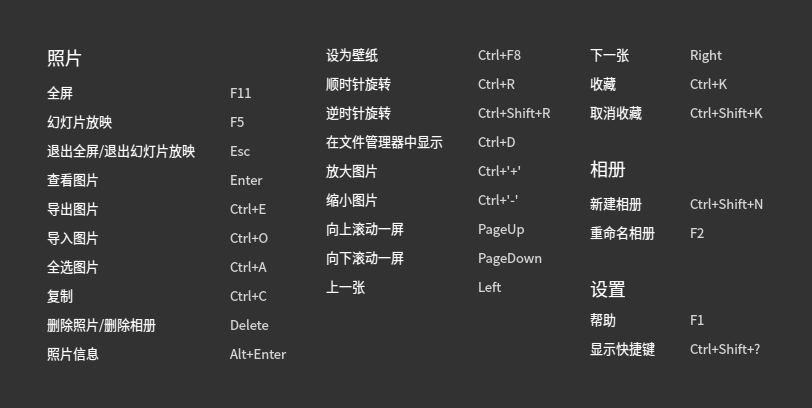
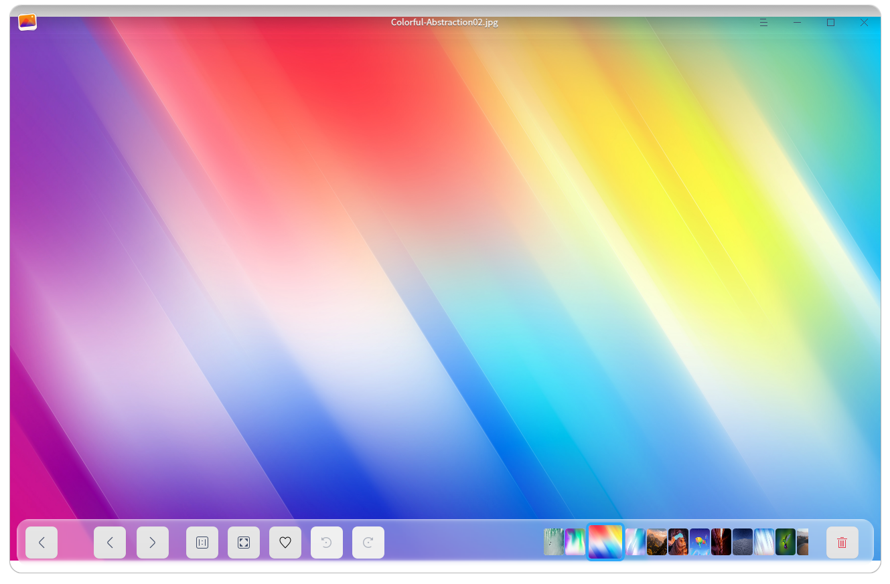
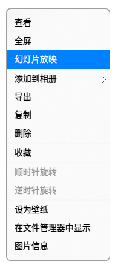
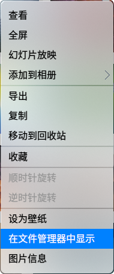
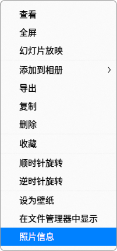
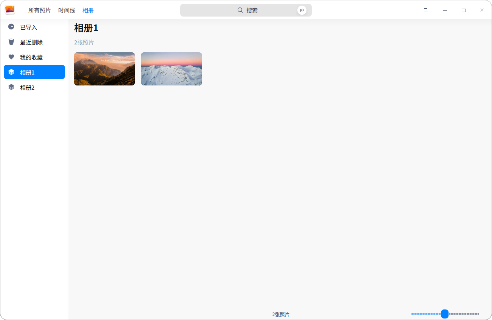
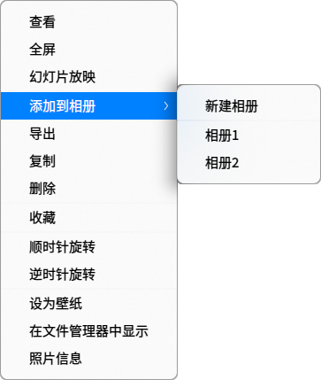

# 相册|../common/deepin-album.svg|

## 概述

相册是一款外观时尚、性能流畅的照片管理工具，支持查看、管理多种图片格式。您可以按日期时间线排列照片，还可以将照片添加到个人收藏，或者归类到不同的相册中，将照片管理得井井有条。

## 使用入门

通过以下方式运行或关闭相册，或者创建相册的快捷方式。

### 运行相册

1. 点击桌面底部的  ，进入启动器界面。
2. 上下滚动鼠标滚轮浏览或通过搜索，找到相册 点击运行。
3. 右键单击 ，您可以：
 - 点击 **发送到桌面**，在桌面创建快捷方式。
 - 点击 **发送到任务栏**，将应用程序固定到任务栏。
 - 点击 **开机自动启动**，将应用程序添加到开机启动项，在电脑开机时自动运行该应用。

> ：您可以在控制中心将相册设置为默认的照片查看程序，具体操作请参考 [默认程序设置](dman:///dde#默认程序设置)。

### 关闭相册

- 在相册界面点击   ，退出相册。
- 在任务栏右键单击 ，选择 **关闭所有** 来退出相册。
- 在相册界面点击  ，选择 **退出** 来退出相册。

### 查看快捷键

在相册界面上，按下  +  +  组合键来查看快捷键，熟练的使用快捷键，将大大提升您的操作效率。

## 照片管理

相册启动后，您可以通过时间线和相册来管理您的照片。

### 导入照片

在相册界面，可以采用以下方式导入照片。
- 点击 >  **导入**。
- 直接将照片或所在文件夹拖拽到界面上。

> ：当相册中尚无照片时，点击 **导入照片**，将照片导入相册管理系统。

> ：相册支持的图片格式有BMP、GIF、JPG、PNG、PBM、PGM、PPM、XBM、XPM、SVG、DDS、ICNS、JP2、MNG、TGA、TIFF、WBMP、WEBP、PSD、PDF、EPS。

### 搜索照片

1. 在相册顶部的搜索框，您可以：
   - 点击，输入关键字。
   - 点击，输入语音，语音会转化为文字显示在搜索框中。

2. 按下键盘上的 **Enter** 键后快速定位。

当没有搜索到匹配的信息时，在界面中间显示 ”无搜索结果”。

### 查看照片

在相册界面上，点击底部的滚动条可以调整照片的缩略图大小。

双击照片，或右键单击照片选择 **查看** ，进入看图界面。

| 图标                                               | 名称    | 说明                         |
| -------------------------------------------------- | ------- | ---------------------------- |
|               | 返回    | 显示返回到主界面。           |
|                      | 上一张  | 显示上一张照片。             |
|                              | 下一张  | 显示下一张照片。             |
|                | 1:1显示 | 照片按照实际尺寸显示。       |
|              | 自适应  | 照片适应窗口尺寸显示。       |
|                        | 收藏    | 将喜欢的照片添加到个人收藏。 |
|  | 顺时针  | 照片顺时针旋转90度。         |
|              | 逆时针  | 照片逆时针旋转90度。         |
|                          | 删除    | 删除当前照片。               |

&nbsp;&nbsp;&nbsp;&nbsp;&nbsp;&nbsp;&nbsp;&nbsp;&nbsp;&nbsp;&nbsp;&nbsp;&nbsp;

> ：在1:1视图下，当照片大小超出窗口范围时，会出现导航窗口。拖动导航窗口中的方框，查看该区域的图片。点击右上角的  关闭导航窗口，也可以右键单击照片，选择“隐藏导航窗口”。

### 查看时间线

在时间线中，所有照片按照日期划分，同一天的照片显示在一起，不同日期的照片分栏排列。查看时间线可以快速找到某一天的照片。

### 幻灯片放映

1. 在相册界面上，右键单击照片。
2. 选择 **幻灯片放映**，照片将以幻灯片形式全屏播放。
3. 按下键盘上的  键退出播放。

### 复制照片

1. 在相册界面上，右键单击照片。
2. 选择 **复制**。
3. 在桌面或者指定位置，单击鼠标右键。
4. 选择 **粘贴**，将照片文件复制到该位置。

### 删除照片

在相册中您可以通过如下方法删除照片：

- 查看图片时，点击界面上的   图标。
- 右键单击照片，选择 **删除**。
- 在相册界面上，按下键盘的   键。

> ：在相册中删除的照片并没有被永久删除，而是暂时存放在“最近删除”中。当照片上的剩余天数显示为0天时，照片将被永久删除。您可以提前恢复或彻底删除这里的照片。

### 收藏照片

1. 在相册界面上，右键单击照片。
2. 选择 **收藏**，照片将会添加到“个人收藏”。
3. 右键单击已收藏的照片，也可以 **取消收藏**。

> ：在查看照片时，点击界面上的，将照片加入我的收藏。再次点击，取消收藏。

### 旋转照片

1. 在相册界面上，右键单击照片。
2. 选择 **顺时针旋转/逆时针旋转**。
3. 照片将会顺时针转旋转90°/逆时针旋转90°。

### 设置为壁纸

1. 在相册界面上，右键单击照片。
2. 选择 **设为壁纸** 即可将当前照片设置为壁纸。

### 在文件管理器显示

1. 在相册界面上，右键单击照片。
2. 选择 **在文件管理器中显示**，就可以在文件管理器中打开照片所在的文件夹。

### 查看照片信息

1. 在相册界面上，右键单击照片。
2. 选择 **照片信息** 查看照片的各种信息。

## 相册管理

在相册界面，您可以新建相册，管理相册中的照片，查看所有相册。

> ：**已导入**、**最近删除**、**我的收藏** 是系统根据实际情况自动生成的，这3个相册不可删除、重命名。
> 

### 新建相册

1. 在相册界面，点击 。
2. 选择 **新建相册**。
3. 输入相册名称，按下键盘上的  键，或者单击界面的空白区域。

> ：右键单击已创建的相册，也可以新建相册。您还可以在添加照片到相册时新建相册。

### 添加照片到相册

1. 在相册界面上，右键单击照片。
2. 选择 **添加到相册**。
3. 选择一个相册，将照片添加到相册中。

> ：也可以直接拖拽照片或照片文件夹到相册中，添加照片到相册。

### 移除相册中的照片

1. 在相册界面上，右键单击相册中的照片。
2. 选择 **从相册中移除**，可以将照片从该相册中移除。

### 重命名相册

1. 在相册界面上，右键单击需要改名的相册。
2. 选择 **重命名相册**。
3. 输入相册名称，按下 键，或者单击界面的空白区域。

### 导出相册

1. 在相册界面上，右键单击一个相册。
2. 选择 **导出相册**。

### 删除相册

1. 在相册界面上，右键单击一个相册。
2. 选择 **删除**。

## 主菜单

在主菜单中，您可以[新建相册](#新建相册)、[导入照片](#导入照片)、切换窗口主题、查看帮助手册，了解相册的更多信息。

### 主题

窗口主题包含浅色主题、深色主题和系统主题，其中系统主题为默认设置。

1. 在相册界面，点击。
2. 点击 **主题**，选择一个主题颜色。

### 帮助

查看帮助手册，进一步了解和使用相册。

1. 在相册界面，点击   。
2. 点击 **帮助**。
3. 查看相册的帮助手册。

### 关于

1. 在相册界面，点击   。
2. 点击 **关于**。
3. 查看相册的版本和介绍。

### 退出

1. 在相册界面，点击 。
2. 点击 **退出**。
