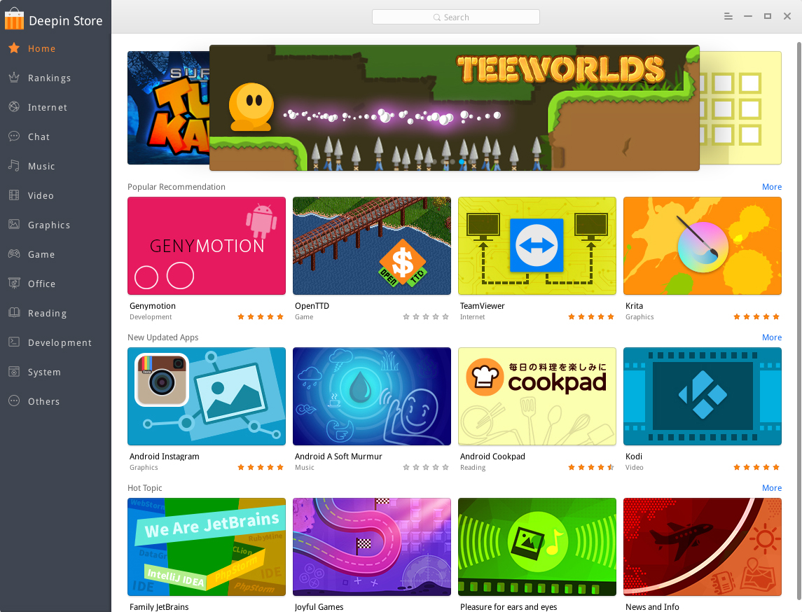
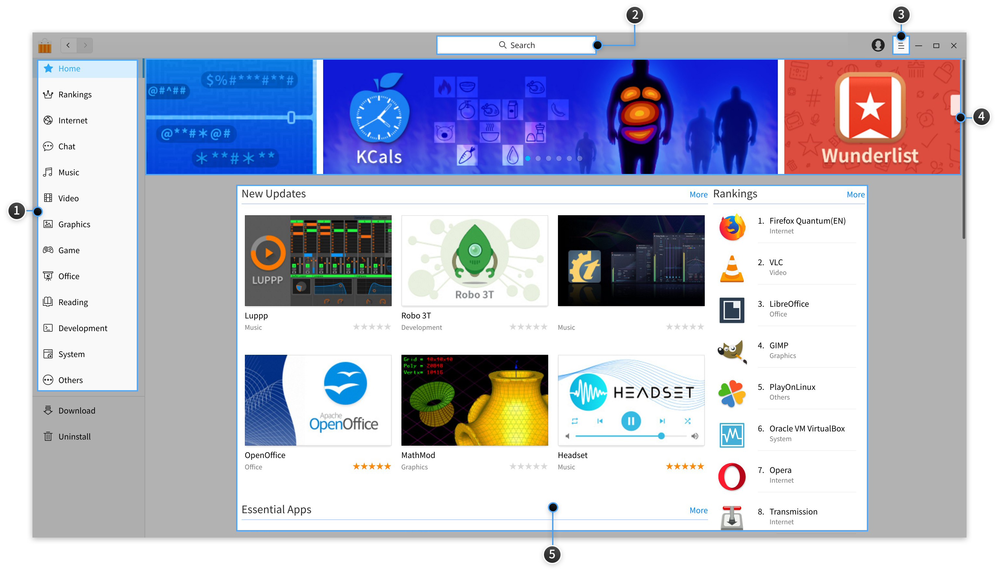
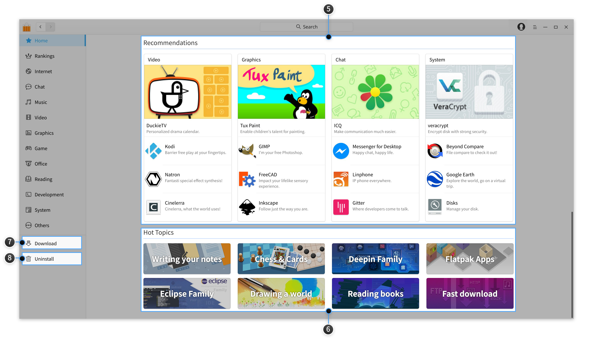
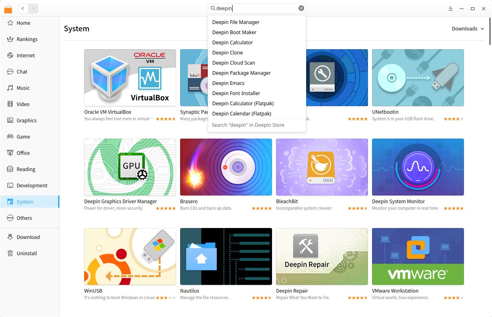
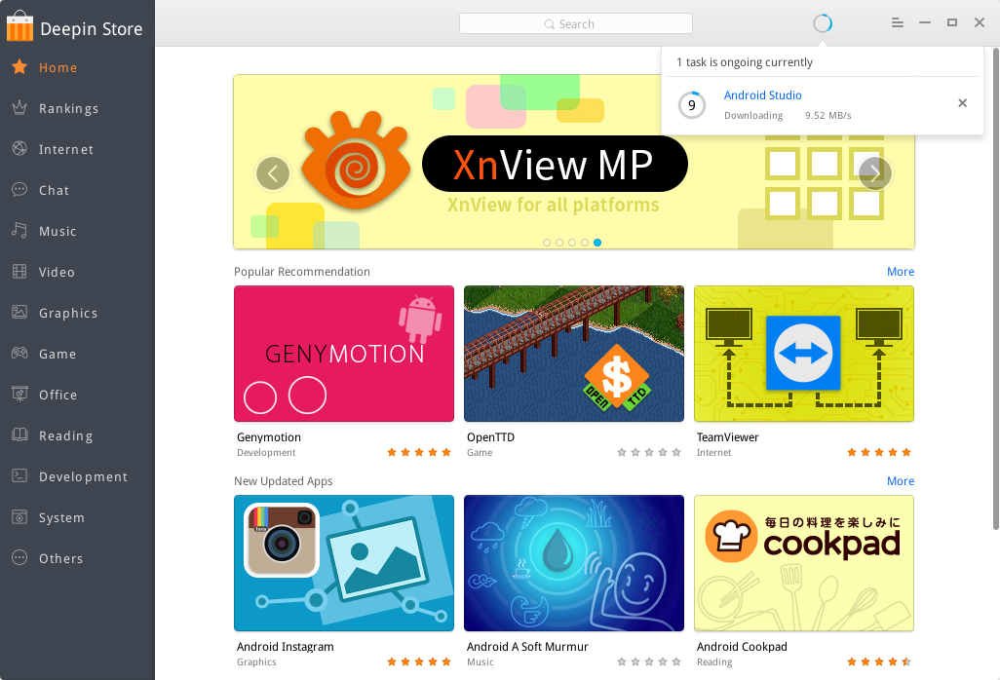
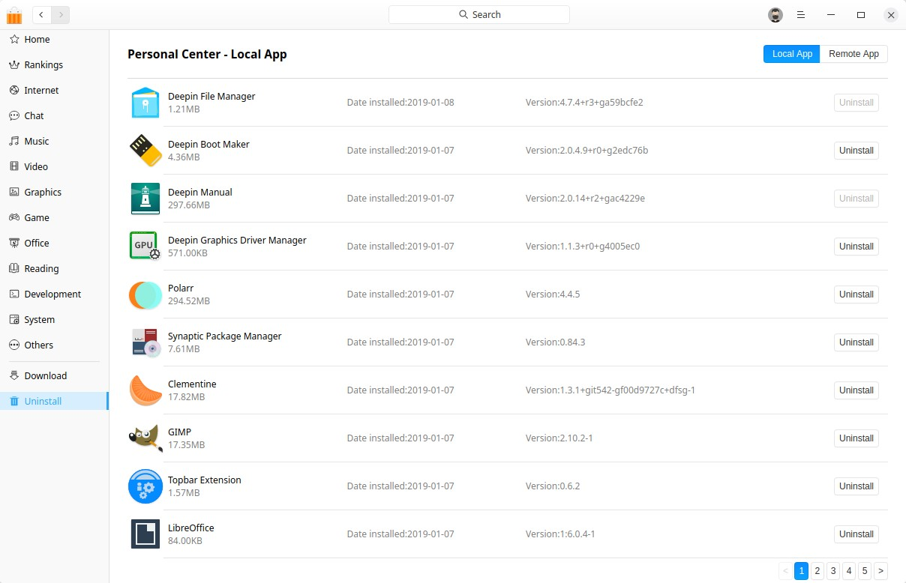
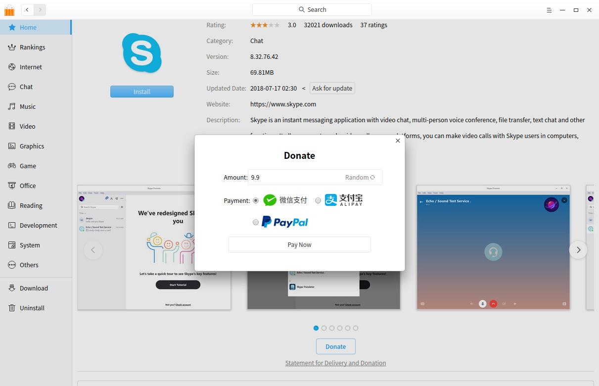
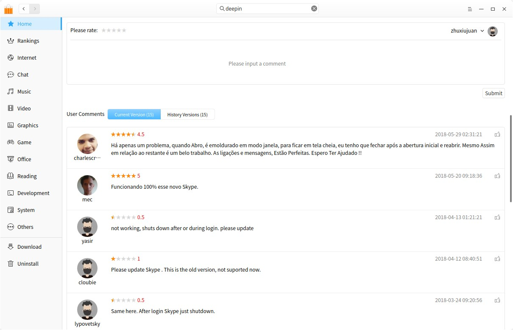
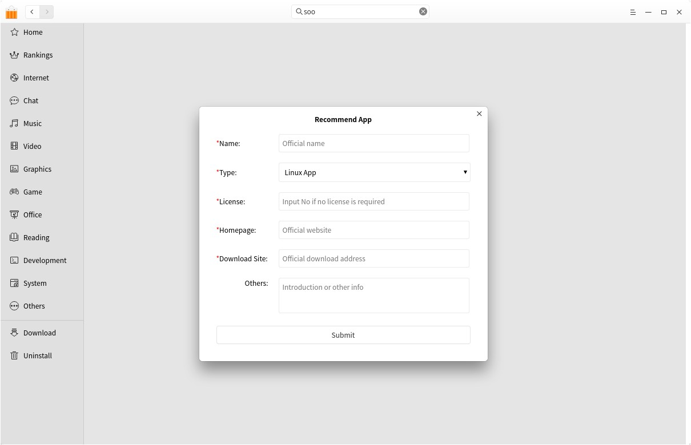

# Deepin Store|../common/deepin-appstore.svg|

## Overview
Deepin Store is an application recreated by Deepin Technology Co., Ltd. with the integration of application display, downloading, installation, uninstallation, commenting, rating, and recommendation. Deepin Store collects different types of applications for you, each one has been installed and verified manually. You can search the popular applications with one-click download and automatic installation.

 

## Basic Operations

### Run Deepin Store
You can run Deepin Store by the following operations:

1. Click on  on dock to enter launcher interface. 
2. Then click .

> : Deepin Store has been fixed on Dock by default, you can click on  on Dock to run it.

### Maximize/Minimize Deepin Store

- On Deepin Store interface, click on  to maximize Deepin Store. To restore to the normal size, click on .
- On Deepin Store interface, click on   to minimize Deepin Store to Dock. To restore the display, click on  on Dock.

### Close Deepin Store

- On Deepin Store interface, click on  to exit.
- Right-click on  on Dock to select **Close All** to exit.
- On Deepin Store interface, select [Exit](#Exit) in the main menu.

## Main Interface
The main interface consists of navigation bar, search box, main menu, flashview, columns, hot topics, download and uninstall management.

<table class="block1">
    <caption>Main Interface</caption>
    <tbody>
        <tr>
            <td width="25px">1</td>
            <td width="95px">Navigation Bar</td>
            <td>Navigation bar mainly displays the home page, rankings and application categories of Deepin Store. </td>
        </tr>
        <tr>
            <td>2</td>
            <td>Search Box</td>
            <td>Users can quickly search applications in Deepin Store by search box. </td>
        </tr>
            <tr>
            <td>3</td>
            <td>Main Menu</td>
            <td>You can sign in, recommend app, select China or International region, clear cache, view the manual and version info, and exit Deepin Store in it. </td>
        </tr>
        <tr>
            <td>4</td>
            <td>Flashview</td>
            <td>Images of recommended applications will be circularly played in flashview. </td>
        </tr>
         <tr>
            <td>5</td>
            <td>Columns</td>
            <td>Home columns are mainly to display new updates, essential apps, popular apps, recommendations, rankings. </td>
        </tr>
        <tr>
            <td>6</td>
            <td>Hot Topics</td>
            <td>Hot topics are mainly to display applications with the same topics. </td>
        </tr>
        <tr>
            <td>7</td>
            <td>Download Management</td>
            <td>Download management is mainly to display the current downloading tasks, downloading and installing progress. You can pause and delete the tasks. </td>
        </tr>
        <tr>
            <td>8</td>
            <td>Uninstallation</td>
            <td>You can view all installed apps in it, and remove any app you do not need. </td>
        </tr>
    </tbody>
 </table>

## Application Management
You can search, download and install different categories of applications by Deepin Store. Meanwhile, more wonderful applications will be explored through flashview, new updates, essential apps, popular apps, recommendations, hot topics, rankings,  user comments and other ways.

### Search Applications
Search function is built in Deepin Store. Search result will be automatically shown below after you input a keyword. Press  on keyboard to display all applications containing that keyword.

### Download/Install Applications
Deepin Store offers one-click download and installation of applications. During the downloading and installing process, you can pause and delete, as well as view the current progress.

1. On Deepin Store interface, click the application image to enter app page.
2. Click on  to automatically download and then install in **Download**.

> : You can directly hover mouse over the application image or name, then click .

> : The installed app will be shown in **Uninstall**.

### Update/Upgrade Application

To update the applications, you can set in Control Center, specific operations refer to [Update Settings](dman:///dde#Update Settings).

> : Besides update the applications, you also can update and upgrade the system in Control Center.

### Uninstall Applications

Besides uninstalling applications in Launcher (specific operations refer to [Uninstall Applications](dman:///dde#Uninstall Applications), you can directly uninstall apps in Deepin Store.
- In **Uninstall** page, find the application to remove, click .

## Application Page

### Application Details
The application page displays the downloads, rating,  comments, category, version, package size, updated date, description, screenshots and so on. You can get a full understanding of the application in it.

> ：Click the screenshots to view in large ones.

### Ask for Update

Click **Ask for update** to submit your request for a new version, so that the application update will be scheduled more quickly.

### Donate

1. Click **Donate**, input the amount or click "Random" to generate an amount.
2. Choose a paying method, and click **Pay Now** to donate.

> ：This function is developed for application developers and packagers, who can get the donation from users according to donation rules.

### Comment and Rate
Please comment on and rate applications after signed in Deepin Store, otherwise you can only view comments and ratings. Your comments and ratings will be displayed after submitted successfully. And, you only can comment once on the current version.

> : If you need to know the information of signing up and signing in, please refer to [Sign In](#Sign In).

> : You can click the icon at the right to like the comment.

## Main Menu

### Sign In
You can sign in Deepin Store with your account in deepin forum.

1. On Deepin Store interface, click on .
2. Click on **Sign In**.
3. Input username and password.
4. If you want to enable auto-Sign-in, please click on **Remember me**.
5. Click on **Sign In**.

> : If you don't have an account, you can click on **Sign Up** in the pop-up box to sign up.

### Recommend App
If you want a new app in Deepin Store, please click "Recommend App" in main menu to submit your request.
1. On Deepin Store interface, click on .
2. Click on **Recommend App**.
3. Input app name, type, license, homepage, download site and other info.
4. Click on **Submit**.

### Select Region
Deepin Store has two regions: China and international, which has different applications based on user preferences.
1. On Deepin Store interface, click on .
2. Click on **Select Region**.
3. Choose **China** or **International**.

### Clear Cache
1. On Deepin Store interface, click on .
2. Click on **Clear Cache** to clear the package caches.

### Dark Theme

1. On Deepin Store interface, click on .
2. Select **Dark Theme**.
3. The interface will switch to dark theme.

### Help
Click "Help" to get the manual, which will help you further know and use Deepin Store.

1. On Deepin Store interface, click on .
2. Click on **Help** to view the manual of Deepin Store.

### About

1. On Deepin Store interface, click on .
2. Click on **About** to view the version and introduction of Deepin Store.

### Exit

1. On Deepin Store interface, click on .
2. Click on **Exit** to exit Deepin Store.

