# Deepin Store|../common/deepin-appstore.svg|

## Vistazo
Deepin Store V5.0 (tienda de Deepin) es una aplicación creada por Deepin Technology Co., Ltd. para interactuar la visualización, descarga, instalación, retroalimentación, puntuación y recomendación de aplicaciones. Deepin Store recopila diferentes tipos de aplicaciones para usted, cada una instalada y comprobada manualmente. Puede buscar las aplicaciones populares e instalar automáticamente en un clic.

 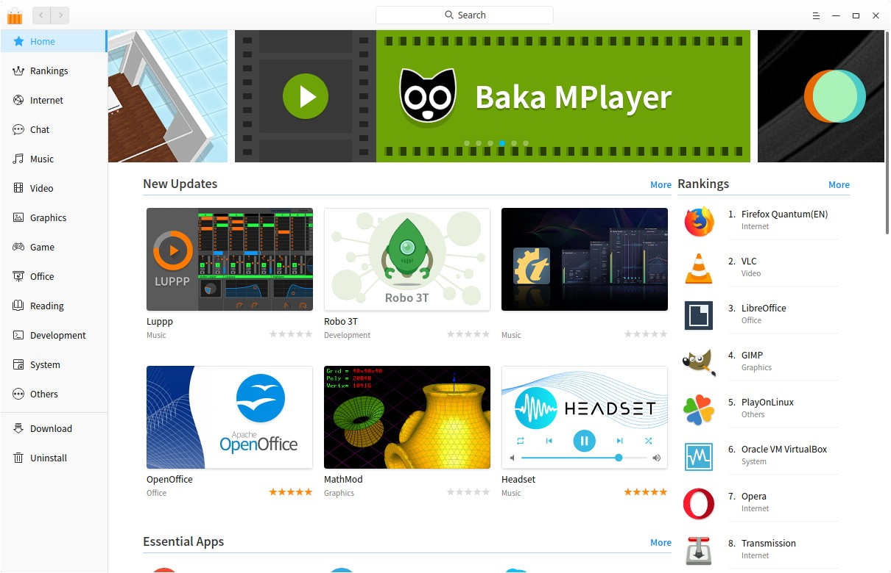

## Operaciones Básicas

### Iniciar Deepin Store
Puede iniciar Deepin Store siguiendo estos pasos:

1. Clic en  en el muelle para entrar a la interfaz del lanzador.
2. Después haga clic .

> : Deepin Store está anclada al Muelle por defecto, puede hacer clic en  en el Muelle para iniciar.

### Maximizar/Minimizar Deepin Store

- En la interfaz de Deepin Store, clic en  to para expandir la ventana de Deepin Store. Para restaurar al tamaño normal, haga clic en .
- En la interfaz de Deepin Store, clic en  para minimizar Deepin Store al Muelle. Para recuperar la ventana, clic en  del Muelle.

### Cerrar Deepin Store

- En la interfaz de Deepin Store, clic en  para salir.
- Clic derecho en  del Muelle y seleccione **Cerrar todo** para salir.
- En la interfaz de Deepin Store, seleccione [Exit](#Exit) en el menú principal.

## Interfaz principal
La interfaz principal consta de barra de navegación, cuadro de búsqueda, menú principal, vista de flash, columnas, temas candentes, administración de descarga y desinstalación.

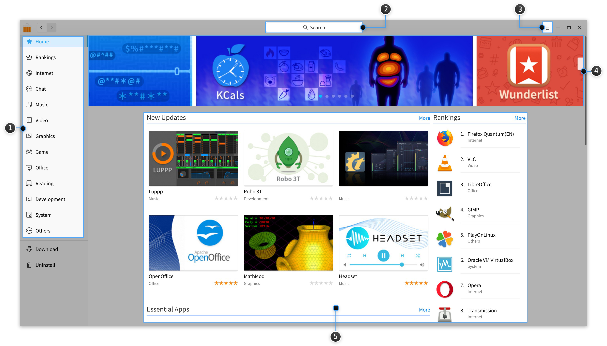

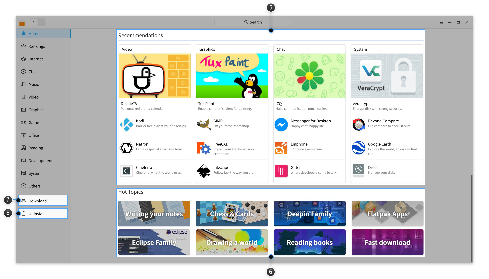

<table class="block1">
    <caption>Interfaz principal</caption>
    <tbody>
        <tr>
            <td width="25px">1</td>
            <td width="95px">Barra de navegación</td>
            <td>La barra de navegación muestra principalmente la página de inicio, los rankings y las categorías de aplicaciones de Deepin Store. </td>
        </tr>
        <tr>
            <td>2</td>
            <td>Barra de búsqueda</td>
            <td>Los usuarios pueden buscar rápidamente aplicaciones en Deepin Store por cuadro de búsqueda. </td>
        </tr>
            <tr>
            <td>3</td>
            <td>Menú principal</td>
            <td>Puede iniciar sesión, recomendar una aplicación, seleccionar la región China o Internacional, borrar la caché, ver el manual y la información de la versión, y salir de Deepin Store en ella. </td>
        </tr>
        <tr>
            <td>4</td>
            <td>Vista rápida</td>
            <td>Muestra imágenes de aplicaciones cíclicamente en la vista rápidamente.</td>
        </tr>
         <tr>
            <td>5</td>
            <td>Columnas</td>
            <td>Las columnas de inicio son principalmente indicadores de nuevas actualizaciones, programas escenciales, populares, recomendadas y puntuadas.</td>
        </tr>
        <tr>
            <td>6</td>
            <td>Populares</td>
            <td>La lista popular es principalmente para mostrar aplicaciones con los mismos temas. </td>
        </tr>
        <tr>
            <td>7</td>
            <td>Administración de descargas</td>
            <td>La gestión de descarga se debe principalmente a mostrar las tareas de descarga actuales, descargar e instalar el progreso. Puede pausar y eliminar las tareas.</td>
        </tr>
        <tr>
            <td>8</td>
            <td>Desinstalación</td>
            <td>Puede ver todas las aplicaciones instaladas en él y eliminar cualquier aplicación que no necesite.</td>
        </tr>
    </tbody>
 </table>

## Application Management
Puede buscar, descargar e instalar diferentes categorías de aplicaciones en Deepin Store. Mientras tanto, se explorarán aplicaciones más maravillosas a través de vista rápida, nuevas actualizaciones, aplicaciones esenciales, aplicaciones populares, recomendaciones, lista popular, clasificaciones, comentarios de los usuarios y otras formas.

### BUscar aplicaciones
La función de búsqueda está integrada en Deepin Store. Los resultados de búsquedas serán mostradas automáticamente en la parte inferior después de ingresar una palabra clave. Pulse  en el teclado para mostrar todas aplicaciones que llevan la palabra clave.

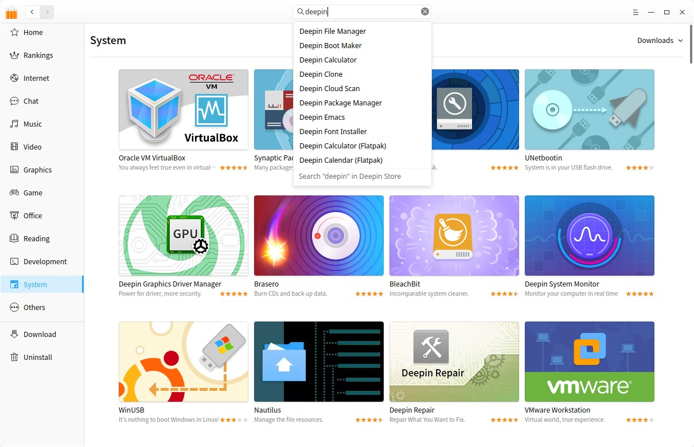

### Download/Install Applications
Deepin Store ofrece descarga e instalación de aplicaciones con un solo clic. Durante el proceso de descarga e instalación, puede pausar y eliminar, así como mirar el progreso actual.

1. En la interfaz de Deepin Store, clic the application image to enter app page.
2. Clic en  para descargar automáticamente y después instala en **Descargar**.

> : Puede pasar el mouse directamente sobre la imagen o el nombre de la aplicación, luego hacer clic en .

> : La aplicación instalada será mostrada en la sección **Desinstalar**.

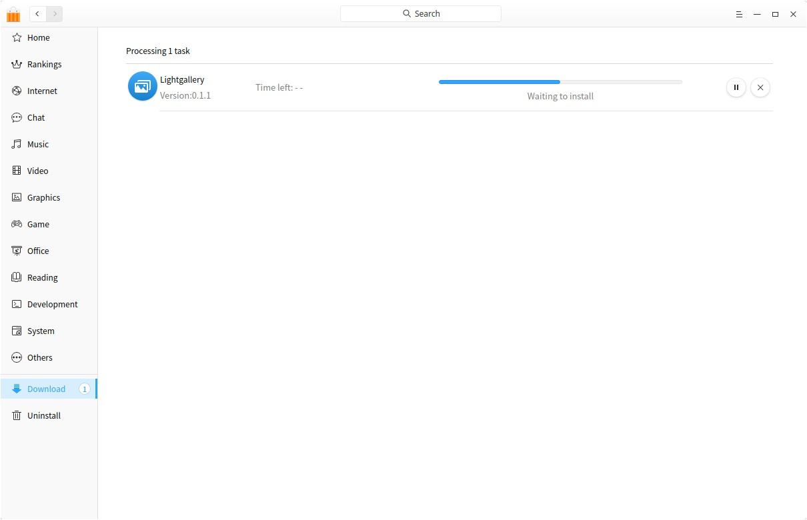

### Update/Upgrade Application

Si necesita descargar e instalar actualizaciones de aplicaciones, puede ajustar en el Centro de control, el procedimiento detallado lo encuentra en [Ajustes de actualización](dman:///dde#Ajustes de actualización).

> : Además de las aplicaciones de actualización y actualización, también puede actualizar y actualizar el sistema en el Centro de control.

### Uninstall Applications

Además de desinstalar aplicaciones en el Lanzador (pasos detallados lo encuentra en [Desinstalar aplicaciones](dman:///dde#Desinstalar aplicaciones), puede desinstalar aplicaciones desde la Deepin Store.
- En la sección **Desinstalar**, localice la aplicación para remover y haga clic en .

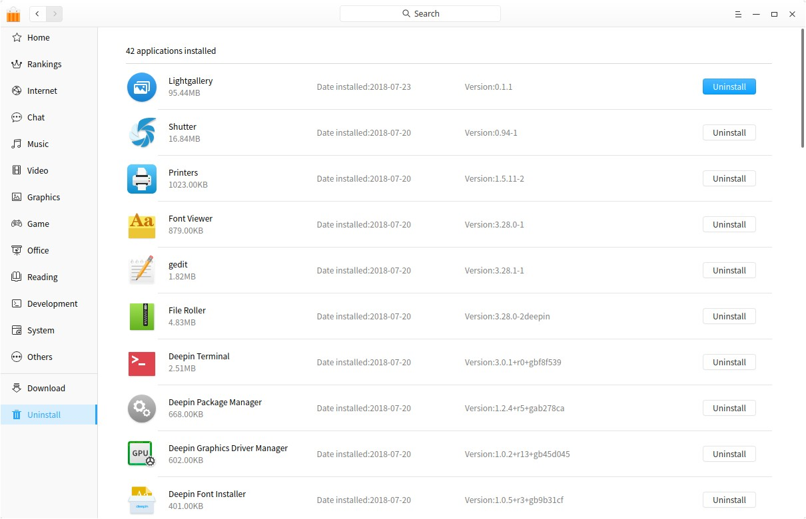

## Página de la aplicación

### Application Details
La página de la aplicación muestra las descargas, la calificación, los comentarios, la categoría, la versión, el tamaño del paquete, la fecha de actualización, la descripción, las capturas de pantalla, etc. Puede obtener una comprensión completa de la aplicación en él.

> ：Clic en las capturas de pantalla para ver de forma extendida.

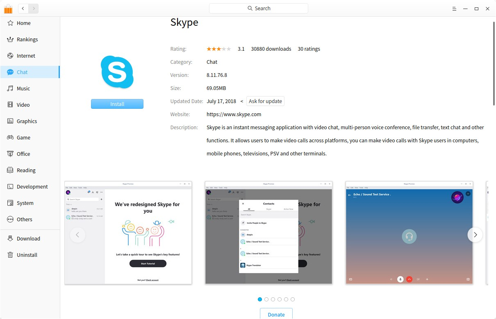

### Solicitar actualización

Clic **Solicitar actualización** para enviar su solicitud de una versión actualizada, para que la actualización de la aplicación sea programa lo más pronto.

### Donate

1. Clic en **Donar**, ingrese en el monto o clic en input the amount or clic en "Aleatorio" para generar el monto.
2. Seleccione un método de pago, y haga clic en **Pagar Ahora** para donar.

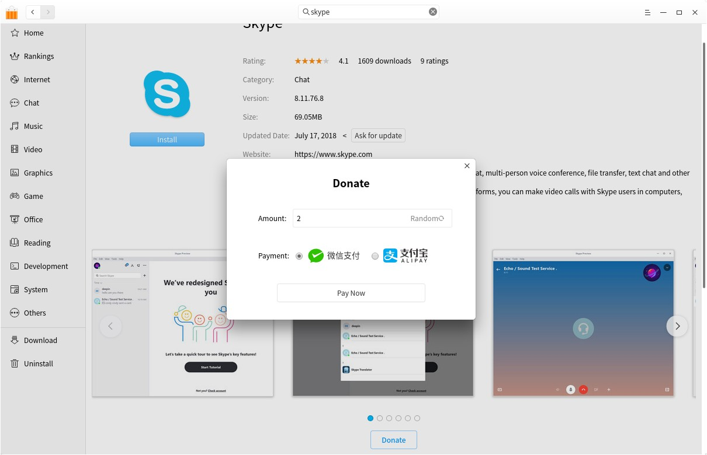

> ：Esta función está enfocada a desarrolladores de aplicaciones y empaquetadores, quienes pueden obtener la contribución de los usuarios de acuerdo con las reglas de donación.

### Comentar y Valorar
Por favor comente o califique las aplicaciones después de ingresar en la Deepin Store, de lo contrario, solo puede ver comentarios y calificaciones. Sus comentarios y calificaciones se mostrarán luego de ser enviados exitosamente. Y, solo puedes comentar una vez en la versión actual.

> : If you need to know the information of signing up and signing in, please refer to [Sign In](#Sign In).

> : You can clic the icon at the right to like the comment.

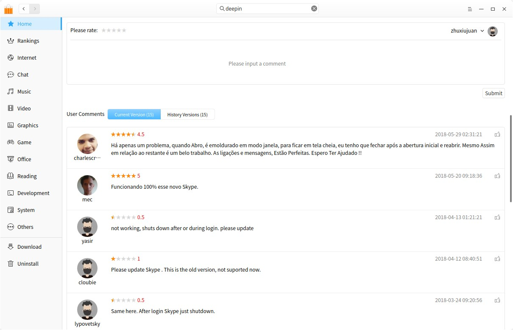

## Menú principal

### Inciar sesión
Puede ingresar a la Deepin Store con su cuenta del foro de deepin.

1. En la interfaz de Deepin Store, clic en .
2. Clic en **Iniciar sesión**.
3. Ingrese el nombre de usuario y contraseña.
4. Si desea iniciar sesión permanentemente, clic en **Remember me**.
5. Clic en **Sign In**.

> : Si no tiene una cuenta, puede hacer clic en **Sign Up** a la ventana emergente para registrarse.

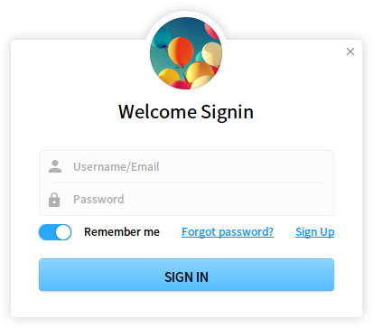

### Recomendar aplicación
Si desea una nueva aplicación en Deepin Store, por favor, haga clic en "Recommend App" in main menu to submit your request.
1. En la interfaz de Deepin Store, clic en .
2. Clic en **Recomendar aplicación**.
3. Ingrese el nombre de la aplicación, tipo, licencia, sitio web, lugar para descarga y otra información.
4. Clic en **Enviar**.

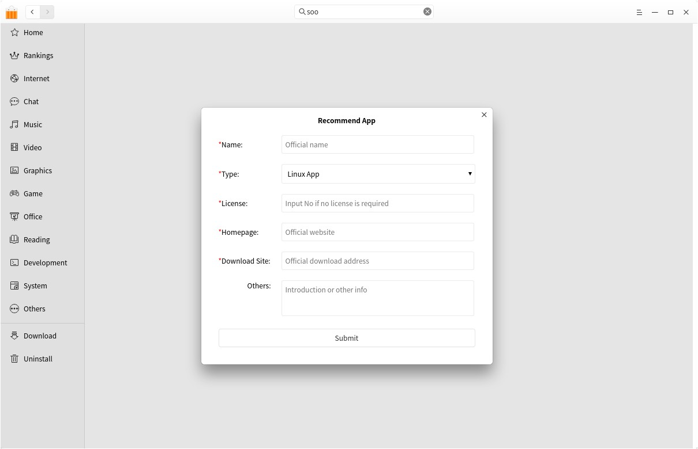

### Seleccionar Región
Deepin Store tiene dos regiones: China e internacional, que tiene diferentes aplicaciones basadas en las preferencias del usuario.
1. En la interfaz de Deepin Store, clic en .
2. Clic en **Seleccionar Región**.
3. Escoga **China** o **Internacional**.

### Limpiar caché
1. En la interfaz de Deepin Store, clic en .
2. Clic en **Limpiar caché** para eliminar la caché de paquetes.

### Ayuda
Clic en "Ayuda" para obtener el manual, que le ayudará a conocer y utilizar Deepin Store.

1. En la interfaz de Deepin Store, clic en .
2. Clic en **Ayuda** para ver el manual de la Deepin Store.

### Acerca de

1. En la interfaz de Deepin Store, clic en .
2. Clic en **Acerca de** para ver la versión y presentación de la Deepin Store.

### Salida

1. En la interfaz de Deepin Store, clic en .
2. Clic en **Salir** para cerrar Deepin Store.
