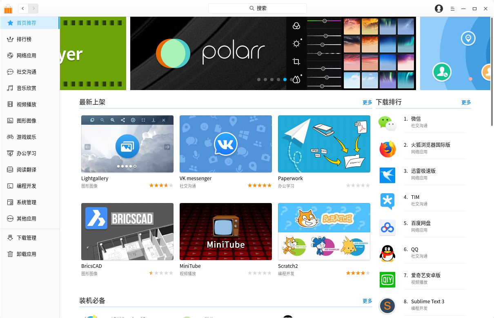
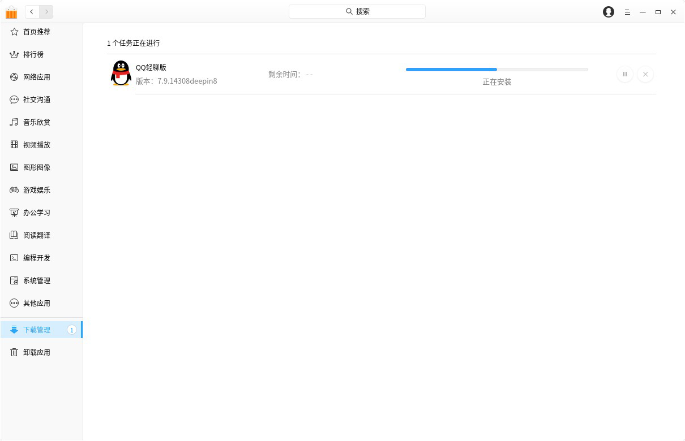

# 深度商店|../common/deepin-appstore.svg|

## 概述
深度商店是深度科技重新打造的一款集应用展示、下载、安装、卸载、评论、评分、推荐于一体的应用程序。深度商店为您精心筛选和收录了不同类别的应用，每款应用都经过人工安装并验证。您可以进入商店搜索热门应用，一键下载并自动安装。

## 基本操作

### 运行深度商店
您可以通过执行以下操作来运行深度商店：

1. 点击任务栏上的  进入启动器界面。
2. 通过浏览找到  点击。

>  ：深度商店已经默认固定在任务栏上，您也可以点击任务栏上的  。

### 最大/最小化深度商店

- 在深度商店界面，点击  最大化图标，深度商店将窗口最大化显示。如果要恢复正常显示，请点击  恢复原始窗口。
- 在深度商店界面，点击  最小化图标，深度商店将最小化到任务栏。如果要恢复显示，请点击任务栏上的  商店图标。

### 关闭深度商店

- 在深度商店界面，点击  关闭图标，退出深度商店。
- 右键单击任务栏上的  商店图标，选择 **关闭所有** 来退出深度商店。
- 在深度商店界面，点击主菜单，选择 [退出](#退出)。

## 主界面
深度商店主界面由导航栏、搜索框、主菜单、首页轮播、首页栏目、热门专题、下载管理、和卸载应用组成。

<table class="block1">
    <caption>主界面</caption>
    <tbody>
        <tr>
            <td width="20px">1</td>
            <td width="100px">导航栏</td>
            <td>导航栏主要显示深度商店的首页、排行榜以及应用分类。</td>
        </tr>
        <tr>
            <td>2</td>
            <td>搜索框</td>
            <td>用户可以通过搜素框快速查找深度商店中的所有应用。</td>
        </tr>
         <tr>
            <td>3</td>
            <td>主菜单</td>
            <td>通过主菜单您可以登录深度商店、推荐应用、选择地区、清除缓存、查看帮助手册、关于信息、退出深度商店。</td>
        </tr>
        <tr>
            <td>4</td>
            <td>首页轮播区域</td>
            <td>首页轮播区域主要循环播放推荐应用的图片。</td>
        </tr>
         <tr>
            <td>5</td>
            <td>首页栏目区域</td>
            <td>首页栏目区域主要展示最新上架、装机必备、热门推荐、分类推荐、排行榜。</td>
        </tr>
        <tr>
            <td>6</td>
            <td>首页专题区域</td>
            <td>首页专题区域主要展示热门专题的应用合集。</td>
        </tr>
        <tr>
            <td>7</td>
            <td>下载管理</td>
            <td>下载管理主要显示当前下载任务，下载及安装进度，您还可以暂停和删除下载任务。</td>
        </tr>
        <tr>
            <td>8</td>
            <td>卸载应用</td>
            <td>在卸载应用中，您可以查看已安装的所有应用，卸载您不需要的应用。</td>
        </tr>
    </tbody>
 </table>

## 应用管理
您可以通过深度商店搜索、下载、安装不同分类的应用，同时还可以根据轮播图、最新上架、装机必备、热门推荐、分类推荐、热门专题、下载排行、星级排行、用户评论等不同方式挖掘更多精彩应用。

### 搜索应用
深度商店中自带搜索功能，您只需在搜索框中输出关键字，将自动在下方显示含该关键字的应用名称。按下键盘上的  键，可查看包含该关键字的所有应用。

### 下载/安装应用
深度商店提供一键式的应用下载和安装，无需手动处理，同时在下载安装应用的过程中，您可以暂停、删除等操作，还可以查看当前应用的下载速度和安装进度。

1. 在深度商店界面，点击应用的封面图， 进入该应用的详情界面。
2. 点击 ，将自动进入 **下载管理** 下载并安装。

> ：您还可以直接将鼠标悬停在应用的封面图或名称上，点击  。

> ：安装完成的应用会显示在 **卸载应用** 中 。

### 更新/升级应用

如果您需要更新和升级应用，可以通过控制中心来设置更新和升级应用，具体操作请参阅 [更新设置](dman:///dde#更新设置)。

> ：除了更新和升级应用，如果系统版本存在更新，您还可以通过控制中心更新和升级系统。

### 卸载应用

除了通过启动器卸载应用（具体操作请参阅 [卸载应用](dman:///dde#卸载应用)），您还可以直接在深度商店进行卸载。

- 在 **卸载应用 **页面，找到您要卸载的应用，点击 。

## 应用界面

### 应用详情
您可以进入应用详情界面，了解应用的状态、下载量、评分、评论、分类、版本、软件包大小、更新日期、应用简介和截图等信息。

> ：点击截图可以放大查看。

### 催更
点击 **催促更新** 以反馈该应用有新版本，以便深度团队尽快更新应用。

> ：需登录后，点击生效。

### 赞赏

1. 点击 **赞赏**，输入赞赏金额或者点击“随机金额”。
2. 选择支付方式，点击 **立即支付** 按钮，扫描二维码支付。

> ：应用赞赏功能是为帮助广大开源爱好者进行的探索，应用开发者和打包者可以根据规则提取用户打赏的金额。

### 评论和评分
您可以登录到深度商店，对应用进行评论或评分，但评论和评分必须同时提交才能成功，而且当前版本应用的评论和评分只能评论一次，如果您未登录则只能查看评论和评分。

> ：如果您需要了解注册和登录的信息，具体操作请参阅 [登录](#登录)。

> ：您还可以点击评论右侧的图标，点赞该条评论。

## 主菜单

### 登录
使用深度科技论坛已注册的帐号直接登录深度商店。

1. 在深度商店界面，点击 。
2. 点击 **登录**。
3. 输入用户名和密码。
4. 如果需要开启自动登录功能，请点击 **记住密码** 开关按钮。
5. 点击 **登录**。

> ：如果您未注册帐号，通过点击弹出框中的 **注册** 按钮跳转到页面中进行注册。

### 推荐应用
若您希望在深度商店上架某个应用，请推荐应用。
1. 在深度商店界面，点击 。
2. 点击 **推荐应用**。
3. 输入应用名称、应用类型、授权情况、应用主页、下载地址和其他信息。
4. 点击 **提交**。

### 选择地区
深度商店现分为两个区：中国区和国际区，根据用户的使用偏好上架不同的应用。
1. 在深度商店界面，点击 。
2. 点击 **选择地区**。
3. 选择 **中国区** 或 **国际区**。

### 清除缓存
1. 在深度商店界面，点击 。
2. 点击 **清除缓存**，清除本地缓存的安装包。

### 深色主题
1. 在深度商店界面，点击。
2. 点击 **深色主题**，来切换主题颜色。

### 帮助
点击“帮助”获取深度商店的帮助手册，让您进一步了解和使用深度商店。

1. 在深度商店界面，点击 。
2. 点击 **帮助**，查看关于深度商店的帮助手册。

### 关于
点击“关于”查看深度商店的版本介绍。

1. 在深度商店界面，点击 。
2. 点击 **关于**，查看深度商店的版本和介绍。

### 退出
您可以进入菜单栏点击退出深度商店。

1. 在深度商店界面，点击 。
2. 点击 **退出**。
