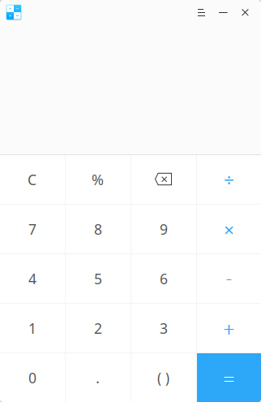

# Calculadora Deepin|../common/deepin-calculator.svg|

## Vistazo

Calculadora Deepin es una simple y fácil manera de usar la calculadora del escritorio. Admite suma, resta, multiplicación y división con entrada de teclado perfectamente encajado como computación simbólica tolerante a fallos.

## Operaciones comunes

### Introducción a símbolos

<table class="block1">
    <caption></caption>
    <tbody>
        <tr>
            <td>0~9</td>
            <td>Teclado numérico Key</td>
            <td>Números arábigos básicos</td>
        </tr>
        <tr>
            <td>c</td>
            <td>Clear/Limpiar</td>
            <td>Un blic para limpiar contenido actual, doble clic para borrar todo.</td>
        </tr>
    	<tr>
            <td>%</td>
            <td>Signo de porcntaje</td>
            <td>To input percent sign</td>
        </tr>
    	<tr>
            <td></td>
            <td>Borrar</td>
            <td>One click to delete a character</td>
        </tr>
    	<tr>
            <td>+-×÷</td>
            <td>Suma, resta, multiplicación y división</td>
            <td>Operadores matemáticos básicos.</td>
        </tr>
        <tr>
            <td>.</td>
            <td>Punto decimal</td>
            <td>Para introducir un punto decimal.</td>
        </tr>
        <tr>
            <td>()</td>
            <td>Paréntesis</td>
            <td>Para introducir paréntesis y completar automáticamente los paréntesis de inicio y final.</td>
        </tr>
        <tr>
            <td>=</td>
            <td>Signo final</td>
            <td>Para obtener el resultado</td>
        </tr>
    </tbody>
</table>

> : You can select the current line by mouse to edit and copy.

### Computación simbólica tolerante a fallos

Calculadora Deepin soporta operaciones en teclado y computación de simbólica tolerante a fallos, además de los números normales y símbolos de operación.

- Procedimiento de multiplicación tolerante a fallos: Al ingresar aterisco (\*) y la letra x para activar la multiplicación;
- Procedimiento de sustración tolerante a fallos: Al ingresar menos (-) y la línea de subrayado (\_) para activar la sustracción;
- Procedimiento de paréntesis tolerante a fallos: IngresaInput open and close brackets to trigger bracket;
- Procedimiento de igualdad tolerante a fallos: Al ingresar = en Inglés y Chino para activar el signo de igual;
- Procedimiento de símbolo de limpieza tolerante a fallos: Al presionar Esc para activar la limpieza;
- Procedimiento de símbolo de borrado tolerante a fallos: Al presionar la tecla de retroceso para activar el borrado;

## Menú principal

### Cambiar tema

El tema de la Calculadora Deepin es luminosa (clara) por defecto, puede hacer clic en **Tema oscuro** para cambiar.

1. En la interfaz de la Calculadora Deepin, clic en .
2. Seleccione **Tema oscuro**.
3. La interfaz cambiará al tema oscuro.

### Ayuda

1. En la interfaz de la Calculadora Deepin, clic en .
2. Seleccione **Ayuda**.
3. Observe el manual.

### Acerca de

1. En la interfaz de la Calculadora Deepin, clic en .
2. Seleccione **Acerca de**.
3. Observe la descripción de la versión.

### Salida

1. En la interfaz de la Calculadora Deepin, clic en .
2. Clic en **Salir** para cerrar.
