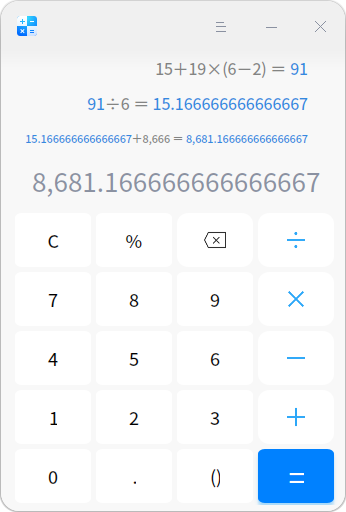

# 计算器|../common/deepin-calculator.svg|

## 概述

计算器是一款简单易用的桌面计算器，支持加减乘除运算。完美支持键盘输入，在键盘输入时还支持符号容错，最多可以显示三行计算结果。

## 操作介绍

### 界面符号介绍

| 图标                       | 名称     | 说明                                                         |
| -------------------------- | -------- | ------------------------------------------------------------ |
| 0~9                        | 数字键   | 基本阿拉伯数字。                                             |
| c                          | 清除     | 点击一次清除当前的表达式内容，连续按两次清空所有表达式历史。 |
| %                          | 百分号   | ⽤来输⼊百分号。                                             |
|  | 删除     | 点击⼀次向前删除⼀个字符。                                   |
| +-×÷                       | 加减乘除 | 基本数学运算符，用来进行加法、减法、乘法、除法运算。         |
| .                          | 小数点   | 用来输入小数点。                                             |
| ()                         | 括号     | 用来输入括号，左右括号自动补全。如果从键盘输入，一次输入左圆括号，再次输入右括号补全，只有嵌套括号都补全完成后，才可再次输入左括号。 |
| =                          | 等于     | 用来得出计算结果。                                           |

> :您可以使用鼠标选择当前输入行，进行修改或复制操作。

### 数学符号容错

计算器支持键盘操作，除了常规的数字和运算符支持之外，还支持数学符号容错功能，让您在键盘输入表达式时，键盘的中英文状态和大小写状态，都不会影响输入表达式。

另外还支持一些特殊的符号容错：

- 乘法符号容错处理：用户输入 * (星号）、x (字母x)都会触发乘法符号激活；
- 减法符号容错处理：输入 - (减号）、_ (下划线）都会触发减法符号激活；
- 括号符号容错处理：输入 左圆括号、右圆括号都会触发括号符号激活；
- 等于号 符号容错处理：输入 = (等于号)、按Enter键都会触发等于号符号激活；
- 清除符号容错处理：输入 Esc 符号触发清除符号激活；
- 删除符号容错处理：输入 Backspace 符号触发删除符号激活；

### 数字联动

- 当一个计算表达式显示数字结果后，可以继续输入操作符号，此时，新表达式的第一个数就是上一个表达式的计算结果。例如，当前表达式是 10 + 20 = 30， 显示计算结果 30 后，键入 + 号，再输入数字9，会新建一个新的表达式为 30 + 9，按Enter键，得出新表达式的计算结果为39。
- 两个表达式产生联动后，修改上一个表达式的数字和操作符，如果其计算结果改变，则会影响与其联动的新表达式的结果。例如，两个表达式 10 + 20 = 30 和 30 +9 = 39 产生联动，如果将第一个表达式的操作符 + 号修改为 * 号，算式为 10 * 20 = 200 ， 则第二个表达式自动转变为 200 + 9 = 209；根据此规则，最多可支持9条表达式联动。
- 重新编辑含有联动数字的表达式时，修改联动数字或联动数字的表达式错误时，可以解除联动。

## 主菜单

在主菜单中，您可以切换窗口主题、查看帮助手册，了解计算器的更多信息。

### 主题

窗口主题包含浅色主题、深色主题和系统主题，其中系统主题为默认设置。

1. 在计算器界面，点击。
2. 点击 **主题**，选择一个主题颜色。

### 帮助

查看帮助手册，进一步了解和使用计算器。

1. 在计算器界面，点击 。
2. 点击 **帮助**。
3. 查看计算器的帮助手册。

### 关于

1. 在计算器界面，点击 。
2. 点击 **关于**。
3. 查看计算器的版本和介绍。

### 退出

1. 在计算器界面，点击 。
2. 点击 **退出**。

