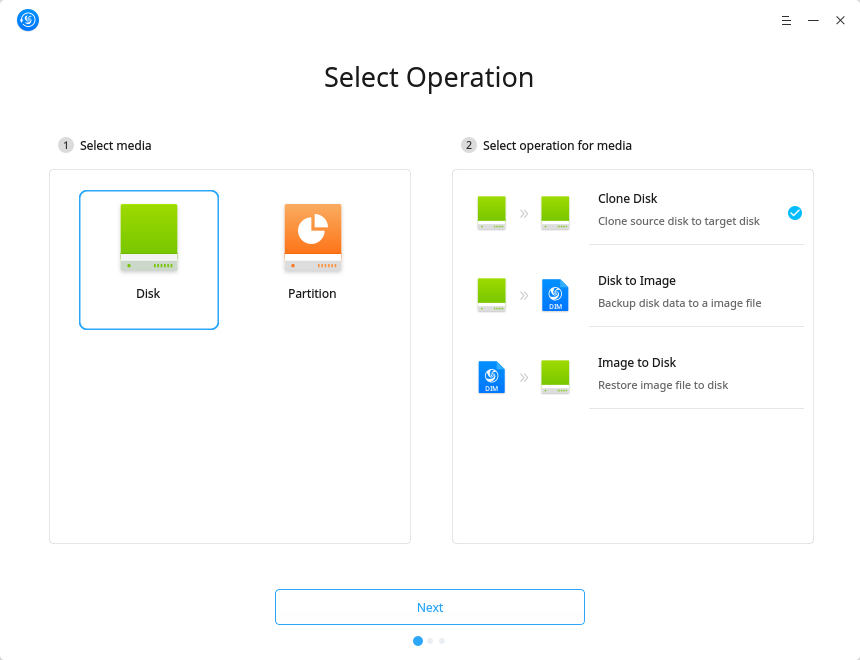
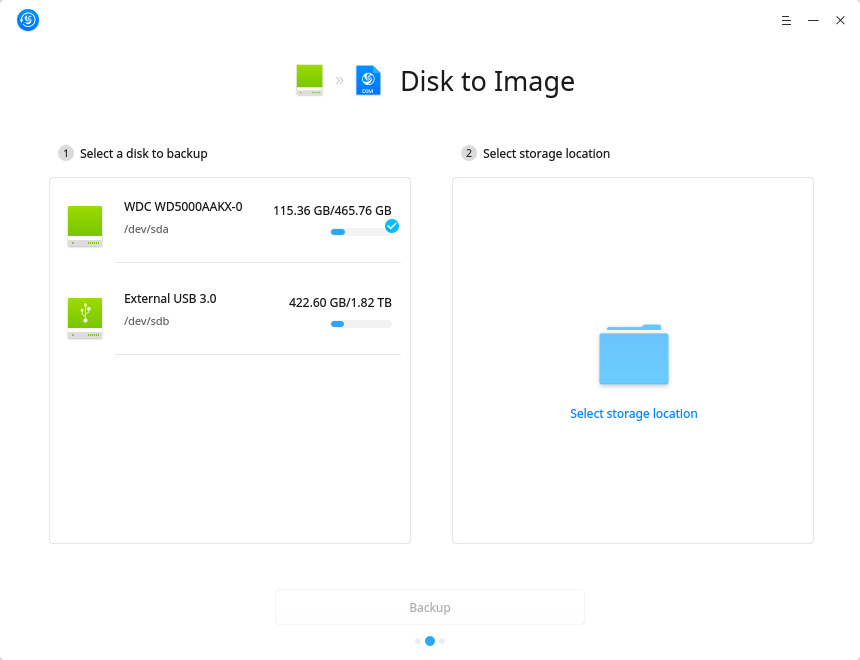

# Deepin Clone |../common/deepin-clone.svg|

## Vistazo
Deepin Clone es una poderosa herramienta de respaldo y restauración en deepin. Puede librementeclonar, respaldar (backup) y restaurar entre discos o particiones. Con Deepin Clone, ¡no se preocupe si se perdió su información jamás!

## Common Operations

### Clonar Disco
1. En la interfaz de Deepin Clone, clic en  y .
2. Clic en **Siguiente** para entrar la interfaz para Clonar Disco.
3. Seleccione el disco de origen y el disco objetivo.
4. Clic en **Clonar** para entrar la sección de Advertencia, clic en **Aceptar** para ver el proceso de clonado.
5. El icono  será mostrado, si clonar tuvo éxito, clic en **Aceptar** para salir.

> :  será mostrada, si la clonación falló, clic en **Reintentar** para volver a intentarlo.

### Clonar Partición
1. En la interfaz de Deepin Clone, clic en  y .
2. Clic en **Siguiente** para entrar interfaz para Clonar Partición.
3. Seleccione la partición de origen y la partición objetivo.
4. Clic en **Clonar** para entrar la sección de Advertencia, clic en **Aceptar** para ver el proceso de clonado.
5. El icono  será mostrado, si clonar tuvo éxito, clic en **Aceptar** para salir.

> :  será mostrada, si la clonación falló, clic en **Reintentar** para volver a intentarlo.

### Respaldar de Disco a Imagen
1. En la interfaz de Deepin Clone, clic en  y, después, en .
2. Clic en **Siguiente** para entrar la interfaz de Disco a Imagen.
3. Seleccione el disco para respaldar y la ubicación a guardar.
4. Clic en **Respaldar** para ver el proceso de respaldo.
5. El icono  será mostrado, si el respaldo tuvo éxito, clic en **Ver archivo de respaldo** para ver el archivo de imagen.

> :  será mostrada, si el respaldo falló, clic en **Reintentar** para volver a intentarlo.

### Respaldar de Partición a Imagen
1. En la interfaz de Deepin Clone, clic en  y, después, en .
2. Clic en **Siguiente** para entrar a la interfaz de Partición a Imagen.
3. Seleccione la partición a respaldar y el lugar a guardar.
4. Clic en **Respaldar** para ver el proceso de respaldo.
5. El icono  será mostrado, si el respaldo tuvo éxito, clic en **Ver archivo de respaldo** para ver el archivo imagen.

> :  será mostrada, si el respaldo falló, clic en **Reintentar** para volver a intentarlo.

### Restaurar Imagen a Disco
1. En la interfaz de Deepin Clone, clic en  y .
2. Clic en **Siguiente** para entrar a la interfaz de Imagen a Disco.
3. Seleccione el archivo de imagen respaldado y un disco para restaurar.
4. Clic en **Restaurar** para entrar la sección de Advertencia, clic en **Aceptar** para ver el proceso de restauración.
5. El icono  será mostrado, si la restauración tuvo éxito, clic en **Reiniciar** para reiniciar el equipo.

> :  será mostrada, si Restaurar falló, clic en **Reintentar** para volver a intentarlo.

### Restaurar Imagen a Partición
1. En la interfaz de Deepin Clone, clic en  y .
2. Clic en **Siguiente** para entrar a la interfaz de Imagen a Partición.
3. Seleccione el archivo de imagen respaldado y una partición para restaurar.
4. Clic en **Restaurar** para entrar la sección de Advertencia, clic en **Aceptar** para ver el proceso de restauración.
5. El icono  será mostrado, si la restauración tuvo éxito, clic en **Reiniciar** para reiniciar el equipo.

> :  será mostrada, si Restaurar falló, clic en **Reintentar** para volver a intentarlo.

### Deepin Recovery
Necesitará de reiniciar y entrar a "Deepin Recovery" (Recuperación de Deepin) para continuar los siguientes pasos, si:
- El disco o partición de origen y el disco o partición objetivo está en el lugar dónde instaló el sistema.
- La imagen de archivo está guardada en el disco o partición dónde está iniciando el sistema.
- La ubicación guardada es un disco o partición dónde instaló el sistema.
- El disco o partición para restaurar está dónde arranca el sistema operativo.

El sistema se reiniciará e ingresará a Deepin Recovery después de hacer clic en **Reiniciar para Continuar**, luego podrá continuar con el resto de operatciones de Deepin Clone.

## Menú Principal

### Ayuda

Puede hacer un clic para ver el manual, que le ayudará a conocer y usar Creador de arranque de Deepin.

1. En la la interfaz de Deepin Clone, clic en  .
2. Clic en **Ayuda**.
3. Observe el manual.

### Acerca de

Puede hacer clic para ver la descripción de la versión.

1. En la la interfaz de Deepin Clone, clic en .
2. Seleccione **Acerca de**.
3. Observe la descripción de la versión.

### Salir

Puede hacer clic para salir del Creador de arranque de Deepin.

1. En la la interfaz de Deepin Clone, clic en .

2. Clic en **Salir** para cerrar.
