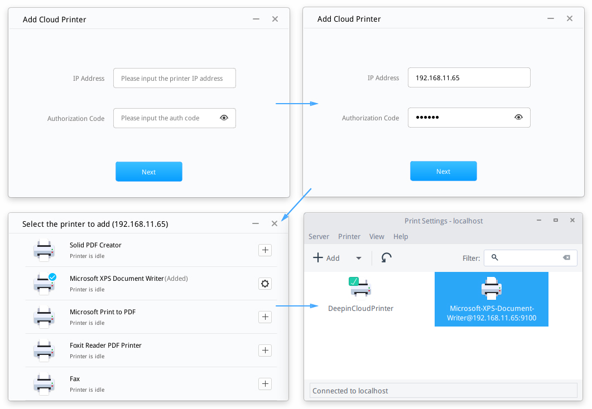
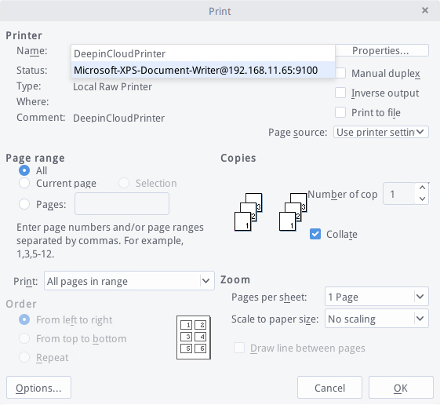

# Deepin Cloud Print|../common/deepin-cloud-print.svg|

## Overview|../common/icon_overview.svg|

Deepin Cloud Print is a new printing solution developed by Wuhan Deepin Technology Co., Ltd.. It will connect your printer to the network, and is enabled for network printing via daily used applications. Deepin Cloud Print is suitable for desktops, laptops, some tablets and other networking devices that you have authorized to print.

Deepin Cloud Print consists of Server (in Windows) and Client (in deepin), which will be configured respectively.

## Configurations of Server|../common/icon_serverconfig.svg|

You can install the application program of Deepin Cloud Print Server and configure the authorization code in Windows.

### Install Deepin Cloud Print

The installation program of Deepin Cloud Print Server is integrated in deepin ISO. You only need to extract to install it.

> : DeepinCloudPrintServerInstaller_*.exe is the installation program of Deepin Cloud Print Server in deepin ISO.

1. Get deepin 15 ISO.
2. Extract the installation program of Deepin Cloud Print Server.
3. Install in Windows.
4. Finish the installation according to its guide.

### Set The Authorization Code

The server IP address will be acquired in Windows automatically after finished the installation, then you can set the authorization code.

> : If you need to change the authorization code, please input a new one in the textbox, and then click on **Update**.

1. Click the start menu to open the program of Deepin Cloud Print Server in Windows.
2. Acquire the IP address automatically.
3. Input the authorization code in the settings interface of Deepin Cloud Print Server.
4. Click on **Update**, then  will be displayed.
5. After updated the authorization code,  will be displayed.

 

## Configurations of Client|../common/icon_clientconfig.svg|

You can open Deepin Cloud Print Client in deepin to add one or more cloud printers.

### Open Deepin Cloud Print

1. Click on  to enter launcher.
2. Click on  to enter the interface of Deepin Cloud Print.

### Set Deepin Cloud Print

1. On the interface of Deepin Cloud Print, input the IP address and authorization code of Deepin Cloud Print Server from Windows.
2. Click on  to show all printers from Windows.
3. Click on  to add the printer, and then its status will be displayed in "Added".
4. Click on  to enter the interface of print settings.
5. You can view whether the printer is added successfully.

 

> : If you need to delete the printer, please enter "Print Settings" to select the printer, then select **Delete** in the context menu.

## Test of Cloud Print|../common/icon_cloudprinttest.svg|

You can use cloud print to print files in deepin, taking .doc files as the example.

> : If authorization code has been updated in Windows, when you are printing a file, there will be a prompt of "The authorization code of cloud print server has been updated, please input a new authorization code". Please contact the administrator to get the new one to print. If errors occurred during printing, please reset according to the errors.

1. Open .doc files by WPS.
2. Click on **Writer** on the top left corner.
3. Select **Print** to enter the interface of print settings.
4. Select the printer in the pull-down option of **Name**, and set other print parameters.
5. Click on **OK**.

 
