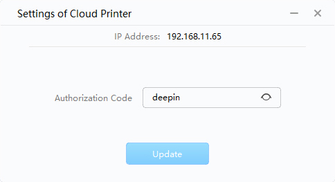
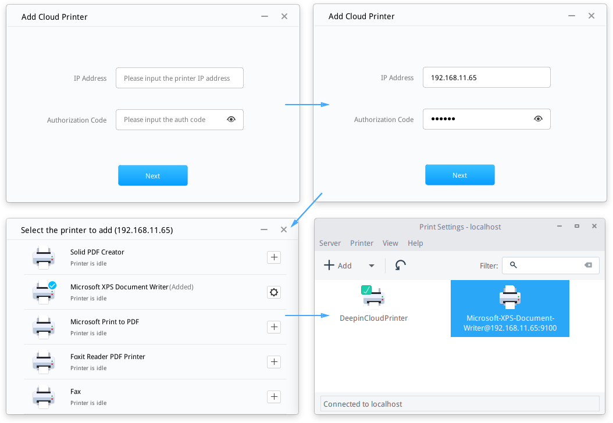
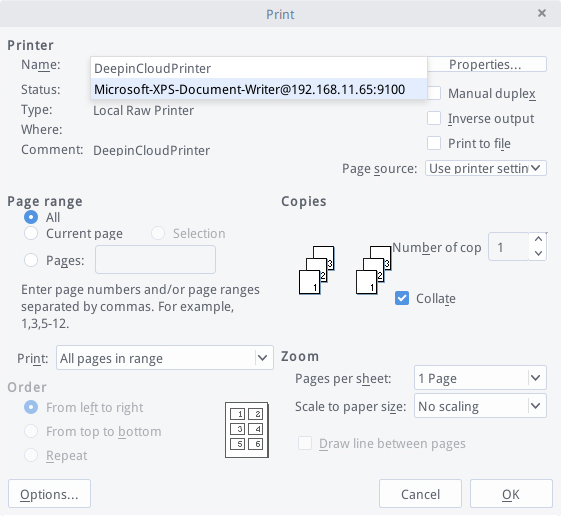

# Deepin Cloud Print|../common/deepin-cloud-print.svg|

## Vistazo

Deepin Cloud Print es una solución de impresión desarrollado por Wuhan Deepin Technology Co., Ltd.
Conectará su impresora a la red y se habilitará para la impresión en red a través de las aplicaciones que usa diariamente. Deepin Cloud Print es adecuado para equipos de sobremesa, portátiles, tabletas y otros dispositivos de red que usted haya autorizado para imprimir.

Deepin Cloud Print consta de Servidor (en Windows) y Cliente (en deepin), que se configurará respectivamente.

## Configuración del Servidor

Puede instalar el programa de aplicación de Servidor de Deepin Cloud Print y configurar con el código de autorización en Windows.

### Instalar Deepin Cloud Print

El programa de instalación del Servidor de Deepin Cloud Print está integrado en el ISO de deepin. Sólo necesita extraer e instalar.

> : DeepinCloudPrintServerInstaller_*.exe es el programa de instalació del Servidor de Deepin Cloud Print en el ISO de deepin.

1. Obten el ISO de deepin 15.
2. Extraiga el programa de instalación del Servidor de Deepin Cloud Print.
3. Instale en Windows.
4. Finalice la instalación acorde a esta guía.

### Establecer el Código de autorización

La dirección IP del servidor se asignará en Windows automáticamente después de finalizar la instalación, luego puede establecer el código de autorización.

> : Si necesita cambiar el código de autorización, por favor ingrese el nuevo código en el cuadro de texto, y luego haga clic en **Actualizar**.

1. Clic the start menu to open the program of Servidor de Deepin Cloud Print in Windows.
2. Acquire the IP address automatically.
3. Input the código de autorización in the settings interface of Servidor de Deepin Cloud Print.
4. Haga clic en **Update**, then  will be displayed.
5. After updated the código de autorización,  will be displayed.

 

## Configuraciones del Cliente

Puede abrir Deepin Cloud Print Client en Deepin para agregar una o más impresoras en la nube.

### Abrir Deepin Cloud Print

1. Haga clic en  para entrar al lanzador.
2. Haga clic en  para entrar a Deepin Cloud Print.

### Ajustar Deepin Cloud Print

1. En la interfaz de Deepin Cloud Print, ingrese la dirección IP y el código de autorización del Servidor de Deepin Cloud Print desde Windows.
2. Haga clic en  para mostrar todas las impresoras desde Windows.
3. Haga clic en  para añadir la impresora, y después el estado será mostrado en "Añadido".
4. Haga clic en  para ingresar a los ajustes de impresión.
5. Puede ver si la impresora se agregó con éxito.

 

> : Si necesia quitar la impresora, por favor ingrese los "Ajustes de impresión" para seleccionar la impresora, después eliga **Borrar** en el menú contextual.

## Prueba de Cloud Print

Puede usar la impresión en la nube para imprimir archivos en deepin, tomando archivos .doc como ejemplo.

> : Si el código de autorización se ha actualizado en Windows, cuando está imprimiendo un archivo, aparecerá el mensaje "El código de autorización del servidor de impresión en la nube se ha actualizado, ingrese un nuevo código de autorización". Por favor, póngase en contacto con el administrador para obtener el nuevo código para imprimir. Si ocurrieron errores durante la impresión, reinícielo de acuerdo con los reportes de error.

1. Abra los archivos .doc con WPS.
2. Haga clic en **Writer** en la esquina superior izquerda.
3. Seleccione **Imprimir** para ingresar a los ajustes de impresión.
4. Seleccione la empresora en la opción listable del **Nombre**, y establezca los parámetros de impresión.
5. Haga clic en **Aceptar**.

 
