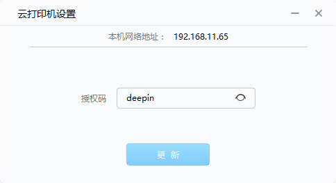
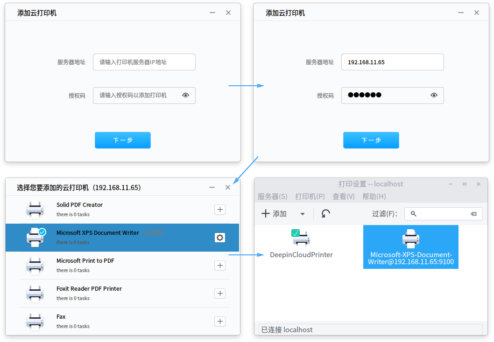
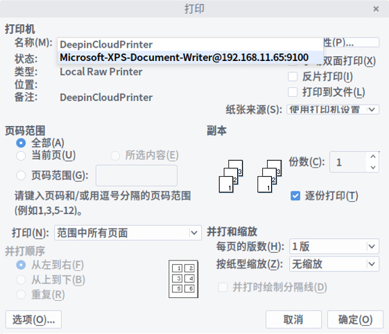

# 深度云打印|../common/deepin-cloud-print.svg|

## 概述

深度云打印是由武汉深之度科技有限公司开发的一种新型打印解决方案，它可以将您的打印机连接到网络，借助深度云打印，您可以通过日常使用的应用程序进行网络打印。同时深度云打印适用于台式机、笔记本电脑、部分平板电脑以及其他所有您已授权打印的联网设备。

深度云打印由服务器端（Windows操作系统）和客户端（深度操作系统）组成，服务器端和客户端需要分别进行配置。

## 服务器端配置

您可以在Windows操作系统中安装深度云打印的服务器应用程序以及配置授权码。

### 安装深度云打印

深度云打印的服务器安装程序集成在深度操作系统的镜像文件中，您只需要使用压缩软件解压即可进行安装。

> ：在深度操作系统的镜像文件中，深度云打印的服务器安装程序命名格式为DeepinCloudPrintServerInstaller_*.exe。

1. 获取深度操作系统 15 的镜像文件。
2. 提取镜像文件中的服务器安装程序。
3. 在Windows操作系统中进行安装。
4. 根据安装向导的提示，完成程序安装。

### 设置云打印授权码

当您安装完成后，系统默认获取Windows操作系统中的IP地址，您只需要设置授权码即可。

> ：如果您需要更改授权码，直接在 **授权码** 文本框中输入新的授权码，点击 **更新** 后即可生效。

1. 在Windows操作系统中，点击开始菜单，打开云打印机程序。
2. 自动获取系统中IP地址。
3. 在云打印机设置界面，输入授权码。
4. 点击 **更新**。
5. 当授权码更新成功后，在界面上显示  状态。

 

## 客户端配置|../common/icon_clientconfig.svg|

您可以在深度操作系统中打开深度云打印客户端应用程序，添加一个或多个云打印机。

### 打开深度云打印

1. 点击任务栏上的  进入启动器界面。
2. 通过浏览找到  进行点击，进入深度云打印界面。

### 设置深度云打印

1. 在深度云打印界面，输入打印机在Windows操作系统中的IP地址和授权码。
2. 点击  ，显示所有Windows操作系统中的打印机列表。
3. 在对应的打印机列表后点击 ，该打印机名称后显示为“已添加”状态。
4. 点击 ，进入打印设置界面。
5. 查看已添加的打印机是否添加成功。

 

> ：如果您需要删除打印机，进入"打印设置"界面中选择打印机，点击鼠标右键 > **删除**。

## 云打印测试|../common/icon_cloudprinttest.svg|

您可以在客户端（深度操作系统）打开文件，选择云打印机进行打印，以下测试以.doc文件为例。

>  ：如果Windows操作系统更新了深度云打印的授权码，当您在打印文件时，系统自动弹出“云打印服务器授权码已被更新，请输入新的授权码”对话框，请联系管理员获取新的授权码后输入继续打印。打印过程中如果出现错误，请根据错误提示，重新进行设置。

1. 使用WPS文字打开.doc文件。
2. 点击左上角的 **WPS文字**。
3. 选择 **打印**，进入打印设置界面。
4. 在 **名称** 下拉选项中，选择打印机并设置其他打印参数。
5. 点击 **确定**。

 
