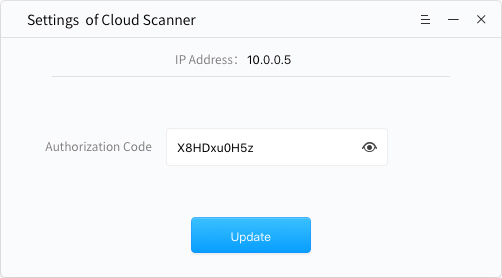
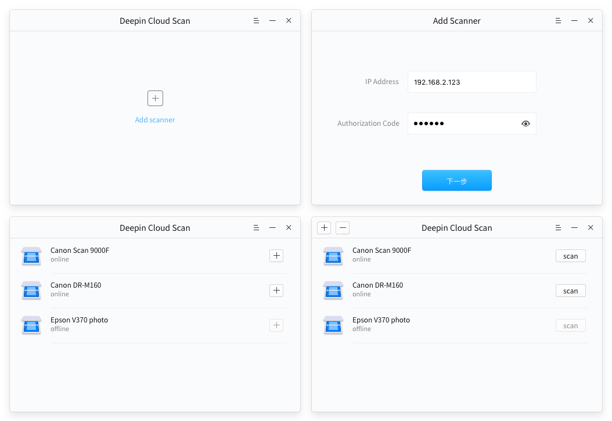
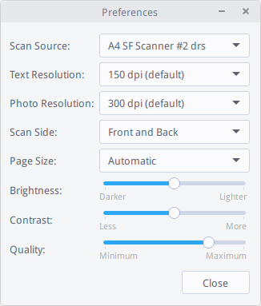

# Deepin Cloud Scan|../common/deepin-cloud-scanner.svg|

## Vistazo

Deepin Cloud Scan es una nueva tecnología de escaneo desarrollada por Wuhan Deepin Technology Co., Ltd. Conectará su escáner a la red, viene habilitado para el escaneo en red a través de las aplicaciones que usa diariamente. Deepin Cloud Scan es adecuado para equipos de escritorio, portátiles, tabletas y otros dispositivos de red que usted haya autorizado para escanear.

Deepin Cloud Scan consiste en un cliente y servidor. El servidor está instalado en Windows, mientras el cliente está preinstalado en Deepin.

## Configuración del Servidor

Puede instalar el servidor en Windows y configurar el código de autorización para el cliente en deepin.

### Instalar el servidor Server

DeepinCloudScanServerInstaller_1.0.0.1.exe es un programa de instalación del servidor, puede instalarlo siguiendo estos pasos:

1. Consiga el programa de instalación del servidor.
2. Instálalo en Windows.
3. Finalice la instalación mediante el asistente.

### Configurar Servidor

Abra el servidor desde el menú de Inicio en Windows, después puede ver la interfaz de ajuste del Cloud Scanner.

: La dirección IP y el código de autorización son mostrados automáticamente en la interfaz. Si desea renovar el código de autorización, por favor siga estos pasos:

1. Ingrese un nuevo código de autorización.
2. Clic en , el botón será gris hasta que se actualice con éxito.

: Hay un menú contextual del servidor en la esquina inferior derecha de Windows. Puede hacer clic para configurar, ver "Acerca de" o salir.

## Configuración del Cliente

El cliente de Deepin Cloud Scan está preinstalado en la ISO de deepin.

### Abrir Cliente

1. Clic en  para ingresar al lanzador.
2. Clic en  para abrir el apartado de "Añadir escáner".

### Cliente de Configuración

1. En la interfaz para "Añadir escáner", ingrese la dirección IP y código de autorización desde el Servidor en Windows.
2. Clic en  para mostrar todos las PC con Windows escaneadas.
3. Clic en  para añadir al escaneo, y después su estádo será mostrado como "Añadido".

:
- Por favor, cierre el cortafuegos antes de ingresar la dirección IP; de lo contrario, será invalidado.
- Si necesita borrar el escáner de la lista, selecciónelo y haga clic en  para quitarlo.

 

## Settings

### Ayuda

Puede hacer un clic para ver el manual, que le ayudará a conocer y usar Creador de arranque de Deepin.

1. En la la interfaz de Deepin Clone, clic en  .
2. Clic en **Ayuda**.
3. Observe el manual.

### Acerca de

Puede hacer clic para ver la descripción de la versión.

1. En la la interfaz de Deepin Clone, clic en .
2. Seleccione **Acerca de**.
3. Observe la descripción de la versión.

### Salir

Puede hacer clic para salir del Creador de arranque de Deepin.

1. En la la interfaz de Deepin Clone, clic en .
2. Clic en **Salir** para cerrar.

: Puede también hacer clic en 
en la interfaz "Añadir escáner".

## Prueba de escaneo

Puede utilizar Deepin Cloud Scan para escanear archivos en profundidad, los pasos son los siguientes.

1. Clic en  para entrar a la interfaz de ajustes de escaneo.
2. Clic en la esquina superior izquierda para seleccionar **Preferencias** para ajustar los parámetros de escaneo.
3. Clic **Escanear** para ejecutar.

: Si el código de autorización ha sido renovado en Windows, cuando está escaneando un archivo, aparecerá una indicación de "Se ha actualizado el código de autorización del servidor de escaneo en la nube, ingrese un nuevo código de autorización". Por favor, póngase en contacto con el administrador para obtener uno nuevo para escanear. Si ocurrieron errores durante el escaneo, reinícielo de acuerdo al regístro de errores.

 
