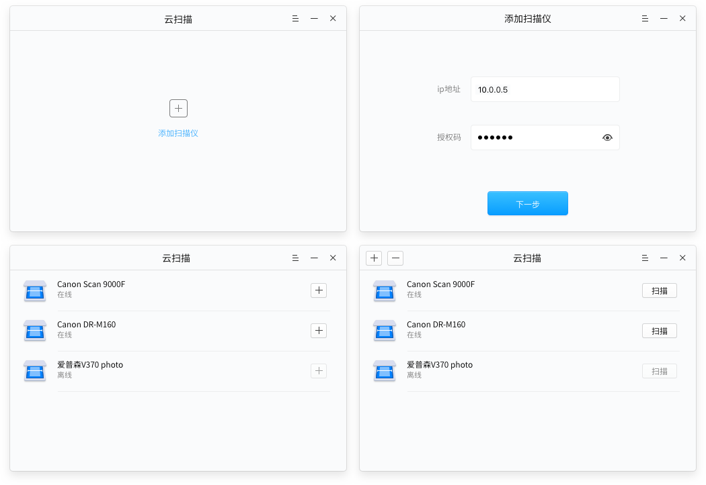

# 云扫描|../common/deepin-cloud-scanner.svg|

## 概述

深度云扫描是由武汉深之度科技有限公司开发的一种新型扫描技术，它可以将您的扫描仪连接到网络，借助深度云扫描，您可以通过日常使用的应用程序进行网络扫描。同时深度云扫描适用于台式机、笔记本电脑、部分平板电脑以及其他所有您已授权扫描的联网设备。

深度云扫描由服务器端（Windows操作系统）和客户端（深度操作系统）组成，服务器端和客户端需要分别进行配置。

## 服务器端配置

您可以在服务器端安装深度云扫描的服务器应用程序以及配置授权码。

### 安装深度云扫描

通过官方提供地址下载深度云扫描的服务器端应用程序。

1. 下载深度云扫描的服务器端应用程序。
2. 在Windows操作系统中进行安装。
3. 根据安装向导的提示，完成程序安装。

### 设置授权码

当您安装完成后，系统默认获取服务器端的IP地址，您只需要设置授权码即可。

1. 在服务器端打开云扫描应用程序。
2. 自动获取系统中IP地址。
3. 在云扫描机设置界面，输入授权码。
4. 点击 **更新** 。

> ：如果您需要更改授权码，直接在 **授权码** 文本框中输入新的授权码，点击 **更新** 后即可生效。

 

## 客户端配置

您可以在深度操作系统中打开深度云扫描客户端应用程序，可以添加一个或多个扫描仪。

### 打开深度云扫描

1. 点击任务栏上的  进入启动器界面。
2. 通过浏览找到  进行点击，进入深度云扫描界面。

### 设置深度云扫描

1. 在深度云扫描界面，点击 .
2. 进入添加扫描仪界面，输入服务器端中的IP地址和授权码。
3. 点击  ，显示所有服务器端中的扫描仪列表。
4. 在对应的扫描仪列表后点击 ，该扫描仪名称后显示为“已添加”状态。
5. 点击 **扫描**，进入扫描易界面进行设置。

 

>  ：如果输入服务器端IP地址和授权码后，界面上提示“无效的IP地址”，进入服务器端关闭Windows防火墙。

- 如果已经添加过扫描仪，可以进入深度云扫描列表界面，点击窗口左上角  添加多个扫描仪设备。
- 如果需要删除深度云扫描列表中的扫描仪，点击窗口左上角  可以删除扫描仪设备。

## 选项设置

### 关于

您可以点击关于查看深度云扫描的版本介绍。

1. 在深度云扫描界面，点击 。
2. 点击 **关于**。
3. 查看关于深度云扫描的版本和介绍。

### 帮助

您可以点击帮助获取深度云扫描的帮助手册，通过帮助进一步让您使用和配置深度云扫描。

1. 在深度云扫描界面，点击 。
2. 点击 **帮助**。
3. 查看关于深度云扫描的帮助手册。

### 退出

您可以进入菜单栏点击退出深度云扫描。

1. 在深度云扫描界面，点击 。
2. 点击 **退出**。

> ：您也可以在深度云扫描界面中点击  按钮来退出。

## 云扫描测试

您可以在客户端（深度操作系统）打开图片或PDF文件，打开启动器中的扫描易进行扫描。

1. 进入启动器界面，浏览找到  点击，进入扫描易界面。
2. 点击左上角的图标。
3. 选择 **首选项**，进入扫描易设置界面。
4. 在 **扫描来源** 下拉选项中，选择扫描仪并设置其他扫描参数。
5. 点击 **确定**。
6. 在扫描易界面上，点击 **扫描** 即可。

 

>  ：如果Windows操作系统更新了深度云扫描的授权码，当您在扫描文件时，提示授权码已更新，请联系管理员获取新的授权码后输入继续扫描。扫描过程中如果出现错误，请根据错误提示，重新进行设置。
