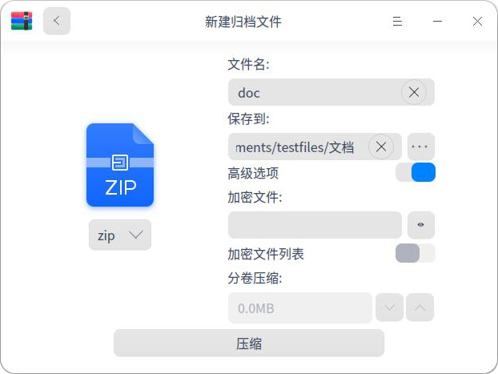
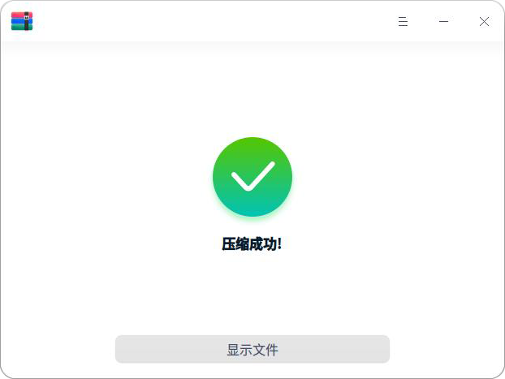
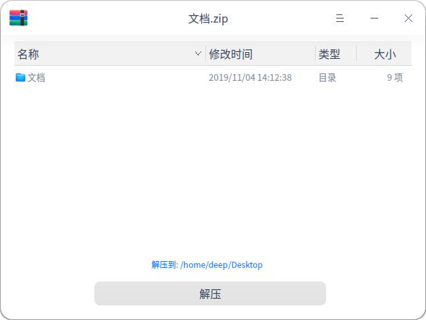

# 压缩工具|../common/deepin-compressor.svg|

## 概述

压缩工具是一款界面友好、使用方便的压缩与解压缩软件，支持7z、jar、tar、tar.bz2、tar.gz、tar.lz、tar.lzm、tar.lzo、tar.Z、zip等多种压缩包格式，还支持加密压缩等设置。

## 使用入门

通过以下方式运行或关闭解压缩，或者创建解压缩的快捷方式。

### 运行压缩

1. 点击桌面底部的  ，进入启动器界面。
2. 上下滚动鼠标滚轮浏览或通过搜索，找到压缩工具 点击运行。
3. 右键单击 ，您可以：
 - 点击 **发送到桌面**，在桌面创建快捷方式。
 - 点击 **发送到任务栏**，将应用程序固定到任务栏。
 - 点击 **开机自动启动**，将应用程序添加到开机启动项，在电脑开机时自动运行该应用。

：您可以在控制中心中将解压缩设置为默认的压缩查看程序，具体操作请参考 [默认程序设置](dman:///dde#默认程序设置)。

### 关闭压缩

- 在压缩界面点击   ，退出压缩。
- 在任务栏右键单击 ，选择 **关闭所有** 来退出压缩。
- 在压缩界面点击  ，选择 **退出** 来退出压缩。

## 操作介绍

### 压缩

可以压缩单个文件，也可以压缩多个文件。

1. 在压缩界面，点击 **选择文件** 。

   > ：也可以选择将一个或者多个文件拖拽到界面上进行压缩操作。

   

2. 选择需要压缩的文件，点击 **打开**。

3. 如果需要添加压缩文件时，点击 添加。

4. 点击 **下一步**。

5. 设置文件名、具体安装位置、压缩包格式等。

6. 如果开启高级选项模式，可以设置压缩包加密密码、分卷压缩。

   

7. 点击 **压缩**。

8. 压缩成功之后，点击 **显示文件**，可以查看压缩文件的具体存放位置。

   ：您还可以右键点击 **压缩**，对文件执行压缩操作。

### 解压缩

1. 在压缩界面，点击 **选择文件** 。

2. 选择需要解压缩的文件，点击 **打开**。

3. 可以设置解压缩路径。

4. 点击 **解压**。

> ：当添加的文件为加密文件时，需要输入密码解压缩。

5. 解压缩成功之后，点击 **显示文件**，可以查看解压缩文件的具体存放位置。

   ：您还可以右键点击 **解压缩**，对文件执行解压缩操作。

## 主菜单

在主菜单中，您可以打开压缩界面、切换窗口主题、查看帮助手册，了解压缩工具的更多信息。

### 打开
1. 在压缩界面，点击   。
2. 选择 **打开**，从文件选择器选择添加压缩文件或解压文件。

### 设置

1. 在压缩界面，点击   。
2. 选择 **设置**。
3. 您可以根据需要进行以下设置：
 - 设置默认解压位置。
 - 设置自动创建文件夹。
 - 设置当解压完成后自动打开对应的文件夹。
 - 设置关联文件类型。

：点击设置界面上的 **恢复默认设置**，会将所有设置恢复到默认状态。

### 主题

窗口主题包含浅色主题、深色主题和系统主题，其中系统主题为默认设置。

1. 在压缩界面，点击。
2. 点击 **主题**，选择一个主题颜色。

### 帮助

查看帮助手册，通过帮助进一步让您了解和使用压缩工具。

1. 在压缩界面，点击   。
2. 点击 **帮助**。
3. 查看关于压缩的帮助手册。

### 关于

1. 在压缩界面，点击   。
2. 点击 **关于**。
3. 查看关于解压缩的版本和介绍。

### 退出

1. 在压缩界面，点击 。
2. 点击 **退出**。
