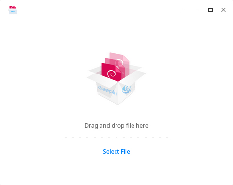
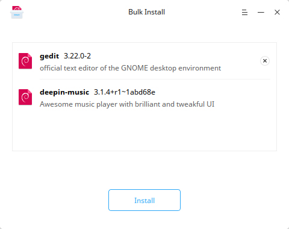
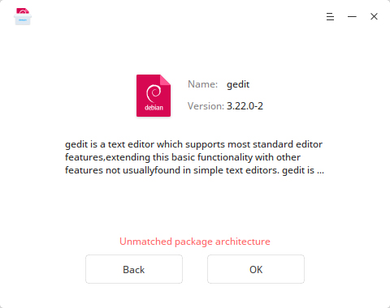
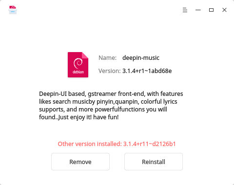

# Deepin Package Manager |../common/deepin-deb-installer.svg|

## Vistazo

Deepin Package Manager (gestor de paquetes de Deepin) es una aplicación usado para ayudar a los usuarios a instalar y remover software local, soporta instalación en lote.

## Operaciones Báiscas

### Iniciar Deepin Package Manager

- Doble clic en a paquete .deb para iniciar.
- Clic en el icono de Deepin Package Manager para iniciar.

### Instalación simple

1. En la interfaz de Deepin Package Manager, clic en **Seleccionar Archivo** para añadir a paquete .deb.
2. La aplicación detectará el estado del paquete:
   - En una nueva instalación, seleccione **Instalar** para instalar.
   - En una actualización, seleccione **Reinstalar** para continuar o **Remover** para desinstalar.
3. Se necesitá la credencial de administrador para continuar cuando pulse **Instalar** o **Desinstalar**.
4. Clic en  o  para expandir o minimizar el proceso de instalación.
5. Clic en **Atrás** para realizar una nueva operación o clic en **Aceptar** para salir.

> : También puede arrastrar y soltar el archivo a Deepin Package Manager para añadirlo.

### Instalación en lotes

1. En la interfaz de Deepin Package Manager, clic en **Seleccionar Archivo** para añadir paquete .debs.
2. Clic el botón Borrar en la parte superior derecha si desea quitar uno.
3. Se necesitá la credencial de administrador para continuar cuando pulse **Instalar**.
4. Clic en  o  para expandir o minimizar el proceso de instalación.
5. El estado de la instalación se mostrará a la derecha de cada paquete, como instalado, instalado y fallado.
6. Clic en **Atrás** para realizar una nueva operación o clic en **Aceptar** para salir.

> : No se podrán añadir más archivos después de que haya agregado varios archivos a la vez.

### Problemas al Instalar

1. En la interfaz de Deepin Package Manager, clic en **Seleccionar Archivo** para añadir a paquete .deb.
2. Revise el motivo del problema al instalar: dependencias rotas o incompatibilidad con la arquitectura del paquete.
3. Clic en **Atrás** para realizar una nueva operación o clic en **Aceptar** para salir.

### Uninstall

1. En la interfaz de Deepin Package Manager, clic en **Seleccionar Archivo** para añadir a paquete .deb.
2. La aplicación detectará el estado del paquete:
   - En una nueva instalación, seleccione **Instalar** para instalar.
   - En una actualización, seleccione **Reinstalar** para continuar o **Remover** para desinstalar.
3. Clic en **Remover**,después aparecerá un aviso y haz clic en **Confirmar** para desinstalar.
4. Clic en  o  para expandir o minimizar el proceso de desinstalación.
5. Clic en **Atrás** para realizar una nueva operación o clic en **Aceptar** para salir.

## Main Menu

### Help

### Ayuda

Puede hacer un clic para ver el manual, que le ayudará a conocer y usar Creador de arranque de Deepin.

1. En la la interfaz de Deepin Package Manager, clic en  .
2. Clic en **Ayuda**.
3. Observe el manual.

### Acerca de

Puede hacer clic para ver la descripción de la versión.

1. En la la interfaz de Deepin Package Manager, clic en .
2. Seleccione **Acerca de**.
3. Observe la descripción de la versión.

### Salir

Puede hacer clic para salir del Creador de arranque de Deepin.

1. En la la interfaz de Deepin Package Manager, clic en .
2. Clic en **Salir** para cerrar.
