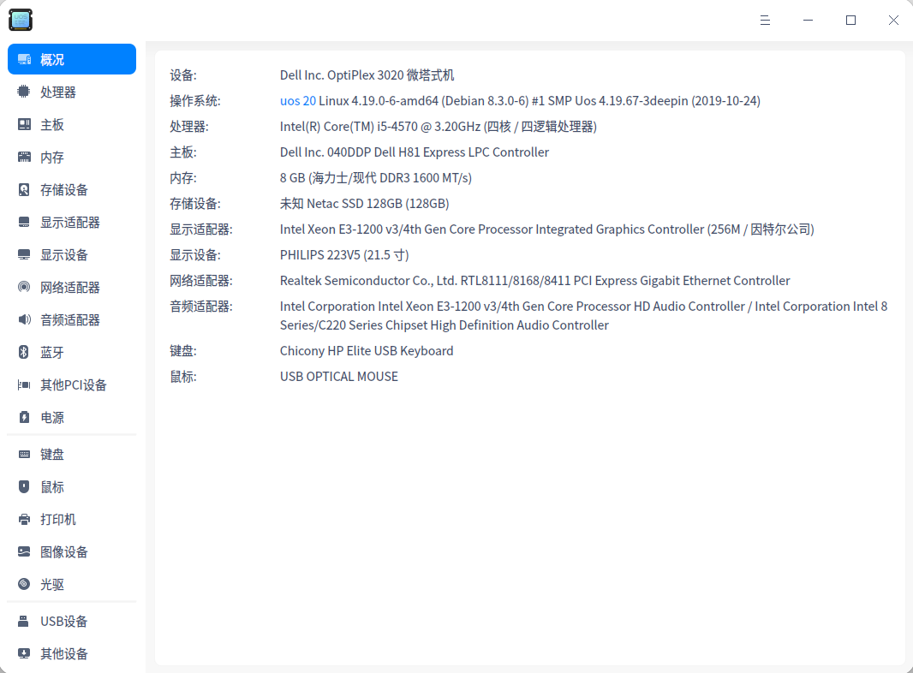

# 设备管理器|../common/deepin-devicemanager.svg|

待完善...

## 概述

设备管理器是查看、管理硬件设备的工具软件。

## 使用入门

您可以通过以下方式运行或关闭设备管理器，或者创建设备管理器的快捷方式。

### 运行设备管理器

1. 点击桌面底部的启动器 或将鼠标指针移到屏幕左上角，进入启动器界面。
2. 上下滚动鼠标滚轮浏览或通过搜索，找到应用点击运行。
3. 将鼠标指针置于设备管理器应用程序的图标上，右键点击，您可以：
- 点击 **发送到桌面**，在桌面创建快捷方式。
- 点击 **发送到任务栏**，将应用程序固定到任务栏。
- 点击 **开机自动启动**，将应用程序添加到开机启动项，在电脑开机时自动运行该应用程序。

您可以在控制中心中将设备管理器设置为默认的图片查看程序，具体操作请参考 [默认启动设置](dman:///dde#默认程序设置)。

## 右键菜单

在设备列表窗或主窗口点击鼠标右键。

### 刷新

刷新设备信息。

### 导出

导出设备信息为Txt/Doc/Xls/Html格式。

## 主菜单

### 主题

主题包含浅色主题、深色主题和跟随系统主题，其中跟随系统主题为默认设置。

### 帮助

您可以点击帮助获取计算器的帮助手册，通过帮助进一步让您了解和使用计算器。

### 关于

您可以点击关于查看计算器的版本介绍。

### 退出

您可以进入菜单栏点击退出计算器。
