# 画板|../common/deepin-draw.svg|

## 概述

画板是一款简单的绘图工具，支持旋转、裁剪、翻转、添加文字、形状等功能。用户可以对本地图片进行简单编辑，也可以绘制一张简单图片。

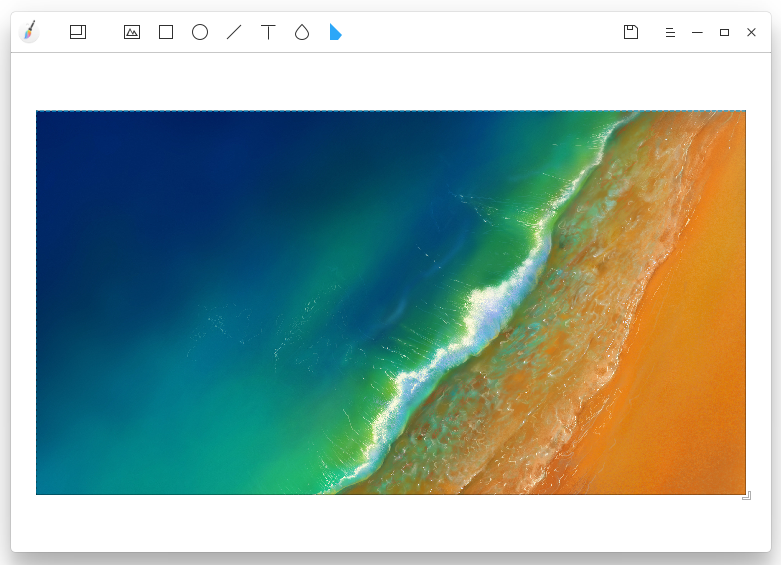

## 使用入门

通过以下方式运行或关闭画板，或者创建画板的快捷方式。

### 运行画板

1. 点击桌面底部的  ，进入启动器界面。
2. 上下滚动鼠标滚轮浏览或通过搜索，找到画板 点击运行。
3. 右键单击 ，您可以：
 - 点击 **发送到桌面**，在桌面创建快捷方式。
 - 点击 **发送到任务栏**，将应用程序固定到任务栏。
 - 点击 **开机自动启动**，将应用程序添加到开机启动项，在电脑开机时自动运行该应用。

：您可以在控制中心中将画板设置为默认的图片查看程序，具体操作请参考 [默认程序设置](dman:///dde-control-center#默认程序设置)。

### 关闭画板

- 在画板界面点击   ，退出画板。
- 在任务栏右键单击  ，选择 **关闭所有** 来退出画板。
- 在画板界面点击  ，选择 **退出** 来退出画板。

### 查看快捷键

在画板界面上，按下键盘上的  +  +  组合键来查看快捷键，熟练的使用快捷键，将大大提升您的操作效率。

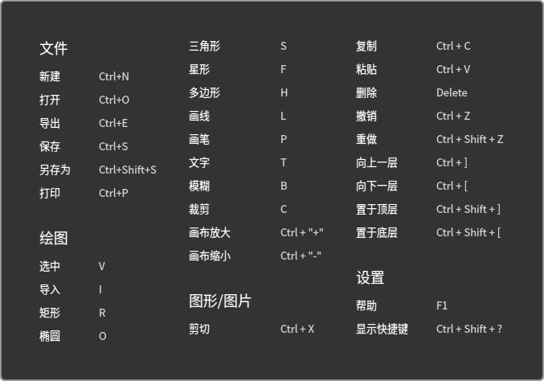

## 常用功能

使用画板可以处理导入的图片，也可以自由绘制图形，并可以保存为多种图片格式。

### 打开图片

1. 在画板界面上，点击 。
2. 选择想要导入的图片，点击 **打开**。

> ：您可以一次导入多张图片，您也可以通过  > **打开** 导入图片。

目前仅支持导入30张图片，且支持的图片格式为JPG、PNG、TIF和BMP。

### 导出图片

1. 在画板界面上，点击  > **导出**。
2. 设置保存文件名、路径、文件格式、图片质量等参数。
3. 点击 **保存**。

### 保存图片

1. 在画板界面上，点击  > **保存** 或   > **另存为**。
2. 设置保存的文件名、格式。
3. 点击 **保存**。

> ：填写保存文件名时可以省略后缀名，会自动保存为文件格式栏选择的格式。

### 打印图片

1. 在画板界面上，点击  > **打印**。
2. 选择打印机。
3. 设置打印参数。
4. 点击 **打印**。

> ：点击 **属性** 和 **选项** 可以自定义您的打印效果。

## 绘画工具

使用画板的绘画工具，可以充分发挥您的想象力和创造力，自由绘制各种图形。

### 选择工具

通过点击选择工具  可以进行以下操作：

- 对已绘制图形、文字、模糊区域进行选择。
- 支持框选，框选范围内的所有图形置为选择状态。
- 在选择状态中的图形，拖拽调整图形大小。
- 支持按住 shift 键，点击选择多个图形。

> ：点击画板空白区域，取消当前已选图形。

### 形状工具

1. 在画板界面上，点击  或  或或或。
2. 您可以设置图形的参数：
 - 点击 **填充** 设置图形的填充颜色和透明度。
 - 点击 **描边** 设置图形笔的描边颜色和透明度。
 - 点击 **描边粗细** 设置图形的粗细。
 - 点击 **锚点数** 和 **半径** 设置图形锚点数及半径的大小，仅适用于星型。
   - 锚点数取值范围为3-50个，数值既可以通过拖拽滑动块进行调节，也可以⼿动输⼊。
   - 半径取值范围为0%-100%，数值既可以通过拖拽滑动块进行调节，也可以⼿动输⼊。
 - 点击 **侧边数** 设置图形边数，仅适用于多边形。
   - 侧边数取值范围为4-10条，数值既可以通过拖拽滑动块进行调节，也可以⼿动输⼊。
3. 在画板区域拖动鼠标来绘制形状。

> ：在使用  或  或或或绘制性质时，配合键盘上的 或+  键可以画出正方形、正圆、正三角、正五角星、正多边形。

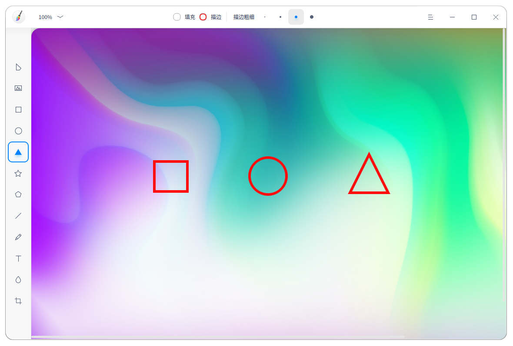

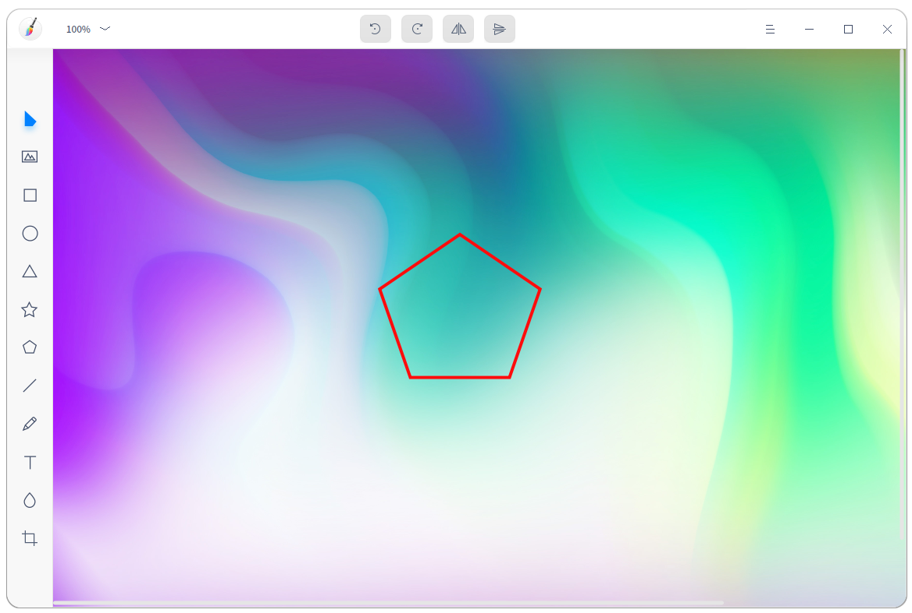

### 画线/画笔工具

1. 在画板界面上，点击或 。
2. 您可以设置画笔参数：

   - 点击 **类型** 中的选项来选择一种画笔样式，可以绘制直线、自由曲线和带箭头的直线。

   - 点击 **描边** 设置画笔的颜色和透明度。

   - 点击 **描边粗细** 中的选项来设置画笔的粗细。

3. 在画板区域拖动鼠标来绘制线条。

### 文本工具

1. 在画板界面上，点击 。
2. 您可以设置文本样式：
   - 点击 **填充** 设置文本的填充颜色和透明度。
   - 在 **字体** 下拉框中选择字体样式。
   - **字号** 可以手动输入数字或通过左右拖拽滑动块来调节。
3. 在画板区域单击鼠标后在文本框中输入文字。

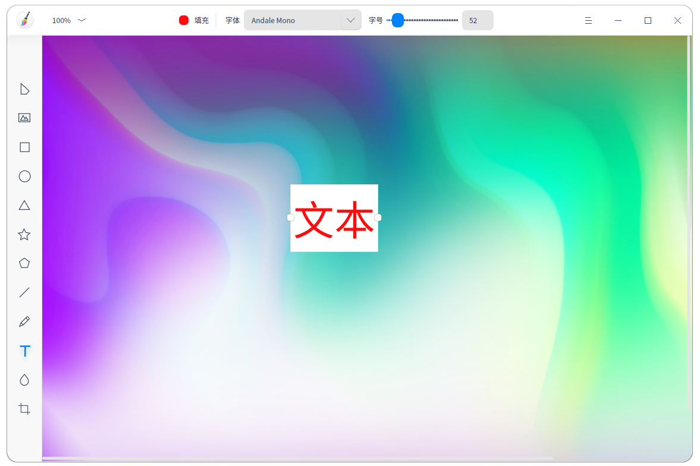

### 模糊工具

1. 在画板界面上，点击 。
2. 选择模糊类型。
3. 通过左右拖动设置条上的滑块设置涂抹区域的粗细。
4. 在画板区域拖动鼠标来涂抹需要模糊的区域。

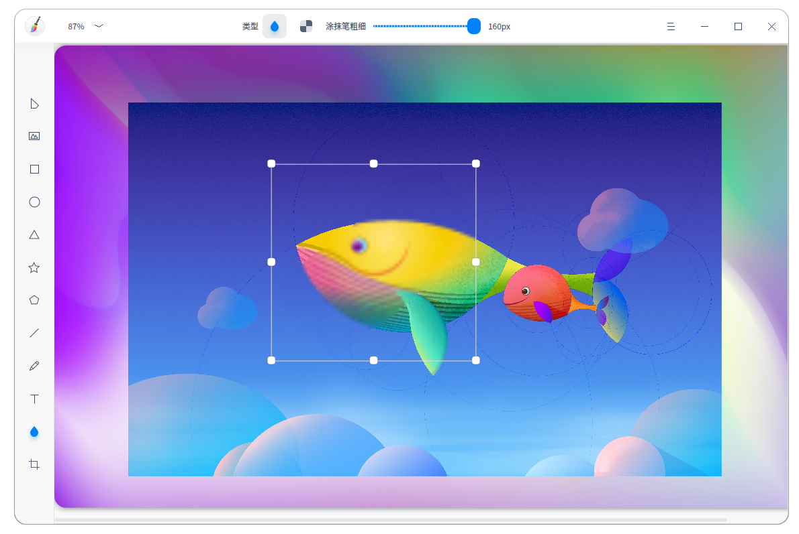

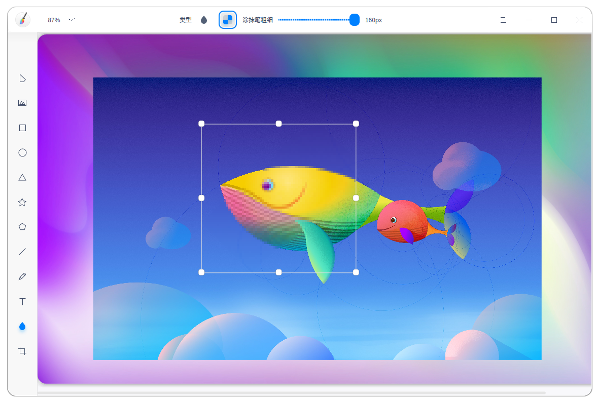

## 编辑功能

### 复制和粘贴

1. 在画板界面上，选中需要复制的图形。
2. 单击鼠标右键选择 **复制** 或 使用快捷键 +  将图形复制到剪贴板。
3. 单击鼠标右键选择 **粘贴** 或 使用快捷键 +  将图形粘贴到画板上。

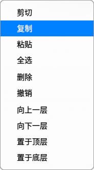

### 裁剪

1. 在画板界面上，选择已导入的图片。
2. 点击  进入裁剪模式。
  - 自由：自定义截取，手动输入尺寸或拖动裁剪边框来调整需要裁剪的区域。
  - 原始：按照原图比例截取，如1:1、2:3、8:5、 16:9。

3. 选择裁剪模式，选定需要裁剪的区域。
4. 按 **Enter** 键将区域外的图形裁剪掉。

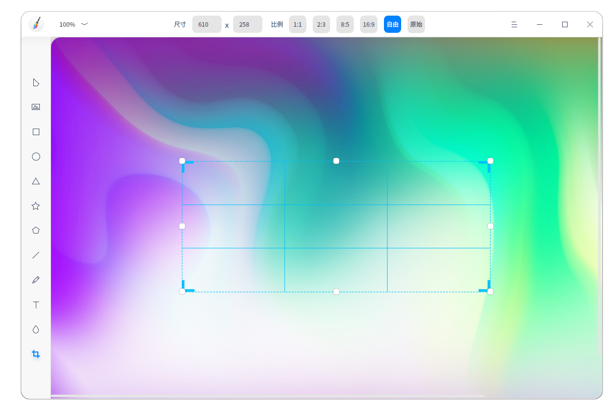

### 翻转

1. 在画板界面上，选择已导入的图片。
2. 点击  或  将图片垂直翻转或水平翻转。

### 旋转

1. 在画板界面上，选择已导入的图片。
2. 点击  或  将图片顺时针或逆时针旋转90°。

> ：您也可以通过鼠标拖动图片或图形的原点来自由旋转操作。

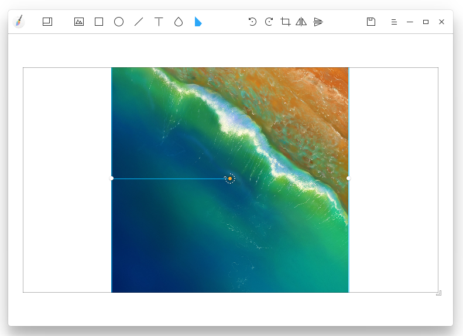

### 删除

1. 在画板界面上，选择一个图形。
2. 单击鼠标右键选择 **删除** 或 使用快捷键将选中的图形删除。

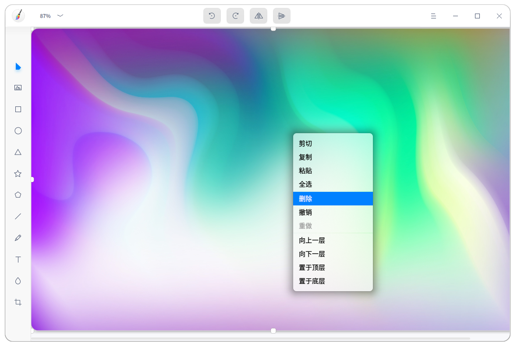

### 调整图层

1. 在画板界面上，选择一个图形。
2. 单击鼠标右键选择 **向上一层**、**向下一层**、**置于顶层**、**至于底层** 来调整图层顺序。

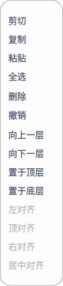

### 对齐文本

1. 在画板界面上，点击 。
2. 单击鼠标右键选择 **左对齐**、**右对齐**、**居中对齐** 来对齐文本。

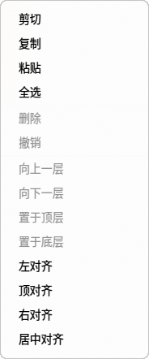

## 主菜单

在主菜单中，您可以新建图档、[打开图片](#打开图片)、[导出图片](#导出图片)、[保存图片](#保存图片)、切换窗口主题、查看帮助手册，了解相册的更多信息。

### 新建

您可以通过新建添加一个图档。

1. 在画板界面，点击。
2. 点击 **新建**，添加一个图档。

### 主题

窗口主题包含浅色主题、深色主题和系统主题，其中系统主题为默认设置。

1. 在画板界面，点击。
2. 点击 **主题**，选择一个主题颜色。

### 帮助

查看帮助手册，通过帮助进一步让您了解和使用画板。

1. 在画板界面，点击   。
2. 点击 **帮助**。
3. 查看关于画板的帮助手册。

### 关于

1. 在画板界面，点击   。
2. 点击 **关于**。
3. 查看关于画板的版本和介绍。

### 退出

1. 在画板界面，点击 。
2. 点击 **退出**。
