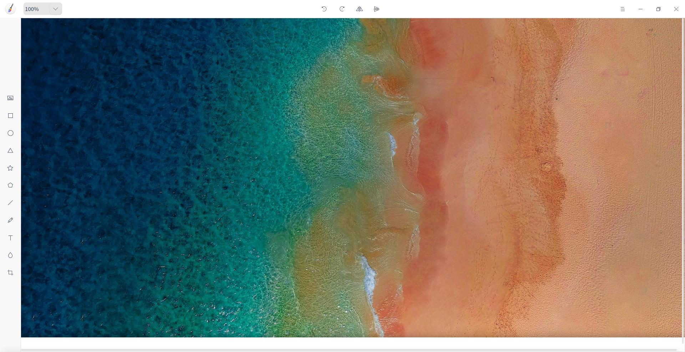

# 画板|../common/deepin-draw.svg|

## 概述

画板是一款简单的绘图工具，支持旋转、裁剪、翻转、添加文字、形状等功能。用户可以对本地图片进行简单编辑，也可以绘制一张简单图片。

待完善...

## 使用入门

您可以通过以下方式运行或关闭画板，或者创建画板的快捷方式。

### 运行画板

1. 点击桌面底部的 启动器  ，进入启动器界面。
2. 上下滚动鼠标滚轮浏览或通过搜索，找到应用 点击运行。
3. 将鼠标指针置于画板应用程序的图标上，右键点击 ，您可以：
 - 点击 **发送到桌面**，在桌面创建快捷方式。
 - 点击 **发送到任务栏**，将应用程序固定到任务栏。
 - 点击 **开机自动启动**，将应用程序添加到开机启动项，在电脑开机时自动运行该应用程序。

：您可以在控制中心中将画板设置为默认的图片查看程序，具体操作请参考 [默认启动设置](dman:///dde-control-center#默认程序设置)。

### 关闭画板

- 在画板界面点击   ，退出画板。
- 在任务栏右键单击  ，选择 **关闭所有** 来退出画板。
- 在画板界面点击  ，选择 **退出** 来退出画板。

### 查看快捷键

使用快捷键操作，能极大的提升您的操作效率。

## 常用功能

使用画板可以处理导入的图片，也可以自由绘制图形，并可以保存为多种图片格式。

### 导入图片

1. 在画板界面上，点击 。
2. 选择想要导入的图片，点击 **打开**。

> ：您可以一次导入多张图片，您也可以通过  > **导入** 或者直接拖拽导入图片。

### 保存图片

1. 在画板界面上，点击  > **保存**。
2. 设置保存文件名、路径、格式、质量等参数。
3. 点击 **保存**。

> ：填写保存文件名时可以省略后缀名，会自动保存为文件格式栏选择的格式。

### 打印图片

1. 在画板界面上，点击  > **打印**。
2. 选择打印机。
3. 设置打印参数。
4. 点击 **打印**。

> ：点击 **属性** 和 **选项** 可以自定义您的打印效果。

## 绘画工具

使用画板的绘画工具，可以充分发挥您的想象力和创造力，自由绘制各种图形。

### 设置画板尺寸

1. 在画板界面上，点击 。
2. 输入画板的宽高值。
3. 鼠标点击画板区域或者按下键盘上的  后设置生效。

> ：在设置画板尺寸时，点击 **裁剪透明** 可以自动裁剪掉画板空白区域。

### 选择工具

选择工具是画板的基础工具，在画板界面上，点击   切换到选择工具。常用的移动、旋转、缩放操作都是通过选择工具实现。

### 形状工具

1. 在画板界面上，点击  或  。
2. 您可以设置画笔参数：
 - 点击 **填充** 设置画笔的填充颜色和透明度。
 - 点击 **描边** 设置画笔的描边颜色和透明度。
 - 点击 **粗细** 中的选项来设置画笔的粗细。
3. 在画板区域拖动鼠标来绘制矩形或椭圆。

> ：在使用  或   绘制矩形或椭圆时，配合键盘上的 或  键可以画出正方形或正圆。

### 画笔工具

1. 在画板界面上，点击 。
2. 您可以设置画笔参数：
 - 点击 **描边**设置画笔的颜色和透明度。
 - 点击 **样式** 中的选项来选择一种画笔样式，可以绘制直线、自由曲线和带箭头的直线。
 - 点击 **粗细** 中的选项来设置画笔的粗细。
    3.在画板区域拖动鼠标来绘制线条。

### 文本工具

1. 在画板界面上，点击 。
2. 您可以设置文本样式：
 - 点击 **填充** 设置文本的填充颜色和透明度。
 - 输入数字或点击 +/- 来调整字号。
3. 在画板区域单击鼠标后在文本框中输入文字。

### 模糊工具

1. 在画板界面上，点击 。
2. 拖动粗细设置条上的滑块设置涂抹区域的粗细。
3. 在画板区域拖动鼠标来涂抹需要模糊的区域。

## 编辑功能

### 复制和粘贴

1. 在画板界面上，选中需要复制的图形。
2. 单击鼠标右键选择 **复制** 或 使用快捷键 +  将图形复制到剪贴板。
3. 单击鼠标右键选择 **粘贴** 或 使用快捷键 +  将图形粘贴到画板上。

### 裁剪

1. 在画板界面上，选择已导入的图片。
2. 点击  进入裁剪模式。
3. 拖动裁剪边框来调整需要裁剪的区域。
4. 点击 **裁剪** 将区域外的图形裁剪掉。

### 翻转

1. 在画板界面上，选择已导入的图片。
2. 点击  或  将图片垂直翻转或水平翻转。

### 旋转

1. 在画板界面上，选择已导入的图片。
2. 点击  或  将图片顺时针或逆时针旋转90°。

> ：您也可以通过鼠标拖动图片或图形的原点来自由旋转操作。

### 删除

1. 在画板界面上，选择一个图形。
2. 单击鼠标右键选择 **删除** 或 使用快捷键将选中的图形删除。

### 调整图层

1. 在画板界面上，选择一个图形。
2. 单击鼠标右键选择 **向上一层**、**向下一层**、**置于顶层**、**至于底层** 来调整图层顺序。

## 主菜单

通过主菜单了解更多有用信息。

### 主题

主题包含浅色主题、深色主题和跟随系统主题，其中跟随系统主题为默认设置。

#### 浅色主题

1. 在字体管理器界面，点击。
2. 点击 **浅色主题**，来切换主题颜色。

#### 深色主题

1. 在字体管理器界面，点击。
2. 点击 **深色主题**，来切换主题颜色。

#### 跟随系统主题

1. 在字体管理器界面，点击。
2. 点击 **跟随系统主题**，来切换主题颜色。

### 帮助

您可以点击帮助获取画板的帮助手册，通过帮助进一步让您了解和使用画板。

1. 在画板界面，点击   。
2. 点击 **帮助**。
3. 查看关于画板的帮助手册。

### 关于

您可以点击关于查看画板的版本介绍。

1. 在画板界面，点击   。
2. 点击 **关于**。
3. 查看关于画板的版本和介绍。

### 退出

您可以进入菜单栏点击退出画板。

1. 在画板界面，点击 。
2. 点击 **退出**。
