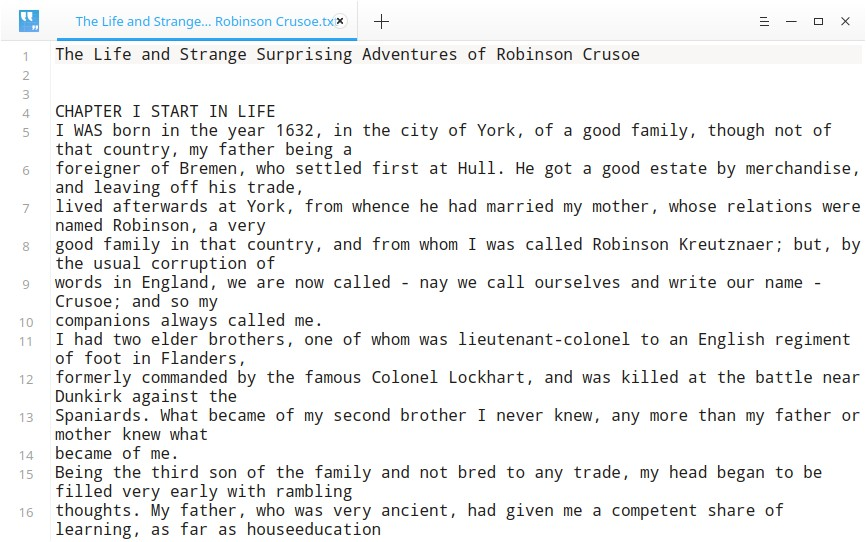
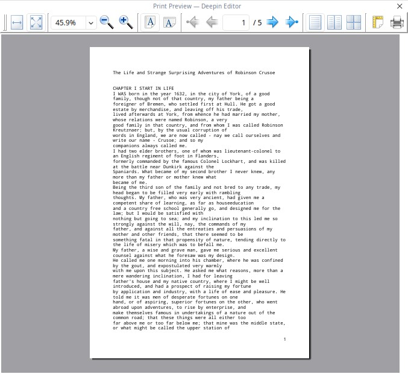
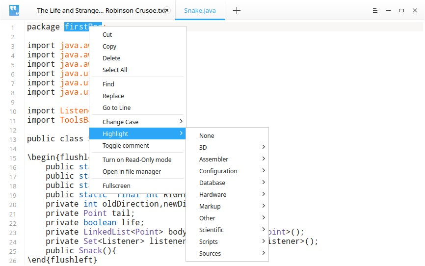
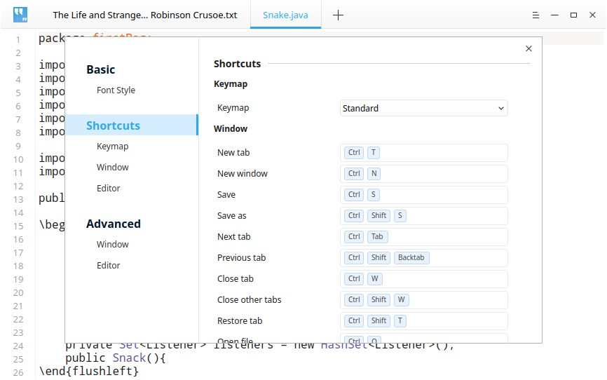

# Deepin Editor|../common/deepin-editor.svg|

## Overview

Deepin editor is a simple text editing tool. You can use it to write a simple text document, or use its advanced features as a code editing tool that supports code syntax highlighting.

## Guide

### Run Deepin Editor

On Dock, click on  to enter Launcher.  Search or browse to find Deepin Editor , click to open it.

In Launcher, right click on Deepin Editor, you can:

  - Click on **Send to desktop** to create a desktop shortcut.
  - Click on **Send to dock** to fix its icon on Dock.
  - Click on **Add to startup** to add it to startup, it will auto run when system boots.

### Exit Deepin Editor

- On Deepin Editor interface, click on  to exit.
- On Deepin Editor interface, click on  > **Exit** to exit.
- Right click on  on Dock, select **Close All** to exit.

### View Shortcuts

On Deepin Editor Interface, press ++ to view all the shortcuts. You can get them in Settings as well. Using shortcuts will greatly improve your work efficiency.

## Basic Operations

### Create Document

Click  on the title bar, or press  +, or select **New window** and **New tab** in the main menu, you can create blank document in Deepin Editor.

### Open File

You can open the text file in the following ways, and the selected file will open in the new tab:

- Drag and drop the file to Deepin Editor interface or its icon.
- Right click the file and open it with Deepin Editor. After selecting Deepin Editor as the default program, you can double-click the file to open it directly.
- In Deepin Editor interface, click  > **Open file** and select the file.
- In Deepin Editor interface, use  +  to open the file.

> : You can open multiple files at one time.

### Save File

- Press  +  to save the current document.
- Press  > **Save** to save the file.

You can also press  +  +  to save the file as  a new one.

### Close File

- Press  +  to close the file.
- Move cursor to the title, click the close button there to close the file.
- Right click the title, select **Close tab** or **Close other tabs**.

> : If you make changes to the file but have not saved it, Deepin Editor will prompt you to save it when closing.

### Print Document

To print file in Deepin Editor, you should have connected and configured the printer.

1. Click  > **Print**, or press  +  to open print preview.

2. In the preview interface, preview the document and set the printing page.

3. Click the printer icon on the right of preview window. In the pop-up window, select the printer and set the parameters. 

4. Click **Print** to start print.

### Manage Tab

In Deepin Editor, you can drag to reorder tabs within the same window, remove tab to create a new window, or move tab from one window to another.

#### Tab Shortcuts

| Function   |  Shortcuts |
| ---------------------------------- | ------------ |
| New tab   |  Ctrl + T |
| Next tab | Ctrl + Tab |
| Previous tab  | Ctrl + Shift + Tab |
| Close tab | Ctrl + W |
| Close other tabs | Ctrl + Shift + W |
| Restore tab (Reopen closed tab) | Ctrl + Shift + T |

## Edit Text

### Move Cursor

In addition to using the arrow keys and mouse clicks, you can also use the following shortcuts to move the cursor quickly:

| Function   |  Shortcuts |
| --------------- | ------------ |
| Save cursor position | Ctrl + Shift + > |
| Reset cursor position (Jump to cursor last saving position) | Ctrl + Shift + < |
| Forward word (Jump forward over a word) | Ctrl + Right |
| Backward word (Jump backward over a word) | Ctrl + Left |
| Move to end of line | End |
| Move to start of line | Home |
| Move to end of text | Ctrl + End |
| Move to start of text | Ctrl + Home |
| Move to line indentation | Ctrl + M |
| Forward over a pair (Jump forward after the right parenthesis) | Alt + P |
| Backward over a pair (Jump backward before the left parenthesis) | Alt + N |

### Change Case

It helps you change the case of selected text. You can change it to lowercase, uppercase, or capitalize the initial.

1. Select the text.
2. Right click and select **Change Case**.
3. Choose **Upper Case**, **Lower Case**, or **Capitalize**. The changes will take effect immediately.

You can also use  +  /  /  to quickly switch the cases.

### Highlight Text
Deepin Editor supports highlighting different kinds of texts.

Right click and select **Highlight**, choose the type of text you want to highlight.

### Delete Text

In addition to deleting characters one by one, you can quickly delete characters by using the following shortcuts:

| Function   |  Shortcuts |
| --------------- | ------------ |
| Delete to end of line | Ctrl + K |
| Delete current line | Ctrl + Shift + K |
| Delete backward word | Alt + Shift + N |
| Delete forward word | Alt + Shift + M |

### Undo

If you make a misoperation, press  +  to undo it, or right click and select **Undo**.

### Find Text

1. Press  +  to open "Find" box below.
2. Input the text you want to find. Once input, all the matches will be highlighted.
3. Click **Next**, **Previous** to find each match, or press  to find next match.
4. Press  or click close button to close the dialog box.

> : Select the text and then press  + , the text will be automatically in the "Find" box.

### Replace Text
1. Press  +  to open "Replace" box below.
2. Input the text to be replaced and the new text.
3. Click **Replace** to replace the matches one by one, click **Replace Rest**、**Replace All** to replace the rest or all the matches. Click **Skip** to skip the current matching text.
4. Press  or click close button to close the dialog box.

### Go to Line
Use it to jump to specific line directly.
Right click and select **Go to Line**, or press  + , and then input the line number to go to that line.

### Edit Line

Use below shortcuts to edit lines easily:

| Function  |  Shortcuts |
| ------------ | ------------ |
| New line above (Insert one line above) | Ctrl + Enter |
| New line below(Insert one line below) | Ctrl + Shift + Enter |
| Duplicate line | Ctrl + Shift + D |
| Swap line up (Swap the current line with above line) | Ctrl + Shift + Up |
| Swap line down (Swap the current line with below line)  | Ctrl + Shift + Down |
| Scroll up one line | Super + Shift + Up |
| Scroll down one line | Super + Shift + Down |
| Mark | Alt + H |
| Unmark | Alt + Shift + H |
| Copy line | Super + C |
| Cut line | Super + X |
| Merge lines | Ctrl + J |

## Main Menu

### Switch Theme

Deepin Editor has various themes for you to change its style.

Click  > **Switch Theme**, and select the theme you want. It will change immediately.

### Basic Settings
#### Font Style

1. Click  > **Settings**.
2. In Settings window, select the font and font size.
3. The text will then use the new font and font size.

> : You can also use  + /  to adjust the font size, and press  +  to reset font size.

### Shortcuts
1. Click  > **Settings**.
2. Select a keymap in **Shortcuts** and view the shortcuts.
3. You can click and press new shortcuts to customize it.

> : Choose a proper keymap to fit your habits, including standard keymap, Emacs keymap, or customize it as you like.

### Advanced Settings

1. Click  > **Settings**.
2. In **Advanced**, you can set:
   - Window size: Normal, Maximum, or Fullscreen;
   - Tab space: The indentation width when pressing Tab.

> : Clicking on Restore Defaults will restore all settings to default.

### Help

1. On Deepin Editor interface, click on .
2. Select **Help**.
3. View the manual.

### About

1. On Deepin Editor interface, click on .
2. Select **About**.
3. View the version and description.

### Exit

1. On Deepin Editor interface, click on .
2. Click on **Exit** to exit.  