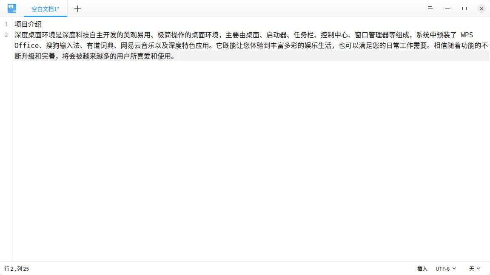
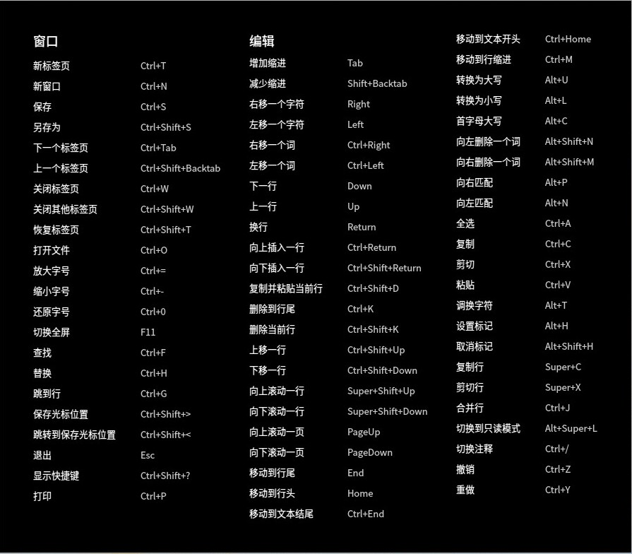
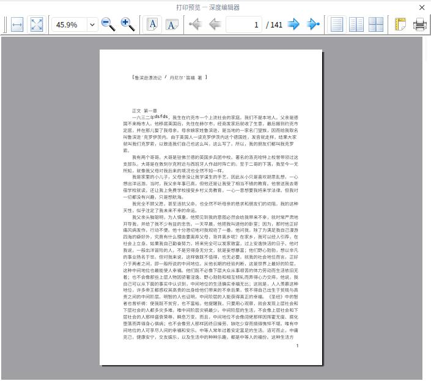
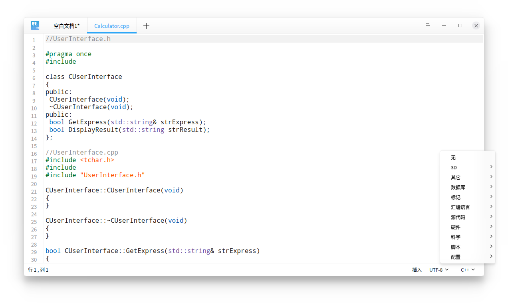
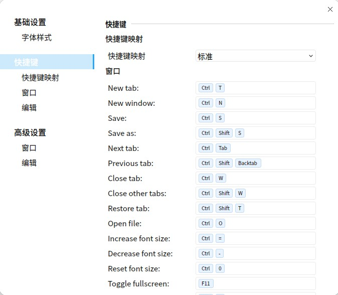

# 深度编辑器|../common/deepin-editor.svg|

## 概述

深度编辑器是一个简单的文本编辑工具。您可以用它书写简单的文本文档，也可以使用它的高级特性，让它成为一个代码编辑工具，支持代码语法高亮。

## 使用入门

### 运行深度编辑器

点击桌面底部的  ，进入启动器界面。搜索或浏览找到深度编辑器 ，点击打开。

在启动器中，右键单击深度编辑器图标，您可以：
 - 点击 **发送到桌面**，在桌面创建快捷方式。
 - 点击 **发送到任务栏**，将应用程序固定到任务栏。
 - 点击 **开机自动启动**，将应用程序添加到开机启动项，在电脑开机时自动运行该应用程序。

### 退出深度编辑器

- 在深度编辑器界面，点击   ，退出深度编辑器。
- 在深度编辑器界面，点击主菜单  > **退出** 来退出深度编辑器。
- 在任务栏右键单击  ，选择 **关闭所有** 来退出深度编辑器。

### 查看快捷键

在深度编辑器界面上，按下键盘上的  +  +  组合键来查看快捷键。您也可以在设置界面查看快捷键。熟练地使用快捷键，将大大提升您的操作效率。

## 基本操作

### 新建文件

点击标题栏上的 ，按下组合键 +  ，或者选择主菜单中的 **新窗口** 、**新标签页**，都可以新建空白文档。

### 打开文件

您可采用以下方式打开文本文件，选中的文件将会在新标签页打开：

- 直接拖动文件到深度编辑器界面或其图标上。
- 右键文件，选择用深度编辑器打开。选择深度编辑器为默认打开程序后，可直接双击打开。
- 在深度编辑器界面，点击 > **打开文件**，选择文件。
- 在深度编辑器界面，使用 + 组合键，选择文件打开。

> ：您可以一次打开多个文件。

### 保存文件
- 使用 + 组合键保存当前文件。
- 点击 > **保存**，保存文件。
您还可以使用 +  +  另存文件。

### 关闭文件

- 使用 + 组合键关闭当前文件。
- 移动光标到文件标题，点击标题栏上的关闭按钮，关闭当前文件。
- 右键单击文件标题，选择 **关闭标签页** 或者 **关闭其他标签页**。

> ：如果您的文件中发生了变化而没有保存，深度编辑器会在关闭前提示您保存更改。

### 打印文档

在深度编辑器中使用打印，需要您连接并配置好打印机。

1. 点击 > **打印**，也可以使用组合键 + 打开打印预览。
2. 在打印预览界面，您可以预览并设置打印页面。
3. 在打印预览界面，点击最右边的打印机图标，在弹出的窗口中选择打印机，并设置相关参数。
4. 点击 **打印** 即可将文件发送到打印机打印。

### 管理标签页

在深度编辑器中，可以拖动同一个窗口内的标签页重新排序，也可以移出标签页创建一个新的窗口，或者从一个窗口移到另外一个窗口中。

#### 标签页快捷键

| 功能   |  快捷键 |
| ---------------------------------- | ------------ |
| 新标签页   |  Ctrl + T |
|  下一个标签页 | Ctrl + Tab |
| 上一个标签页  | Ctrl + Shift + Tab |
| 关闭标签页 | Ctrl + W |
| 关闭其他标签页 | Ctrl + Shift + W |
| 恢复标签页（打开关闭的标签页） | Ctrl + Shift + T |

## 编辑文本

### 移动光标

除使用方向键和鼠标点击移动光标，您还可以使用以下快捷键迅速移动光标：

| 功能   |  快捷键 |
| --------------- | ------------ |
| 保存光标位置 | Ctrl + Shift + > |
| 重置光标位置（跳转到上次光标保存的位置） | Ctrl + Shift + < |
| 右移一个词 （光标向右跳过一个词） | Ctrl + 右方向键 |
| 左移一个词 （光标向左跳过一个词） | Ctrl + 左方向键 |
| 移动到行尾 | End |
| 移动到行头 | Home |
| 移动到文本结尾 | Ctrl + End |
| 移动到文本开头 | Ctrl + Home |
| 移动到行缩进 | Ctrl + M |
| 向右匹配 （光标移动到右括号的后面） | Alt + P |
| 向左匹配（光标移动到左括号的前面） | Alt + N |

### 切换大小写

此功能帮助您更改选中文本的大小写。您可以将选中文本全部改为小写字母，大写字母，或者让首字母大写。

1. 选中您想更改的文本内容。
2. 点击右键，选择 **切换大小写**。
3. 选择您想使用的格式选项。文本格式的更改会立即生效。

您也可以使用快捷键  +  /  /  迅速切换大小写。

### 高亮文本
深度编辑器支持高亮不同类型的文本。
点击底部状态栏最右侧的三角符号， 选择某种文本类型。若文本中有相应内容则会自动高亮。

### 删除文本
除了向左或向右逐个删除字符外，您还可以使用以下快捷键迅速删除字符：

| 功能   |  快捷键 |
| --------------- | ------------ |
| 删除到行尾 | Ctrl + K |
| 删除当前行 | Ctrl + Shift + K |
| 向左删除一个词 | Alt + Shift + N |
| 向右删除一个词 | Alt + Shift + M |

### 撤销操作

如果在编辑时发生误操作, 您可以使用组合键  +  取消这个操作， 或者在右键菜单中选择 **撤销**。

### 查找文本

1. 使用组合键  +  可以在下方打开查找窗口。
2. 在查找窗口中输入您想要搜索的文本。在您输入的同时，编辑器就会高亮显示文档中的匹配项。
3. 点击 **下一个**、**上一个** 逐个查找，或使用  键查找下一个匹配项。
4. 按下 键或点击关闭按钮，关闭查找窗口。

> ：如果您使用鼠标选中一段文本，然后按  +  进行搜索，则这段文本会自动出现在查找窗口中。

### 替换文本
1. 使用组合键  +  可以在下方打开替换窗口。
2. 在替换窗口中输入您想要替换的文本以及新文本。
3. 点击 **替换**逐个替换，点击 **剩余替换**、**全部替换** 一次性替换剩余的或所有的匹配文本。点击 **跳过** 不替换当前匹配的文本。
4. 按下 键或点击关闭按钮，关闭搜索窗口。

### 跳到行
使用该功能可以迅速跳转到任一行。
在右键菜单中选择 **跳到行** 或者使用 + ，输入行号即可跳转到相应行。

### 编辑行

您可以使用以下快捷键迅速编辑行：

| 功能   |  快捷键 |
| ------------ | ------------ |
| 向上插入一行（在上方插入一行） | Ctrl + Enter |
| 向下插入一行（在下方插入一行） | Ctrl + Shift + Enter |
| 复制并粘贴当前行 | Ctrl + Shift + D |
| 上移一行（与上一行交换位置） | Ctrl + Shift + Up |
| 下移一行（与下一行交换位置） | Ctrl + Shift + Down |
| 向上滚动一行 | Super + Shift + Up |
| 向下滚动一行 | Super + Shift + Down |
| 设置标记 | Alt + H |
| 取消标记 | Alt + Shift + H |
| 复制行 | Super + C |
| 剪切行 | Super + X |
| 合并行 | Ctrl + J |

## 主菜单

### 切换主题

深度编辑器包含多个主题，允许您更改文本窗口的外观。
点击 > **切换主题**，选择您想使用的主题。新的主题会立即生效。

### 基础设置
#### 字体样式

您可以根据个人习惯修改深度编辑器的默认字体和字号。
1. 点击 > **设置**。
2. 在设置窗口中，选择字体和字号。
3. 文本内容会立即使用新的字体和字号。

> ：您还可以使用  + /  来调节深度编辑器的默认字号。使用  +  恢复默认字号。

### 快捷键设置
1. 点击 > **设置**，在 **快捷键** 选项查看当前快捷键。
2. 选择一种快捷键映射。
3. 您可以点击并重新输入快捷键，来自定义快捷键。

> : 快捷键映射允许您选择某一种键盘快捷键。您可以使用标准快捷键，Emacs快捷键，或自定义快捷键，以符合您的使用习惯。

### 高级设置

1. 点击 > **设置**.
2. 在 **高级设置** 选项，您可以设置：
   - 窗口默认大小：为正常大小，最大化或全屏。
   - Tab字符宽度：Tab缩进所占用的空间大小。

> ：点击设置界面上的 **恢复默认**,会将所有设置恢复到默认状态。

### 帮助

您可以点击帮助获取帮助手册，进一步了解和使用深度编辑器。

1. 在深度编辑器界面，点击 。
2. 点击 **帮助**。
3. 查看深度编辑器的帮助手册。

### 关于

您可以点击关于，查看深度编辑器的版本介绍。

1. 在深度编辑器界面，点击 。
2. 点击 **关于**。
3. 查看深度编辑器的版本和介绍。

### 退出

您可以进入主菜单点击退出深度编辑器。

1. 在深度编辑器界面，点击 。
2. 点击 **退出**。