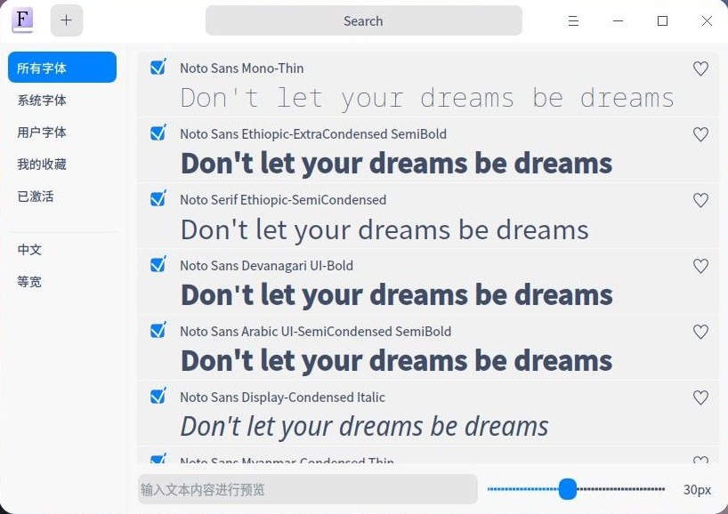
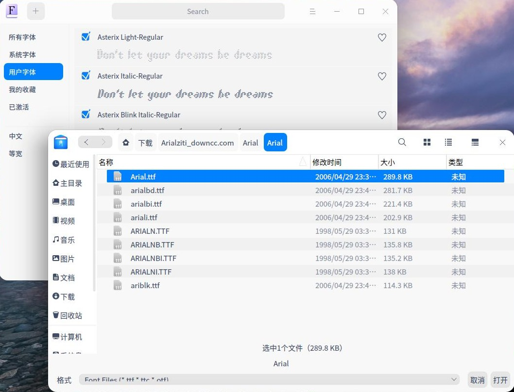
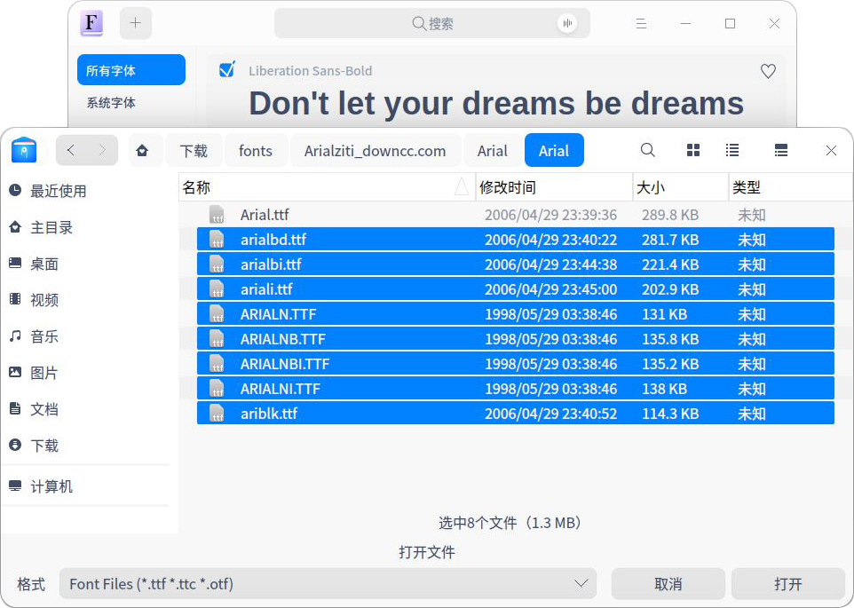
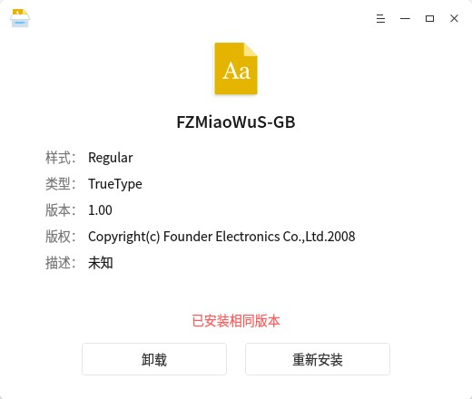

# 字体管理器|../common/deepin-font-installer.svg|

## 概述

深度字体管理器是一款字体安装和卸载工具，简化字体安装和卸载的操作，支持批量安装、字体信息识别等功能，让您轻松用上喜欢的字体。

## 操作介绍

### 打开方式

您可以使用以下方法打开深度字体管理器：

- 右键单击字体文件并选择 **打开方式** > **深度字体管理器**，深度字体管理器会自动启动并准备安装该字体。
- 从启动器中点击 ，深度字体管理器启动后可以选择文件或者直接将字体文件拖拽到界面上。

### 安装

深度字体管理器可以安装单个字体，也可以批量安装多个字体。

#### 单个安装

1. 在深度字体管理器界面，点击 **选择文件** 。
2. 选择需要安装的字体，点击 **打开**。
3. 点击 **安装**。
4. 如果弹出授权窗口，请输入密码授权。
5. 安装成功之后，点击 **查看字体目录** ，可以查看字体的具体安装位置。

>:深度字体管理器会自动检测您的字体，如果本地已经安装过该字体，会显示已安装和准备安装的版本信息，此时可以选择 **卸载** 或 **重新安装** 操作。

#### 多个安装

深度字体管理器可以通过拖拽和选择文件的方式一次性批量添加多个字体，安装步骤请参考 [单个安装](#单个安装)，多个安装时请注意一下要点：

- 批量添加成功后可以继续追加。
- 批量安装时按钮只显示 **安装** 按钮。本地已安装的字体执行重新安装操作。
- 批量安装时将鼠标移动到一个字体栏上，可以点击右侧的×将该字体从安装列表移除。

>:如果您想将安装的字体设置成系统字体，可以打开 **控制中心** > **个性化设置** > **字体** 来设置系统字体。

### 卸载

当您想要卸载一个字体时，可以使用深度字体管理器执行卸载操作。

1. 在深度字体管理器界面，点击 **选择文件** 。
2. 选择计算机上已安装的字体，点击 **打开**。
3. 点击 **卸载**。
4. 如果弹出授权窗口，请输入密码授权。
5. 卸载成功后点击 **完成**。

### 文件管理器快捷操作

您可以通过深度文件管理器预览、打开、安装和卸载字体。

- 在深度文件管理器中选中字体文件并按键盘的空格键，可以打开预览窗口直接预览该字体。
- 在深度文件管理器中选中字体文件并选择右键菜单中的　**打开**，可以快速启动深度字体管理器并将改字体加入到安装列表。

## 主菜单

### 帮助

您可以点击帮助获取深度字体管理器的帮助手册，通过帮助进一步让您了解和使用深度字体管理器。

1. 在深度字体管理器界面，点击 。
2. 点击 **帮助**。
3. 查看关于深度字体管理器的帮助手册。

### 关于

您可以点击关于查看深度字体管理器的版本介绍。

1. 在深度字体管理器界面，点击 。
2. 点击 **关于**。
3. 查看关于深度字体管理器的版本和介绍。

### 退出

您可以进入菜单栏点击退出深度字体管理器。

1. 在深度字体管理器界面，点击 。
2. 点击 **退出**。

