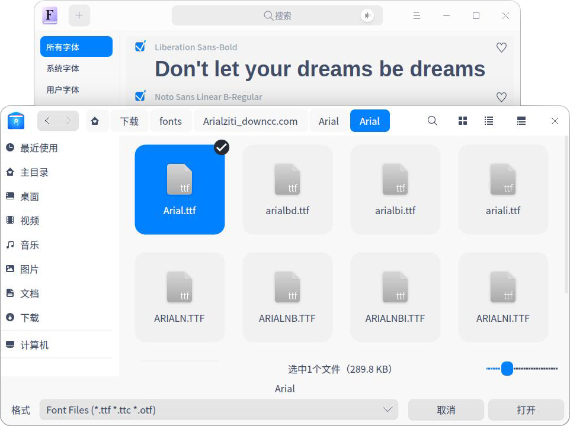
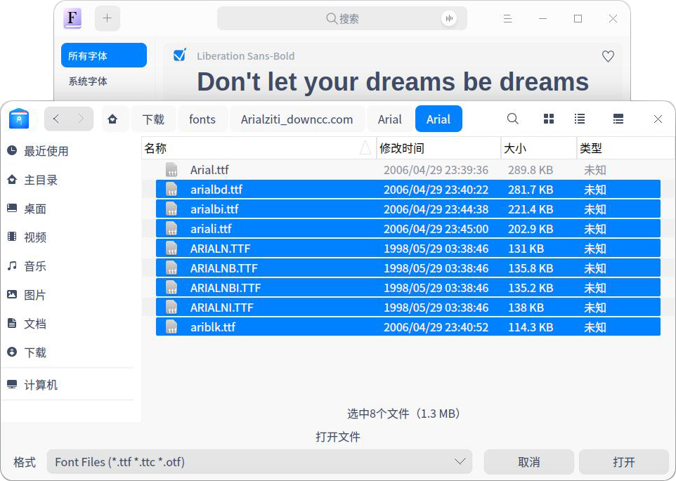
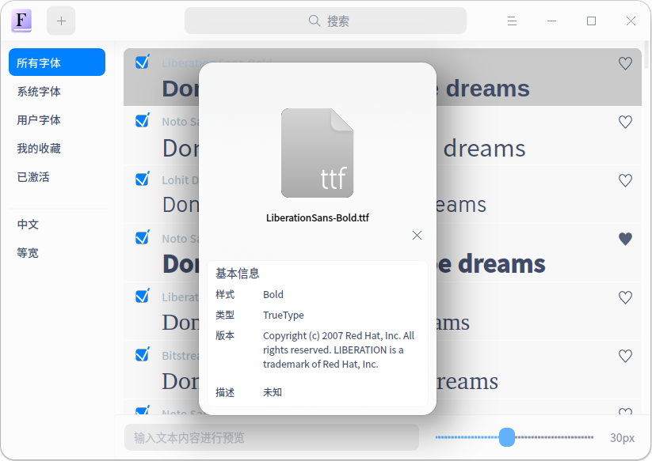

# 字体管理器|../common/deepin-font-manager.svg|

## 概述

字体管理器是一款功能非常强大的字体管理工具，具有查找、安装、启用、禁用、收藏、删除字体等功能，还可以通过输入文本内容、设置文本大小进行字体预览。

字体管理器支持安装的字体格式有ttf、xft、mf。

## 使用入门

您可以通过以下方式运行或关闭字体管理器，或者创建字体管理器的快捷方式。

### 运行字体管理器

1. 点击桌面底部的  ，进入启动器界面。
2. 上下滚动鼠标滚轮浏览或通过搜索，找到字体管理器  点击运行。
3. 右键单击  ，您可以：

   - 点击 **发送到桌面**，在桌面创建快捷方式。
   - 点击 **发送到任务栏**，将应用程序固定到任务栏。
   - 点击 **开机自动启动**，将应用程序添加到开机启动项，在电脑开机时自动运行该应用。

### 关闭字体管理器

- 在字体管理器界面点击   ，退出字体管理器。
- 在任务栏右键单击  ，选择 **关闭所有** 来退出字体管理器。
- 在字体管理器界面点击  ，选择 **退出** 来退出字体管理器。

## 操作介绍

### 界面介绍

| 名称     | 说明                                                       |
| -------- | ---------------------------------------------------------- |
| 所有字体 | 系统字体和用户字体的集合，默认显示所有字体。               |
| 系统字体 | 系统自带的字体列表，该字体集中的字体不可删除。             |
| 用户字体 | 用户安装字体列表。                                         |
| 我的收藏 | 用户选择收藏的字体列表，在其他字体集中选定字体的字体合集。 |
| 已激活   | 启动状态的所有字体合集。                                   |
| 中文     | 所有字体集中的中文字体。                                   |
| 等宽     | 所有字体中字符宽度相同的字体。                             |

### 安装字体

字体管理器可以安装单个字体，也可以批量安装多个字体。

#### 单个安装

1. 在字体管理器界面，点击，或选择   > **添加字体**。
2. 选择文件，选定需要安装的字体，点击 **打开**。
3. 如果弹出授权窗口，请输入密码授权。
4. 安装成功之后，右键单击字体文件，选择 **在文件管理器中显示**，查看字体的具体安装位置。

：您可以右键点击字体文件并选择 **打开方式** > **字体管理器**，进入字体管理器界面，点击 **安装字体** 安装字体。

:字体管理器会自动检测您的字体，如果本地已经安装过该字体，会显示已安装相同版本的提示信息，此时可以选择  **退出**  或 **继续** 安装操作。

#### 多个安装

字体管理器可以通过拖拽和选择文件的方式一次性批量添加多个字体，安装步骤请参阅 [单个安装](#单个安装)，多个安装时请注意以下要点：

- 批量添加成功后可以继续追加。
- 批量安装时本地已安装的字体执行重新安装操作。

：如果您想将安装的字体设置成系统字体，可以打开 **控制中心** > **个性化** > **字体** 来设置系统字体。

### 搜索字体

1. 在字体管理器界面，顶部搜索框中，您可以：

   - 点击，输入关键字。
   - 点击，输入语音，语音会转化为文字显示在搜索框中。

   在所选择的字体集列表中实时显示搜索结果。如果未匹配到搜索条件时，字体列表中显示为“无搜索结果”。

2. 如果搜索到相关字体时，在底部文本内容预览框中输入文字，再通过左右拖动控制条设置字体大小，可切换查看包含搜索条件的预览效果。

3. 在搜索框中点击，或删除搜索框中输入的信息，即可清除当前输入的搜索条件或取消搜索。

### 查看字体基本信息

您可以通过文件管理器查看字体基本信息。

1. 在字体管理器界面，字体集列表中，右键单击 **信息**。

   可以查看字体图标、名称、样式、类型、版本和描述信息。
   

### 查看字体安装位置

当字体安装成功后，您可以通过文件管理器查看字体安装位置。

1. 在字体管理器界面，字体集列表中，右键点击 **在文件管理器中显示**，查看字体具体安装位置。

### 预览字体

字体集中字体的每个文本块呈现着字体的样式，可以通过预览字体来体验字体的显示效果。

默认预览文案为“Don't let your dreams be dreams”，中/英文展示。

1. 在字体管理器界面，在底部字体预览输入框中输入文本内容。

2. 通过左右拖动控制条设置字体大小。

   在字体集列表中查看字体显示效果。

   ：控制条向左滑动为缩小字体，向右滑动为放大字体，字体大小范围为6px - 60px。

### 收藏/取消收藏字体

当您需要收藏或者取消收藏一个字体时，可以使用字体管理器执行该操作。
1. 在字体管理器界面，**所有字体** 列表。

2. 点击列表中某一列所在行右侧的图标 。

3. 可以在 **我的收藏** 列表中查看该字体，其状态为“已收藏”。

4. 在所有字体列表中，点击图标。

   取消收藏的字体将不在 **我的收藏 **显示，且该字体在其他字体集列表中状态为“未收藏” 。

5. 在所有字体列表中，也可以进行右键点击 **收藏** 或 **取消收藏** 操作。

### 启用/禁用字体 

当您需要启用或者禁用一个字体时，可以使用字体管理器执行该操作。

1. 在字体管理器界面，**所有字体** 列表，选择状态为“未启用”的字体。

2. 勾选字体，字体将为启用状态，同时显示在 **已激活** 列表。

3. 在 **已激活** 列表，点击取消已勾选的字体，禁用该字体。

   禁用字体将不在 **已激活 **列表显示，且该字体在其他字体集列表中处于置灰“禁用” 状态。

4. 在所有字体列表中，也可以进行右键点击 **启用字体** 或者 **禁用字体** 操作。

### 删除字体

当您需要删除一个字体时，可以使用字体管理器执行该操作。

：目前仅支持单个删除，不支持批量删除字体。系统字体、禁用字体不能删除。

1. 在字体管理器界面，**用户字体** 列表，选中字体右键点击 **删除字体**。
2. 在弹出的提示对话框中点击 **删除**。
3. 如果弹出授权窗口，请输入密码授权，即可删除字体。

## 主菜单

在主菜单中，您可以切换窗口主题、查看帮助手册，了解字体管理器的更多信息。

### 主题

窗口主题包含浅色主题、深色主题和系统主题，其中系统主题为默认设置。

1. 在字体管理器界面，点击。
2. 点击 **主题**，选择一个主题颜色。

### 帮助

查看帮助手册，通过帮助进一步让您了解和使用字体管理器。

1. 在字体管理器界面，点击 。
2. 点击 **帮助**。
3. 查看关于字体管理器的帮助手册。

### 关于

1. 在字体管理器界面，点击 。
2. 点击 **关于**。
3. 查看关于字体管理器的版本和介绍。

### 退出

1. 在字体管理器界面，点击 。
2. 点击 **退出**。

