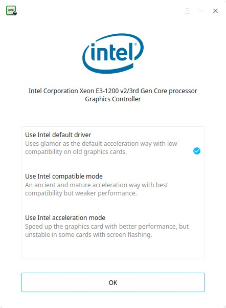
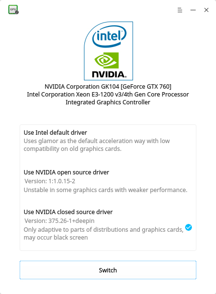
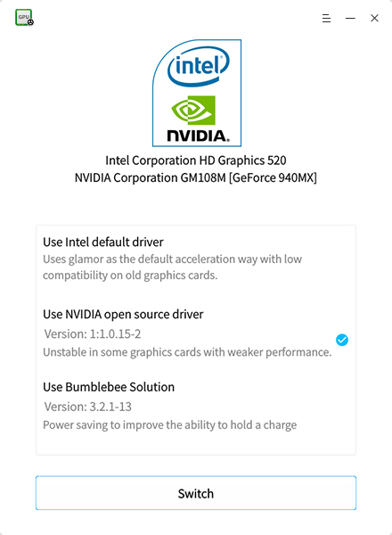

# Graphics Driver Manager|../common/deepin-graphics-driver-manager.svg|

## Overview

Deepin Graphics Driver Manager is a compact and easy  to use graphics driver managing tool. It includes graphics card hardware detection, graphics driver installation, graphics driver solution switching,  graphics driver automatic recovery and other functions.

## Common Operations

Don't worry about your system, Deepin Graphics Driver Manager supports to restore your operations! The original driver solution will be restored after the new solution failed or by rebooting if new solution resulted blank screen.

: There will be a solution list, if the driver solution you selected  is system currently used, just click on **OK** or  to exit.

### NVIDIA Graphics Driver Management
#### Single NVIDA Graphics Driver 
If your computer only has one NVIDA graphics card, closed source driver is recommended with better performance, but parts will occurred compatibility problem. If closed source driver can not be used, you'd better try open source, because the default driver is poor in performance.

1. On Deepin Graphics Driver Manager interface, select the driver solution for your graphics card.
2. Click on **Switch** to switch.
3. Click on **Reboot** to install the new driver.
4. Check the test interface. 
5. Click on **Apply** to use the new driver solution and click on **Cancel** to restore to original driver.
6. Reboot again to make your operation take effect.

 

#### NVIDA+ Intel Graphics Driver (For desktop computer)
If your computer has NVIDA and intel  graphics card, NVIDA independent graphics card is recommended, just like single NVIDA graphics driver, closed source driver and open source driver are supported. If both are not available, you can try the default driver of Intel integrated graphics card.

1. On Deepin Graphics Driver Manager interface, select the driver solution for your graphics card.
2. Click on **Switch** to switch.
3. Click on **Reboot** to install the new driver.
4. Check the test interface. 
5. Click on **Apply** to use the new driver solution and click on **Cancel** to restore to original driver.
6. Reboot again to make your operation take effect.

 

#### NVIDA+ Intel Graphics Driver (For laptop)
If your laptop has NVIDA and intel  graphics card, intel integrated graphics card is used by default, but bumblebee is recommended (if hardware supported).  If bumblebee doesn't work, you can try NVIDA open source drivers or the default driver of Intel integrated graphics card.

1. On Deepin Graphics Driver Manager interface, select the driver solution for your graphics card.
2. Click on **Switch** to switch.
3. Click on **Reboot** to install the new driver.
4. Check the test interface. 
5. Click on **Apply** to use the new driver solution and click on **Cancel** to restore to original driver
6. Reboot again to make your operation take effect.

 

> : Bumblebee solution is recommended for better performance.

### Intel Graphics Driver Management
If your computer only has one intel graphics card, the default driver is recommended with better performance and poor compatibility. If default driver can not be used, you'd better try acceleration mode. Compatible mode is a more ancient and mature solution with the best compatibility and weaker performance.

1. On Deepin Graphics Driver Manager interface, select the driver solution for your graphics card.
2. Click on **Switch** to switch.
3. Click on **Reboot** to install the new driver.
4. Check the test interface. 
5. Click on **Apply** to use the new driver solution and click on **Cancel** to restore to original driver
6. Reboot again to make your operation take effect.

  

### AMD Graphics Driver Management
If the system detected AMD graphics card used, no other solutions available,  just click on **OK** to exit.

## Main Menu

### Help

1. On Deepin Graphics Driver Manager interface, click on .
2. Select **Help**.
3. View the manual.

### About

1. On Deepin Graphics Driver Manager interface, click on .
2. Select **About**.
3. View the version description.

### Exit

1. On Deepin Graphics Driver Manager interface, click on .
2. Click on **Exit** to exit.
