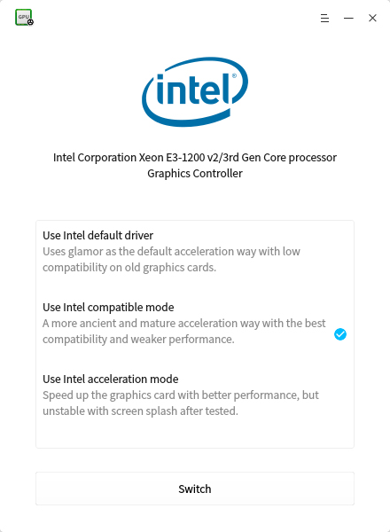
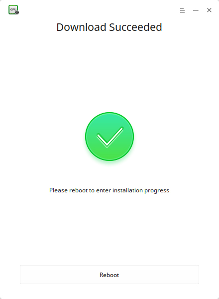
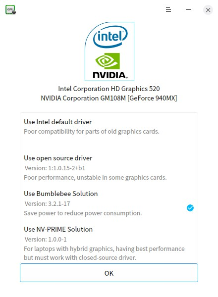

# Graphics Driver Manager|../common/deepin-graphics-driver-manager.svg|

## Overview

Deepin Graphics Driver Manager is a compact and easy to use graphics driver managing tool. It includes graphics card hardware detection, graphics driver installation, graphics driver solution switching,  graphics driver automatic recovery and other functions.

 

 

 

## Common Operations

Don't worry about your system, Deepin Graphics Driver Manager supports to restore your operations! The original driver solution will be restored after the new solution failed or by rebooting if the new solution resulted a blank screen.

: If the driver solution you selected is system currently used, just click on **OK** or  to exit.

### NVIDIA Graphics Driver Management
#### Single NVIDIA Graphics Driver 
If your computer only has one NVIDIA graphics card, closed source driver is recommended with better performance, but some have compatibility problem. If closed source driver can not be used, please try open source driver, because the default driver is poor in performance.

1. On Deepin Graphics Driver Manager interface, select the driver solution for your graphics card.
2. Click on **Switch** to switch.
3. Click on **Reboot** to install the new driver.
4. Check the test interface. 
5. Click on **Apply** to use the new driver solution and click on **Cancel** to restore to original driver.
6. Reboot again to make your operation effective.

 

#### NVIDIA + Intel Graphics Driver (For desktop computer)
If your computer has NVIDIA and Intel graphics cards, discrete NVIDIA graphics card is recommended, just like single NVIDIA graphics driver, closed source driver and open source driver are supported. If both are not available, you can try the default driver of Intel integrated graphics card.

1. On Deepin Graphics Driver Manager interface, select the driver solution for your graphics card.
2. Click on **Switch** to switch.
3. Click on **Reboot** to install the new driver.
4. Check the test interface. 
5. Click on **Apply** to use the new driver solution and click on **Cancel** to restore to original driver.
6. Reboot again to make your operation effective.

 

#### NVIDIA + Intel Graphics Driver (For laptop)
If your laptop has NVIDIA and Intel graphics cards, Intel integrated graphics card is used by default, but bumblebee is recommended (if hardware supported).  If bumblebee doesn't work, you can try NVIDIA open source driver, or the default driver of Intel integrated graphics card, or PRIME solution.

1. On Deepin Graphics Driver Manager interface, select the driver solution for your graphics card.
2. Click on **Switch** to switch.
3. Click on **Reboot** to install the new driver.
4. Check the test interface. 
5. Click on **Apply** to use the new driver solution and click on **Cancel** to restore to original driver.
6. Reboot again to make your operation effective.

 

> : If your laptop does not support bumblebee driver, then it will not be shown, please refer to the solution for desktop computer.

> : PRIME is a technology used to manage hybrid graphics found on recent laptops with best performance.

### Intel Graphics Driver Management
If your computer only has one Intel graphics card, the default driver is recommended with better performance and poor compatibility. If default driver can not be used, you'd better try acceleration mode. Compatible mode is an ancient but mature solution with the best compatibility and weaker performance.

1. On Deepin Graphics Driver Manager interface, select the driver solution for your graphics card.
2. Click on **Switch** to switch.
3. Click on **Reboot** to install the new driver.
4. Check the test interface. 
5. Click on **Apply** to use the new driver solution and click on **Cancel** to restore to original driver.
6. Reboot again to make your operation effective.
 

### AMD Graphics Driver Management
If the system detected AMD graphics card, no other solutions available,  just click on **OK** to exit.

 

## Main Menu

### Dark Theme

1. On Deepin Graphics Driver Manager interface, click on .
2. Select **Dark Theme**.
3. The interface will switch to dark theme.

### Help

1. On Deepin Graphics Driver Manager interface, click on .
2. Select **Help**.
3. View the manual.

### About

1. On Deepin Graphics Driver Manager interface, click on .
2. Select **About**.
3. View the version and description.

### Exit

1. On Deepin Graphics Driver Manager interface, click on .
2. Click on **Exit** to exit.
