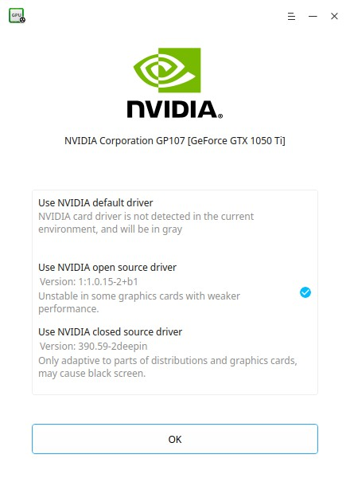

# Graphics Driver Manager|../common/deepin-graphics-driver-manager.svg|

## Vistazo

Deepin Graphics Driver Manager es una herramienta de gestión de controladores de gráficos compacta y fácil de usar. Incluye detección de hardware de la tarjeta gráfica, instalación del controlador de gráficos, cambiar soluciones en el controlador de gráficos, restauración automática del controlador de gráficos y otras funciones.

 

 

 

## Operaciones comunes

¡No se preocupe por su sistema operativo, Deepin Graphics Driver Manager tiene planeado restaurar sus acciones! La solución para el controlador original se revertirá cuando éste tiene problemas o muestra deficiencias gráficas al reiniciar el sistema.

: Si la solución del controlador que escogió es actualmente usado en el sistema, solo haga clic en **Aceptar** o  para salir.

### Administrador de controladores gráficos de NVIDIA
#### Controlador gráfico sencillo de NVIDIA
Si su computadora solo tiene una tarjeta gráfica NVIDIA, el controlador de fuente cerrada o privativa es la mejor opción con un mejor rendimiento, pero raras veces ocurren problemas de compatibilidad. Si no se puede utilizar el controlador de fuente cerrada, intente optar por el controlador de origen, ya que el controlador predeterminado tiene bajo rendimiento.

1. En la interfaz de Deepin Graphics Driver Manager, seleccione la solución del controlador para su tarjeta gráfica.
2. Clic en **Cambiar** para realizar el cambio.
3. Clic en **Reiniciar** para instalar el nuevo controlador.
4. Revise la interfaz de prueba.
5. Clic en **Aplicar** para usar la nueva solución del controlador y haga clic en **Cancelar** para revertir al controlador original.
6. Reinicie de nuevo para que la operación sea efectiva.

 

#### Controlador gráfico mixto NVIDIA + Intel (para computadoras de escritorio)
Si su computadora tiene tarjetas gráficas con NVIDIA y Intel, se recomienda la versión centrada en la tarjeta gráfica NVIDIA; al igual que la solución para la tarjeta gráfica exclusiva para NVIDIA, el controlador de fuente cerrada y el otro de fuente abierta son compatibles. Si ambos no están disponibles, puede probar el controlador predeterminado para la tarjeta gráfica integrada de Intel.

1. En la interfaz de Deepin Graphics Driver Manager, seleccione la solución del controlador para su tarjeta gráfica.
2. Clic en **Cambiar** para realizar el cambio.
3. Clic en **Reiniciar** para instalar el nuevo controlador.
4. Revise la interfaz de prueba.
5. Clic en **Aplicar** para usar la nueva solución del controlador y haga clic en **Cancelar** para revertir al controlador original.
6. Reinicie de nuevo para que la operación sea efectiva.

 

#### Controlador gráfico NVIDIA + Intel (para computadoras portátiles)
Si su laptop tiene tarjeta gráficas con NVIDIA y Intel, la tarjeta gráfica integrada de Intel está activada por defecto, pero la solución bumblebee es recomendada (si el hardware lo admite). Si bumblebee no trabaja, puede probar con el controlador NVIDIA de código abierto, el controlador predeterminado de Intel o la solución PRIME.

1. En la interfaz de Deepin Graphics Driver Manager, seleccione la solución del controlador para su tarjeta gráfica.
2. Clic en **Cambiar** para realizar el cambio.
3. Clic en **Reiniciar** para instalar el nuevo controlador.
4. Revise la interfaz de prueba.
5. Clic en **Aplicar** para usar la nueva solución del controlador y haga clic en **Cancelar** para revertir al controlador original.
6. Reinicie de nuevo para que la operación sea efectiva.

 

> : Si su laptop no soporta la solución bumblebee, entonces no se mostrará, consulte los pasos para computadora de escritorio.

> : La tecnología PRIME se usa para la gestión de gráficos híbridos y está disponible en laptops más recientes con una buena optimización.

### Administración de controladores gráficos Intel
Si su computadora tiene solo una tarjeta gráfica Intel, el controlador preinstalado es la recomendada con un buen rendimiento pero una pobre compatibilidad. Si la solución predeterminada no puede usarse, será mejor que pruebe con el modo aceleración. El modo compatible es una solución clásica pero establece con la mejor compatibilidad y un rendimiento más limitado.

1. En la interfaz de Deepin Graphics Driver Manager, seleccione la solución del controlador para su tarjeta gráfica.
2. Clic en **Cambiar** para realizar el cambio.
3. Clic en **Reiniciar** para instalar el nuevo controlador.
4. Revise la interfaz de prueba.
5. Clic en **Aplicar** para usar la nueva solución del controlador y haga clic en **Cancelar** para revertir al controlador original.
6. Reinicie de nuevo para que la operación sea efectiva.
 

### Administración de controladores gráficos de AMD
Si el sistema dectecta la tarjeta gráfica AMD, no existe otras soluciones para cambiar; por lo tanto, haga clic **OK** para salir.

 

 ## Menú principal

 ### Nueva grabación

 1. En la interfaz de Deepin Voice Recorder, clic en .
 2. Clic en **Nueva grabación**.
 3. Inicie una nueva grabación y la grabación actual se guardará si se finaliza.

 

 ### Ayuda

 1. En la interfaz de la Calculadora Deepin, clic en .
 2. Seleccione **Ayuda**.
 3. Observe el manual.

 ### Acerca de

 1. En la interfaz de la Calculadora Deepin, clic en .
 2. Seleccione **Acerca de**.
 3. Observe la descripción de la versión.

 ### Salida

 1. En la interfaz de la Calculadora Deepin, clic en .
 2. Clic en **Salir** para cerrar.
