# Visor de imágenes Deepin|../common/deepin-image-viewer.svg|

## Vistazo

Visor de imágenes Deepin es un aplicación para visualizar y gestionar imágenes diseñada por Deepin Technology, Inc. Su interfaz es elegante, rápida y eficiente para la organización cotidiana de fotografías. Las funciones de administración de Visor de imágenes Deepin le permiten ordenarlas cronológicamente categorizarlas en diferentes álbumes para mantenerlas en buen estado.

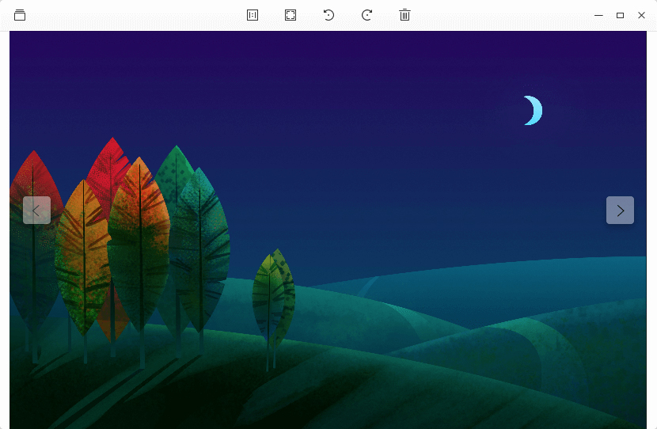

## Guía

El usuario puede iniciar, cerrar y crear un atajo para el Visor de imágenes Deepin de las siguientes formas.

### Iniciar Visor de imágenes Deepin

1. Clic en  or mover el puntero del ratón a la esquina superior izquierda de la pantalla para entrar a la interfaz del Lanzador.
2. Encuentre  al mover la rueda del ratón o buscando como "Visor de imágenes Deepin" en la interfaz del Lanzador.
3. Clic derecho en , el usuario puede hacer:
  - Clic en **Envíar al escritorio** para crear un acceso directo al escritorio.
  - Clic en **Enviar al muelle** para fijar la aplicación al Muelle.
  - Clic en **Añadir al arranque** para añadir la aplicación en el arranque, esta se iniciará automáticamente cuando la computadora inicie.

> : En el Centro de control, puede establecer el visor Deepin como administrador de imágenes predeterminado. Las operaciones específicas son señaladas en [Ajustar aplicaciones predeterminadas](dman:///dde#Ajustar aplicaciones predeterminadas).

### Cerrar Visor de imágenes Deepin

1. En la interfaz del Visor de imágenes Deepin, clic en  para salir del Visor de imágenes Deepin.
2. Clic derecho en  en el muelle, seleccione **Cerrar todo** para salir del Visor de imágenes Deepin.
3. Clic en  y seleccione **Salir** para salir del Visor de imágenes Deepin.

## Ver imagen

Visor de imágenes Deepin se cracteriza en la información, rotado, visualización normal, en diapositivas o cronológica de las fotografías o galerías, entre otros. Clic derecho en una imagen, seleccione **Abrir con** > **Visor de imágenes Deepin**. Si el Visor de imágenes Deepin se ha establecido como aplicaciones predeterminadas para imágenes, el usuario podrá hacer doble clic para verlo.

### Interfaz de la visualización de la imagen

<table class="block1">
    <caption></caption>
    <tbody>
        <tr>
            <td></td>
            <td>Gestión de imágenes</td>
            <td>Ingresa al apartado visual del Visor de imágenes Deepin .</td>
        </tr>
        <tr>
            <td></td>
            <td>Tamaño 1:1</td>
            <td>La imagen se mostrará en proporción 1:1 sin cambiar el tamaño de la ventana. Si la imagen supera a la ventana, aparecerá una ventana de navegación en la esquina inferior derecha, que ayuda al usuario a localizar rápidamente las áreas de la imagen.</td>
        </tr>
    	<tr>
            <td></td>
            <td>Ajustar a ventana</td>
            <td>The imagen será redimencionada para adaptar a la ventana correspondiente.</td>
        </tr>
        <tr>
            <td></td>
            <td>Girar hacia la derecha</td>
            <td>Rota la imagen a 90 grados en sentido horario.</td>
        </tr>
        <tr>
            <td></td>
            <td>Girar hacia la izquierda</td>
            <td>Rota la imagen a 90 grados en sentido antihorario.</td>
        </tr>
        <tr>
            <td></td>
            <td>Mover a la Papelera</td>
            <td>Tira la imagen actual a la Papelera.</td>
        </tr>
        <tr>
            <td></td>
            <td>Anterior</td>
            <td>Cambia a la imagen anterior.</td>
        </tr>
        <tr>
            <td></td>
            <td>Siguiente</td>
            <td>Cambia a la imagen siguiente.</td>
        </tr>
    </tbody>
</table>

> : Si está en el modo de tamaño 1:1, el usuario puede hacer clic en  en la esquina superior izquierda de la ventana de navegación para cerrarlo, entonces no se mostrará automáticamente la próxima vez. El usuario puede seleccionar para desactivar/aactivar la ventana de navegación en el menú contextual.

> : Al presionar,  y  se cambiarán el uno al otro.

### Iniciar presentación

El usuario puede iniciar una visualización de dispositivas de todas las imágenes en la carpeta.

1. Abra una imagen en un folder con el Visor de imágenes Deepin.
2. Clic derecho en la imagen en el interfaz del Visor de imágenes Deepin y seleccione **Presentar en diapositivas**.
3. El Visor de imágenes Deepin entrará en pantalla completa y presentará en dispositivas.
4. Para salir de la presentación en dispositivas, clic derecho en las dispositivas y seleccione **Finalizar presentación**, o presione la tecla .

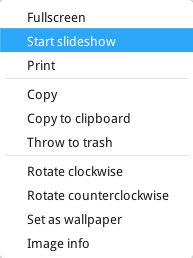

### Copiar imagen

El usuario puede copiar imágenes en el Visor de imágenes Deepin.

1. Clic derecho en la imagen en la interfaz del Visor de imágenes Deepin y seleccione **Copiar**.
2. En el lugar de destino, haga clic derecho en el área en blanco y seleccione **Pegar** para duplicar la imagen en el lugar.

> ：**Copiar al portapapeles** es una mejora de la función de copiado, en esta opción se puede usar para copiar la imagen como el contenido del documento, o compartir la imagen a amigos.

### Imprimir imagen

El usuario puede print imagen en Visor de imágenes Deepin.

1. Clic derecho en la imagen en la interfaz del Visor de imágenes Deepin y seleccione **Imprimir**.
2. Seleccione una impresora ajuste las opciones de impresión.
3. Clic en **Imprimir** para enviar la imagen a la impresora.

> ：Si seleccionó una impresora PDF, deberá elegir dónde guardar el archivo PDF impreso.

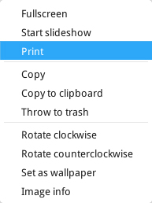

### Borrar imagen

El usuario puede eliminar imágenes del Visor de imágenes Deepin de las siguientes formas.

- Clic en el icono de  icon en la interfaz del Visor de imágenes Deepin.
- Clic derecho en la imagen para borrar y seleccione **Mover a la papelera**.
- Clic en la imagen to delete and press  key.

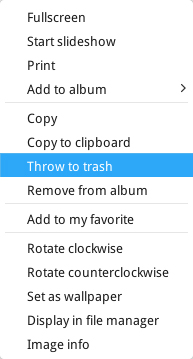

>: The deleted imagen will also be deleted from disk.

### Girar imagen

El usuario puede girar la imagen en el apartado para ver dicha imagen.
1. Clic derecho en la imagen en la interfaz del Visor de imágenes Deepin y seleccione **Girar a la derecha** or **Girar a la izquierda**.
2. La imágen rotará 90 grados en sentido horario o antihorario.

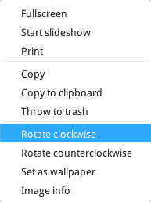

### Establecer imagen as Wallpaper

El usuario puede establecer una imagen como fondo de pantalla para escritorio. Clic derecho en la imagen en la interfaz del Visor de imágenes Deepin y seleccione **Establecer como fondo de pantalla**.

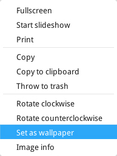

### View Imagen Information

El usuario puede ver the detailed information of la imagen.
1. Clic derecho en la imagen en la interfaz del Visor de imágenes Deepin y seleccione **Información de imagen**.
2. Aparecerá una ventana de información en el lado izquierdo de la interfaz del Visor de imágenes Deepin.

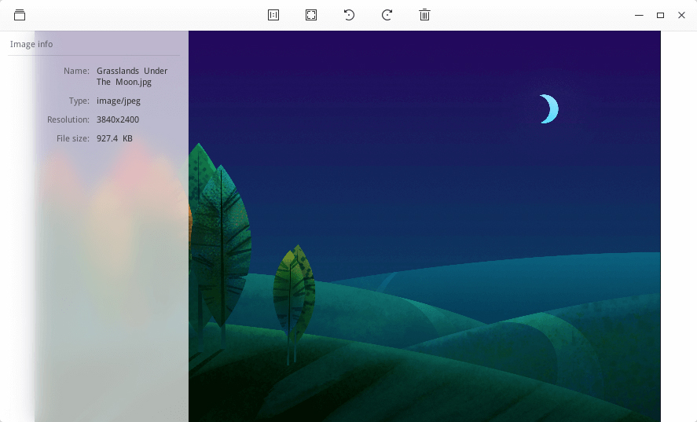

## Gestionar imagen

In imagen management interface, el usuario puede hacer cambios a la cronología y los álbumnes, y filtrar o usar el buscador para encontrar la imagen que necesite. Al presionar en  y  se cambiará entre la cronología y el álbum.

### Cronología

Clic en  en la interfaz del Visor de imágenes Deepin para entrar a la interfaz de la Cronología.
Las imágenes en Cronología se clasifican y agruparán de acuerdo con la fecha de fotografiado o creación. Se agraparán si pertenecen a la misma fecha. De arriba a abajo se muestran de los más recientes a los primeros creados.

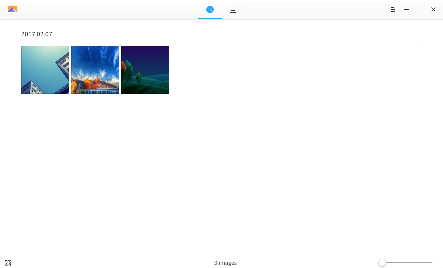

#### Amplificación de imagen

Las miniaturas of imágenes en la Cronología Cronología pueden ser ampliadas.
1. En la esquina inferior derecha de la interfaz del Visor de imágenes Deepin, clic en el deslizador de la barra de deslizado.
2. Arrastre el deslizado hacia la izquierda o derecha para amplificarlo o reducirlo.

#### Sincronizar imagen

Visor de imágenes Deepin sincronizará las carpetas gestionadas en el arranque.

1. En la cronología de la interfaz del Visor de imágenes Deepin, clic en el icono  para la esquina inferior izquierda.
2. Clic en **Añadir carpeta** y seleccione la carpeta que almacena la imagen.
3. Clic en **Abrir** para sincronizar la imagen a la cronología.

> ：El usuario puede hacer clic en el símbolo × en la carpeta sincronizada para cancelar en el apartado para escanear carpetas.

#### Añadir imagen a mis favoritos

El usuario puede descatar carpetas a Mis favoritos.
1. En la Cronología de la interfaz del Visor de imágenes Deepin, abra una imagen.
2. Clic derecho en la imagen y seleccione **Destacar**, o haga clic en  para añadirlo a Mis favoritos.
3. Clic derecho en la imagen y seleccione **No destacar**, o haga clic en  para quitarlo de Mis favoritos.

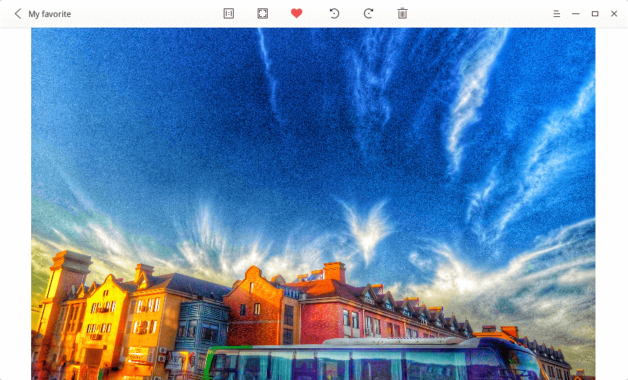

#### Añadir imagen al álbum

El usuario puede añadir imágenes a un álbum.
1. En la Cronología de la interfaz del Visor de imágenes Deepin, abra una imagen.
2. Clic derecho en la imagen y seleccione **Añadir al álbum**.
3. Seleccione un álbum para añadir la imagen a uno de ellos.

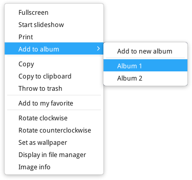

### Mostrar en el gestor de archivos

El usuario puede encontrar el directorio donde la imagen es guardada.
1. Clic derecho en la imagen en la interfaz del Visor de imágenes Deepin y seleccione **Mostrar en el gestor de archivos**.
2. The folder where la imagen is stored will pop up.

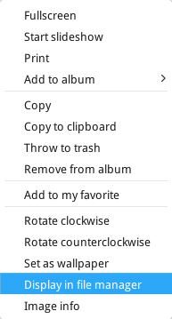

### Album

Clic en  en la interfaz del Visor de imágenes Deepin para entrar al apartado del álbum.
El usuario puede ver todos los álbumnes en apartado del álbum. Se mostrará miniaturas de los álbumnes, nombres y el rango de fecha de las imágenes correspondientes.

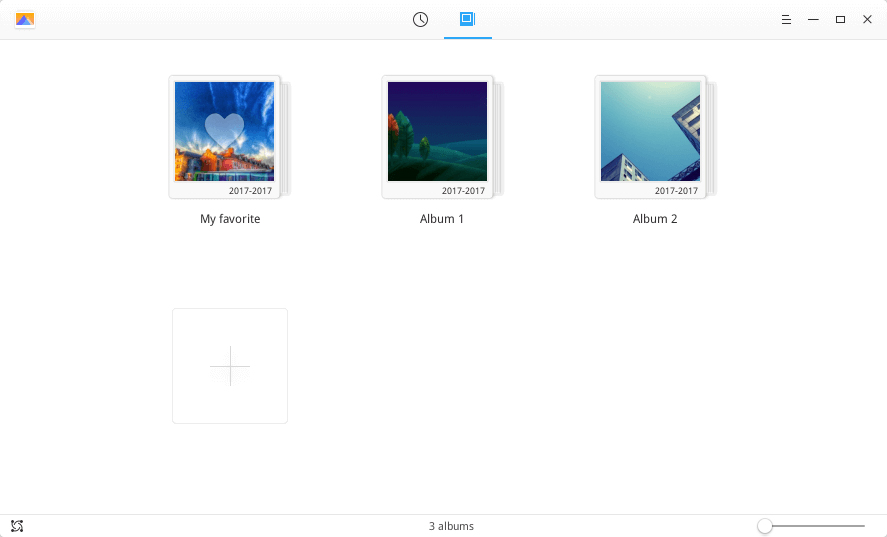

> : Hay un álbum predeterminado en Visor de imágenes Deepin, llamado **Mis favoritos** donde se pueden encontrar las imágenes favoritas del usuario. Este álbum no puede ser eliminado o renombrado.

#### Ampliación del álbum

Las miniaturas de las imágenes de los álbumnes puede ser amplificada.
1. En la esquina inferior izquierda del Visor de imágenes Deepin, clic en el deslizador de la barra de deslizado.
2. Arrastre el deslizado hacia la izquierda o derecha para amplificarlo o reducirlo.

#### Nuevo álbum

El usuario puede crear nuevos álbumnes para categorizar imágenes.
1. En el apartado del álbum, clic en  y seleccione **Nuevo álbum**.
2. Ingrese un nombre para el nuevo álbum, luego presione  o haga clic en el área en blanco.

> : El usuario puede también hacer clic en **+** para crear un nuevo álbum.

#### Añadir imágenes al álbum

El usuario puede añadir imágenes al álbum de las siguientes formas:
- Al **Sincronizar carpeta** para recopilar archivos al álbum a la carpeta donde se creará también en la cronología.
- Al **Añadir al álbum** en la interfaz de la cronología.
- Arrastre directamente las imágenes desde el administrador de archivos y colóquelas en el álbum.

#### Quitar imagen del álbum

En el álbum, clic derecho en la imagen y seleccione **Quitar del álbum** para retirar la imagen del álbum.

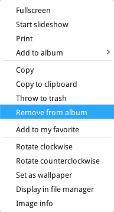

>: Para quitar un álbum, clic derecho en el icono del álbum y seleccione **Borrar**, las imágenes en el álbum quedarán en la Cronología y el disco.

#### Copiar álbum

En el apartado del álbum, clic derecho en el álbum icon y seleccione **Copiar** para copiar todas las imágenes en el álbum.

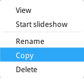

#### Renombrar álbum

1. En el apartado del álbum, clic derecho en el álbum y seleccione **Renombrar**.
2. Ingrese un nombre y pulse  o haga clic en el área en blanco.

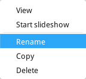

## Main Menu

En el **Menú principal**, el usuario puede crear un nuevo álbum, establecer las opciones, ver la información en el Visor de imágenes Deepin y cerrar la aplicación.
En la interfaz del Visor de imágenes Deepin, clic en  para entrar al **Menú principal**.

### Cambiar tema oscuro

En el **Menú principal**, seleccione o desmarque **Tema oscuro** para cambiar el tema visual.

### Settings

1. En el **Menú principal**, clic en **Ajustes**.
2. El usuario puede ajustes los siguientes parámetros que necesite:
   - Establezca el efecto y la duración de la presentación de diapositivas.
   - Ver los atajos de teclado predeterminados y personalizarlos.
   - Restaurar a los ajustes predeterminados.

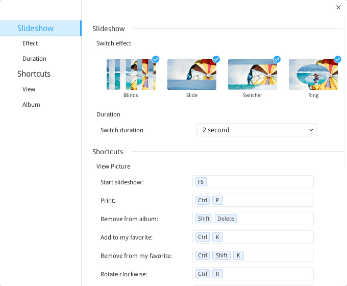

### Help

En el **Menú principal**, seleccione **Help** para ver el manual del Visor de imágenes Deepin.

### About

En el **Menú principal**, seleccione **About** para verificar la versión y presentación del Visor de imágenes Deepin.

### Exit

En el **Menú principal**, seleccione **Salir** para salir del Visor de imágenes Deepin.
