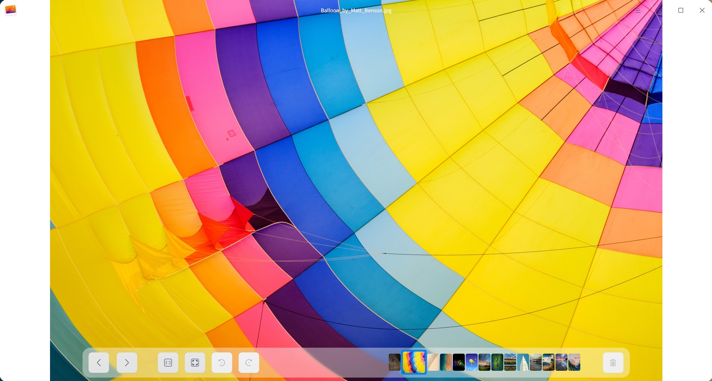
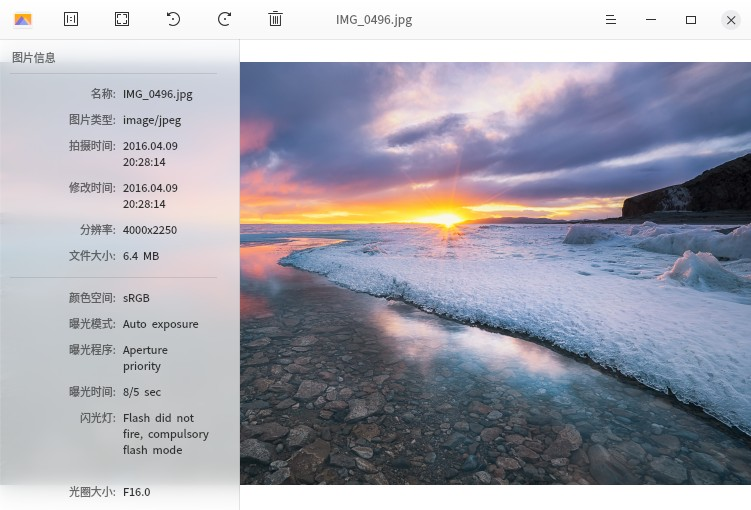

# 深度看图|../common/deepin-image-viewer.svg|

## 概述

深度看图是一款小巧的图片查看应用。外观时尚、性能流畅，支持多种图片格式，任何图片想看就看。

## 使用入门

您可以通过以下方式运行或关闭深度看图，或者创建深度看图的快捷方式。

### 运行深度看图

1. 点击桌面底部的启动器  ，进入启动器界面。
2. 上下滚动鼠标滚轮浏览或通过搜索，找到应用 点击运行。
3. 将鼠标指针置于深度看图应用程序的图标上，右键点击 ，您可以：
 - 点击 **发送到桌面**，在桌面创建快捷方式。
 - 点击 **发送到任务栏**，将应用程序固定到任务栏。
 - 点击 **开机自动启动**，将应用程序添加到开机启动项，在电脑开机时自动运行该应用程序。

### 关闭深度看图

- 在深度看图界面点击   ，退出深度看图。
- 在任务栏右键单击  ，选择 **关闭所有** 来退出深度看图。
- 在深度看图界面点击  ，选择 **退出** 来退出深度看图。

## 图片查看

### 打开图片
您可以采用以下任一方式打开图片。
- 右击图片，选择用深度看图打开图片。
- 设置深度看图为默认的图片查看程序后，可双击图片打开。
- 运行深度看图后，点击 **打开图片**，选择文件打开。
- 运行深度看图后，拖动图片到深度看图界面，打开图片。
- 直接拖动图片到深度看图在桌面或任务栏的图标，打开图片。

：您可以在控制中心中将深度看图设置为默认的图片查看程序，具体操作请参考 [默认程序设置](dman:///dde#默认程序设置)。

### 界面介绍

<table class="block1">
    <caption>主界面</caption>
    <tbody>
    	<tr>
            <td>  </td>
            <td>1:1视图</td>
            <td>图片按照实际尺寸显示。</td>
        </tr>
    	<tr>
            <td>  </td>
            <td>适应窗口</td>
            <td>图片适应窗口尺寸显示。</td>
        </tr>
    	<tr>
            <td>  </td>
            <td>顺时针</td>
            <td>图片顺时针旋转90度。</td>
        </tr>
    	<tr>
            <td>  </td>
            <td>逆时针</td>
            <td>图片逆时针旋转90度。</td>
        </tr>
    	<tr>
            <td>  </td>
            <td>删除</td>
            <td>删除当前图片。</td>
        </tr>
        <tr>
            <td>  </td>
            <td>上一张</td>
            <td>显示上一张图片。</td>
        </tr>
    	<tr>
            <td>  </td>
            <td>下一张</td>
            <td>显示下一张图片。</td>
        </tr>
    </tbody>
</table>

> ：在1:1视图下，当图片超出界面范围时，界面上会出现导航窗口。点击导航窗口的右上角关闭导航窗口，也可以在看深度看图界面上单击鼠标右键选择 **隐藏导航窗口/显示导航窗口**。

### 打印图片

1. 在深度看图界面上，单击鼠标右键。
2. 选择 **打印**。
3. 选择一个打印机。
4. 根据需要设置打印属性。
5. 选择 **打印**，将图片发送到打印机进行打印。

> ：如果选择的是pdf打印机还需要选择打印位置，将在指定位置输出pdf文件。

### 复制图片

1. 在深度看图界面上，单击鼠标右键。
2. 选择 **复制**。
3. 在桌面或者指定位置，单击鼠标右键。
4. 选择 **粘贴**，将图片文件复制到该位置。

> ：**复制到剪贴板** 是复制功能的补充，当您想将图片作为内容插入到文档中或者发送给好友时，就可以将图片复制到剪贴板，然后粘贴。

### 删除图片

在深度看图中您可以通过如下方法删除图片：

- 点击深度看图界面上的   图标。
- 右键单击图片，选择 **删除**。
- 在深度看图界面上，按下键盘的   键。

### 旋转图片

1. 在深度看图界面上，单击鼠标右键。
2. 选择 **顺时针旋转/逆时针旋转**。
3. 图片将会顺时针转旋转90°/逆时针旋转90°。

### 设置为壁纸

1. 在深度看图界面上，单击鼠标右键。
2. 选择 **设为壁纸** 即可将当前图片设置为壁纸。

### 查看图片信息

1. 在深度看图界面上，单击鼠标右键。
2. 选择 **图片信息** 可以显示图片信息。

## 主菜单

### 深色主题

1. 在深度看图界面，点击   。
2. 点击 **深色主题**，来切换主题颜色。

### 帮助

点击“帮助”获取深度看图的帮助手册，进一步了解和使用深度看图。

1. 在深度看图界面，点击   。
2. 点击 **帮助**。
3. 查看深度看图的帮助手册。

### 关于

点击“关于”查看深度看图的版本介绍。

1. 在深度看图界面，点击   。
2. 点击 **关于**。
3. 查看深度看图的版本和介绍。

### 退出

您可以进入主菜单点击退出深度看图。

1. 在深度看图界面，点击 。
2. 点击 **退出**。
