# Películas Deepin |../common/deepin-movie.svg|
## Vistazo

Películas Deepin (Películas Deepin) es un reproductor de video con varias funciones integradas en deepin. Ofrece una interfaz simple y accesos directos completos, admite varios formatos audiovisuales. También puede reproducir recursos de video en línea, establecer libremente el sonido, el fotograma y los subtítulos.

Películas Deepin, comparte la completa experiencia cinematográfica con usted. Úsalo, ¡te encantará!

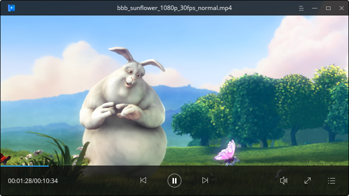

## Guía

### Iniciar Películas Deepin

1. En el Muelle, clic en  para entrar al Lanzador.
2. Clic derecho en , puede:
- Clic en **Envíar al escritorio** para crear un acceso directo al escritorio.
- Clic en **Enviar al muelle** para fijar la aplicación al Muelle.
- Clic en **Añadir al arranque** para añadir la aplicación en el arranque, esta se iniciará automáticamente cuando la computadora inicie.

> : También puede hacer doble clic a un vídeo y selecionar **Abrir con Películas Deepin** para ejecutar.

### Salir de Películas Deepin

- En la interfaz de Películas Deepin, clic en  para salir.
- Clic derecho en  en el Muelle, seleccione **Cerrar todo** para salir.
- Clic en  y selecionar **Salir** para finalizar.

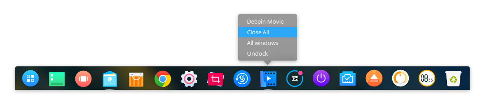

### Ver atajos de teclado

1. En la interfaz de Películas Deepin, pulse ++.
2. Puede ver todos los atajos en la interfaz de previsualización.

<table>
     <tr>
        <td colspan="2">REPRODUCCIÓN</td>
        <td colspan="2">CUADRO/AUDIO</td>
        <td colspan="2">SUBTÍTULO</td>
     </tr>
     <tr>
        <td>Pusar/Reproducir</td>
        <td>Espacio</td>
        <td>Modo compacto</td>
        <td>F2</td>
        <td>Adelantar 0.5s</td>
        <td>Shift+Derecha</td>
     </tr>
     <tr>
        <td>Adelantar</td>
        <td>Derecha</td>
        <td>Volume up</td>
        <td>Up</td>
        <td>Rebobinar 0.5s</td>
        <td>Shift+Izuierda</td>
     </tr>
     <tr>
        <td>Rebobinar</td>
        <td>Izquierda</td>
        <td>Bajar volumen</td>
        <td>Abajo</td>
        <td>-</td>
        <td>-</td>
     </tr>
     <tr>
        <td>Pantalla completa</td>
        <td>Retroceso</td>
        <td>Silenciar</td>
        <td>M</td>
        <td>-</td>
        <td>-</td>
     </tr>
     <tr>
        <td>Lista reproducción</td>
        <td>F3</td>
        <td colspan="2">ARCHIVO</td>
        <td colspan="2">CAPTURA</td>
     </tr>
     <tr>
        <td>Accelerar</td>
        <td>Ctrl+Derecha</td>
        <td>Abrir archivo</td>
        <td>Ctrl+O</td>
        <td>Captura de cine</td>
        <td>Alt+A</td>
     </tr>
     <tr>
        <td>Ralentizar/td>
        <td>Ctrl+Izquierda</td>
        <td>Abrir anterior</td>
        <td>PgUp/AvPag</td>
        <td>Captura en ráfaga</td>
        <td>Alt+S</td>
     </tr>
     <tr>
        <td>Velocidad normal</td>
        <td>R</td>
        <td>Abrir siguiente</td>
        <td>PgDown/RePag</td>
        <td>-</td>
        <td>-</td>
     </tr>
</table>

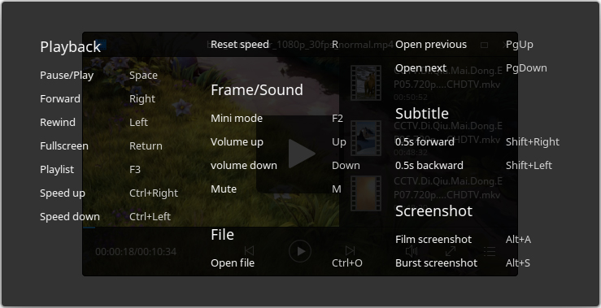

## Intrefaz principal

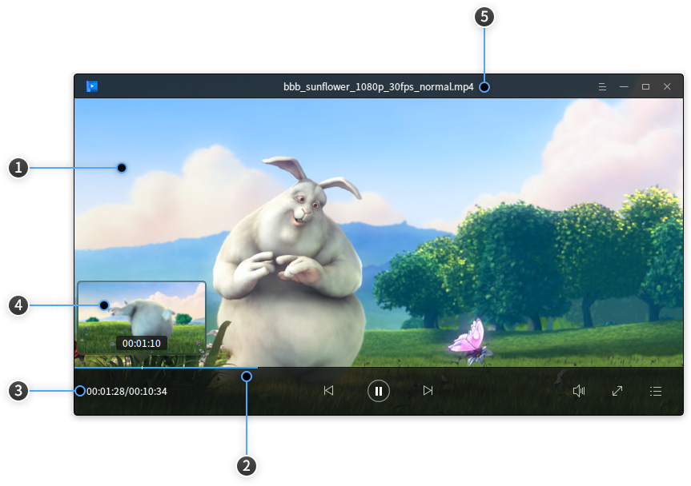

<table>
  <tr>
            <td>1</td>
            <td width="60px">Ventana de reproducción</td>
            <td>Muestra el contenido e información del vídeo (o película) y los iconos de función se mostrarán después de que el puntero del mouse se movió a la ventana de reproducción; de lo contrario, se ocultará. La ventana de reproducción es el modo sin marco, puede arrastrar y soltar libremente la ventana de reproducción para ajustar manualmente su tamaño. </td>
        </tr>
        <tr>
            <td>2</td>
            <td>Barra de progreso</td>
            <td>Es para mostrar el progreso de la reproducción de la película y puede cambiar el estado arrastrando y soltando la barra de progreso. Mueva el puntero del mouse sobre la barra de progreso, y la barra de progreso se mostrará en negrita de manera inteligente y se mostrará la ventana de vista previa de la película. </td>
        </tr>
         <tr>
            <td>3</td>
            <td>Visualización del tiempo</td>
            <td>Muestra el tiempo total y la información del tiempo reproducido de la película actual. </td>
        </tr>
         <tr>
            <td>4</td>
            <td>Ventana de previsualización</td>
            <td>Muestra la previsualización de la película, puede ver el contenido del vídeo en cualquier tiempo en la ventanas. </td>
        </tr>
         <tr>
            <td>5</td>
            <td>Título del vídeo</td>
            <td>Muestra el título del vídeo, grabación o película. </td>
        </tr>
</table>

### Icono descriptivo

<table>
     <tr>
       <td></td>
       <td>Menú principal</td>
       <td></td>
       <td>Minimizar</td>
       <td></td>
       <td>Maximizar</td>
       <td></td>
       <td>Cerrar</td>
     </tr>
     <tr>
       <td></td>
       <td>Reproducir</td>
       <td></td>
       <td>Pausar</td>
       <td></td>
       <td>Reproducir película anterior</td>
       <td></td>
       <td>Reproducir película siguiente</td>
     </tr>
     <tr>
       <td></td>
       <td>Volumen</td>
       <td></td>
       <td>Pantalla completa</td>
       <td></td>
       <td>Liste de vídeos</td>
       <td></td>
       <td>Salir del modo miniatura</td>
     </tr>
</table>

### Abrir película

Puede reproducir películas con cualquiera de los siguientes pasos:

1. En la interfaz de Películas Deepin, haga clic una o dos veces en  to select **Abrir archivo**.
2. En la interfaz de Películas Deepin, haga clic una o dos veces en  to select **Abrir carpeta**.
3. En la interfaz de Películas Deepin, haga doble clic para seleccionar **Abrir URL**.
4. En la interfaz de Películas Deepin, haga doble clic para seleccionar **Abrir CD/DVD**.
5. Arrastre y suelte el archivo o carpeta a la interfaz principal.

### Pausar/Continuar

- En la interfaz de Películas Deepin, clic en /.
- En la interfaz de Películas Deepin, pulse  en el teclado.
- En la interfaz de Películas Deepin, haga clic con el botón izquierdo.

>: Pausar y continuar son estados mutuamente excluyentes.

### Anterior/Siguiente

- En la interfaz de Películas Deepin, pulse  / .
- En la interfaz de Películas Deepin, clic en /.

### Forward/Rewind

1. En la interfaz de Películas Deepin, pulse  para avanzar el vídeo.
2. Presione  en el teclado para retrocer el vídeo.

### Accelerar/Ralentizar

1. En la interfaz de Películas Deepin, pulse + para accelerar el vídeo.
2. Presione + para ralentizar (o hacer cámara lenta) al vídeo.
3. Si desea normalizar la velocidad, pulse  en el teclado.

>: Accelerar o ralentizar está relacionado al ritmo original del vídeo. Cada acción, incrementa o decrementa el 10%. La velocidad máxima es del 200% al original y la mímina es del 10%.

## Operaciones básicas
En la interfaz de Películas Deepin, puede hacer varias operaciones acorde a sus necesidades.

### Ajustar ventanas

1. Clic derecho en la interfaz de Películas Deepin.
2. Seleccione **Pantalla completa** para mostrar en todo el monitor.
3. Seleccione **Modo miniatura** para mostrar en una pantalla mínima.
4. Seleccione **Siempre al frente** para colocar la ventana como capa superior.

> : También puede arrastrar y soltar la ventana en una proporción que desee.

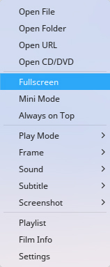

### Seleccionar Modo reproducción

1. Clic derecho en la interfaz de Películas Deepin.
2. Seleccionar **Modo reproducción**, puede:
  - Marcar **Reproducir en orden**, las películas de la lista serán mostradas ordenadamente.
  - Marcar **Reproducir al azar**, las películas de la lista serán mostradas desordenadamente, pero no se repetirá el vídeo las mismas veces.
  - Marcar **Reproducción simple**, la reproducción finalizará cuando termine el vídeo actual.
  - Marcar **Repetición simple**, la película será reproducida una y otra vez.
  - Marcar **Repetición en lista**, toda la lista de reproducción se reproducirá varias veces.

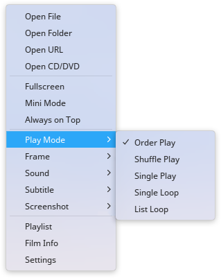

### Ajustar cuadro

1. Clic derecho en la interfaz de Películas Deepin.
2. Seleccionar **Cuadro**, puede:
  - Ajustar el radio de aspecto de la película entre 4:3, 16:9, 16:10, 1.85:1 y 2.35:1.
  - Girar el vídeo en sentido horario o antihorario.

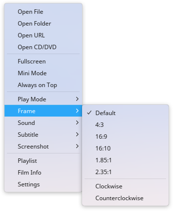

### Ajustar sonido

1. Clic derecho en la interfaz de Películas Deepin.
2. Seleccionar **Sound** > **Channel**, puede:
  - Marcar **Estéreo**, el vídeo será reproducido en dos canales.
  - Marcar **Canal izquierdo**, la película será reproducida en el canal izquierdo.
  - Marcar **Canal derecho**, la película será reproducida en canal derecho.
3. Seleccione **Sonido** > **Pista**, puede establecer qué pista emitirá en la película.

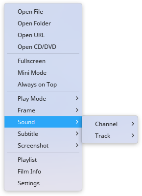

### Establecer subtítulo

1. Clic derecho en la interfaz de Películas Deepin.
2. Seleccione **Subtítulo**, puede:
  - Marcar **Cargar**, para abrir manualmente los subtítulos.
  - Marcar **Búsqueda en línea**, para buscar los subtítulos en línea para la película y cargarlos automáticamente.
  - Marcar **Seleccionar**, para escoger un subtítulo para la película.
  - Marcar **Esconder**, para esconder los subtítulos.
  - Marcar **Codificación de datos**, para asignar la encoficación al vídeo.

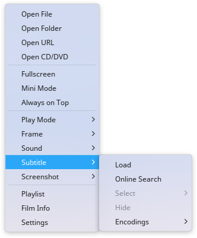

### Hacer una captura de pantalla

1. Clic derecho en la interfaz de Películas Deepin.
2. Seleccionar **Captura de pantalla**, puede:
  - Marcar **Captura de vídeo**, para tomar una captura de pantalla de la película en el fotografma actual.
  - Marcar **Captura en ráfaga**, para tomar 15 imágenes de la película en diferentes tiempos.

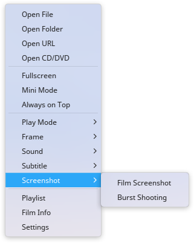

### View Film Info

1. Clic derecho en la interfaz de Películas Deepin.
2. Seleccionar **Información del vídeo**, puede ver el tipo de archivo, resolución, tamaño, duración y ruta del archivo.

> : También puede hacer doble clic en la lista de reproducción y seleccionar **Información del vídeos** para mostrar.

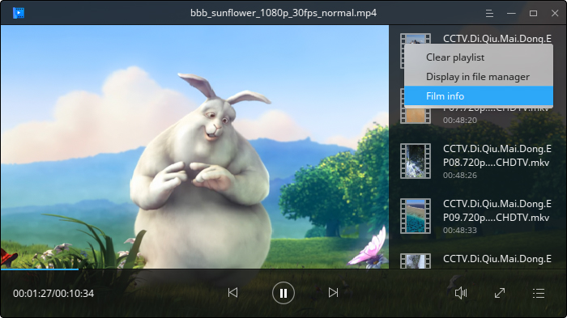

## Gestionar lista de reproducción

### Mostrar/ocultar lista de reproducción

1. Clic derecho en la interfaz de Películas Deepin.
2. Marcar **Lista de reproducción** para mostrar la lista de reproducción y desmarque para ocultarla.

> : También puede clic en  dentro de la interfaz principal para mostrar/ocultar lista de reproducción.

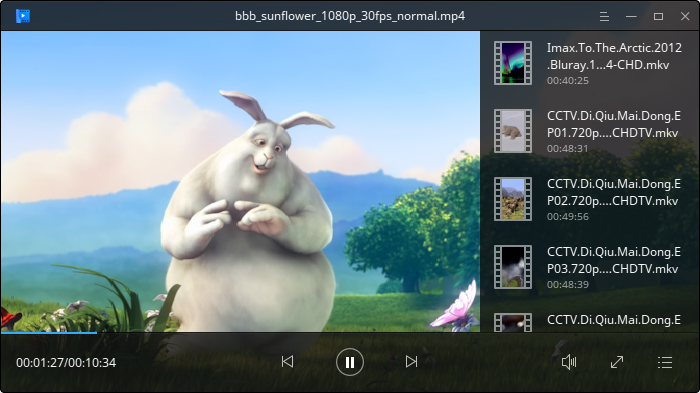

### Añadir vídeo a la lista de reproducción

Puede añadir una película a la lista con los siguientes pasos:
- Muestre la lista, y arrastre y suelte el archivo/carpeta a ella.
- Clic derecho en la interfaz principal, y selecione **Abrir archivo/Abrir carpeta/Abrir URL/Abrir CD/DVD** para agregarlo.
- Clic en  en la interfaz de Películas Deepin, y selecione **Abrir archivo/Abrir carpeta** para agregarlo.

### Quitar vídeo de la lista de reproducción

1. En la lista de Películas Deepin, dirígase al archivo.
2. Clic en el botón de borrar en la esquina superior derecha para retirar de la selección.

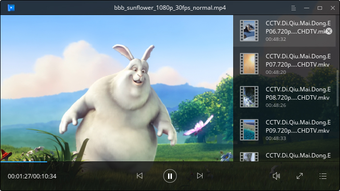

### Limpiar lista de reproducción

1. Clic derecho en la lista.
2. Seleccione **Limpiar lista de reproducción** para limpiar toda la relación.

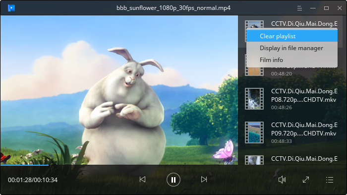

### Mostrar en el Gestor de archivos

1. Clic derecho en el gestor de archivos.
2. Seleccione **Mostrar en el gestor de archivos** para mostrar la ubicación de la carpeta en dicho programa.

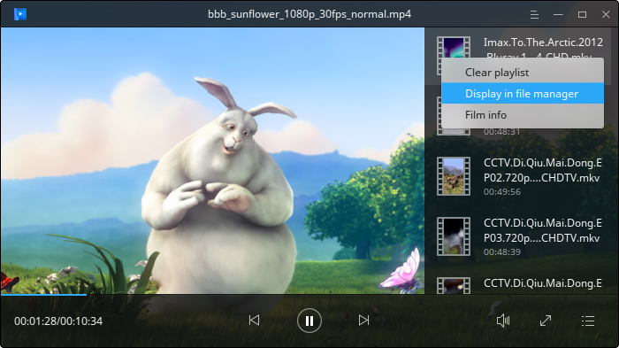

## Menú principal
### Ajustes básicos

1. En la interfaz de Películas Deepin, clic en .
2. Seleccionar **Ajustes** > **Basic settings**.
3. En la opción **Reproducir**, puede:
 - Marcar el casillero de **Borrar lista de reproducción al salir**, la lista será vaciada cuando salga de Películas Deepin.
 - Marcar el casillero de **Recordar la posición de reproducción**, el vídeo será reproducido automáticamente a la última posición que dejó al iniciar Películas Deepin.
 - Marcar el casillero de **Agregar automáticamente archivos similares para reproducir**, los archivos de vídeos relacionados serán visualizados después de qué el último archivo fuese reproducido.
 - Marcar el casillero de **Mostrar vista previa con el puntero**, la vista previa del vídeo se mostrará al dejar el puntero en la barra de progreso.
 - Marcar el casillero de **Abrir un nuevo reproducrot para cada archivo reproducido**, un nuevo reproductor será abierto cuando reproduzca un vídeo.
 - Marcar el casillero de **Pausar al minimizar**, el vídeo se pausará cuando realice dicha acción en la ventana de Películas Deepin.
4. En la opción of **Screenshot**, puede select the path to save screenshot.

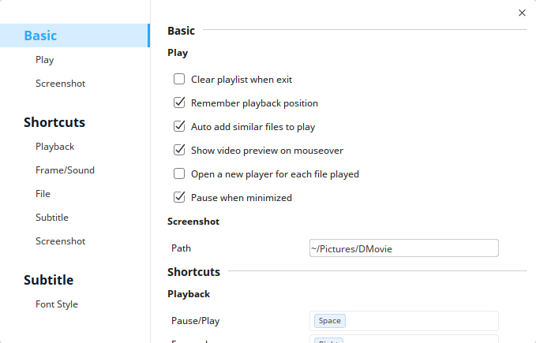

### Ajustes de atajos de teclado

1. En la interfaz de Películas Deepin, clic en .
2. Seleccionar **Ajustes** > **Atajos de teclado**.
3. Puede establecer los atajos para reproducción, imagen, sonido, subtitulado, captura y uso del archivo.

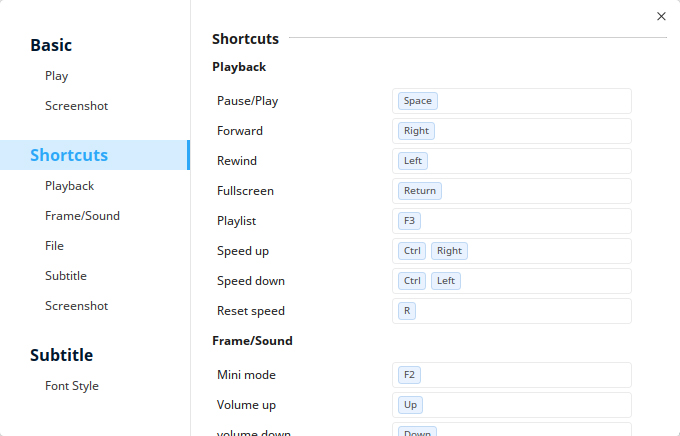

### Ajustes de subtitulado

1. En la interfaz de Películas Deepin, clic en .
2. Seleccionar **Ajustes** > **Subtitle**.
3. Puede ajustar la fuente y tamaño de los subtítulos.

> : También puede clic en **Restablecer a los ajustes predeterminados** para restaurar todos los ajustes.

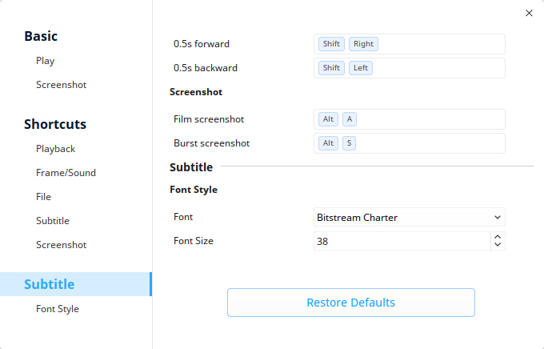

### Cambiar tema

El tema de la Películas Deepin es oscuro (de color negro) por defecto, puede hacer clic en **Tema claro** para cambiar.

1. En la interfaz de la Películas Deepin, clic en .
2. Seleccione **Tema claro**.
3. La interfaz cambiará al tema oscuro.

### Ayuda

1. En la interfaz de la Películas Deepin, clic en .
2. Seleccione **Ayuda**.
3. Observe el manual.

### Acerca de

1. En la interfaz de la Películas Deepin, clic en .
2. Seleccione **Acerca de**.
3. Observe la descripción de la versión.

### Salida

1. En la interfaz de la Películas Deepin, clic en .
2. Clic en **Salir** para cerrar.
