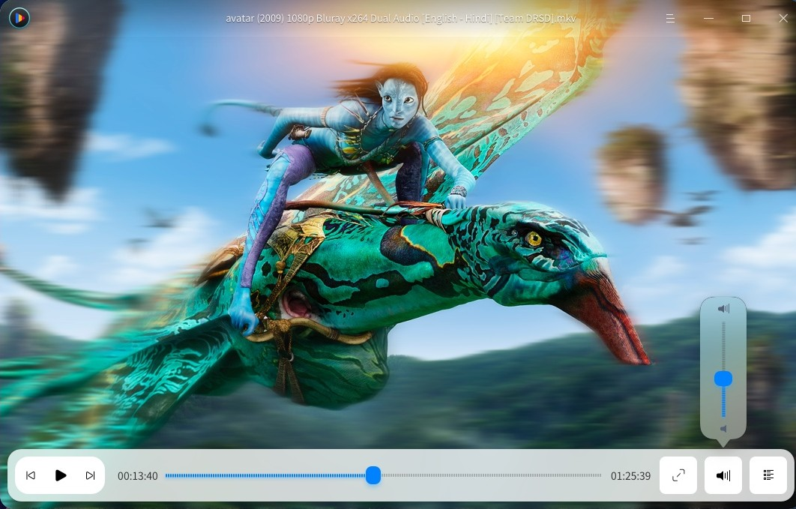
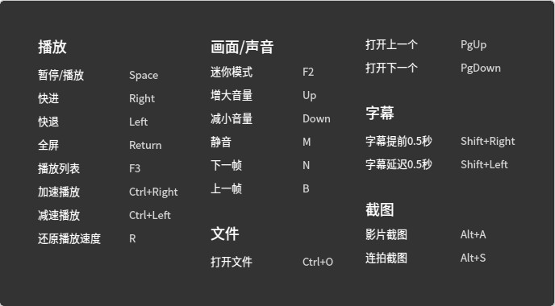

# 影院|../common/deepin-movie.svg|

## 概述

惬意的悠闲时光，让影院陪您一起度过！

影院提供了直观易用的操作界面和丰富齐全的快捷键，依靠键盘您就能完成所有的播放操作，让您彻底摆脱鼠标点击的束缚。您可以使用影院播放多种格式的视频文件，利用流媒体功能轻松欣赏到网络视频资源。

## 使用入门

### 运行影院

1. 点击桌面底部的 ，进入启动器界面。
2. 上下滚动鼠标滚轮，通过浏览找到  进行点击。
3. 将鼠标指针置于影院应用程序的图标上，右键单击   图标，您可以：
 - 点击 **发送到桌面**，在桌面创建快捷方式。
 - 点击 **发送到任务栏**，将应用程序固定到任务栏。
 - 点击 **开机自动启动**，将应用程序添加到开机启动项，在电脑开机时自动运行该应用程序

### 关闭深度影院
- 在深度影院界面点击   ，退出深度影院。
- 在任务栏右键单击  ，选择 **关闭所有** 来退出深度影院。
- 在深度影院界面点击  ，选择 **退出** 来退出深度影院。

### 快捷键

播放视频之前先了解一下快捷键的配置，让您的后续操作事半功倍。

1. 在深度影院界面，按下键盘上的 ++ 组合键，打开快捷键预览界面。
2. 在快捷键预览界面，您可以查看到所有的快捷键。

  

>  ：在视频播放的过程中，您也可以随时调出快捷键预览界面。

待完成...