# Reproductor Deepin|../common/deepin-music.svg|

## Vistazo

Reproductor Deepin (originalmente *Music*) es una aplicación de reproducción de música local con un nuevo diseño de interfaz de usuario y una experiencia de reproducción extrema desarrollada por Deepin Technology. Se presenta con funciones de escaneo de música local y sincronización de letras, etc.

## Guía

Puede iniciar, cerrar y crear un acceso directo para Reproductor Deepin de la siguiente manera.

### Iniciar Reproductor Deepin

1. Clic en  o mueva el puntero del ratón a la esquina superior izquierda de la pantalla para entrar a la interfaz del lanzador.
2. Encuentre  cen la rueda del ratón o buscando "deepin music" en la interfaz del Lanzador.
3. Clic derecho en el icono de la aplicación del Reproductor Deepin, puede
- Clic en **Envíar al escritorio** para crear un acceso directo al escritorio.
- Clic en **Enviar al muelle** para fijar la aplicación al Muelle.
- Clic en **Añadir al arranque** para añadir la aplicación en el arranque, esta se iniciará automáticamente cuando la computadora inicie.

> : Si el Reproductor Deepin fue anclado al Muelle, también puede hacer clic en su icono para iniciar.

### Minimizar a la bandeja de sistema

1. En la interfaz del Reproductor Deepin, clic en , seleccione **Minimizar a la bandeja de sistema**.
2. El Reproductor Deepin se mimizará a la bandeja;
3. Clic derecho icono de aplicación del Reproductor Deepin en la bandeja, puede:
 - Clic en **Reproducir/Pausar** para reproducir/pausar la canción;
 - Clic en **Anterior** para reproducir la anterior pista;
 - Clic en **Siguiente** para reproducir la siguiente pista.
 - Clic en **Salir** para salir de Reproductor Deepin.

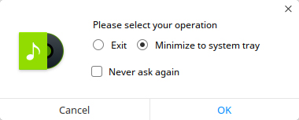

### Salir de Reproductor Deepin

- En la interfaz del Reproductor Deepin, clic en , y seleccione **Salir** para salir de Reproductor Deepin.
- Clic derecho en el icono de aplicación del Reproductor Deepin del Muelle, seleccione **Cerrar Todo** para salir del reproductor de música.
- Clic en  y seleccione **Salir** para salir de Reproductor Deepin.

## Interfaz principal

En la interfaz principal, puede realizar operaciones de reproducción comunes, ver la lista de reproducción y la información de la canción.

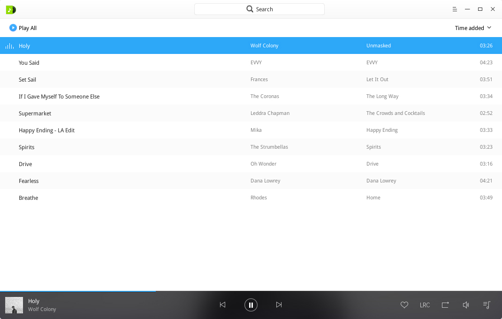

<table class="block1">
    <caption></caption>
    <tbody>
        <tr>
            <td>1</td>
            <td>Baja de búsqueda</td>
            <td>Los usuarios pueden buscar rápidamente sus canciones cen la baja de búsqueda.</td>
        </tr>
        <tr>
            <td>2</td>
            <td>Menú principal</td>
            <td>Los usuarios pueden añadir lista de reproducción, añadir música, ajustar, ver el manual, la información y salir de la aplicación desde el menú principal.</td>
        </tr>
    	<tr>
            <td>3</td>
            <td>Opciones de ordenado</td>
            <td>Los usuarios pueden ordenar la lista por la fecha de añadido, título, artista o nombre de álbum.</td>
        </tr>
    	<tr>
            <td>4</td>
            <td>Caja de reproducción</td>
            <td>Muestra la barra de avance, la cubierta y el título del álbum.</td>
        </tr>
    		<tr>
            <td>5</td>
            <td>Botón para Reproducir/Pausar</td>
            <td>Clic para Reproducir/Pausar la música.</td>
        </tr>
    	<tr>
            <td>6</td>
            <td>Anterior/Siguiente</td>
            <td>Clic en el interruptor para ir a la canción anterior o siguiente.</td>
        </tr>
    	<tr>
            <td>7</td>
            <td>Mis favoritos</td>
            <td>Clic para añadir música para mis favoritos, clic de nuevo para cancelar.</td>
        </tr>
    	<tr>
            <td>8</td>
            <td>Letras</td>
            <td>Clic para cambiar a la interfaz de cancionero (letras musicales), clic de nuevo para cerrar el cancionero.</td>
        </tr>
    		<tr>
            <td>9</td>
            <td>Modo de reproducción</td>
            <td>Clic para cambiar al modo de reproducción, incluyendo repetición de la lista de reproducción, repetir canción y mezclar.</td>
        </tr>
    		<tr>
            <td>10</td>
            <td>Volumen</td>
            <td>Clic para Silenciar o dejar de silenciar, mueva la barra de volumen para ajustar el sonido.</td>
        </tr>
    		<tr>
            <td>11</td>
            <td>Playlist</td>
            <td>Clic para mostrar/ocultar lista de reproducción.</td>
        </tr>
    </tbody>
</table>

## Operaciones comunes

Puede añadir, borrar y ver detalles de la música local en el Reproductor Deepin.

### Añadir archivo

En la interfaz del Reproductor Deepin, puede:
- Clic en **Añadir carpeta** para añadir la carpeta cen las canciones.
- Clic en **Escanear** para escanear el directorio musical.
- Clic en  > **Añadir carpeta** para añadir la carpeta.
- Clic en  > **Añadir Archivo** para añadir un archivo.

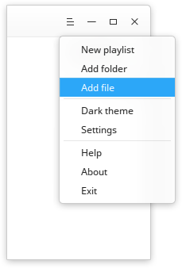

> : También puede añadir si arrastra y suelta el archivo musical al interfaz del Reproductor Deepin.

### Buscar música

1. En la parte superior de la interfaz del Reproductor Deepin, clic en **Buscar**.
2. Ingrese las palabras clave en el cuadro de búsqueda, luego el resultado se mostrará en la interfaz y puede encontrar la música rápidamente.

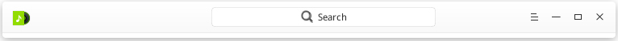

### Añadir música a Mis favoritos

En la interfaz del Reproductor Deepin, clic en  para añadir música a Mis favoritos.

> : También puede hacer clic derecho en la canción, y clic en **Añadir a lista de reproducción** > **Mis favoritos** para completar la tarea.

### Mostrar en el gestor de archivos

1. En la interfaz del Reproductor Deepin, haga clic derecho en la música.
2. Clic en **Mostrar en el gestor de archivos**, puede ver el archivo musical en el Gestor de archivos Deepin.

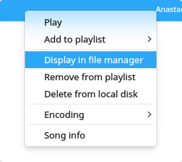

### Borrar música

En la interfaz del Reproductor Deepin, haga clic derecho en la canción, puede:
- Clic en **Remover de la lista de reproducción** para quitarlo de la lista de reproducción, pero el archivo musical seguirá conservando en el disco local.
- Clic en **Eliminar del disco duro** para quitar de la lista de reproducción y borrar del disco duro. Se mostrará una ventana emergente para confirmar la operación.

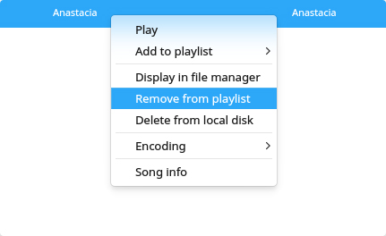

### Encodificación

1. En la interfaz del Reproductor Deepin, haga clic derecho en la canción.
2. Clic en **Encodificación**, puede seleccionar el sistema de encodificación que desee.

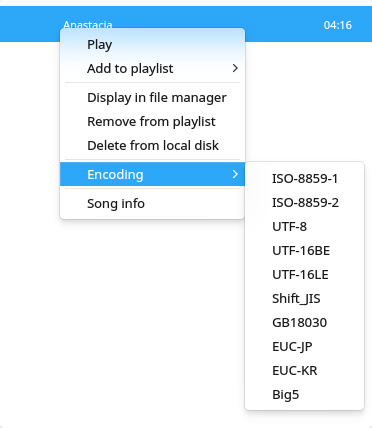

### Ver información de la canción

1. En la interfaz del Reproductor Deepin, haga clic derecho en la canción.
2. Clic en **Información de la canción**, puede ver la información detallada de la canción.

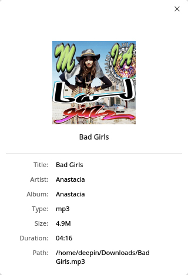

## Gestionar lista de reproducción

En la interfaz del Reproductor Deepin, puede crear, borrar, renombrar lista de reproducción y añadir música a la lista de reproducción.

### Create a New Playlist

1. Para crear una nueva lista de reproducción, puede:
 - Clic en , luego haga clic en **Nueva lista de reproducción**.
 - Clic en  para seleccionar **Nueva lista de reproducción**.
 - Clic derecho en la canción and clic en **Añadir a lista de reproducción** > **Nueva lista de reproducción**.
2. Ingrese un nombre de la lista de reproducción.
3. Clic en el área en blanco o pulse la tecla **** para confirmar.

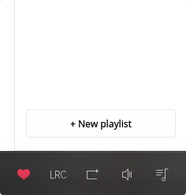

### Renombrar lista de reproducción

1. En la interfaz del Reproductor Deepin, clic en .
2. Clic derecho en la lista de reproducción para seleccionar **Renombrar**.
3. Ingrese el nombre de la lista de reproducción.
4. Clic en el área en blanco del Reproductor Deepin, o pulse la tecla **** para confirmar el nombre.

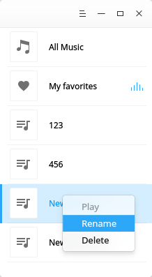

### Añadir música a la lista de reproducción

1. En la interfaz del Reproductor Deepin, seleccione a music you want para añadir.
2. Clic derecho para seleccionar **Añadir a lista de reproducción** > **Nombre de la lista**.

> : También puede seleccionar **Nueva lista de reproducción** para añadir la pista al nuevo listado.

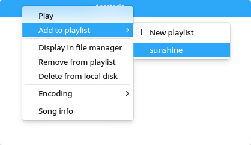

### Quitar música de la lista de reproducción

1. En la interfaz del Reproductor Deepin, seleccione a music you want para remove.
2. Clic derecho para seleccionar **Quitar de la lista de reproducción**.

### Borrar lista de reproducción

1. En la interfaz del Reproductor Deepin, clic en .
2. Clic derecho en la lista de reproducción para seleccionar **Borrar**.
3. En la ventana emergente, seleccione **Borrar** para confirmar la operación.

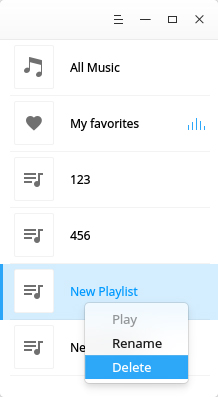

## Menú principal

Puede añadir nuevas listas de reproducción o canciones, ajustar, ver información o salir del Reproductor Deepin.

### Ajustes básicos

1. En la interfaz del Reproductor Deepin, clic en .
2. Seleccione **Ajustes** > **Ajustes básicos**.
3. En la opción **Reproducir**, puede:
 - Marcar el casillero de **Autoreproducir**, la canción se reproducirá automáticamente cuando el reproductor de música inicie.
 - Marcar el casillero de **Recordar posición de la reproducción**, la canción will be played automatically from last position played when Reproductor Deepin runs.
 - Marcar el casillero de **Habilitar desvanecimiento**, la pista cambiará el volumen gradualmente cuando se ejecuta el Reproductor Deepin.
4. En la opción de **Cerrar ventana principal**, puede:
 - Seleccionar **Minimizar a la bandeja de entrada** para trasladar el icono a la bandeja.
 - Seleccionar **Salir Reproductor Deepin** para cerrar la aplicación.

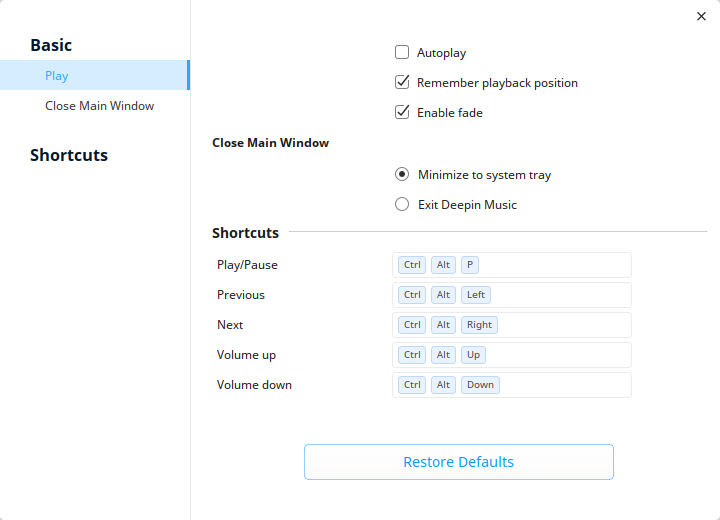

### Ajustes de atajos de teclado Settings

1. En la interfaz del Reproductor Deepin, clic en .
2. Seleccione **Ajustes** > **Atajos de teclado**.
3. Después puede asignar los atajos de teclado de Reproducir/Pausar, anterior, siguiente, subir y bajar volumen.

> : También puede clic en **Restaurar a los ajustes predeterminados** para restaurar todos los parámetros.

### Cambiar tema
El tema del Reproductor Deepin es claro, puede hacer clic en **Tema oscuro** para cambiarlo.

1. En la interfaz del Reproductor Deepin, clic en  en la esquina superior izquierda.

2. Clic en **Tema oscuro** para cambiar el tema del Reproductor Deepin.

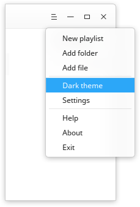

### Ayuda
Hacer clic en "Ayuda" para conocer el manual del Reproductor de Deepin.

1. En la interfaz de Reproductor de Deepin, clic en .
2. Clic en **Ayuda** para ver el manual de la Reproductor de Deepin.

### Acerca de
Puede hacer clic en "Acerca de" para saber la infomración del Reproductor de Deepin.

1. En la interfaz de Reproductor de Deepin, clic en .
2. Clic en **Acerca de** para ver la versión y presentación de la Reproductor de Deepin.

### Salir
Puede hacer clic en "Salir" para finalizar la aplicación.

1. En la interfaz de Reproductor de Deepin, clic en .
2. Clic en **Salir** para cerrar Reproductor de Deepin.
