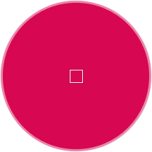

# 取色器|../common/deepin-picker.svg|

## 概述

取色器是一款轻便小巧的屏幕色彩拾取软件，可以快速获取各种颜色的代码，并将其拷贝到剪切板上。

## 使用入门

您可以通过以下方式运行或关闭取色器，或者创建取色器的快捷方式。

### 运行取色器

1. 点击桌面底部的 启动器  ，进入启动器界面。
2. 上下滚动鼠标滚轮浏览或通过搜索，找到应用 点击运行。
3. 将鼠标指针置于取色器应用程序的图标上，右键点击 ，您可以：
 - 点击 **发送到桌面**，在桌面创建快捷方式。
 - 点击 **发送到任务栏**，将应用程序固定到任务栏。
 - 点击 **开机自动启动**，将应用程序添加到开机启动项，在电脑开机时自动运行该应用程序。

：您可以在控制中心中将取色器设置为默认的图片查看程序，具体操作请参考 [默认启动设置](dman:///dde#默认程序设置)。

### 关闭取色器

取色器吸取颜色后自动退出，关闭取色器。

## 吸取颜色

启动取色器后，点击吸取所需的颜色，取色器将自动拷贝颜色到剪切板。

